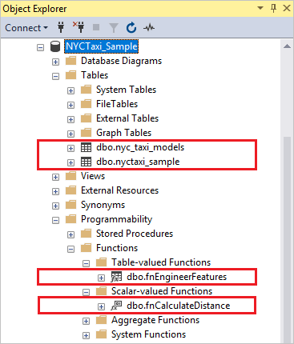

# NYC Taxi demo data for SQL Server Python and R tutorials
[!INCLUDE[appliesto-ss-xxxx-xxxx-xxx-md-winonly](../../includes/appliesto-ss-xxxx-xxxx-xxx-md-winonly.md)]

This article explains how to set up a sample database consisting of public data from the [New York City Taxi and Limousine Commission](http://www.nyc.gov/html/tlc/html/about/trip_record_data.shtml). This data is used in several R and Python tutorials for in-database analytics in SQL Server. The sample data is one percent of the public data set. On your system, the database backup file is slightly over 90 MB, providing 1.7 million rows in the primary data table.

To complete this exercise, you should have [SQL Server Management Studio](https://docs.microsoft.com/sql/ssms/download-sql-server-management-studio-ssms?view=sql-server-2017) or another tool that can restore a database backup file and run T-SQL queries.

Tutorials and quickstarts using this data set include the following:

+  [Use a Python model in SQL Server for training and scoring](train-score-using-python-in-tsql.md)

## Download files

The sample database is a backup file hosted by Microsoft. File download begins immediately when you click the link. 

File size is approximately 90 MB.

1. Click [NYCTaxi_Sample.bak](https://sqlmldoccontent.blob.core.windows.net/sqlml/NYCTaxi_Sample.bak) to download the database backup file.

2. Copy the file to C:\Program files\Microsoft SQL Server\MSSQL-instance-name\MSSQL\Backup folder.

3. In Management Studio, right-click **Databases** and select **Restore Files and File Groups**.

4. Enter *NYCTaxi_Sample* as the database name.

5. Click **From device** and then open the file selection page to select the backup file. Click **Add** to select NYCTaxi_Sample.bak.

6. Select the **Restore** checkbox and click **OK** to restore the database.

## Review database objects
   
Confirm the database objects exist on the [!INCLUDE[ssNoVersion](../../includes/ssnoversion-md.md)] instance using [!INCLUDE[ssManStudioFull](../../includes/ssmanstudiofull-md.md)]. You should see the database, tables, functions, and stored procedures.
  
   

### Objects in NYCTaxi_Sample database

The following table summarizes the objects created in the NYC Taxi demo database.

|**Object name**|**Object type**|**Description**|
|----------|------------------------|---------------|
|**NYCTaxi_Sample** | database |Created by the create-db-tb-upload-data.sql script. Creates a database and two tables:<br /><br />dbo.nyctaxi_sample table: Contains the main NYC Taxi dataset. A clustered columnstore index is added to the table to improve storage and query performance. The 1% sample of the NYC Taxi dataset is inserted into this table.<br /><br />dbo.nyc_taxi_models table: Used to persist the trained advanced analytics model.|
|**fnCalculateDistance** |scalar-valued function | Created by the fnCalculateDistance.sql script. Calculates the direct distance between pickup and dropoff locations. This function is used in [Create data features](sqldev-create-data-features-using-t-sql.md), [Train and save a model](sqldev-train-and-save-a-model-using-t-sql.md)  and [Operationalize the R model](sqldev-operationalize-the-model.md).|
|**fnEngineerFeatures** |table-valued function | Created by the fnEngineerFeatures.sql script. Creates new data features for model training. This function is used in [Create data features](sqldev-create-data-features-using-t-sql.md) and [Operationalize the R model](sqldev-operationalize-the-model.md).|
|**PlotHistogram** |stored procedure | Created by the PlotHistogram.sql script. Calls an R function to plot the histogram of a variable and then returns the plot as a binary object. This stored procedure is used in [Explore and visualize data](sqldev-explore-and-visualize-the-data.md).|
|**PlotInOutputFiles** |stored procedure| Created by the  PlotInOutputFiles.sql script. Creates a graphic using an R function and then saves the output as a local PDF file. This stored procedure is used in [Explore and visualize data](sqldev-explore-and-visualize-the-data.md).|
|**PersistModel** |stored procedure | Created by the PersistModel.sql script. Takes a model that has been serialized in a varbinary data type, and writes it to the specified table. |
|**PredictTip**  |stored procedure |Created by the PredictTip.sql script. Calls the trained model to create predictions using the model. The stored procedure accepts a query as its input parameter and returns a column of numeric values containing the scores for the input rows. This stored procedure is used in [Operationalize the R model](sqldev-operationalize-the-model.md).|
|**PredictTipSingleMode**  |stored procedure| Created by the PredictTipSingleMode.sql script. Calls the trained model to create predictions using the model. This stored procedure accepts a new observation as input, with individual feature values passed as in-line parameters, and returns a value that predicts the outcome for the new observation. This stored procedure is used in [Operationalize the R model](sqldev-operationalize-the-model.md).|
|**TrainTipPredictionModel**  |stored procedure|Created by the TrainTipPredictionModel.sql script. Trains a logistic regression model by calling an R package. The model predicts the value of the  tipped column, and is trained using a randomly selected 70% of the data. The output of the stored procedure is the trained model, which is saved in the table nyc_taxi_models. This stored procedure is used in [Train and save a model](sqldev-train-and-save-a-model-using-t-sql.md).|

## Query the data

As a validation step, run a query to confirm the data was uploaded.

1. In Object Explorer, under Databases, right-click the **NYCTaxi_Sample** database, and start a new query.

2. Run some simple queries:

    ```sql
    SELECT TOP(10) * FROM dbo.nyctaxi_sample;
    SELECT COUNT(*) FROM dbo.nyctaxi_sample;
    ```
The database contains 1.7 million rows.

## Next steps

NYC Taxi sample data is now available for hands-on learning.

+ [Learn in-database analytics using R in SQL Server](sqldev-in-database-r-for-sql-developers.md)