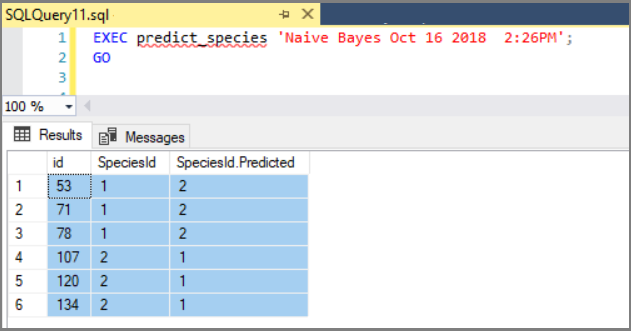

# Quickstart: Create, train, and use a Python model with stored procedures in SQL Server
[!INCLUDE[appliesto-ss-xxxx-xxxx-xxx-md-winonly](../../includes/appliesto-ss-xxxx-xxxx-xxx-md-winonly.md)]

In this quickstart using Python, you will create and execute two stored procedures. The first one uses the classic Iris flower data set and generates a Naïve Bayes model to predict an Iris species based on flower characteristics. The second procedure is for scoring. It calls the model generated in the first procedure to output a set of predictions. By placing code in a stored procedure, operations are contained, reusable, and callable by other stored procedures and client applications. 

By completing this quickstart, you will learn:

> [!div class="checklist"]
> * How to embed Python code in a stored procedure
> * How to pass inputs to your code through inputs on the stored procedure
> * How stored procedures are used to operationalize models

## Prerequisites

A previous quickstart, [Verify Python exists in SQL Server](quickstart-python-verify.md), provides information and links for setting up the Python environment required for this quickstart.

The sample data used in this exercise is the [**irissql**](demo-data-iris-in-sql.md) database.

## Create a stored procedure that generates models

A common pattern in SQL Server development is to organize programmable operations into distinct stored procedures. In this step, you will create a stored procedure that generates a model for predicting outcomes. 

1. Open a new query window in Management Studio, connected to the **irissql** database. 

    ```sql
    USE irissql
    GO
    ```

2. Copy in the following code to create a new stored procedure. 

   When executed, this procedure calls [sp_execute_external_script](https://docs.microsoft.com/sql/relational-databases/system-stored-procedures/sp-execute-external-script-transact-sql) to start a Python session. 
   
   Inputs needed by your Python code are passed as input parameters on this stored procedure. Output will be a trained model, based on the Python **scikit-learn** library for the machine learning algorithm. 

   This code uses [**pickle**](https://docs.python.org/2/library/pickle.html) to serialize the model. The model will be trained using data from columns 0 through 4 from the **iris_data** table. 
   
   The parameters you see in the second part of the procedure articulate data inputs and model outputs. As much as possible, you want the Python code running in a stored procedure to have clearly defined inputs and outputs that map to stored procedure inputs and outputs passed in at run time. 

    ```sql
    CREATE PROCEDURE generate_iris_model (@trained_model varbinary(max) OUTPUT)
    AS
    BEGIN
    EXEC sp_execute_external_script @language = N'Python',
    @script = N'
    import pickle
    from sklearn.naive_bayes import GaussianNB
    GNB = GaussianNB()
    trained_model = pickle.dumps(GNB.fit(iris_data[[0,1,2,3]], iris_data[[4]].values.ravel()))
    '
    , @input_data_1 = N'select "Sepal.Length", "Sepal.Width", "Petal.Length", "Petal.Width", "SpeciesId" from iris_data'
    , @input_data_1_name = N'iris_data'
    , @params = N'@trained_model varbinary(max) OUTPUT'
    , @trained_model = @trained_model OUTPUT;
    END;
    GO
    ```

3. Verify the stored procedure exists. 

   If the T-SQL script from the previous step ran without error, a new stored procedure called **generate_iris_model** is created and added to the **irissql** database. You can find stored procedures in Management Studio's **Object Explorer**, under **Programmability**.

## Execute the procedure to create and train models

In this step, execute the procedure to run the embedded code, creating a trained and serialized model as an output. Models that are stored for reuse in SQL Server are serialized as a byte stream and stored in a VARBINARY(MAX) column in a database table. Once the model is created, trained, serialized, and saved to a database, it can be called by other procedures or by the [PREDICT T-SQL](https://docs.microsoft.com/sql/t-sql/queries/predict-transact-sql) function in scoring workloads.

1. Copy the following code to execute the procedure. The specific statement for executing a stored procedure is `EXEC` on the fifth line.

   This particular script deletes an existing model of the same name ("Naive Bayes") to make room for new ones created by rerunning the same procedure. Without model deletion, an error occurs stating the object already exists. The model is stored in a table called **iris_models**, provisioned when you created the **irissql** database.

    ```sql
    DECLARE @model varbinary(max);
    DECLARE @new_model_name varchar(50)
    SET @new_model_name = 'Naive Bayes'
    EXEC generate_iris_model @model OUTPUT;
    DELETE iris_models WHERE model_name = @new_model_name;
    INSERT INTO iris_models (model_name, model) values(@new_model_name, @model);
    GO
    ```

2. Verify that the model was inserted Another way to return a list of models is

    ```sql
    SELECT * FROM dbo.iris_models
    ```

    **Results**

    | model_name  | model |
    |---|-----------------|
    | Naive Bayes | 0x800363736B6C6561726E2E6E616976655F62617965730A... | 

## Create and execute a stored procedure for generating predictions

Now that you have created, trained, and saved a model, move on to the next step: creating a stored procedure that generates predictions. You'll do this by calling sp_execute_external_script to start Python, and then pass in Python script that loads a serialized model you created in the last exercise, and then gives it data inputs to score.

1. Run the following code to create the stored procedure that performs scoring. At run time, this procedure will load a binary model, use columns `[1,2,3,4]` as inputs, and specify columns `[0,5,6]` as output.

    ```sql
    CREATE PROCEDURE predict_species (@model varchar(100))
    AS
    BEGIN
    DECLARE @nb_model varbinary(max) = (SELECT model FROM iris_models WHERE model_name = @model);
    EXEC sp_execute_external_script @language = N'Python', 
    @script = N'
    import pickle
    irismodel = pickle.loads(nb_model)
    species_pred = irismodel.predict(iris_data[[1,2,3,4]])
    iris_data["PredictedSpecies"] = species_pred
    OutputDataSet = iris_data[[0,5,6]] 
    print(OutputDataSet)
    '
    , @input_data_1 = N'select id, "Sepal.Length", "Sepal.Width", "Petal.Length", "Petal.Width", "SpeciesId" from iris_data'
    , @input_data_1_name = N'iris_data'
    , @params = N'@nb_model varbinary(max)'
    , @nb_model = @nb_model
    WITH RESULT SETS ( ("id" int, "SpeciesId" int, "SpeciesId.Predicted" int));
    END;
    GO
    ```

2. Execute the stored procedure, giving the model name "Naive Bayes" so that the procedure knows which model to use. 

    ```sql
    EXEC predict_species 'Naive Bayes';
    GO
    ```

    When you run the stored procedure, it returns a Python data.frame. This line of T-SQL specifies the schema for the returned results: `WITH RESULT SETS ( ("id" int, "SpeciesId" int, "SpeciesId.Predicted" int));`. You can insert the results into a new table, or return them to an application.

    

    The results are 150 predictions about species using floral characteristics as inputs. For the majority of the observations, the predicted species matches the actual species.

    This example has been made simple by using the Python iris dataset for both training and scoring. A more typical approach would involve running a SQL query to get the new data, and pass that into Python as `InputDataSet`. 

## Conclusion

In this exercise, you learned how to create stored procedures dedicated to different tasks, where each stored procedure used the system stored procedure [sp_execute_external_script](../../relational-databases/system-stored-procedures/sp-execute-external-script-transact-sql.md) to start a Python process. Inputs to the Python process are passed to sp_execute_external script as parameters. Both the Python script itself and data variables in a SQL Server database are passed as inputs.

Generally, you should only plan on using SSMS with polished Python code, or simple Python code that returns row-based output. As a tool, SSMS supports query languages like T-SQL and returns flattened rowsets. If your code generates visual output like a scatterplot or histogram, you need a tool or end-user application that can render the image.

For some Python developers who are used to writing all-inclusive script handling a range of operations, organizing tasks into separate procedures might seem unnecessary. But training and scoring have different use cases. By separating them, you can put each task on different schedule and scope permissions to operation.

Likewise, you can also leverage resourcing features of SQL Server, such as parallel processing, resource governance, or by writing your script to use algorithms in [revoscalepy](../python/ref-py-revoscalepy.md) or [microsoftml](../python/ref-py-microsoftml.md) that support streaming and parallel execution. By separating training and scoring, you can target optimizations for specific workloads.

A final benefit is that processes can be modified using parameters. In this exercise, Python code that created the model (named "Naive Bayes" in this example) was passed as an input to a second stored procedure calling the model in a scoring process. This exercise only uses one model, but you can imagine how parameterizing the model in a scoring task would make that script more useful.

## Next steps

If you are SQL developer new to Python, review the steps and tools for working with Python code locally, with the ability to shift execution from local sessions to a remote SQL Server instance.

> [!div class="nextstepaction"]
> [Set up a Python client workstation](../python/setup-python-client-tools-sql.md).

