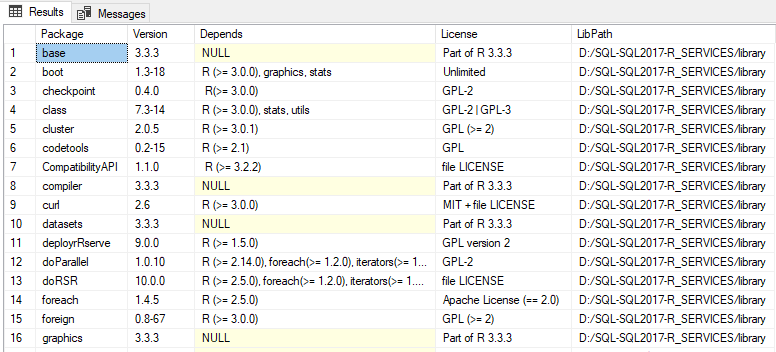

# Quickstart: Verify R exists in SQL Server 
[!INCLUDE[appliesto-ss-xxxx-xxxx-xxx-md-winonly](../../includes/appliesto-ss-xxxx-xxxx-xxx-md-winonly.md)]

SQL Server includes R language support for data science analytics on resident SQL Server data. Your R script can consist of open-source R functions, third-party R libraries, or built-in Microsoft R libraries such as [RevoScaleR](../r/revoscaler-overview.md) for predictive analytics at scale.

Script execution is through stored procedures, using either of the following approaches:

+ Built-in [sp_execute_external_script](https://docs.microsoft.com/sql/relational-databases/system-stored-procedures/sp-execute-external-script-transact-sql) stored procedure, passing R script in as an input parameter.
+ Wrap R script in a [custom stored procedure](sqldev-in-database-r-for-sql-developers.md) that you create.

In this quickstart, you will verify that [SQL Server 2017 Machine Learning Services](../what-is-sql-server-machine-learning.md) or [SQL Server 2016 R Services](../r/sql-server-r-services.md) is installed and configured.

## Prerequisites

This exercise requires access to an instance of SQL Server with one of the following already installed:

+ [SQL Server 2017 Machine Learning Services](../install/sql-machine-learning-services-windows-install.md), with the R language installed
+ [SQL Server 2016 R Services](../install/sql-r-services-windows-install.md)

Your SQL Server instance can be in an Azure virtual machine or on-premises. Just be aware that the external scripting feature is disabled by default, so you might need to [enable external scripting](../install/sql-machine-learning-services-windows-install.md#bkmk_enableFeature) and verify that **SQL Server Launchpad service** is running before you start.

You also need a tool for running SQL queries. You can run the R scripts using any database management or query tool, as long as it can connect to a SQL Server instance, and run a T-SQL query or stored procedure. This quickstart uses [SQL Server Management Studio (SSMS)](https://docs.microsoft.com/sql/ssms/sql-server-management-studio-ssms).

## Verify R exists

You can confirm that Machine Learning Services (with R) is enabled for your SQL Server instance and which version of R is installed. Follow the steps below.

1. Open SQL Server Management Studio and connect to your SQL Server instance.

2. Run the code below. 

    ```SQL
    EXECUTE sp_execute_external_script
    @language =N'R',
    @script=N'print(version)';
    GO
    ```

3. The R `print` function returns the version to the **Messages** window. In the example output below, you can see that SQL Server in this case have R version 3.3.3 installed.

    **Results**

    ```text
    platform       x86_64-w64-mingw32          
    arch           x86_64                      
    os             mingw32                     
    system         x86_64, mingw32             
    status                                     
    major          3                           
    minor          3.3                         
    year           2017                        
    month          03                          
    day            06                          
    svn rev        72310                       
    language       R                           
    version.string R version 3.3.3 (2017-03-06)
    nickname       Another Canoe               
    ```

If you get any errors from this query, rule out any installation issues. Post-install configuration is required to enable use of external code libraries. See [Install SQL Server 2017 Machine Learning Services](../install/sql-machine-learning-services-windows-install.md) or [Install SQL Server 2016 R Services](../install/sql-r-services-windows-install.md). Likewise, make sure that the Launchpad service is running.

Depending on your environment, you might need to enable the R worker accounts to connect to SQL Server, install additional network libraries, enable remote code execution, or restart the instance after everything is configured. For more information, see [R Services Installation and Upgrade FAQ](../r/upgrade-and-installation-faq-sql-server-r-services.md).

## List R packages

Microsoft provides a number of R packages pre-installed with Machine Learning Services in your SQL Server instance. To see a list of which R packages are installed, including version, dependencies, license, and library path information, follow the steps below.

1. Run the script below on your SQL Server instance.

    ```SQL
    EXECUTE sp_execute_external_script @language = N'R'
    , @script = N'
    OutputDataSet <- data.frame(installed.packages()[,c("Package", "Version", "Depends", "License", "LibPath")]);'
    WITH result sets((Package NVARCHAR(255), Version NVARCHAR(100), Depends NVARCHAR(4000)
        , License NVARCHAR(1000), LibPath NVARCHAR(2000)));
    ```

2. The output is from `installed.packages()` in R and returned as a result set.

    **Results**

    

## Next steps

Now that you have confirmed your instance is ready to work with R, take a closer look at a basic R interaction.

> [!div class="nextstepaction"]
> [Quickstart: "Hello world" R script in SQL Server ](quickstart-r-run-using-tsql.md)
