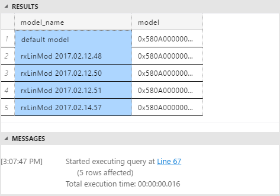
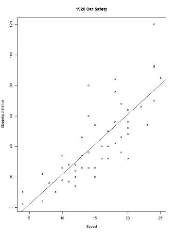

# Predict and plot from model (R in SQL quickstart)

To perform _scoring_ using new data, get one of the trained models from the table, and then call a new set of data on which to base predictions. Scoring is a term sometimes used in data science to mean generating predictions, probabilities, or other values based on new data fed into a trained model.

## Create the table of new speeds

Did you notice that the original training data stops at a speed of 25 miles per hour? That's because the original data was based on an experiment from 1920!

You might wonder, how long would it take an automobile from the 1920s to stop, assuming it could get going as fast as 60 mph or even 100 mph? To answer this question, you will provide some new speed values.

```sql
CREATE TABLE [dbo].[NewCarSpeed]([speed] [int] NOT NULL,
	[distance] [int]  NULL) ON [PRIMARY]
GO
INSERT [dbo].[NewCarSpeed] (speed)
VALUES (40),  (50),  (60), (70), (80), (90), (100)
```

## Predict stopping distance

By now, your table might contain multiple R models, all built using different parameters or algorithms, or trained on different subsets of data.



To get predictions based on one specific model, you must write a SQL script that does the following:

1. Gets the model you want
2. Gets the new input data
3. Calls an R prediction function that is compatible with that model

In this example, because your model is based on the **rxLinMod** algorithm provided as part of the **RevoScaleR** package, you should call the `rxPredict` function, rather than the generic R `predict` function.

```sql
DECLARE @speedmodel varbinary(max) = (SELECT model FROM [dbo].[stopping_distance_models] WHERE model_name = 'latest model');
EXEC sp_execute_external_script
    @language = N'R'
    , @script = N'
            current_model <- unserialize(as.raw(speedmodel));
            new <- data.frame(NewCarData);
            predicted.distance <- rxPredict(current_model, new);
            str(predicted.distance);
            OutputDataSet <- cbind(new, ceiling(predicted.distance));
            '
    , @input_data_1 = N' SELECT speed FROM [dbo].[NewCarSpeed] '
    , @input_data_1_name = N'NewCarData'
    , @params = N'@speedmodel varbinary(max)'
    , @speedmodel = @speedmodel
WITH RESULT SETS (([new_speed] INT, [predicted_distance] INT))
```

+ Use a SELECT statement to get a single model from the table, and pass it as an input parameter.
+  After retrieving the model from the table, call the `unserialize` function on the model.

    > [!TIP] 
    > Also check out the new [serialization functions](https://docs.microsoft.com/=r-server/r-reference/revoscaler/rxserializemodel) provided by RevoScaleR, which support [realtime scoring](../../advanced-analytics/real-time-scoring.md).
+  Apply the `rxPredict` function with appropriate arguments to the model, and provide the new input data.
+  In the example, the `str` function is added during the testing phase, to check the schema of data being returned from R. You can remove the statement later.
+ The column names used in the R script are not necessarily passed to the stored procedure output. Here we've used the WITH RESULTS clause to define some new column names.

**Results**


## Perform scoring in parallel

The predictions came back fairly fast on this tiny data set. But suppose you needed to make lots of predictions very fast? There are many ways to speed up operations in SQL Server, more so if the operations can be processed in  parallel. For scoring in particular, one easy way is to add the *@parallel* parameter to `sp_execute_external_script` and set the value to **1**.

Let's assume that you have obtained a much bigger table of possible car speeds, including hundreds of thousands of values. There are many sample T-SQL scripts from the community to help you generate number tables, so we won't reproduce those here. Let's just say that you have a column containing many integers, and want to use that as input for `speed` in the model.

To do this, just run the same prediction query, but substitute the larger dataset, and add the `@parallel = 1` argument.

```sql
DECLARE @speedmodel varbinary(max) = (select model from [dbo].[stopping_distance_models] where model_name = 'default model');
EXEC sp_execute_external_script
    @language = N'R'
    , @script = N'
            current_model <- unserialize(as.raw(speedmodel));
            new <- data.frame(NewCarData);
            predicted.distance <- rxPredict(current_model, new);
            OutputDataSet <- cbind(new, ceiling(predicted.distance));
            '
    , @input_data_1 = N' SELECT [speed] FROM [dbo].[HugeTableofCarSpeeds] '
    , @input_data_1_name = N'NewCarData'
    , @parallel = 1
    , @params = N'@speedmodel varbinary(max)'
    , @speedmodel = @speedmodel
WITH RESULT SETS (([new_speed] INT, [predicted_distance] INT))
```

+ Parallel execution generally provides benefits only when working with very large data. The SQL database engine might decide that parallel execution is not needed. Moreover, the SQL query that gets your data must be capable of generating a parallel query plan.

+ When using the option for parallel execution, you **must** specify the output results schema in advance, by using the WITH RESULT SETS clause. Specifying the output schema in advance allows SQL Server to aggregate the results of multiple parallel datasets, which otherwise might have unknown schemas.

+ If you are *training* a model instead of *scoring*, this parameter often won't have an effect. Depending on the model type, model creation might require that all the rows be read before summaries can be created.

+ To get the benefits of parallel processing when you train your model, we recommend that you use one of the **RevoScaleR** algorithms. These algorithms are designed to distribute processing automatically, even if you don't specify <code>@parallel =1</code> in the call to `sp_execute_external_script`. For guidance on how to get the best performance with RevoScaleR algorithms, see [Distributed and parallel computing with ScaleR in Microsoft R](https://docs.microsoft.com/r-server/r/how-to-revoscaler-distributed-computing).

## Create an R plot of the model

Many clients, including SQL Server Management Studio, cannot directly display plots created using [sp_execute_external_script](../../relational-databases/system-stored-procedures/sp-execute-external-script-transact-sql.md). Instead, the general process for generating R plots is to create the plot as part of your R code and then write the image to a file.

Alternatively, you can return the serialized binary plot object to any application that can display images.

The following example demonstrates how to create a simple graphic using a plotting function included by default with R. The image is output to the specified file, and is also output into a SQL variable by the stored procedure.

```sql
 EXECUTE sp_execute_external_script
 @language = N'R'
 , @script = N'
     imageDir <- ''C:\\temp\\plots'';
     image_filename = tempfile(pattern = "plot_", tmpdir = imageDir, fileext = ".jpg")
     print(image_filename);
     jpeg(filename=image_filename,  width=600, height = 800);
     print(plot(distance~speed, data=InputDataSet, xlab="Speed", ylab="Stopping distance", main = "1920 Car Safety"));
     abline(lm(distance~speed, data = InputDataSet));
     dev.off();
     OutputDataSet <- data.frame(data=readBin(file(image_filename, "rb"), what=raw(), n=1e6));
     '
  , @input_data_1 = N'SELECT speed, distance from [dbo].[CarSpeed]'
  WITH RESULT SETS ((plot varbinary(max)));
```

+ The `tempfile` function returns a string that can be used as a file name, but the file is not actually generated yet.
+ For arguments to `tempfile`, you can specify a prefix and file extension, as well as the directory. To verify the complete file name and path, print a message using `str()`.
+ The `jpeg` function creates an R device with the specified parameters.
+ After you create the plot, you can add more visual features to it. In this case, a regression line is added using `abline`.
+ When you are done adding plot features, you must close the graphics device using the `dev.off()` function.
+ The `readBin` function takes a file to read, a format specification, and the number of records. The `rb`**` keyword indicates that the file is binary rather than text.

**Results**



If you want to do some more elaborate plots, using some of the great graphics packages for R, we recommend these articles. Both require the popular **ggplot2** package.

+ [Loan Classification using SQL Server 2016 R Services](https://blogs.msdn.microsoft.com/microsoftrservertigerteam/2016/09/27/loan-classification-using-sql-server-2016-r-services/): End-to-end scenario based on insurance data. Requires the **reshape** package.
+ [Create Graphs and Plots Using R](../../advanced-analytics/tutorials/walkthrough-create-graphs-and-plots-using-r.md)

## Conclusions

Integration of R with SQL Server makes it easier to deploy R solutions at scale, leveraging the best features of R and relational databases, for high-performance data handling and rapid R analytics. 

See these additional resources for more R samples:

+  [SQL Server R tutorials](../../advanced-analytics/tutorials/sql-server-r-tutorials.md)

    Continue learning about solutions using R with SQL Server, through end-to-end scenarios created by the Microsoft Data Science and R Services development teams.

+ [SQL Server Python tutorials](../../advanced-analytics/tutorials/sql-server-python-tutorials.md)

    For SQL Server 2017, use the power of remote compute context and scalable algorithm with the Python language.

+ [Tutorials and sample data for Microsoft R](https://docs.microsoft.com/r-server/r/tutorial-introduction)

    Learn how to use the new RevoScaleR packages to create models and transform data.

+ [Get Started with MicrosoftML](https://docs.microsoft.com/r-server/r/concept-what-is-the-microsoftml-package)

    Learn more about the fast, scalable machine learning algorithms from Microsoft Research.