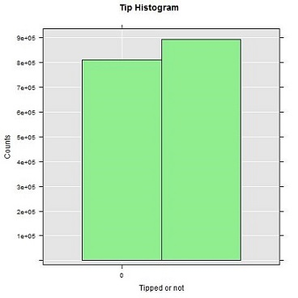

# Lesson 1: Explore and visualize the data
[!INCLUDE[appliesto-ss-xxxx-xxxx-xxx-md-winonly](../../includes/appliesto-ss-xxxx-xxxx-xxx-md-winonly.md)]

This article is part of a tutorial for SQL developers on how to use R in SQL Server.

In this step, you'll review the sample data, and then generate some plots using [rxHistogram](https://docs.microsoft.com/machine-learning-server/r-reference/revoscaler/rxhistogram) from [RevoScaleR](https://docs.microsoft.com/machine-learning-server/r-reference/revoscaler/revoscaler) and the generic [Hist](https://www.rdocumentation.org/packages/graphics/versions/3.5.0/topics/hist) function in base R. These R functions are already included in [!INCLUDE[rsql_productname](../../includes/rsql-productname-md.md)].

A key objective of this lesson is showing how to call R functions from [!INCLUDE[tsql](../../includes/tsql-md.md)] in stored procedures and save the results in application file formats:

+ Create a stored procedure using **RxHistogram** to generate an R plot as varbinary data. Use **bcp** to export the binary stream to an image file.
+ Create a stored procedure using **Hist** to generate a plot, saving results as JPG and PDF output.

> [!NOTE]
> Because visualization is such a powerful tool for understanding data shape and distribution, R provides a range of functions and packages for generating histograms, scatter plots, box plots, and other data exploration graphs. R typically creates images using an R device for graphical output, which you can capture and store as a **varbinary** data type for rendering in application. You can also save the images to any of the support file formats (.JPG, .PDF, etc.).

## Review the data

Developing a data science solution usually includes intensive data exploration and data visualization. So first take a minute to review the sample data, if you haven't already.

In the original public dataset, the taxi identifiers and trip records were provided in separate files. However, to make the sample data easier to use, the two original datasets have been joined on the columns _medallion_, _hack\_license_, and _pickup\_datetime_.  The records were also sampled to get just 1% of the original number of records. The resulting down-sampled dataset has 1,703,957 rows and 23 columns.

**Taxi identifiers**
  
-   The _medallion_ column represents the taxi's unique id number.
  
-   The _hack\_license_ column contains the taxi driver's license number (anonymized).
  
**Trip and fare records**
  
-   Each trip record includes the pickup and drop-off location and time, and the trip distance.
  
-   Each fare record includes payment information such as the payment type, total amount of payment, and the tip amount.
  
-   The last three columns can be used for various machine learning tasks. The _tip\_amount_ column contains continuous numeric values and can be used as the **label** column for regression analysis. The _tipped_ column has only yes/no values and is used for binary classification. The _tip\_class_ column has multiple **class labels** and therefore can be used as the label for multi-class classification tasks.
  
    This walkthrough demonstrates only the binary classification task; you are welcome to try building models for the other two machine learning tasks, regression and multiclass classification.
  
-   The values used for the label columns are all based on the _tip\_amount_ column, using these business rules:
  
    |Derived column name|Rule|
    |-|-|
     |tipped|If tip_amount > 0, tipped = 1, otherwise tipped = 0|
    |tip_class|Class 0: tip_amount = $0<br /><br />Class 1: tip_amount > $0 and tip_amount <= $5<br /><br />Class 2: tip_amount > $5 and tip_amount <= $10<br /><br />Class 3: tip_amount > $10 and tip_amount <= $20<br /><br />Class 4: tip_amount > $20|

## Create a stored procedure using rxHistogram to plot the data

To create the plot, use [rxHistogram](https://docs.microsoft.com/machine-learning-server/r-reference/revoscaler/rxhistogram), one of the enhanced R functions provided in [RevoScaleR](https://docs.microsoft.com/machine-learning-server/r-reference/revoscaler/revoscaler). This step plots a histogram based on data from a [!INCLUDE[tsql](../../includes/tsql-md.md)] query. You can wrap this function in a stored procedure, **PlotRxHistogram**.

1. In [!INCLUDE[ssManStudioFull](../../includes/ssmanstudiofull-md.md)], in Object Explorer, right-click the **NYCTaxi_Sample** database and select **New Query**.

2. Paste in the following script to create a stored procedure that plots the histogram. This example is named **RPlotRxHistogram*.

    ```sql
    CREATE PROCEDURE [dbo].[RxPlotHistogram]
    AS
    BEGIN
      SET NOCOUNT ON;
      DECLARE @query nvarchar(max) =  
      N'SELECT tipped FROM nyctaxi_sample'  
      EXECUTE sp_execute_external_script @language = N'R',  
                                         @script = N'  
       image_file = tempfile();  
       jpeg(filename = image_file);  
       #Plot histogram  
       rxHistogram(~tipped, data=InputDataSet, col=''lightgreen'',   
       title = ''Tip Histogram'', xlab =''Tipped or not'', ylab =''Counts'');  
       dev.off();  
       OutputDataSet <- data.frame(data=readBin(file(image_file, "rb"), what=raw(), n=1e6));  
       ',  
       @input_data_1 = @query  
       WITH RESULT SETS ((plot varbinary(max)));  
    END
    GO
    ```

Key points to understand in this script include the following: 
  
+ The variable `@query` defines the query text (`'SELECT tipped FROM nyctaxi_sample'`), which is passed to the R script as the argument to the script input variable, `@input_data_1`. For R scripts that run as external processes, you should have a one-to-one mapping between inputs to your script, and inputs to the [sp_execute_external_script](https://docs.microsoft.com/sql/relational-databases/system-stored-procedures/sp-execute-external-script-transact-sql) system stored procedure that starts the R session on SQL Server.
  
+ Within the R script, a variable (`image_file`) is defined to store the image. 

+ The **rxHistogram** function from the RevoScaleR library is called to generate the plot.
  
+ The R device is set to **off** because you are running this command as an external script in SQL Server. Typically in R, when you issue a high-level plotting command, R opens a graphics window, called a *device*. You can turn the device off if you are writing to a file or handling the output some other way.
  
+ The R graphics object is serialized to an R data.frame for output.

### Execute the stored procedure and use bcp to export binary data to an image file

The stored procedure returns the image as a stream of varbinary data, which obviously you cannot view directly. However, you can use the **bcp** utility to get the varbinary data and save it as an image file on a client computer.
  
1. In [!INCLUDE[ssManStudio](../../includes/ssmanstudio-md.md)], run the following statement:
  
    ```sql
    EXEC [dbo].[RxPlotHistogram]
    ```
  
    **Results**
    
    *plot*
    *0xFFD8FFE000104A4649...*
  
2. Open a PowerShell command prompt and run the following command, providing the appropriate instance name, database name, username, and credentials as arguments. For those using Windows identities, you can replace **-U** and **-P** with **-T**.
  
    ```powershell
    bcp "exec RxPlotHistogram" queryout "plot.jpg" -S <SQL Server instance name> -d  NYCTaxi_Sample  -U <user name> -P <password> -T
    ```

    > [!NOTE]
    > Command switches for bcp are case-sensitive.
  
3. If the connection is successful, you will be prompted to enter more information about the graphic file format. 

   Press ENTER at each prompt to accept the defaults, except for these changes:
    
   + For **prefix-length of field plot**, type 0
  
   + Type **Y** if you want to save the output parameters for later reuse.
  
    ```powershell
    Enter the file storage type of field plot [varbinary(max)]: 
    Enter prefix-length of field plot [8]: 0
    Enter length of field plot [0]:
    Enter field terminator [none]:
  
    Do you want to save this format information in a file? [Y/n]
    Host filename [bcp.fmt]:
    ```
  
    **Results**
    
    ```powershell
    Starting copy...
    1 rows copied.
    Network packet size (bytes): 4096
    Clock Time (ms.) Total     : 3922   Average : (0.25 rows per sec.)
    ```

    > [!TIP]
    > If you save the format information to file (bcp.fmt), the **bcp** utility generates a format definition that you can apply to similar commands in future without being prompted for graphic file format options. To use the format file, add `-f bcp.fmt` to the end of any command line, after the password argument.
  
4.  The output file will be created in the same directory where you ran the PowerShell command. To view the plot, just open the file plot.jpg.
  
      
  
## Create a stored procedure using Hist and multiple output formats

Typically, data scientists generate multiple data visualizations to get insights into the data from different perspectives. In this example, you will create a stored procedure called **RPlotHist** to write histograms, scatterplots, and other R graphics to .JPG and .PDF format.

This stored procedure uses the **Hist** function to create the histogram, exporting the binary data to popular formats such as .JPG, .PDF, and .PNG. 

1. In [!INCLUDE[ssManStudioFull](../../includes/ssmanstudiofull-md.md)], in Object Explorer, right-click the **NYCTaxi_Sample** database and select **New Query**.

2. Paste in the following script to create a stored procedure that plots the histogram. This example is named **RPlotHist** .
  
    ```sql
    CREATE PROCEDURE [dbo].[RPlotHist]  
    AS  
    BEGIN  
      SET NOCOUNT ON;  
      DECLARE @query nvarchar(max) =  
      N'SELECT cast(tipped as int) as tipped, tip_amount, fare_amount FROM [dbo].[nyctaxi_sample]'  
      EXECUTE sp_execute_external_script @language = N'R',  
      @script = N'  
       # Set output directory for files and check for existing files with same names   
        mainDir <- ''C:\\temp\\plots''  
        dir.create(mainDir, recursive = TRUE, showWarnings = FALSE)  
        setwd(mainDir);  
        print("Creating output plot files:", quote=FALSE)
        
        # Open a jpeg file and output histogram of tipped variable in that file.  
        dest_filename = tempfile(pattern = ''rHistogram_Tipped_'', tmpdir = mainDir)  
        dest_filename = paste(dest_filename, ''.jpg'',sep="")  
        print(dest_filename, quote=FALSE);  
        jpeg(filename=dest_filename);  
        hist(InputDataSet$tipped, col = ''lightgreen'', xlab=''Tipped'',   
            ylab = ''Counts'', main = ''Histogram, Tipped'');  
         dev.off();  

        # Open a pdf file and output histograms of tip amount and fare amount.   
        # Outputs two plots in one row  
        dest_filename = tempfile(pattern = ''rHistograms_Tip_and_Fare_Amount_'', tmpdir = mainDir)  
        dest_filename = paste(dest_filename, ''.pdf'',sep="")  
        print(dest_filename, quote=FALSE);  
        pdf(file=dest_filename, height=4, width=7);  
        par(mfrow=c(1,2));  
        hist(InputDataSet$tip_amount, col = ''lightgreen'',   
            xlab=''Tip amount ($)'',   
            ylab = ''Counts'',   
            main = ''Histogram, Tip amount'', xlim = c(0,40), 100);  
        hist(InputDataSet$fare_amount, col = ''lightgreen'',   
            xlab=''Fare amount ($)'',   
            ylab = ''Counts'',   
            main = ''Histogram,   
            Fare amount'',   
            xlim = c(0,100), 100);  
       dev.off();  
  
        # Open a pdf file and output an xyplot of tip amount vs. fare amount using lattice;  
        # Only 10,000 sampled observations are plotted here, otherwise file is large.  
        dest_filename = tempfile(pattern = ''rXYPlots_Tip_vs_Fare_Amount_'', tmpdir = mainDir)  
        dest_filename = paste(dest_filename, ''.pdf'',sep="")  
        print(dest_filename, quote=FALSE);  
        pdf(file=dest_filename, height=4, width=4);  
        plot(tip_amount ~ fare_amount,   
            data = InputDataSet[sample(nrow(InputDataSet), 10000), ],   
            ylim = c(0,50),   
            xlim = c(0,150),   
            cex=.5,   
            pch=19,   
            col=''darkgreen'',    
            main = ''Tip amount by Fare amount'',   
            xlab=''Fare Amount ($)'',   
            ylab = ''Tip Amount ($)'');   
        dev.off();',  
     @input_data_1 = @query  
     END
    ```
  
+ The output of the SELECT query within the stored procedure is stored in the default R data frame, `InputDataSet`. Various R plotting functions can then be called to generate the actual graphics files. Most of the embedded R script represents options for these graphics functions,  such as `plot` or `hist`.
  
+ All files are saved to the local folder C:\temp\Plots. The destination folder is defined by the arguments provided to the R script as part of the stored procedure.  You can change the destination folder by changing the value of the variable, `mainDir`.

+ To output the files to a different folder, change the value of the `mainDir` variable in the R script embedded in the stored procedure. You can also modify the script to output different formats, more files, and so on.

### Execute the stored procedure

Run the following statement to export binary plot data to JPEG and PDF file formats.

```sql
EXEC RPlotHist
```

**Results**
    
```sql
STDOUT message(s) from external script:
[1] Creating output plot files:[1] C:\temp\plots\rHistogram_Tipped_18887f6265d4.jpg[1] 

C:\temp\plots\rHistograms_Tip_and_Fare_Amount_1888441e542c.pdf[1]

C:\temp\plots\rXYPlots_Tip_vs_Fare_Amount_18887c9d517b.pdf
```

The numbers in the file names are randomly generated to ensure that you don't get an error when trying to write to an existing file.

### View output 

To view the plot, open the destination folder and review the files that were created by the R code in the stored procedure.

1. Go the folder indicated in the STDOUT message (in the example, this is C:\temp\plots\)

2. Open `rHistogram_Tipped.jpg` to show the number of trips that got a tip vs. the trips that got no tip. (This histogram is much like the one you generated in the previous step.)

3. Open `rHistograms_Tip_and_Fare_Amount.pdf` to view distribution of tip amounts, plotted against the fare amounts.
    
  

4. Open `rXYPlots_Tip_vs_Fare_Amount.pdf` to view a scatterplot with the fare amount on the x-axis and the tip amount on the y-axis.

   

## Next lesson

[Lesson 2: Create data features using T-SQL](sqldev-create-data-features-using-t-sql.md)

## Previous lesson

[Set up NYC Taxi demo data](demo-data-nyctaxi-in-sql.md)
