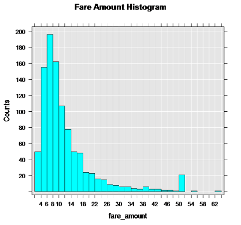
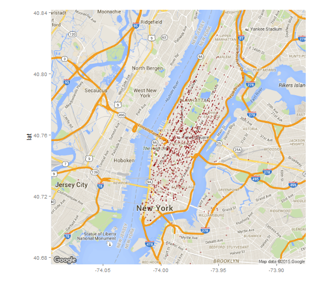

# Create graphs and plots using SQL and R (walkthrough)
[!INCLUDE[appliesto-ss-xxxx-xxxx-xxx-md-winonly](../../includes/appliesto-ss-xxxx-xxxx-xxx-md-winonly.md)]

In this part of the walkthrough, you learn techniques for generating plots and maps using R with SQL Server data. You create a simple histogram and then develop a more complex map plot.

## Prerequisites

This step assumes an ongoing R session based on previous steps in this walkthrough. It uses the connection strings and data source objects created in those steps. The following tools and packages are used to run the script.

+ Rgui.exe to run R commands
+ Management Studio to run T-SQL
+ googMap
+ ggmap package
+ mapproj package

## Create a histogram

1. Generate the first plot, using the [rxHistogram](https://docs.microsoft.com/r-server/r-reference/revoscaler/rxdatasource) function.  The rxHistogram function provides functionality similar to that in open-source R packages, but can run in a remote execution context.

    ```R
    # Plot fare amount on SQL Server and return the plot
    start.time <- proc.time()
    rxHistogram(~fare_amount, data = inDataSource, title = "Fare Amount Histogram")
    used.time <- proc.time() - start.time
    print(paste("It takes CPU Time=", round(used.time[1]+used.time[2],2), " seconds, Elapsed Time=", round(used.time[3],2), " seconds to generate plot.", sep=""))
    ```

2. The image is returned in the R graphics device for your development environment.  For example, in RStudio, click the **Plot** window.  In [!INCLUDE[rsql_rtvs](../../includes/rsql-rtvs-md.md)], a separate graphics window is opened.

    

    > [!NOTE]
    > Does your graph look different?
    >  
    > That's because _inDataSource_ uses only the top 1000 rows. The ordering of rows using TOP is non-deterministic in the absence of an ORDER BY clause, so it's expected that the data and the resulting graph might vary.
    > This particular image was generated using about 10,000 rows of data. We recommend that you experiment with different numbers of rows to get different graphs, and note how long it takes to return the results in your environment.

## Create a map plot

Typically, database servers block Internet access. This can be inconvenient when using R packages that need to download maps or other images to generate plots. However, there is a workaround that you might find useful when developing your own applications. Basically, you generate the map representation on the client, and then overlay on the map the points that are stored as attributes in the SQL Server table.

1. Define the function that creates the R plot object. The custom function *mapPlot* creates a scatter plot that uses the taxi pickup locations, and plots the number of rides that started from each location. It uses the **ggplot2** and  **ggmap** packages, which should already be [installed and loaded](walkthrough-data-science-end-to-end-walkthrough.md#add-packages).

    ```R
    mapPlot <- function(inDataSource, googMap){
        library(ggmap)
        library(mapproj)
        ds <- rxImport(inDataSource)
        p <- ggmap(googMap)+
        geom_point(aes(x = pickup_longitude, y =pickup_latitude ), data=ds, alpha =.5,
    color="darkred", size = 1.5)
        return(list(myplot=p))
    }
    ```

    + The *mapPlot* function takes two arguments: an existing data object, which you defined earlier using RxSqlServerData, and the map representation passed from the client.
    + In the line beginning with the *ds* variable, rxImport is used to load into memory data from the previously created data source, *inDataSource*. (That data source contains only 1000 rows; if you want to create a map with more data points, you can substitute a different data source.)
    + Whenever you use open-source R functions, data must be loaded into data frames in local memory. However, by calling the [rxImport](https://docs.microsoft.com/r-server/r-reference/revoscaler/rximport) function, you can run in the memory of the remote compute context.

2. Change the compute context to local, and load the libraries required for creating the maps.

    ```R
    rxSetComputeContext("local")
    library(ggmap)
    library(mapproj)
    gc <- geocode("Times Square", source = "google")
    googMap <- get_googlemap(center = as.numeric(gc), zoom = 12, maptype = 'roadmap', color = 'color');
    ```

    + The `gc` variable stores a set of coordinates for Times Square, NY.

    + The line beginning with `googmap` generates a map with the specified coordinates at the center.

3. Switch to the SQL Server compute context, and render the results, by wrapping the plot function in [rxExec](https://docs.microsoft.com/r-server/r-reference/revoscaler/rxexec) as shown here. The rxExec function is part of the **RevoScaleR** package, and supports execution of arbitrary R functions in a remote compute context.

    ```R
    rxSetComputeContext(sqlcc)
    myplots <- rxExec(mapPlot, inDataSource, googMap, timesToRun = 1)
    plot(myplots[[1]][["myplot"]]);
    ````

    + The map data in `googMap` is passed as an argument to the remotely executed function *mapPlot*. Because the maps were generated in your local environment, they must be passed to the function in order to create the plot in the context of SQL Server.

    + When the line beginning with `plot` runs, the rendered data is serialized back to the local R environment so that you can view it in your R client.

    > [!NOTE]
    > If you are using SQL Server in an Azure virtual machine, you might get an error at this point. An error occurs when the default firewall rule in Azure blocks network access by R code. For details on how to fix this error, see [Installing Machine Learning (R) Services on an Azure VM](../r/installing-sql-server-r-services-on-an-azure-virtual-machine.md).

4. The following image shows the output plot. The taxi pickup locations are added to the map as red dots. Your image might look different, depending how many locations are in the data source you used.

    

## Next steps

> [!div class="nextstepaction"]
> [Create data features using R and SQL](walkthrough-create-data-features.md)
