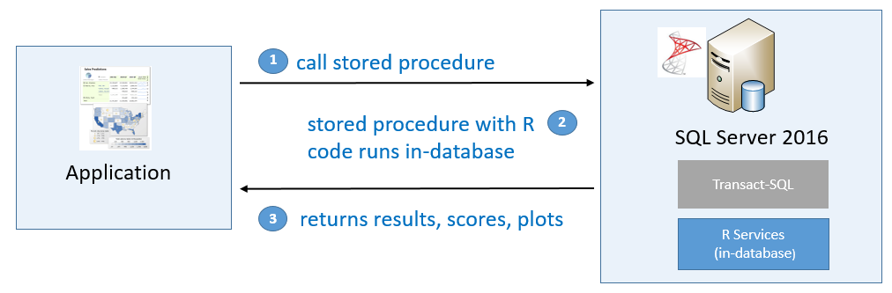

# Machine Learning Services (R, Python) in SQL Server 2017
[!INCLUDE[appliesto-ss-xxxx-xxxx-xxx-md-winonly](../includes/appliesto-ss-xxxx-xxxx-xxx-md-winonly.md)]

SQL Server 2017 Machine Learning Services is an add-on to a database engine instance, used for executing R and Python code on SQL Server. The feature includes [Microsoft R and Python packages](#components) for high-performance predictive analytics and machine learning. Code runs in an extensibility framework, isolated from core engine processes, but fully available to relational data as stored procedures, as T-SQL script containing R or Python statements, or as R or Python code containing T-SQL. 

If you previously used [SQL Server 2016 R Services](r/sql-server-r-services.md), Machine Learning Services in SQL Server 2017 is the next generation of R support, with updated versions of base R, RevoScaleR, MicrosoftML, and other libraries introduced in 2016. 

In Azure SQL Database, [Machine Learning Services (with R)](https://docs.microsoft.com/azure/sql-database/sql-database-machine-learning-services-overview) is currently in public preview.

The key value proposition of Machine Learning Services is the power of its enterprise R and Python packages to deliver advanced analytics at scale, and the ability to bring calculations and processing to where the data resides, eliminating the need to pull data across the network.

## Components

SQL Server 2017 supports R and Python. The following table describes the components.

| Component | Description |
|-----------|-------------|
| SQL Server Launchpad service | A service that manages communications between the external R and Python runtimes and the database engine instance. |
| R packages | [**RevoScaleR**](r/ref-r-revoscaler.md) is the primary library for scalable R. Functions in this library are among the most widely used. Data transformations and manipulation, statistical summarization, visualization, and many forms of modeling and analyses are found in these libraries. Additionally, functions in these libraries automatically distribute workloads across available cores for parallel processing, with the ability to work on chunks of data that are coordinated and managed by the calculation engine.   [**MicrosoftML (R)**](r/ref-r-microsoftml.md) adds machine learning algorithms to create custom models for text analysis, image analysis, and sentiment analysis.  [**sqlRUtils**](r/ref-r-sqlrutils.md) provides helper functions for putting R scripts into a T-SQL stored procedure, registering a stored procedure with a database, and running the stored procedure from an R development environment. [**olapR**](r/ref-r-olapr.md) is for building or executing an MDX query in R script.|
| Microsoft R Open (MRO) | [**MRO**](https://mran.microsoft.com/open) is Microsoft's open-source distribution of R. The package and interpreter are included. Always use the version of MRO installed by Setup. |
| R tools | R console windows and command prompts are standard tools in an R distribution.  |
| R Samples and scripts |  Open-source R and RevoScaleR packages include built-in data sets so that you can create and run script using pre-installed data. |
| Python packages | [**revoscalepy**](python/ref-py-revoscalepy.md) is the primary library for scalable Python with functions for data manipulation, transformation, visualization, and analysis.  [**microsoftml (Python)**](python/ref-py-microsoftml.md) adds machine learning algorithms to create custom models for text analysis, image analysis, and sentiment analysis.  |
| Python tools | The built-in Python command line tool is useful for ad hoc testing and tasks.  |
| Anaconda | Anaconda is an open-source distribution of Python and essential packages. |
| Python samples and scripts | As with R, Python includes built-in data sets  and scripts.  |
| Pre-trained models in R and Python | Pre-trained models are created for specific use cases and maintained by the data science engineering team at Microsoft. You can use the pre-trained models as-is to score positive-negative sentiment in text, or detect features in images, using new data inputs that you provide. The models run in Machine Learning Services, but cannot be installed through SQL Server Setup. For more information, see [Install pre-trained machine learning models on SQL Server](install/sql-pretrained-models-install.md). |

## Using SQL MLS

Developers and analysts often have code running on top of a local SQL Server instance. By adding Machine Learning Services and enabling external script execution, you gain the ability to run R and Python code in SQL Server modalities: wrapping script in stored procedures, storing models in a SQL Server table, or combining T-SQL and R or Python functions in queries.

Script execution is within the boundaries of the data security model: permissions on the relational database are the basis of data access in your script. A user running R or Python script should not be able to use any data that could not be accessed by that user in a SQL query. You need the standard database read and write permissions, plus an additional permission to run external script. Models and code that you write for relational data are wrapped in stored procedures, or serialized to a binary format and stored in a table, or loaded from disk if you serialized the raw byte stream to a file.

The most common approach for in-database analytics is to use [sp_execute_external_script](../relational-databases/system-stored-procedures/sp-execute-external-script-transact-sql.md), passing R or Python script as an input parameter.

Classic client-server interactions are another approach. From any client workstation that has an IDE, you can install [Microsoft R Client](https://docs.microsoft.com/machine-learning-server/r-client/what-is-microsoft-r-client) or the [Python libraries](https://docs.microsoft.com/machine-learning-server/install/python-libraries-interpreter), and then write code that pushes execution (referred to as a *remote compute context*) to data and operations to a remote SQL Server. 

Finally, if you are using a [standalone server](r/r-server-standalone.md) and the Developer edition, you can build solutions on a client workstation using the same libraries and interpreters, and then deploy production code on SQL Server Machine Learning Services (In-Database). 

## How to get started

### Step 1: Install the software

+ [SQL Server Machine Learning Services (In-Database)](install/sql-machine-learning-services-windows-install.md)
 
### Step 2: Configure a development tool

Data scientists typically use R or Python on their own laptop or development workstation, to explore data, and build and tune predictive models until a good predictive model is achieved. With in-database analytics in SQL Server, there is no need to change this process. After installation is complete, you can run R or Python code on SQL Server locally and remotely.

 

+ **Use the IDE you prefer**. You can link the R and Python libraries to your development tool of choice. For more information, see [Set up R tools](r/set-up-a-data-science-client.md) and [Set up Python tools](python/setup-python-client-tools-sql.md).  

+ **Work remotely or locally**. Data scientists can connect to SQL Server and bring the data to the client for local analysis, as usual. However, a better solution is to use the **RevoScaleR** or **revoscalepy** APIs to push computations to the SQL Server computer, avoiding costly and insecure data movement.

+ **Embed R or Python scripts in SQL Server stored procedures**. When your code is fully optimized, wrap it in a stored procedure to avoid unnecessary data movement and optimize data processing tasks.

### Step 3: Write your first script

Call R or Python functions from within T-SQL script:

+ [R: Learn in-database analytics using R](tutorials/sqldev-in-database-r-for-sql-developers.md)
+ [R: End-to-end walkthrough with R](tutorials/walkthrough-data-science-end-to-end-walkthrough.md)
+ [Python: Run Python using T-SQL](tutorials/run-python-using-t-sql.md)
+ [Python: Learn in-database analytics using Python](tutorials/sqldev-in-database-python-for-sql-developers.md)

Choose the best language for the task. R is best for statistical computations that are difficult to implement using SQL. For set-based operations over data, leverage the power of SQL Server  to achieve maximum performance. Use the in-memory database engine for very fast computations over columns.

### Step 4: Optimize your solution

When the model is ready to scale on enterprise data, the data scientist often works with the DBA or SQL developer to optimize processes such as:

+ Feature engineering
+ Data ingestion and data transformation
+ Scoring

Traditionally, data scientists using R have had problems with both performance and scale, especially when using large dataset. That is because the common runtime implementation is single-threaded and can accommodate only those data sets that fit into the available memory on the local computer. Integration with SQL Server Machine Learning Services provides multiple features for better performance, with more data:

+ **RevoScaleR**: This R package contains implementations of some of the most popular R functions, redesigned to provide parallelism and scale. The package also includes functions that further boost  performance and scale by pushing computations to the SQL Server computer, which typically has far greater memory and computational power.

+ **revoscalepy**. This Python library implements the most popular functions in RevoScaleR, such as remote compute contexts, and many algorithms that support distributed processing.

For more information about performance, see this [performance case study](r/performance-case-study-r-services.md) and [R and data optimization](r/r-and-data-optimization-r-services.md).

### Step 5: Deploy and Consume

After the script or model is ready for production use, a database developer might embed the code or model in a stored procedure so that the saved R or Python code can be called from an application. Storing and running R code from SQL Server has many benefits: you can use the convenient SQL Server interface, and all computations take place in the database, avoiding unnecessary data movement.

+ **Secure and extensible**. SQL Server uses a new extensibility architecture that keeps your database engine secure and isolates R and Python sessions. You also have control over the users who can execute scripts, and you can specify which databases can be accessed by code. You can control the amount of resources allocated to the runtime, to prevent massive computations from jeopardizing the overall server performance.

+ **Scheduling and auditing**. When external script jobs are run in SQL Server, you can control and audit the data used by data scientists. You can also schedule jobs and author workflows containing external R or Python scripts, just like you would schedule any other T-SQL job or stored procedure.

To take advantage of the resource management and security features in SQL Server, the deployment process might include these tasks:

+ Converting your code to a function that can run optimally in a stored procedure
+ Setting up security and locking down packages used by a particular task
+ Enabling resource governance (requires the Enterprise edition)

For more information, see [Resource Governance for R](r/resource-governance-for-r-services.md) and [R Package Management for SQL Server](r/install-additional-r-packages-on-sql-server.md).

## Version history

SQL Server 2017 Machine Learning Services is the next generation of SQL Server 2016 R Services, enhanced to include Python. The following table is a complete list of all product versions, from inception to the current release. 

| Product name | Engine version | Release date |
|--------------|---------|--------------|
| SQL Server 2017 Machine Learning Services (In-Database) | R Server 9.2.1   Python Server 9.2 | October 2017 |
| SQL Server 2017 Machine Learning Server (Standalone) | R Server 9.2.1   Python Server 9.2 | October 2017 |
| SQL Server 2016 R Services (In-Database) | R Server 9.1  | July 2017  |
| SQL Server 2016 R Server (Standalone)  |  R Server 9.1 | July 2017 |

For package versions by release, see the version map in [Upgrade R and Python components](r/use-sqlbindr-exe-to-upgrade-an-instance-of-sql-server.md#version-map).

## Portability and related products

Portability of your custom R and Python code is addressed through package distribution and interpreters that are built into multiple products. The same packages that ship in SQL Server are also available in several other Microsoft products and services, including a non-SQL version called [Microsoft Machine Learning Server](https://docs.microsoft.com/machine-learning-server/). 

Free clients that include our R and Python interpreters are [Microsoft R Client](https://docs.microsoft.com/machine-learning-server/r-client/what-is-microsoft-r-client) and the [Python libraries](https://docs.microsoft.com/machine-learning-server/install/python-libraries-interpreter).

On Azure, Microsoft's R and Python packages and interpreters are also available on Azure Machine Learning, and Azure services like [HDInsight](https://docs.microsoft.com/azure/hdinsight/r-server/r-server-overview), and [Azure virtual machines](https://docs.microsoft.com/machine-learning-server/install/machine-learning-server-azure-vm-on-linux). The [Data Science Virtual Machine](https://azure.microsoft.com/services/virtual-machines/data-science-virtual-machines/) includes a fully equipped development workstation with tools from multiple vendors as well as the libraries and interpreters from Microsoft.

## See also

[Install SQL Server Machine Learning Services](install/sql-machine-learning-services-windows-install.md)
