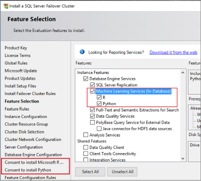

# What's new in SQL Server Machine Learning Services 
[!INCLUDE[appliesto-ss-xxxx-xxxx-xxx-md-winonly](../includes/appliesto-ss-xxxx-xxxx-xxx-md-winonly.md)]

Machine learning capabilities are added to SQL Server in each release as we continue to expand, extend, and deepen the integration between the data platform and the data science, analytics, and supervised learning you want to implement over your data. 

::: moniker range=">=sql-server-ver15||=sqlallproducts-allversions"
## New in SQL Server vNext

This release adds the top-requested features for R and Python machine learning operations in SQL Server. For more information about other features in this release, see [What's new in SQL Server vNext](../sql-server/what-s-new-in-sql-server-vnext.md)

| Release | Date | Feature update |
|---------|------|----------------|
| CTP 2.0 | September 2018 | Linux platform support for SQL Server vNext Machine Learning Services (In-Database).   For instructions on Linux installation, see [Install SQL Server Machine Learning Services on Linux](../linux/sql-server-linux-setup-machine-learning.md). |
| CTP 2.0 | September 2018 | Partition-based modeling. By setting new parameters on the [sp_execute_external_script](https://docs.microsoft.com/sql/relational-databases/system-stored-procedures/sp-execute-external-script-transact-sql) system stored procedure, you can specify a column in the data set that naturally segments data into partitions (some examples are geographic regions, dates, age or gender, categories). At execution time, individual models are generated for each partition, with external script executing once for every partition.   Learn more in this tutorial, [Create partition-based models in R](tutorials/r-tutorial-create-models-per-partition.md). |
| CTP 2.0 | September 2018 | Failover cluster support. You can install SQL Server vNext Machine Learning Services (In-Database) on a Windows failover cluster to meet your SLA requirements if your primary server fails over. Installation requires acceptance of licensing agreements for the R and Python components you install.    |
::: moniker-end

::: moniker range=">=sql-server-2017||=sqlallproducts-allversions"
## New in SQL Server 2017

This release adds [Python support and industry-leading machine learning algorithms](https://blogs.technet.microsoft.com/dataplatforminsider/2017/04/19/python-in-sql-server-2017-enhanced-in-database-machine-learning/). Renamed to reflect the new scope, SQL Server 2017 marks the introduction of [SQL Server Machine Learning Services (In-Database)](what-is-sql-server-machine-learning.md), with language support for both Python and R. 

### R enhancements

The R component of SQL Server 2017 Machine Learning Services is the next generation of SQL Server 2016 R Services, with updated versions of base R, RevoScaler, and other packages.

New capabilities for R include [**package management**](r/install-additional-r-packages-on-sql-server.md), with the following highlights: 

+ Database roles help DBAs manage packages and assign permissions for package installation.
+ [CREATE EXTERNAL LIBRARY](https://docs.microsoft.com/sql/t-sql/statements/create-external-library-transact-sql) helps DBAs manage packages in the familiar T-SQL language.
+ [RevoScaleR](r/use-revoscaler-to-manage-r-packages.md) functions help install, remove, or list packages owned by users. For more information, see [How to use RevoScaleR functions to find or install R packages on SQL Server](r/use-revoscaler-to-manage-r-packages.md).

### R libraries

| Package | Description |
|---------|-------------|
| [**MicrosoftML**](using-the-microsoftml-package.md) | In this release, MicrosoftML is included in a default R installation, eliminating the upgrade step required in the previous SQL Server 2016 R Services. MicrosoftML provides state-of-the-art machine learning algorithms and data transformations that can be scaled or run in remote compute contexts. Algorithms include customizable deep neural networks, fast decision trees and decision forests, linear regression, and logistic regression.  |

### Python integration for in-database analytics

T-SQL and Python integration is now supported through the [sp_execute_external_script](https://docs.microsoft.com/sql/relational-databases/system-stored-procedures/sp-execute-external-script-transact-sql) system stored procedure. You can call any Python code using this stored procedure. Code runs in a secure, dual architecture that enables enterprise-grade deployment of Python models and scripts, callable from an application using a simple stored procedure. Additional performance gains are achieved by streaming data from SQL to Python processes and MPI ring parallelization.

You can use the T-SQL [PREDICT](../t-sql/queries/predict-transact-sql.md) function to perform [native scoring](sql-native-scoring.md) on a pre-trained model that has been previously saved in the required binary format.

### Python libraries

| Package | Description |
|---------|-------------|
[**revoscalepy**](python/what-is-revoscalepy.md)| Python-equivalent of RevoScaleR. You can create Python models for linear and logistic regressions, decision trees, boosted trees, and random forests, all parallelizable, and capable of being run in remote compute contexts. This package supports use of multiple data sources and remote compute contexts. The data scientist or developer can execute Python code on a remote SQL Server, to explore data or build models without moving data. |
|[**microsoftml**](https://docs.microsoft.com/machine-learning-server/python-reference/microsoftml/microsoftml-package) |Python-equivalent of the MicrosoftML R package. |

### Pre-trained models

[**Pre-trained models**](install/sql-pretrained-models-install.md) are available for both Python and R. Use these models for image recognition and positive-negative sentiment analysis, to generate predictions on your own data. 

### Standalone Server as a shared feature in SQL Server Setup

This release also adds [SQL Server Machine Learning Server (Standalone)](r/r-server-standalone.md), a fully independent data science server, supporting statistical and predictive analytics in R and Python. As with R Services, this server is the next version of SQL Server 2016 R Server (Standalone). With the standalone server, you can distribute and scale R or Python solutions with no dependencies on SQL Server.

## New in SQL Server 2016

This release introduced machine learning capabilities into SQL Server through **SQL Server 2016 R Services**, an in-database analytics engine for processing R script on resident data within a database engine instance.

Additionally, **SQL Server 2016 R Server (Standalone)** was released as a way to install R Server on a Windows server. Initially, SQL Server Setup provided the only way to install R Server for Windows. In later releases, developers and data scientists who wanted R Server on Windows could use another standalone installer to achieve the same goal. The standalone server in SQL Server is functionally equivalent to the standalone server product, [Microsoft R Server for Windows](https://docs.microsoft.com/machine-learning-server/install/r-server-install-windows).

| Release |Feature update |
|---------|----------------|
| CU additions | [**Real-time scoring**](real-time-scoring.md) relies on native C++ libraries to read a model stored in an optimized binary format, and then generate predictions without having to call the R runtime. This makes scoring operations much faster. With real-time scoring, you can run a stored procedure or perform real-time scoring from R code. Real-time scoring is also available for SQL Server 2016, if the instance is upgraded to the latest release of [!INCLUDE[rsql-platform-md](../includes/rsql-platform-md.md)]. |
| Initial release | [**R integration for in-database analytics**](r/sql-server-r-services.md).    R packages for calling R functions in T-SQL, and vice versa. RevoScaleR functions provide R analytics at scale by chunking data into component parts, coordinating and managing distributed processing, and aggregating results. In SQL Server 2016 R Services (In-Database), the RevoScaleR engine is integrated with a database engine instance, brining data and analytics together in the same processing context.   T-SQL and R integration through [sp_execute_external_script](https://docs.microsoft.com/sql/relational-databases/system-stored-procedures/sp-execute-external-script-transact-sql). You can call any R code using this stored procedure. This secure infrastructure enables enterprise-grade deployment of Rn models and scripts that can be called from an application using a simple stored procedure. Additional performance gains are achieved by streaming data from SQL to R processes and MPI ring parallelization.   You can use the T-SQL [PREDICT](../t-sql/queries/predict-transact-sql.md) function to perform [native scoring](sql-native-scoring.md) on a pre-trained model that has been previously saved in the required binary format.|

## Linux support roadmap

SQL Server vNext CTP 2.0 adds Linux support for **R only** in-database analytics when you install the machine learning packages with a database engine instance. Python support is forthcoming but there is no projected date at this time. For more information, see [Install SQL Server Machine Learning Services on Linux](../linux/sql-server-linux-setup-machine-learning.md).

On SQL Server 2017, there is no R or Python in-database support in SQL Server 2017 on Linux, with the exception of [native scoring](sql-native-scoring.md) using the T-SQL PREDICT function. Native scoring lets you score from a pretrained model very fast, without calling or even requiring an R runtime. This means you can use SQL Server on Linux to generate predictions very fast, to serve client applications.

## Azure SQL Database roadmap

There is limited support for R in Azure SQL Database: available only in West Central US, in services created at the Premium tier. Expanded coverage, including Python support, is likely to follow in a future release. However, there is no projected release date at this time.  

## Next steps

+ [Install SQL Server 2017 Machine Learning Services (In-Database)](install/sql-machine-learning-services-windows-install.md)
+ [Machine learning tutorials and samples](tutorials/machine-learning-services-tutorials.md)
