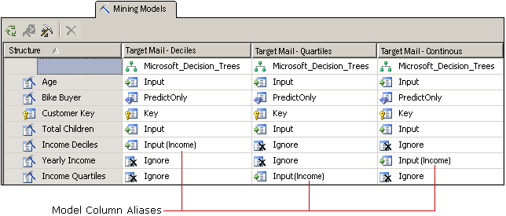

# Customize Mining Models and Structure
[!INCLUDE[ssas-appliesto-sqlas](../../includes/ssas-appliesto-sqlas.md)]
  After you have selected an algorithm that meets your business needs, you can customize the mining model in the following ways to potentially improve results.  
  
-   Use different columns of data in the model, or change the usage, content type, or discretization method for the columns.  
  
-   Create filters on the mining model to restrict the data used in training the model.  
  
-   Change the algorithm that was used to analyze data.  
  
-   Set algorithm parameters to control thresholds, tree splits, and other important conditions.  
  
 This topic describes these options.  
  
## Changing Data Used by the Model  
 The decisions that you make about which columns of data to use in the model, and how to use and process that data, greatly affect the results of analysis. The following topics provide information to help you understand these choices.  
  
### Using Feature Selection  
 Most data mining algorithms in [!INCLUDE[ssASnoversion](../../includes/ssasnoversion-md.md)] use a process called *feature selection* to select only the most useful attributes for addition to a model. Reducing the number of columns and attributes can improve performance and the quality of the model. The feature selection methods that are available differ depending on the algorithm that you choose.  
  
 [Feature Selection &#40;Data Mining&#41;](../../analysis-services/data-mining/feature-selection-data-mining.md).  
  
### Changing Usage  
 You can change which columns are included in a mining model and how each column is used. If you do not get the results you expect, you should example the columns you used as input, and ask yourself whether the columns are a good choice, and whether there is anything you can do to improve the handling of data, including:  
  
-   Identifying categorical variables that have mistakenly labeled as numbers.  
  
-   Adding categories to collapse the number of attributes and make it easier t find correlations.  
  
-   Changing the way that numbers are binned, or discretized.  
  
-   Removing columns that have a lot of unique values, or columns that are really reference data and not useful for analysis, such as addresses or middle names.  
  
 You don't need to physically remove columns from the mining structure; you can just flag the column as **Ignore**. The column is removed from the mining model, but can still be used by other mining models in the structure, ore referenced in a drillthrough query.  
  
### Creating Aliases for Model Columns  
 When [!INCLUDE[ssASnoversion](../../includes/ssasnoversion-md.md)] creates the mining model, it uses the same column names that are in the mining structure. You can add an alias to any column in the mining model. This might make it easier to understand the column contents or usage, or make the name shorter for convenience in creating queries. Aliases are also helpful when you want to create a copy of a column and name it something descriptive.  
  
 You create an alias by editing the **Name** property of the mining model column. [!INCLUDE[ssASnoversion](../../includes/ssasnoversion-md.md)] continues to use the original name as the ID of the column, and the new value that you type for **Name** becomes the column alias, and appears in the grid in parentheses next to the column usage.  
  
   
  
 The graphic shows related models that have multiple copies of a mining structure column, all related to Income. Each copy of the structure column has been discretized in a different way. The models in the diagram each use a different column from the mining structure; however, for convenience in comparing the columns across the models, the column in each model has been renamed to [**Income**].  
  
### Adding Filters  
 You can add a filter to a mining model. A filter is a set of WHERE conditions that restrict the data in the model cases to some subset. The filter is used when training the model, and can optionally be used when you test the model or create accuracy charts.  
  
 By adding filters, you can reuse mining structures but create models based on very different subsets of the data. Or, you can simply use filters to eliminate certain rows and improve the quality of analysis.  
  
 For more information, see [Filters for Mining Models &#40;Analysis Services - Data Mining&#41;](../../analysis-services/data-mining/filters-for-mining-models-analysis-services-data-mining.md).  
  
## Changing the Algorithm  
 Although new models that you add to a mining structure share the same data set, you can get different results by using a different algorithm (if the data supports it), or by changing the parameters for the algorithm. You can also set modeling flags.  
  
 The choice of algorithm determines what kind of results you will get. For general information about how a specific algorithm works, or the business scenarios where you would benefit from using a particular algorithm, see [Data Mining Algorithms &#40;Analysis Services - Data Mining&#41;](../../analysis-services/data-mining/data-mining-algorithms-analysis-services-data-mining.md).  
  
 See the technical reference topic for each algorithm for a description of the requirements and restrictions, as well as detailed information about the customizations that each algorithm supports.  
  
|||  
|-|-|  
|[Microsoft Decision Trees Algorithm](../../analysis-services/data-mining/microsoft-decision-trees-algorithm.md)|[Microsoft Time Series Algorithm](../../analysis-services/data-mining/microsoft-time-series-algorithm.md)|  
|[Microsoft Clustering Algorithm](../../analysis-services/data-mining/microsoft-clustering-algorithm.md)|[Microsoft Neural Network Algorithm](../../analysis-services/data-mining/microsoft-neural-network-algorithm.md)|  
|[Microsoft Naive Bayes Algorithm](../../analysis-services/data-mining/microsoft-naive-bayes-algorithm.md)|[Microsoft Logistic Regression Algorithm](../../analysis-services/data-mining/microsoft-logistic-regression-algorithm.md)|  
|[Microsoft Association Algorithm](../../analysis-services/data-mining/microsoft-association-algorithm.md)|[Microsoft Linear Regression Algorithm](../../analysis-services/data-mining/microsoft-linear-regression-algorithm.md)|  
|[Microsoft Sequence Clustering Algorithm](../../analysis-services/data-mining/microsoft-sequence-clustering-algorithm.md)||  
  
## Customizing Algorithm Parameters  
 Each algorithm supports parameters that you can use to customize the behavior of the algorithm and fine-tune the results of your model. For a description of how to use each parameter, see the following topics:  
  
 The topic for each algorithm type also lists the prediction functions that can be used with models based on that algorithm.  
  
|Property name|Applies to|  
|-------------------|----------------|  
|AUTO_DETECT_PERIODICITY|[Microsoft Time Series Algorithm Technical Reference](../../analysis-services/data-mining/microsoft-time-series-algorithm-technical-reference.md)|  
|CLUSTER_COUNT|[Microsoft Clustering Algorithm Technical Reference](../../analysis-services/data-mining/microsoft-clustering-algorithm-technical-reference.md)   [Microsoft Sequence Clustering Algorithm Technical Reference](../../analysis-services/data-mining/microsoft-sequence-clustering-algorithm-technical-reference.md)|  
|CLUSTER_SEED|[Microsoft Clustering Algorithm Technical Reference](../../analysis-services/data-mining/microsoft-clustering-algorithm-technical-reference.md)|  
|CLUSTERING_METHOD|[Microsoft Clustering Algorithm Technical Reference](../../analysis-services/data-mining/microsoft-clustering-algorithm-technical-reference.md)|  
|COMPLEXITY_PENALTY|[Microsoft Decision Trees Algorithm Technical Reference](../../analysis-services/data-mining/microsoft-decision-trees-algorithm-technical-reference.md)   [Microsoft Time Series Algorithm Technical Reference](../../analysis-services/data-mining/microsoft-time-series-algorithm-technical-reference.md)|  
|FORCE_REGRESSOR|[Microsoft Decision Trees Algorithm Technical Reference](../../analysis-services/data-mining/microsoft-decision-trees-algorithm-technical-reference.md)   [Microsoft Linear Regression Algorithm Technical Reference](../../analysis-services/data-mining/microsoft-linear-regression-algorithm-technical-reference.md)   [Modeling Flags &#40;Data Mining&#41;](../../analysis-services/data-mining/modeling-flags-data-mining.md)|  
|FORECAST_METHOD|[Microsoft Time Series Algorithm Technical Reference](../../analysis-services/data-mining/microsoft-time-series-algorithm-technical-reference.md)|  
|HIDDEN_NODE_RATIO|[Microsoft Neural Network Algorithm Technical Reference](../../analysis-services/data-mining/microsoft-neural-network-algorithm-technical-reference.md)|  
|HISTORIC_MODEL_COUNT|[Microsoft Time Series Algorithm Technical Reference](../../analysis-services/data-mining/microsoft-time-series-algorithm-technical-reference.md)|  
|HISTORICAL_MODEL_GAP|[Microsoft Time Series Algorithm Technical Reference](../../analysis-services/data-mining/microsoft-time-series-algorithm-technical-reference.md)|  
|HOLDOUT_PERCENTAGE|[Microsoft Logistic Regression Algorithm Technical Reference](../../analysis-services/data-mining/microsoft-logistic-regression-algorithm-technical-reference.md)   [Microsoft Neural Network Algorithm Technical Reference](../../analysis-services/data-mining/microsoft-neural-network-algorithm-technical-reference.md)   Note: This parameter is different from the holdout percentage value that applies to a mining structure.|  
|HOLDOUT_SEED|[Microsoft Logistic Regression Algorithm Technical Reference](../../analysis-services/data-mining/microsoft-logistic-regression-algorithm-technical-reference.md)   [Microsoft Neural Network Algorithm Technical Reference](../../analysis-services/data-mining/microsoft-neural-network-algorithm-technical-reference.md)   Note: This parameter is different from the holdout seed value that applies to a mining structure.|  
|INSTABILITY_SENSITIVITY|[Microsoft Time Series Algorithm Technical Reference](../../analysis-services/data-mining/microsoft-time-series-algorithm-technical-reference.md)|  
|MAXIMUM_INPUT_ATTRIBUTES|[Microsoft Clustering Algorithm Technical Reference](../../analysis-services/data-mining/microsoft-clustering-algorithm-technical-reference.md)   [Microsoft Decision Trees Algorithm Technical Reference](../../analysis-services/data-mining/microsoft-decision-trees-algorithm-technical-reference.md)   [Microsoft Linear Regression Algorithm Technical Reference](../../analysis-services/data-mining/microsoft-linear-regression-algorithm-technical-reference.md)   [Microsoft Naive Bayes Algorithm Technical Reference](../../analysis-services/data-mining/microsoft-naive-bayes-algorithm-technical-reference.md)   [Microsoft Neural Network Algorithm Technical Reference](../../analysis-services/data-mining/microsoft-neural-network-algorithm-technical-reference.md)   [Microsoft Logistic Regression Algorithm Technical Reference](../../analysis-services/data-mining/microsoft-logistic-regression-algorithm-technical-reference.md)|  
|MAXIMUM_ITEMSET_COUNT|[Microsoft Association Algorithm Technical Reference](../../analysis-services/data-mining/microsoft-association-algorithm-technical-reference.md)|  
|MAXIMUM_ITEMSET_SIZE|[Microsoft Association Algorithm Technical Reference](../../analysis-services/data-mining/microsoft-association-algorithm-technical-reference.md)|  
|MAXIMUM_OUTPUT_ATTRIBUTES|[Microsoft Decision Trees Algorithm Technical Reference](../../analysis-services/data-mining/microsoft-decision-trees-algorithm-technical-reference.md)   [Microsoft Linear Regression Algorithm Technical Reference](../../analysis-services/data-mining/microsoft-linear-regression-algorithm-technical-reference.md)   [Microsoft Logistic Regression Algorithm Technical Reference](../../analysis-services/data-mining/microsoft-logistic-regression-algorithm-technical-reference.md)   [Microsoft Naive Bayes Algorithm Technical Reference](../../analysis-services/data-mining/microsoft-naive-bayes-algorithm-technical-reference.md)   [Microsoft Neural Network Algorithm Technical Reference](../../analysis-services/data-mining/microsoft-neural-network-algorithm-technical-reference.md)|  
|MAXIMUM_SEQUENCE_STATES|[Microsoft Sequence Clustering Algorithm Technical Reference](../../analysis-services/data-mining/microsoft-sequence-clustering-algorithm-technical-reference.md)|  
|MAXIMUM_SERIES_VALUE|[Microsoft Time Series Algorithm Technical Reference](../../analysis-services/data-mining/microsoft-time-series-algorithm-technical-reference.md)|  
|MAXIMUM_STATES|[Microsoft Clustering Algorithm Technical Reference](../../analysis-services/data-mining/microsoft-clustering-algorithm-technical-reference.md)   [Microsoft Neural Network Algorithm Technical Reference](../../analysis-services/data-mining/microsoft-neural-network-algorithm-technical-reference.md)   [Microsoft Sequence Clustering Algorithm Technical Reference](../../analysis-services/data-mining/microsoft-sequence-clustering-algorithm-technical-reference.md)|  
|MAXIMUM_SUPPORT|[Microsoft Association Algorithm Technical Reference](../../analysis-services/data-mining/microsoft-association-algorithm-technical-reference.md)|  
|MINIMUM_IMPORTANCE|[Microsoft Association Algorithm Technical Reference](../../analysis-services/data-mining/microsoft-association-algorithm-technical-reference.md)|  
|MINIMUM_ITEMSET_SIZE|[Microsoft Association Algorithm Technical Reference](../../analysis-services/data-mining/microsoft-association-algorithm-technical-reference.md)|  
|MINIMUM_DEPENDENCY_PROBABILITY|[Microsoft Naive Bayes Algorithm Technical Reference](../../analysis-services/data-mining/microsoft-naive-bayes-algorithm-technical-reference.md)|  
|MINIMUM_PROBABILITY|[Microsoft Association Algorithm Technical Reference](../../analysis-services/data-mining/microsoft-association-algorithm-technical-reference.md)|  
|MINIMUM_SERIES_VALUE|[Microsoft Time Series Algorithm Technical Reference](../../analysis-services/data-mining/microsoft-time-series-algorithm-technical-reference.md)|  
|MINIMUM_SUPPORT|[Microsoft Association Algorithm Technical Reference](../../analysis-services/data-mining/microsoft-association-algorithm-technical-reference.md)   [Microsoft Clustering Algorithm Technical Reference](../../analysis-services/data-mining/microsoft-clustering-algorithm-technical-reference.md)   [Microsoft Decision Trees Algorithm Technical Reference](../../analysis-services/data-mining/microsoft-decision-trees-algorithm-technical-reference.md)   [Microsoft Sequence Clustering Algorithm Technical Reference](../../analysis-services/data-mining/microsoft-sequence-clustering-algorithm-technical-reference.md)   [Microsoft Time Series Algorithm Technical Reference](../../analysis-services/data-mining/microsoft-time-series-algorithm-technical-reference.md)|  
|MISSING_VALUE_SUBSTITUTION|[Microsoft Time Series Algorithm Technical Reference](../../analysis-services/data-mining/microsoft-time-series-algorithm-technical-reference.md)|  
|MODELLING_CARDINALITY|[Microsoft Clustering Algorithm Technical Reference](../../analysis-services/data-mining/microsoft-clustering-algorithm-technical-reference.md)|  
|PERIODICITY_HINT|[Microsoft Time Series Algorithm Technical Reference](../../analysis-services/data-mining/microsoft-time-series-algorithm-technical-reference.md)|  
|PREDICTION_SMOOTHING|[Microsoft Time Series Algorithm Technical Reference](../../analysis-services/data-mining/microsoft-time-series-algorithm-technical-reference.md)|  
|SAMPLE_SIZE|[Microsoft Clustering Algorithm Technical Reference](../../analysis-services/data-mining/microsoft-clustering-algorithm-technical-reference.md)   [Microsoft Logistic Regression Algorithm Technical Reference](../../analysis-services/data-mining/microsoft-logistic-regression-algorithm-technical-reference.md)   [Microsoft Neural Network Algorithm Technical Reference](../../analysis-services/data-mining/microsoft-neural-network-algorithm-technical-reference.md)|  
|SCORE_METHOD|[Microsoft Decision Trees Algorithm Technical Reference](../../analysis-services/data-mining/microsoft-decision-trees-algorithm-technical-reference.md)|  
|SPLIT_METHOD|[Microsoft Decision Trees Algorithm Technical Reference](../../analysis-services/data-mining/microsoft-decision-trees-algorithm-technical-reference.md)|  
|STOPPING_TOLERANCE|[Microsoft Clustering Algorithm Technical Reference](../../analysis-services/data-mining/microsoft-clustering-algorithm-technical-reference.md)|  
  
## See Also  
 [Data Mining Algorithms &#40;Analysis Services - Data Mining&#41;](../../analysis-services/data-mining/data-mining-algorithms-analysis-services-data-mining.md)   
 [Physical Architecture &#40;Analysis Services - Data Mining&#41;](../../analysis-services/data-mining/physical-architecture-analysis-services-data-mining.md)  
  
  
