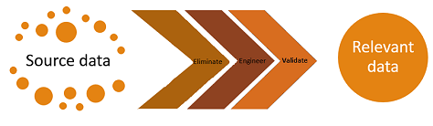

# Feature Selection (Data Mining)
[!INCLUDE[ssas-appliesto-sqlas](../../includes/ssas-appliesto-sqlas.md)]
  *Feature selection* is an important part of machine learning. Feature selection refers to the process of reducing the inputs for processing and analysis, or of finding the most meaningful inputs. A related term, *feature engineering* (or *feature extraction*), refers to the process of extracting useful information or features from existing data.  
  
## Why Do Feature Selection?  
 Feature selection is critical to building a good model for several reasons. One is that feature selection  implies some degree of *cardinality reduction*, to impose a cutoff on the number of attributes that can be considered when building a model. Data almost always contains more information than is needed to build the model, or the wrong kind of information. For example, you might have a dataset with 500 columns that describe the characteristics of customers; however, if the data in some of the columns is very sparse you would gain very little benefit from adding them to the model, and if some of the columns duplicate each other, using both columns could affect the model.  
  
 Not only does feature selection improve the quality of the model, it also makes the process of modeling more efficient. If you use unneeded columns while building a model, more CPU and memory are required during the training process, and more storage space is required for the completed model. Even if resources were not an issue, you would still want to perform feature selection and identify the best columns, because unneeded columns can degrade the quality of the model in several ways:  
  
-   Noisy or redundant data makes it more difficult to discover meaningful patterns.  
  
-   If the data set is high-dimensional, most data mining algorithms require a much larger training data set.  
  
 During the process of feature selection, either the analyst or the modeling tool or algorithm actively selects or discards attributes based on their usefulness for analysis.  The analyst might perform feature engineering to add features, and remove or modify existing data, while the machine learning algorithm typically scores columns and validates their usefulness in the model.  
  
   
  
 In short, feature selection helps solve two problems: having too much data that is of little value, or having too little data that is of high value. Your goal in feature selection should be to identify the minimum number of columns from the data source that are significant in building a model.  
  
## How Feature Selection Works in SQL Server Data Mining  
 Feature selection is always performed before the model is trained. With some algorithms, feature selection techniques are "built-in" so that irrelevant columns are excluded and the best features are automatically discovered. Each algorithm has its own set of default techniques for intelligently applying feature reduction.  However, you can also manually set parameters to influence feature selection behavior.  
  
 During automatic feature selection, a score is calculated for each attribute, and only the attributes that have the best scores are selected for the model. You can also adjust the threshold for the top scores. [!INCLUDE[ssNoVersion](../../includes/ssnoversion-md.md)] Data Mining  provides multiple methods for calculating these scores, and the exact method that is applied in any model depends on these factors:  
  
-   The algorithm used in your model  
  
-   The data type of the attribute  
  
-   Any parameters that you may have set on your model  
  
 Feature selection is applied to inputs, predictable attributes, or to states in a column. When scoring for feature selection is complete, only the attributes and states that the algorithm selects are included in the model-building process and can be used for prediction. If you choose a predictable attribute that does not meet the threshold for feature selection the attribute can still be used for prediction, but the predictions will be based solely on the global statistics that exist in the model.  
  
> [!NOTE]  
>  Feature selection affects only the columns that are used in the model, and has no effect on storage of the mining structure. The columns that you leave out of the mining model are still available in the structure, and data in the mining structure columns will be cached.  
  
### Feature Selection Scores  
 [!INCLUDE[ssNoVersion](../../includes/ssnoversion-md.md)] Data Mining supports these popular and well-established methods for scoring attributes. The specific method used in any particular algorithm or data set depends on the data types, and the column usage.  
  
-   The *interestingness* score is used to rank and sort attributes in columns that contain nonbinary continuous numeric data.  
  
-   *Shannon's entropy* and two *Bayesian* scores are available for columns that contain discrete and discretized data. However, if the model contains any continuous columns, the interestingness score will be used to assess all input columns, to ensure consistency.  
  
#### Interestingness score  
 A feature is interesting if it tells you some useful piece of information. However, *interestingness* can be measured in many ways.  *Novelty* might be valuable for outlier detection, but the ability to discriminate between closely related items, or *discriminating weight*, might be more interesting for classification.  
  
 The measure of interestingness that is used in [!INCLUDE[ssNoVersion](../../includes/ssnoversion-md.md)] Data Mining is *entropy-based*, meaning that attributes with random distributions have higher entropy and lower information gain; therefore, such attributes are less interesting. The entropy for any particular attribute is compared to the entropy of all other attributes, as follows:  
  
 Interestingness(Attribute) = - (m - Entropy(Attribute)) * (m - Entropy(Attribute))  
  
 Central entropy, or m, means the entropy of the entire feature set. By subtracting the entropy of the target attribute from the central entropy, you can assess how much information the attribute provides.  
  
 This score is used by default whenever the column contains nonbinary continuous numeric data.  
  
#### Shannon's Entropy  
 Shannon's entropy measures the uncertainty of a random variable for a particular outcome. For example, the entropy of a coin toss can be represented as a function of the probability of it coming up heads.  
  
 Analysis Services uses the following formula to calculate Shannon's entropy:  
  
 H(X) = -∑ P(xi) log(P(xi))  
  
 This scoring method is available for discrete and discretized attributes.  
  
#### Bayesian with K2 Prior  
 [!INCLUDE[ssNoVersion](../../includes/ssnoversion-md.md)] Data Mining provides two feature selection scores that are based on Bayesian networks. A Bayesian network is a *directed* or *acyclic* graph of states and transitions between states, meaning that some states are always prior to the current state, some states are posterior, and the graph does not repeat or loop. By definition, Bayesian networks allow the use of prior knowledge. However, the question of which prior states to use in calculating probabilities of later states is important for algorithm design, performance, and accuracy.  
  
 The K2 algorithm for learning from a Bayesian network was developed by Cooper and Herskovits and is often used in data mining. It is scalable and can analyze multiple variables, but requires ordering on variables used as input. For more information, see [Learning Bayesian Networks](http://research.microsoft.com/en-us/um/people/heckerman/hgc94uai.pdf) by Chickering, Geiger, and Heckerman.  
  
 This scoring method is available for discrete and discretized attributes.  
  
#### Bayesian Dirichlet Equivalent with Uniform Prior  
 The Bayesian Dirichlet Equivalent (BDE) score also uses Bayesian analysis to evaluate a network given a dataset. The BDE scoring method was developed by Heckerman and is based on the BD metric developed by Cooper and Herskovits. The Dirichlet distribution is a multinomial distribution that describes the conditional probability of each variable in the network, and has many properties that are useful for learning.  
  
 The Bayesian Dirichlet Equivalent with Uniform Prior (BDEU) method assumes a special case of the Dirichlet distribution, in which a mathematical constant is used to create a fixed or uniform distribution of prior states. The BDE score also assumes likelihood equivalence, which means that the data cannot be expected to discriminate equivalent structures. In other words, if the score for If A Then B is the same as the score for If B Then A, the structures cannot be distinguished based on the data, and causation cannot be inferred.  
  
 For more information about Bayesian networks and the implementation of these scoring methods, see [Learning Bayesian Networks](http://research.microsoft.com/en-us/um/people/heckerman/hgc94uai.pdf).  
  
### Feature Selection Methods per Algorithm  
 The following table lists the algorithms that support feature selection, the feature selection methods used by the algorithm, and the parameters that you set to control feature selection behavior:  
  
|Algorithm|Method of analysis|Comments|  
|---------------|------------------------|--------------|  
|Naive Bayes|Shannon's Entropy   Bayesian with K2 Prior   Bayesian Dirichlet with uniform prior (default)|The Microsoft Naïve Bayes algorithm accepts only discrete or discretized attributes; therefore, it cannot use the interestingness score.   For more information about this algorithm, see [Microsoft Naive Bayes Algorithm Technical Reference](../../analysis-services/data-mining/microsoft-naive-bayes-algorithm-technical-reference.md).|  
|Decision trees|Interestingness score   Shannon's Entropy   Bayesian with K2 Prior   Bayesian Dirichlet with uniform prior (default)|If any columns contain non-binary continuous values, the interestingness score is used for all columns, to ensure consistency. Otherwise, the default feature selection method is used, or the method that you specified when you created the model.   For more information about this algorithm, see [Microsoft Decision Trees Algorithm Technical Reference](../../analysis-services/data-mining/microsoft-decision-trees-algorithm-technical-reference.md).|  
|Neural network|Interestingness score   Shannon's Entropy   Bayesian with K2 Prior   Bayesian Dirichlet with uniform prior (default)|The Microsoft Neural Networks algorithm can use both Bayesian and entropy-based methods, as long as the data contains continuous columns.   For more information about this algorithm, see [Microsoft Neural Network Algorithm Technical Reference](../../analysis-services/data-mining/microsoft-neural-network-algorithm-technical-reference.md).|  
|Logistic regression|Interestingness score   Shannon's Entropy   Bayesian with K2 Prior   Bayesian Dirichlet with uniform prior (default)|Although the Microsoft Logistic Regression algorithm is based on the Microsoft Neural Network algorithm, you cannot customize logistic regression models to control feature selection behavior; therefore, feature selection always default to the method that is most appropriate for the attribute.   If all attributes are discrete or discretized, the default is BDEU.   For more information about this algorithm, see [Microsoft Logistic Regression Algorithm Technical Reference](../../analysis-services/data-mining/microsoft-logistic-regression-algorithm-technical-reference.md).|  
|Clustering|Interestingness score|The Microsoft Clustering algorithm can use discrete or discretized data. However, because the score of each attribute is calculated as a distance and is represented as a continuous number, the interestingness score must be used.   For more information about this algorithm, see [Microsoft Clustering Algorithm Technical Reference](../../analysis-services/data-mining/microsoft-clustering-algorithm-technical-reference.md).|  
|Linear regression|Interestingness score|The Microsoft Linear Regression algorithm can only use the interestingness score, because it only supports continuous columns.   For more information about this algorithm, see [Microsoft Linear Regression Algorithm Technical Reference](../../analysis-services/data-mining/microsoft-linear-regression-algorithm-technical-reference.md).|  
|Association rules   Sequence clustering|Not used|Feature selection is not invoked with these algorithms.   However, you can control the behavior of the algorithm and reduce the size of input data if necessary by setting the value of the parameters MINIMUM_SUPPORT and MINIMUM_PROBABILIITY.   For more information, see [Microsoft Association Algorithm Technical Reference](../../analysis-services/data-mining/microsoft-association-algorithm-technical-reference.md) and [Microsoft Sequence Clustering Algorithm Technical Reference](../../analysis-services/data-mining/microsoft-sequence-clustering-algorithm-technical-reference.md).|  
|Time series|Not used|Feature selection does not apply to time series models.   For more information about this algorithm, see [Microsoft Time Series Algorithm Technical Reference](../../analysis-services/data-mining/microsoft-time-series-algorithm-technical-reference.md).|  
  
## Feature Selection Parameters  
 In algorithms that support feature selection, you can control when feature selection is turned on by using the following parameters. Each algorithm has a default value for the number of inputs that are allowed, but you can override this default and specify the number of attributes. This section lists the parameters that are provided for managing feature selection.  
  
#### MAXIMUM_INPUT_ATTRIBUTES  
 If a model contains more columns than the number that is specified in the *MAXIMUM_INPUT_ATTRIBUTES* parameter, the algorithm ignores any columns that it calculates to be uninteresting.  
  
#### MAXIMUM_OUTPUT_ATTRIBUTES  
 Similarly, if a model contains more predictable columns than the number that is specified in the *MAXIMUM_OUTPUT_ATTRIBUTES* parameter, the algorithm ignores any columns that it calculates to be uninteresting.  
  
#### MAXIMUM_STATES  
 If a model contains more cases than are specified in the *MAXIMUM_STATES* parameter, the least popular states are grouped together and treated as missing. If any one of these parameters is set to 0, feature selection is turned off, affecting processing time and performance.  
  
 In addition to these methods for feature selection, you can improve the ability of the algorithm to identify or promote meaningful attributes by setting *modeling flags* on the model or by setting *distribution flags* on the structure. For more information about these concepts, see [Modeling Flags &#40;Data Mining&#41;](../../analysis-services/data-mining/modeling-flags-data-mining.md) and [Column Distributions &#40;Data Mining&#41;](../../analysis-services/data-mining/column-distributions-data-mining.md).  
  
## See Also  
 [Customize Mining Models and Structure](../../analysis-services/data-mining/customize-mining-models-and-structure.md)  
  
  
