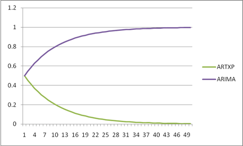
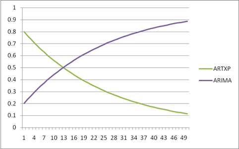

# Microsoft Time Series Algorithm Technical Reference
[!INCLUDE[ssas-appliesto-sqlas](../../includes/ssas-appliesto-sqlas.md)]
  The [!INCLUDE[msCoName](../../includes/msconame-md.md)] Time Series algorithm includes two separate algorithms for analyzing time series:  
  
-   The ARTXP algorithm, which was introduced in [!INCLUDE[ssVersion2005](../../includes/ssversion2005-md.md)], is optimized for predicting the next likely value in a series.  
  
-   The ARIMA algorithm was added in [!INCLUDE[ssKatmai](../../includes/sskatmai-md.md)] to improve accuracy for long-term prediction.  
  
 By default, [!INCLUDE[ssASnoversion](../../includes/ssasnoversion-md.md)] uses each algorithm separately to train the model and then blends the results to yield the best prediction for a variable number of predictions. You can also choose to use just one of the algorithms, based on your data and prediction requirements. In [!INCLUDE[ssEnterpriseEd10](../../includes/ssenterpriseed10-md.md)], you can also customize the cut-off point that controls the blend of algorithms during prediction.  
  
 This topic provides additional information about how each algorithm is implemented, and how you can customize the algorithm by setting parameters to fine-tune the analysis and prediction results.  
  
## Implementation of the Microsoft Time Series Algorithm  
 [!INCLUDE[msCoName](../../includes/msconame-md.md)] Research developed the original ARTXP algorithm that was used in SQL Server 2005, basing the implementation on the [!INCLUDE[msCoName](../../includes/msconame-md.md)] Decision Trees algorithm. Therefore, the ARTXP algorithm can be described as an autoregressive tree model for representing periodic time series data. This algorithm relates a variable number of past items to each current item that is being predicted. The name ARTXP derives from the fact that the autoregressive tree method (an ART algorithm) is applied to multiple unknown prior states. For a detailed explanation of the ARTXP algorithm, see [Autoregressive Tree Models for Time-Series Analysis](http://go.microsoft.com/fwlink/?LinkId=45966).  
  
 The ARIMA algorithm was added to the Microsoft Time Series algorithm in SQL Server 2008 to improve long-term prediction. It is an implementation of the process for computing autoregressive integrated moving averages that was described by Box and Jenkins. The ARIMA methodology makes it possible to determine dependencies in observations taken sequentially in time, and can incorporate random shocks as part of the model. The ARIMA method also supports multiplicative seasonality. Readers who want to learn more about the ARIMA algorithm are encouraged to read the seminal work by Box and Jenkins; this section is intended to provide specific details about how the ARIMA methodology has been implemented in the Microsoft Time Series algorithm.  
  
 By default, the Microsoft Time Series algorithm uses both methods, ARTXP and ARIMA, and blends the results to improve prediction accuracy. If you want to use only a specific method, you can set the algorithm parameters to use only ARTXP or only ARIMA, or to control how the results of the algorithms are combined. Note that the ARTXP algorithm supports cross-prediction, but the ARIMA algorithm does not. Therefore, cross-prediction is available only when you use a blend of algorithms, or when you configure the model to use only ARTXP.  
  
## Understanding ARIMA Difference Order  
 This section introduces some terminology needed to understand the ARIMA model, and discusses the specific implementation of *differencing* in the Microsoft Time Series algorithm. For a full explanation of these terms and concepts, we recommend a review of Box and Jenkins.  
  
-   A term is a component of a mathematical equation. For example, a term in a polynomial equation might include a combination of variables and constants.  
  
-   The ARIMA formula that is included in the Microsoft Time Series algorithm uses both *autoregressive* and *moving average* terms.  
  
-   Time series models can be *stationary* or *nonstationary*. *Stationary models* are those that revert to a mean, though they might have cycles, whereas *nonstationary* models do not have a focus of equilibrium and are subject to greater variance or change introduced by *shocks*, or external variables.  
  
-   The goal of *differencing* is to make a time series stabilize and become stationary.  
  
-   The  *order of difference* represents the number of times that the difference between values is taken for a time series.  
  
 The Microsoft Time Series algorithm works by taking values in a data series and attempting to fit the data to a pattern. If the data series is are not already stationary, the algorithm applies an order of difference. Each increase in the order of difference tends to make the time series more stationary.  
  
 For example, if you have the time series (z1, z2, ..., zn) and perform calculations using one order of difference, you obtain a new series (y1, y2,...., yn-1), where `yi = zi+1-zi`. When the difference order is 2, the algorithm generates another series \`(x1, x2, ..., xn-2)`, based on the y series that was derived from the first order equation. The correct amount of differencing depends on the data. A single order of differencing is most common in models that show a constant trend; a second order of differencing can indicate a trend that varies with time.  
  
 By default, the order of difference used in the Microsoft Time Series algorithm is -1, meaning that the algorithm will automatically detect the best value for the difference order. Typically, that best value is 1 (when differencing is required), but under certain circumstances the algorithm will increase that value to a maximum of 2.  
  
 The Microsoft Time Series algorithm determines the optimal ARIMA difference order by using the autoregression values. The algorithm examines the AR values and sets a hidden parameter, ARIMA_AR_ORDER, representing the order of the AR terms. This hidden parameter, ARIMA_AR_ORDER, has a range of values from -1 to 8. At the default value of -1, the algorithm will automatically select the appropriate difference order.  
  
 Whenever the value of ARIMA_AR_ORDER is greater than 1, the algorithm multiplies the time series by a polynomial term. If one term of the polynomial formula resolves to a root of 1 or close to 1, the algorithm attempts to preserve the stability of the model by removing the term and increasing the difference order by 1. If the difference order is already at the maximum, the term is removed and the difference order does not change.  
  
 For example, if the value of AR = 2,   the resulting AR polynomial term might look like this: `1 - 1.4B + .45B^2 = (1- .9B) (1- 0.5B)`. Note the term `(1- .9B)` which has a root of about 0.9. The algorithm eliminates this term from the polynomial formula but cannot increase the difference order by one because it is already at the maximum value of 2.  
  
 It is important to note that the only way that you can **force** a change in difference order is to use the unsupported parameter, ARIMA_DIFFERENCE_ORDER. This hidden parameter controls how many times the algorithm performs differencing on the time series, and can be set by typing a custom algorithm parameter. However, we do not recommend that you change this value unless you are prepared to experiment and are familiar with the calculations involved. Also note that there is currently no mechanism, including hidden parameters, to let you control the threshold at which the increase in difference order is triggered.  
  
 Finally, note that the formula described above is the simplified case, with no seasonality hints. If seasonality hints are provided, then a separate AR polynomial term is added to the left of the equation for each seasonality hint, and the same strategy is applied to eliminate terms that might destabilize the differenced series.  
  
## Customizing the Microsoft Time Series Algorithm  
 The [!INCLUDE[msCoName](../../includes/msconame-md.md)] Time Series algorithm supports the following parameters that affect the behavior, performance, and accuracy of the resulting mining model.  
  
> [!NOTE]  
>  The Microsoft Time Series algorithm is available in all editions of [!INCLUDE[ssNoVersion](../../includes/ssnoversion-md.md)]; however, some advanced features, including parameters for customizing the time series analysis, are supported only in specific editions of [!INCLUDE[ssNoVersion](../../includes/ssnoversion-md.md)]. For a list of features that are supported by the editions of [!INCLUDE[ssNoVersion](../../includes/ssnoversion-md.md)], see [Features Supported by the Editions of SQL Server](../../analysis-services/analysis-services-features-supported-by-the-editions-of-sql-server-2016.md).  
  
### Detection of Seasonality  
 Both ARIMA and ARTXP algorithms support detection of seasonality or periodicity. [!INCLUDE[ssASnoversion](../../includes/ssasnoversion-md.md)] uses Fast Fourier transformation to detect seasonality before training. However, you can affect seasonality detection, and the results of time series analysis, by setting algorithm parameters.  
  
-   By changing the value of *AUTODETECT_SEASONALITY*, you can influence the number of possible time segments that are generated.  
  
-   By setting a value or multiple values for *PERIODICITY_HINT*, you can provide the algorithm with information about expected cycles in the data and potentially increase the accuracy of detection.  
  
> [!NOTE]  
>  Both the ARTXP and ARIMA algorithms are very sensitive to seasonality hints. Therefore, providing the wrong hint can adversely affect results.  
  
### Choosing an Algorithm and Specifying the Blend of Algorithms  
 By default, or when you select the MIXED option, [!INCLUDE[ssASnoversion](../../includes/ssasnoversion-md.md)] combines the algorithms and assigns them equal weight. However, in Enterprise Edition, you can specify a particular algorithm, or you can customize the proportion of each algorithm in the results by setting a parameter that weights the results towards either the short or the long-term prediction. By default, the *FORECAST_METHOD* parameter is set to MIXED, and [!INCLUDE[ssASnoversion](../../includes/ssasnoversion-md.md)] uses both algorithms and then weights their values to maximize the strengths of each algorithm.  
  
-   To control the choice of algorithm, you set the *FORECAST_METHOD* parameter.  
  
-   If you want to use cross-prediction, you must use either the ARTXP or the MIXED option because ARIMA does not support cross-prediction.  
  
-   Set the *FORECAST_METHOD* to ARTXP if you want to favor short-term prediction.  
  
-   Set the *FORECAST_METHOD* to ARIMA if you want to improve long-term prediction.  
  
 In Enterprise Edition, you can also customize how [!INCLUDE[ssASnoversion](../../includes/ssasnoversion-md.md)] mixes the combination of the ARIMA and ARTXP algorithms. You can control both the starting point for the mixture, and the rate of change by setting the *PREDICTION_SMOOTHING* parameter:  
  
-   If you set *PREDICTION_SMOOTHING* to 0, the model uses ARTXP only.  
  
-   If you set *PREDICTION_SMOOTHING* to 1, the model uses ARIMA only.  
  
-   If you set *PREDICTION_SMOOTHING* to a value between 0 and 1, the model weights the ARTXP algorithm as an exponentially decreasing function of the prediction steps. At the same time, the model also weights the ARIMA algorithm as the 1-complement of the ARTXP weight. The model uses normalization and a stabilization constant to smooth the curves.  
  
 In general, if you predict up to 5 time slices, ARTXP is almost always the better choice. However, as you increase the number of time slices to predict, ARIMA typically performs better.  
  
 The following diagram illustrates how the model blends the algorithms when *PREDICTION_SMOOTHING* is set to the default value, 0.5. ARIMA and ARTXP are weighted equally at first, but as the number of prediction steps increases, ARIMA is weighed more heavily.  
  
   
  
 In contrast, the following diagram illustrates the blending of the algorithms when *PREDICTION_SMOOTHING* is set to 0.2. For step [!INCLUDE[tabValue](../../includes/tabvalue-md.md)], the model weights ARIMA as 0.2 and ARTXP as 0.8. Thereafter, the weight of ARIMA exponentially increases and the weight of ARTXP exponentially decreases.  
  
   
  
### Setting Algorithm Parameters  
 The following table describes the parameters that can be used with the [!INCLUDE[msCoName](../../includes/msconame-md.md)] Time Series algorithm.  
  
|Parameter|Description|  
|---------------|-----------------|  
|*AUTO_DETECT_PERIODICITY*|Specifies a numeric value between [!INCLUDE[tabValue](../../includes/tabvalue-md.md)] and 1 that detects periodicity. The default is 0.6.   If the value is closer to [!INCLUDE[tabValue](../../includes/tabvalue-md.md)], periodicity is detected only for strongly periodic data.   Setting this value closer to 1 favors the discovery of many patterns that are almost periodic and the automatic generation of periodicity hints.   Note: Dealing with many periodicity hints will likely lead to significantly longer model training times, but more accurate models.|  
|*COMPLEXITY_PENALTY*|Controls the growth of the decision tree. The default is 0.1.   Decreasing this value increases the chance of a split. Increasing this value decreases the chance of a split.   Note: This parameter is only available in some editions of [!INCLUDE[ssNoVersion](../../includes/ssnoversion-md.md)].|  
|*FORECAST_METHOD*|Specifies which algorithm to use for analysis and prediction. Possible values are ARTXP, ARIMA, or MIXED. The default is MIXED.|  
|*HISTORIC_MODEL_COUNT*|Specifies the number of historic models that will be built. The default is 1.   Note: This parameter is only available in some editions of [!INCLUDE[ssNoVersion](../../includes/ssnoversion-md.md)].|  
|*HISTORICAL_MODEL_GAP*|Specifies the time lag between two consecutive historic models. The default is 10. The value represents a number of time units, where the unit is defined by the model.   For example, setting this value to g causes historic models to be built for data that is truncated by time slices at intervals of g, 2*g, 3\*g, and so on.   Note: This parameter is only available in some editions of [!INCLUDE[ssNoVersion](../../includes/ssnoversion-md.md)].|  
|*INSTABILITY_SENSITIVITY*|Controls the point at which prediction variance exceeds a certain threshold, after which the ARTXP algorithm suppresses predictions. The default value is 1.   Note: This parameter does not apply to models that use ARIMA only.   The default value of 1 provides the same behavior as in [!INCLUDE[ssVersion2005](../../includes/ssversion2005-md.md)]. [!INCLUDE[ssASnoversion](../../includes/ssasnoversion-md.md)] monitors the normalized standard deviation for each prediction. As soon as this value exceeds the threshold for any prediction, the time series algorithm returns a NULL and stops the prediction process.   A value of [!INCLUDE[tabValue](../../includes/tabvalue-md.md)] stops instability detection. This means that you can create an infinite number of predictions, regardless of the variance.   Note: This parameter can only be modified in [!INCLUDE[ssNoVersion](../../includes/ssnoversion-md.md)] Enterprise. In [!INCLUDE[ssNoVersion](../../includes/ssnoversion-md.md)] Standard, [!INCLUDE[ssASnoversion](../../includes/ssasnoversion-md.md)] uses only the default value of 1.|  
|*MAXIMUM_SERIES_VALUE*|Specifies the maximum value to use for predictions. This parameter is used, together with *MINIMUM_SERIES_VALUE*, to constrain the predictions to some expected range. For example, you can specify that the predicted sales quantity for any day should never exceed the number of products in inventory.   Note: This parameter is only available in some editions of [!INCLUDE[ssNoVersion](../../includes/ssnoversion-md.md)].|  
|*MINIMUM_SERIES_VALUE*|Specifies the minimum value that can be predicted. This parameter is used, together with *MAXIMUM_SERIES_VALUE*, to constrain the predictions to some expected range. For example, you can specify that the predicted sales quantity should never be a negative number.   Note: This parameter is only available in some editions of [!INCLUDE[ssNoVersion](../../includes/ssnoversion-md.md)].|  
|*MINIMUM_SUPPORT*|Specifies the minimum number of time slices that are required to generate a split in each time series tree. The default is 10.|  
|*MISSING_VALUE_SUBSTITUTION*|Specifies how gaps in historical data are filled. By default, gaps in data are not allowed. The following table lists the possible values for this parameter:   **Previous**: Repeats the value from the previous time slice.   **Mean**: Uses a moving average of time slices used in training.   Numeric constant: Uses the specified number to replace all missing values.   **None**: Default. Replaces missing values with values plotted along the curve of the trained model.      Note that if your data contains multiple series, the series cannot have ragged edges. That is, all series should have the same start and end points.                      [!INCLUDE[ssASnoversion](../../includes/ssasnoversion-md.md)] also uses the value of this parameter to fill gaps in new data when you perform a **PREDICTION JOIN** on time series model.|  
|*PERIODICITY_HINT*|Provides a hint to the algorithm as to the periodicity of the data. For example, if sales vary by year, and the unit of measurement in the series is months, the periodicity is 12. This parameter takes the format of {n [, n]}, where n is any positive number.   The n in the brackets [] is optional and can be repeated as frequently as needed. For example, to provide multiple periodicity hints for data supplied monthly, you might enter {12, 3, 1} to detect patterns for the year, quarter, and month. However, periodicity has a strong effect on model quality. If the hint that you give differs from the actual periodicity, your results can be adversely affected.   The default is {1}.   Note that the braces are required. Also, this parameter has a string data type. Therefore, if you type this parameter as part of a Data Mining Extensions (DMX) statement, you must enclose the number and braces in quotation marks.|  
|*PREDICTION_SMOOTHING*|Specifies how the model should be mixed to optimize forecasting. You can type any value between [!INCLUDE[tabValue](../../includes/tabvalue-md.md)] and 1 or use one of the following values:   [!INCLUDE[tabValue](../../includes/tabvalue-md.md)]:                           Specifies that prediction uses ARTXP only. Forecasting is optimized for fewer predictions.   1: Specifies that prediction uses ARIMA only. Forecasting is optimized for many predictions.   0.5: Default. Specifies that for prediction both algorithms should be used and the results blended.      When doing prediction smoothing, use the *FORECAST_METHOD* parameter to control training.   Note that this parameter is only available in some editions of [!INCLUDE[ssNoVersion](../../includes/ssnoversion-md.md)].|  
  
### Modeling Flags  
 The [!INCLUDE[msCoName](../../includes/msconame-md.md)] Time Series algorithm supports the following modeling flags. When you create the mining structure or mining model, you define modeling flags to specify how values in each column are handled during analysis. For more information, see [Modeling Flags &#40;Data Mining&#41;](../../analysis-services/data-mining/modeling-flags-data-mining.md).  
  
|Modeling Flag|Description|  
|-------------------|-----------------|  
|NOT NULL|Indicates that the column cannot contain a null. An error will result if Analysis Services encounters a null during model training.   Applies to mining structure columns.|  
|MODEL_EXISTENCE_ONLY|Means that the column will be treated as having two possible states: Missing and Existing. A null is a missing value.   Applies to mining model columns.|  
  
## Requirements  
 A time series model must contain a key time column that contains unique values, input columns, and at least one predictable column.  
  
### Input and Predictable Columns  
 The [!INCLUDE[msCoName](../../includes/msconame-md.md)] Time Series algorithm supports the specific input column content types, predictable column content types, and modeling flags that are listed in the following table.  
  
|Column|Content types|  
|------------|-------------------|  
|Input attribute|Continuous ,Key, Key Time, and Table|  
|Predictable attribute|Continuous, Table|  
  
> [!NOTE]  
>  Cyclical and Ordered content types are supported, but the algorithm treats them as discrete values and does not perform special processing.  
  
## See Also  
 [Microsoft Time Series Algorithm](../../analysis-services/data-mining/microsoft-time-series-algorithm.md)   
 [Time Series Model Query Examples](../../analysis-services/data-mining/time-series-model-query-examples.md)   
 [Mining Model Content for Time Series Models &#40;Analysis Services - Data Mining&#41;](../../analysis-services/data-mining/mining-model-content-for-time-series-models-analysis-services-data-mining.md)  
  
  
