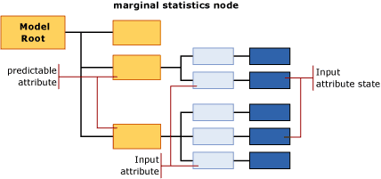

# Mining Model Content for Naive Bayes Models (Analysis Services - Data Mining)
[!INCLUDE[ssas-appliesto-sqlas](../../includes/ssas-appliesto-sqlas.md)]
  This topic describes mining model content that is specific to models that use the [!INCLUDE[msCoName](../../includes/msconame-md.md)] Naive Bayes algorithm. For an explanation of how to interpret statistics and structure shared by all model types, and general definitions of terms related to mining model content, see [Mining Model Content &#40;Analysis Services - Data Mining&#41;](../../analysis-services/data-mining/mining-model-content-analysis-services-data-mining.md).  
  
## Understanding the Structure of a Naive Bayes Model  
 A Naive Bayes model has a single parent node that represents the model and its metadata, and underneath that parent node, any number of independent trees that represent the predictable attributes that you selected. In addition to trees for the attributes, each model contains one marginal statistics node (NODE_TYPE = 26) that provides descriptive statistics about the set of training cases. For more information, see [Information in the Marginal Statistics Node](#bkmk_margstats).  
  
 For each predictable attribute and value, the model outputs a tree that contains information describing how the various input columns affected the outcome of that particular predictable. Each tree contains the predictable attribute and its value (NODE_TYPE = 9), and then a series of nodes that represent the input attributes (NODE_TYPE = 10). Because the input attributes typically have multiple values, each input attribute (NODE_TYPE = 10) may have multiple child nodes (NODE_TYPE = 11), each for a specific state of the attribute.  
  
> [!NOTE]  
>  Because a Naive Bayes model does not permit continuous data types, all the values of the input columns are treated as discrete or discretized. You can specify how a value is discretized. For more information, [Change the Discretization of a Column in a Mining Model](../../analysis-services/data-mining/change-the-discretization-of-a-column-in-a-mining-model.md).  
  
   
  
## Model Content for a Naive Bayes Model  
 This section provides detail and examples only for those columns in the mining model content that have particular relevance for Naive Bayes models.  
  
 For information about general-purpose columns in the schema rowset, such as MODEL_CATALOG and MODEL_NAME, that are not described here, or for explanations of mining model terminology, see [Mining Model Content &#40;Analysis Services - Data Mining&#41;](../../analysis-services/data-mining/mining-model-content-analysis-services-data-mining.md).  
  
 MODEL_CATALOG  
 Name of the database where the model is stored.  
  
 MODEL_NAME  
 Name of the model.  
  
 ATTRIBUTE_NAME  
 The names of the attributes that correspond to this node.  
  
 **Model root** The name of the predictable attribute.  
  
 **Marginal statistics** Not applicable  
  
 **Predictable attribute** The name of the predictable attribute.  
  
 **Input attribute** The name of the input attribute.  
  
 **Input attribute state** The name of the input attribute only. To get the state, use MSOLAP_NODE_SHORT_CAPTION.  
  
 NODE_NAME  
 The name of the node.  
  
 This column contains the same value as NODE_UNIQUE_NAME.  
  
 For more information about node naming conventions, see [Using Node Names and IDs](#bkmk_nodenames).  
  
 NODE_UNIQUE_NAME  
 The unique name of the node. The unique names are assigned according to a convention that provides information about the relationships among the nodes. For more information about node naming conventions, see [Using Node Names and IDs](#bkmk_nodenames).  
  
 NODE_TYPE  
 A Naive Bayes model outputs the following node types:  
  
|Node Type ID|Description|  
|------------------|-----------------|  
|26 (NaiveBayesMarginalStatNode)|Contains statistics that describes the entire set of training cases for the model.|  
|9 (Predictable attribute)|Contains the name of the predictable-attribute.|  
|10 (Input attribute)|Contains the name of an input attribute column, and child nodes that contains the values for the attribute.|  
|11 (Input attribute state)|Contains the values or discretized values of all input attributes that were paired with a particular output attribute.|  
  
 NODE_CAPTION  
 The label or a caption associated with the node. This property is primarily for display purposes.  
  
 **Model root** blank  
  
 **Marginal statistics** blank  
  
 **Predictable attribute** The name of the predictable attribute.  
  
 **Input attribute** The name of the predictable attribute and the current input attribute. Ex:  
  
 Bike Buyer -> Age  
  
 **Input attribute state** The name of the predictable attribute and the current input attribute, plus the value of the input. Ex:  
  
 Bike Buyer -> Age = Missing  
  
 CHILDREN_CARDINALITY  
 The number of children that the node has.  
  
 **Model root** Count of predictable attributes in the model plus 1 for the marginal statistics node.  
  
 **Marginal statistics** By definition has no children.  
  
 **Predictable attribute**  Count of the input attributes that were related to the current predictable attribute.  
  
 **Input attribute** Count of the discrete or discretized values for the current input attribute.  
  
 **Input attribute state** Always 0.  
  
 PARENT_UNIQUE_NAME  
 The unique name of the parent node. For more information about relating parent and child nodes, see [Using Node Names and IDs](#bkmk_nodenames).  
  
 NODE_DESCRIPTION  
 The same as the node caption.  
  
 NODE_RULE  
 An XML representation of the node caption.  
  
 MARGINAL_RULE  
 The same as the node rule.  
  
 NODE_PROBABILITY  
 The probability associated with this node.  
  
 **Model root** Always 0.  
  
 **Marginal statistics** Always 0.  
  
 **Predictable attribute**  Always 1.  
  
 **Input attribute** Always 1.  
  
 **Input attribute state** A decimal number that represents the probability of the current value. Values for all input attribute states under the parent input attribute node sum to 1.  
  
 MARGINAL_PROBABILITY  
 The same as the node probability.  
  
 NODE_DISTRIBUTION  
 A table that contains the probability histogram for the node. For more information, see [NODE_DISTRIBUTION Table](#bkmk_nodedist).  
  
 NODE_SUPPORT  
 The number of cases that support this node.  
  
 **Model root** Count of all cases in training data.  
  
 **Marginal statistics** Always 0.  
  
 **Predictable attribute** Count of all cases in training data.  
  
 **Input attribute** Count of all cases in training data.  
  
 **Input attribute state** Count of cases in training data that contain only this particular value.  
  
 MSOLAP_MODEL_COLUMN  
 A label used for display purposes. Usually the same as ATTRIBUTE_NAME.  
  
 MSOLAP_NODE_SCORE  
 Represents the importance of the attribute or value within the model.  
  
 **Model root** Always 0.  
  
 **Marginal statistics** Always 0.  
  
 **Predictable attribute**  Always 0.  
  
 **Input attribute** Interestingness score for the current input attribute in relation to the current predictable attribute.  
  
 **Input attribute state** Always 0.  
  
 MSOLAP_NODE_SHORT_CAPTION  
 A text string that represents the name or the value of a column.  
  
 **Model root** Blank  
  
 **Marginal statistics** Blank  
  
 **Predictable attribute**  The name of the predictable attribute.  
  
 **Input attribute** The name of the input attribute.  
  
 **Input attribute state** The value or discretized value of the input attribute.  
  
##  <a name="bkmk_nodenames"></a> Using Node Names and IDs  
 The naming of the nodes in a Naive Bayes model provides additional information about the type of node, to make it easier to understand the relationships among the information in the model. The following table shows the convention for the IDs that are assigned to different node types.  
  
|Node Type|Convention for node ID|  
|---------------|----------------------------|  
|Model root (1)|Always 0.|  
|Marginal statistics node (26)|An arbitrary ID value.|  
|Predictable attribute (9)|Hexadecimal number beginning with 10000000<br /><br /> Example: 100000001, 10000000b|  
|Input attribute (10)|A two-part hexadecimal number where the first part is always 20000000, and the second part starts with the hexadecimal identifier of the related predictable attribute.<br /><br /> Example: 20000000b00000000<br /><br /> In this case, the related predictable attribute is 10000000b.|  
|Input attribute state (11)|A three-part hexadecimal number where the first part is always 30000000, the second part starts with the hexadecimal identifier of the related predictable attribute, and the third part represents the identifier of the value.<br /><br /> Example: 30000000b00000000200000000<br /><br /> In this case, the related predictable attribute is 10000000b.|  
  
 You can use the IDs to relate input attributes and states to a predictable attribute. For example, the following query returns the names and captions for nodes that represent the possible combinations of input and predictable attributes for the model, `TM_NaiveBayes`.  
  
```  
SELECT NODE_NAME, NODE_CAPTION  
FROM TM_NaiveBayes.CONTENT  
WHERE NODE_TYPE = 10  
```  
  
 Expected results:  
  
|NODE_NAME|NODE_CAPTION|  
|----------------|-------------------|  
|20000000000000001|Bike Buyer -> Commute Distance|  
|20000000000000002|Bike Buyer -> English Education|  
|20000000000000003|Bike Buyer -> English Occupation|  
|20000000000000009|Bike Buyer -> Marital Status|  
|2000000000000000a|Bike Buyer -> Number Children At Home|  
|2000000000000000b|Bike Buyer -> Region|  
|2000000000000000c|Bike Buyer -> Total Children|  
  
 You can then use the IDs of the parent nodes to retrieve the child nodes. The following query retrieves the nodes that contain values for the `Marital Status` attribute, together with the probability of each node.  
  
```  
SELECT NODE_NAME, NODE_CAPTION, NODE_PROBABILITY  
FROM TM_NaiveBayes.CONTENT  
WHERE NODE_TYPE = 11  
AND [PARENT_UNIQUE_NAME] = '20000000000000009'  
```  
  
> [!NOTE]  
>  The name of the column, PARENT_UNIQUE_NAME, must be enclosed in brackets to distinguish it from the reserved keyword of the same name.  
  
 Expected results:  
  
|NODE_NAME|NODE_CAPTION|NODE_PROBABILITY|  
|----------------|-------------------|-----------------------|  
|3000000000000000900000000|Bike Buyer -> Marital Status = Missing|0|  
|3000000000000000900000001|Bike Buyer -> Marital Status = S|0.457504004|  
|3000000000000000900000002|Bike Buyer -> Marital Status = M|0.542495996|  
  
##  <a name="bkmk_nodedist"></a> NODE_DISTRIBUTION Table  
 The nested table column, NODE_DISTRIBUTION, typically contains statistics about the distribution of values in the node. In a Naive Bayes model, this table is populated only for the following nodes:  
  
|Node Type|Content of nested table|  
|---------------|-----------------------------|  
|Model root (1)|Blank.|  
|Marginal statistics node (24)|Contains summary information for all predictable attributes and input attributes, for entire set of training data.|  
|Predictable attribute (9)|Blank.|  
|Input attribute (10)|Blank.|  
|Input attribute state (11)|Contains statistics that describe the distribution of values in the training data for this particular combination of a predictable value and input attribute value.|  
  
 You can use the node IDs or node captions to retrieve increasing levels of detail. For example, the following query retrieves specific columns from the NODE_DISTRIBUTION table for only those input attribute nodes that are related to the value, `'Marital Status = S'`.  
  
```  
SELECT FLATTENED NODE_CAPTION,  
(SELECT ATTRIBUTE_NAME, ATTRIBUTE_VALUE, [SUPPORT], [PROBABILITY], VALUETYPE  
FROM NODE_DISTRIBUTION) as t  
FROM TM_NaiveBayes.content  
WHERE NODE_TYPE = 11  
AND NODE_CAPTION = 'Bike Buyer -> Marital Status = S'  
```  
  
 Expected results:  
  
|NODE_CAPTION|t.ATTRIBUTE_NAME|t.ATTRIBUTE_VALUE|t.SUPPORT|t.PROBABILITY|t.VALUETYPE|  
|-------------------|-----------------------|------------------------|---------------|-------------------|-----------------|  
|Bike Buyer -> Marital Status = S|Bike Buyer|Missing|0|0|1|  
|Bike Buyer -> Marital Status = S|Bike Buyer|0|3783|0.472934117|4|  
|Bike Buyer -> Marital Status = S|Bike Buyer|1|4216|0.527065883|4|  
  
 In these results, the value of the SUPPORT column tells you the count of customers with the specified marital status who purchased a bike. The PROBABILITY column contains the probability of each attribute value, as calculated for this node only. For general definitions of terms used in the NODE_DISTRIBUTION table, see [Mining Model Content &#40;Analysis Services - Data Mining&#41;](../../analysis-services/data-mining/mining-model-content-analysis-services-data-mining.md).  
  
###  <a name="bkmk_margstats"></a> Information in the Marginal Statistics Node  
 In a Naive Bayes model, the nested table for the marginal statistics node contains the distribution of values for the entire set of training data. For example, the following table contains a partial list of the statistics in the nested NODE_DISTRIBUTION table for the model, `TM_NaiveBayes`:  
  
|ATTRIBUTE_NAME|ATTRIBUTE_VALUE|SUPPORT|PROBABILITY|VARIANCE|VALUETYPE|  
|---------------------|----------------------|-------------|-----------------|--------------|---------------|  
|Bike Buyer|Missing|0|0|0|1|  
|Bike Buyer|0|8869|0.507263784|0|4|  
|Bike Buyer|1|8615|0.492736216|0|4|  
|Marital Status|Missing|0|0|0|1|  
|Marital Status|S|7999|0.457504004|0|4|  
|Marital Status|M|9485|0.542495996|0|4|  
|Total Children|Missing|0|0|0|1|  
|Total Children|0|4865|0.278254404|0|4|  
|Total Children|3|2093|0.119709449|0|4|  
|Total Children|1|3406|0.19480668|0|4|  
  
 The [Bike Buyer] column is included because the marginal statistics node always contains a description of the predictable attribute and its possible values. All other columns that are listed represent input attributes, together with the values that were used in the model. Values can only be missing, discrete or discretized.  
  
 In a Naive Bayes model, there can be no continuous attributes; therefore, all numeric data is represented as either discrete (VALUE_TYPE = 4) or discretized (VALUE_TYPE = 5).  
  
 A **Missing** value (VALUE_TYPE = 1) is added to every input and output attribute to represent potential values that were not present in the training data. You must be careful to distinguish between "missing" as a string and the default **Missing** value. For more information, see [Missing Values &#40;Analysis Services - Data Mining&#41;](../../analysis-services/data-mining/missing-values-analysis-services-data-mining.md).  
  
## See Also  
 [Mining Model Content &#40;Analysis Services - Data Mining&#41;](../../analysis-services/data-mining/mining-model-content-analysis-services-data-mining.md)   
 [Data Mining Model Viewers](../../analysis-services/data-mining/data-mining-model-viewers.md)   
 [Data Mining Queries](../../analysis-services/data-mining/data-mining-queries.md)   
 [Microsoft Naive Bayes Algorithm](../../analysis-services/data-mining/microsoft-naive-bayes-algorithm.md)  
  
  
