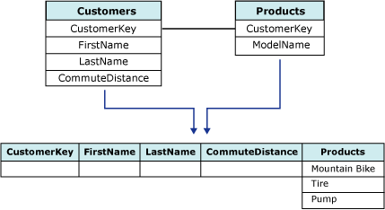

# Nested Tables (Analysis Services - Data Mining)
[!INCLUDE[ssas-appliesto-sqlas](../../includes/ssas-appliesto-sqlas.md)]
  In [!INCLUDE[ssNoVersion](../../includes/ssnoversion-md.md)] [!INCLUDE[ssASnoversion](../../includes/ssasnoversion-md.md)], data must be fed to a data mining algorithm as a series of cases that are contained within a case table. However, not all cases can be described by a single row of data. For example, a case might be derived from two tables: one table that contains customer information, and another table that contains customer purchases. A single customer in the customer information table might have multiple items in the customer purchases table, which makes it difficult to describe the data by using a single row. [!INCLUDE[ssASnoversion](../../includes/ssasnoversion-md.md)] provides a unique method for handling these cases, by using *nested tables*. The concept of a nested table is demonstrated in the following illustration.  
  
   
  
 In this diagram, the first table, which is the parent table, contains information about customers, and associates a unique identifier for each customer. The second table, the child table, contains the purchases for each customer. The purchases in the child table are related to the parent table by the unique identifier, the **CustomerKey** column. The third table in the diagram shows the two tables combined.  
  
 A nested table is represented in the case table as a special column that has a data type of **TABLE**. For any particular case row, this kind of column contains selected rows from the child table that pertain to the parent table.  
  
 The data in a nested table can be used for prediction or for input, or for both. For example, you might have two nested table columns in a model: one nested table column might contain a list of the products that a customer has purchased, while the other nested table column contains information about the customer's hobbies and interests, possibly obtained from a survey. In this scenario, you could use the customer's hobbies and interests as an input for analyzing purchasing behavior, and predicting likely purchases.  
  
## Joining Case Tables and Nested Tables  
 In order to create a nested table, the two source tables must contain a defined relationship so that the items in one table can be related to the other table. In [!INCLUDE[ssBIDevStudioFull](../../includes/ssbidevstudiofull-md.md)], you can define this relationship in the data source view.  
  
> [!NOTE]  
>  The **CustomerKey** field is the relational key that is used to link the case table and the nested table within the data source view definition, and to establish the relationship of the columns within the mining structure. However, typically you should not use this relational key in mining models built on that structure. Usually it is best to omit the relational key column from the mining model if it serves only to join the tables and does not provide information that is interesting for analysis.  
  
 You can create nested tables programmatically by either using Data Mining Extensions (DMX) or Analysis Management Objects (AMO), or you can use the Data Mining Wizard and Data Mining Designer in [!INCLUDE[ssBIDevStudioFull](../../includes/ssbidevstudiofull-md.md)].  
  
## Using Nested Table Columns in a Mining Model  
 In the case table, the key is often a customer ID, a product name, or date in a series: data that uniquely identifies a row in the table. . However, in nested tables, the key is typically not the relational key (or foreign key) but rather the column that represents the attribute that you are modeling.  
  
 For example, if the case table contains orders, and the nested table contains items in the order, you would be interested in modeling the relationship between items stored in the nested table across multiple orders, which are stored in the case table. Therefore, although the **Items** nested table is joined to the **Orders** case table by the relational key **OrderID**, you should not use **OrderID** as the nested table key. Instead, you would select the **Items** column as the nested table key, because that column contains the data that you want to model. In most cases, you can safely ignore **OrderID** in the mining model, because the relationship between the case table and the nested table has already been established by the data source view definition.  
  
 When you choose a column to use as the nested table key, you must ensure that the values in that column are unique for each case. For example, if the case table represents customers and the nested table represents items purchased by the customer, you must ensure that no item is listed more than one time per customer. If a customer has purchased the same item more than one time, you might want to create a different view that has a column that aggregates the count of purchases for each unique product.  
  
 How you decide to handle duplicate values in a nested table depends on the mining model that you are creating and the business problem that you are solving. In some scenarios you might not care how many times a customer has purchased a particular product, but want to check for the existence of at least one purchase. In other scenarios, the quantity and sequence of purchases might be very important.  
  
 If the order of items is important, you might need an additional column that indicates the sequence. When you use the sequence clustering algorithm to create a model, you must choose an additional *key sequence* column to represent the order of the items. The key sequence column is a special kind of nested key that is used only in sequence clustering models, and requires a unique numeric data type. For example, integers and dates can both be used as a key sequence column, but all sequence values must be unique. In addition to the key sequence column, a sequence clustering model also has a nested table key that represents the attribute that is being modeled, such as the products that have been purchased.  
  
### Using Non-Key Nested Columns from a Nested Table  
 After you have defined the join between the case table and the nested table, and you have chosen a column that contains interesting and unique attributes to use as the nested table key, you can include other columns from the nested table to use as input to the model. All columns from the nested table can be used for input, prediction and input, or for prediction only.  
  
 For example, if the nested table contains the columns **Product**, **ProductQuantity**, and **ProductPrice**, you might choose **Product** as the nested table key, but add **ProductQuantity** to the mining structure to use as input.  
  
## Filtering Nested Table Data  
 In [!INCLUDE[ssCurrent](../../includes/sscurrent-md.md)], you can create filters on the data that is used to train or test a data mining model. A filter can be used to affect the composition of the model, or to test the model on a subset of cases. Filters can also be applied to nested tables. However, there are limitations on the syntax that can be used with nested tables.  
  
 Often when you apply a filter to a nested table you are testing for the existence or nonexistence of an attribute. For example, you can apply a filter that restricts the cases used in the model to only those cases that have a specified value in the nested table. Or, you could restrict the cases used in the model to customers who have not purchased a particular item.  
  
 When you create filters on a nested table, you can also use operators such as greater than or less than. For example, you could restrict the cases used in the model to customers who had purchased at least n units of the target product. The ability to filter on nested table attributes provides great flexibility for customizing models.  
  
 For more information about how to create and use model filters, see [Filters for Mining Models &#40;Analysis Services - Data Mining&#41;](../../analysis-services/data-mining/filters-for-mining-models-analysis-services-data-mining.md).  
  
## See Also  
 [Data Mining Algorithms &#40;Analysis Services - Data Mining&#41;](../../analysis-services/data-mining/data-mining-algorithms-analysis-services-data-mining.md)   
 [Mining Structures &#40;Analysis Services - Data Mining&#41;](../../analysis-services/data-mining/mining-structures-analysis-services-data-mining.md)  
  
  
