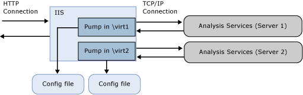
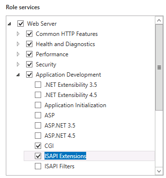

# Configure HTTP Access to Analysis Services on IIS 8.0
[!INCLUDE[ssas-appliesto-sqlas](../../includes/ssas-appliesto-sqlas.md)]
  This article explains how to set up an HTTP endpoint for accessing an Analysis Services instance. You can enable HTTP access by configuring MSMDPUMP.dll, an ISAPI extension that runs in Internet Information Services (IIS) and pumps data to and from client applications and an Analysis Services server. This approach provides an alternative means for connecting to Analysis Services when your BI solution calls for the following capabilities:  
  
-   Client access is over Internet or extranet connections, with restrictions on which ports can be enabled.  
  
-   Client connections are from non-trusted domains in the same network.  
  
-   Client application runs in a network environment that allows HTTP but not TCP/IP connections.  
  
-   Client applications cannot use the Analysis Services client libraries (for example, a Java application running on a UNIX server). If you cannot use the Analysis Services client libraries for data access, you can use SOAP and XML/A over a direct HTTP connection to an Analysis Services instance.  
  
-   Authentication methods other than Windows integrated security are required. Specifically, you can use Anonymous connections and Basic authentication when configuring Analysis Services for HTTP access. Digest, Forms, and ASP.NET authentication are not supported. A requirement of Basic authentication is one of the primary reasons for enabling HTTP access. To learn more, see [Microsoft BI Authentication and Identity Delegation](http://go.microsoft.com/fwlink/?LinkId=286576).  
  
 You can configure HTTP access for any supported version or edition of Analysis Services, running either tabular mode or multidimensional mode. Local cubes are an exception. You cannot connect to a local cube via an HTTP endpoint.  
  
 Setting up HTTP access is a post-installation task. Analysis Services must be installed before you can configure it for HTTP access. As the Analysis Services administrator, you will need to grant permissions to Windows accounts before HTTP access is possible. Additionally, it is a best practice to validate your installation first, ensuring that it is fully operational before configuring the server any further. After HTTP access is configured, you can use both the HTTP endpoint and the regular network name of the server over TCP/IP. Setting up HTTP access does not invalidate other approaches for data access.  
  
 As you move forward with MSMDPUMP configuration, remember there are two connections to consider: client-to-IIS, IIS-to-SSAS. The instructions in this article are about IIS-to-SSAS. Your client application might require additional configuration before it can connect to IIS. Decisions such as whether to use SSL, or how to configure bindings, are out of scope for this article. See [Web Server (IIS)](http://technet.microsoft.com/library/hh831725.aspx) for more information about IIS.  
  
##  <a name="bkmk_overview"></a> Overview  
 MSMDPUMP is an ISAPI extension that loads into IIS and provides redirection to a local or remote Analysis Services instance. By configuring this ISAPI extension, you create an HTTP endpoint to an Analysis Services instance.  
  
 You must create and configure one virtual directory for each HTTP endpoint. Each endpoint will need its own set of MSMDPUMP files, for each Analysis Services instance you want to connect to. A configuration file in this file set specifies the name of the Analysis Services instance used for each HTTP endpoint.  
  
 On IIS, MSMDPUMP connects to Analysis Services using the Analysis Services OLE DB provider over TCP/IP. Although client requests can originate outside of domain trust, both Analysis Services and IIS must be in the same domain or in trusted domains in order for the native connection to succeed.  
  
 When MSMDPUMP connects to Analysis Services, it does so under a Windows user identity. This account will either be the Anonymous account if you configured the virtual directory for anonymous connections, or a Windows user account. The account must have the appropriate data access rights on the Analysis Services server and database.  
  
   
  
 The following table lists additional considerations when you enable HTTP access for different scenarios.  
  
|Scenario|Configuration|  
|--------------|-------------------|  
|IIS and Analysis Services on the same computer|This is the simplest configuration because it allows you to use the default configuration (where the server name is localhost), the local Analysis Services OLE DB provider, and Windows integrated security with NTLM. Assuming that the client is also in the same domain, authentication is transparent to the user, with no additional work on your part.|  
|IIS and Analysis Services on different computers|For this topology, you must install the Analysis Services OLE DB provider on the web server. You must also edit the msmdpump.ini file to specify the location of Analysis Services instance on the remote computer.<br /><br /> This topology adds a double-hop authentication step, where credentials must flow from the client to the web server, and on to the backend Analysis Services server. If you are using Windows credentials and NTLM, you will get an error because NTLM does not allow delegation of client credentials to a second server. The most common solution is to use Basic authentication with Secure Sockets Layer (SSL), but this will require users to provide a user name and password when accessing the MSMDPUMP virtual directory. A more straightforward approach might be to enable Kerberos and configure Analysis Services constrained delegation so that users can access Analysis Services in a transparent manner. See [Configure Analysis Services for Kerberos constrained delegation](../../analysis-services/instances/configure-analysis-services-for-kerberos-constrained-delegation.md) for details.<br /><br /> Consider which ports to unblock in Windows Firewall. You will need to unblock ports on both servers to allow access to the web application on IIS, and to Analysis Services on a remote server.|  
|Client connections are from a non-trusted domain or an extranet connection|Client connections from a non-trusted domain introduce further restrictions on authentication. By default, Analysis Services uses Windows integrated authentication, which requires users to be on the same domain as the server. If you have Extranet users who connect to IIS from outside the domain, those users will get a connection error if the server is configured to use the default settings.<br /><br /> Workarounds include having Extranet users connect through a VPN using domain credentials. However, a better approach might be to enable Basic authentication and SSL on your IIS web site.|  
  
##  <a name="bkmk_prereq"></a> Prerequisites  
 The instructions in this article assume IIS is already configured and that Analysis Services is already installed. Windows Server 2012 ships with IIS 8.x as a server role that you can enable on the system.  
  
 **Extra configuration in IIS 8.0**  
  
 The default configuration of IIS 8.0 is missing components that are necessary for HTTP access to Analysis Services. These components, found in the **Security** and **Application Development** feature areas of the **Web Server (IIS)** role, include the following:  
  
-   **Security** | **Windows Authentication**, or **Basic Authentication**, and any other security features required for your data access scenario.  
  
-   **Application Development** | **CGI**  
  
-   **Application Development** | **ISAPI Extensions**  
  
 To verify or add these components, use **Server Manager** | **Manage** | **Add Roles and Features**. Step through the wizard until you get to **Server Roles**. Scroll down to find **Web Server (IIS)**.  
  
1.  Open **Web Server** | **Security** and choose the authentication methods.  
  
2.  Open **Web Server** | **Application Development** and choose **CGI** and **ISAPI Extensions**.  
  
       
  
 **When IIS is on a remote server**  
  
 A remote connection between IIS and Analysis Services requires that you install the Analysis Services OLE DB provider (MSOLAP) on the Windows server running IIS.  
  
1.  Go to the download page for [SQL Server 2014 Feature Pack](http://www.microsoft.com/download/details.aspx?id=42295)  
  
2.  Click the red Download button.  
  
3.  Scroll down to find ENU\x64\SQL_AS_OLEDB.msi  
  
4.  Follow the instructions in the wizard to complete the installation.  
  
> [!NOTE]  
>  Remember to unblock the ports in Windows Firewall to allow client connections to a remote Analysis Services server. For more information, see [Configure the Windows Firewall to Allow Analysis Services Access](../../analysis-services/instances/configure-the-windows-firewall-to-allow-analysis-services-access.md).  
  
##  <a name="bkmk_copy"></a> Step 1: Copy the MSMDPUMP files to a folder on the Web server  
 Each HTTP endpoint that you create must have its own set of MSMDPUMP files. In this step, you copy the MSMDPUMP executable, configuration file, and resource folder from the Analysis Services program folders to a new virtual directory folder that you will create on the file system of the computer running IIS.  
  
 The drive must be formatted for the NTFS file system. The path to the folder that you create must not contain any spaces.  
  
1.  Copy the following files, found at \<drive>:\Program Files\Microsoft SQL Server\\<instance\>\OLAP\bin\isapi: MSMDPUMP.DLL, MSMDPUMP.INI, and a Resources folder.  
  
       
  
2.  On the web server, create a new folder: \<drive>:\inetpub\wwwroot\\**OLAP**  
  
3.  Paste the files that you previously copied into this new folder.  
  
4.  Verify that the \inetpub\wwwroot\OLAP folder on your web server contains the following: MSMDPUMP.DLL, MSMDPUMP.INI, and a Resources folder. Your folder structure should look like this:  
  
    -   \<drive>:\inetpub\wwwroot\OLAP\MSMDPUMP.dll  
  
    -   \<drive>:\inetpub\wwwroot\OLAP\MSMDPUMP.ini  
  
    -   \<drive>:\inetpub\wwwroot\OLAP\Resources  
  
##  <a name="bkmk_appPool"></a> Step 2: Create an application pool and virtual directory in IIS  
 Next, create an application pool and an endpoint to the pump.  
  
#### Create an application pool  
  
1.  Start IIS Manager.  
  
2.  Open the server folder, right-click **Application Pools** and then click **Add Application Pool**. Create an application pool named **OLAP**, using the .NET Framework, with Managed pipeline mode set to **Classic**.  
  
       
  
3.  By default, IIS creates application pools using **ApplicationPoolIdentity** as the security identity, which is a valid choice for HTTP access to Analysis Services. If you have specific reasons for changing the identity, right-click **OLAP**, and then select **Advanced Settings**. Select **ApplicationPoolIdentity**. Click the **Change** button for this property to replace the built-in account with the custom account you want to use.  
  
       
  
4.  By default, on a 64-bit operating system, IIS sets the **Enable 32-bit Applications** property to **false**. If you copied msmdpump.dll from a 64-bit installation of Analysis Services, this is the correct setting for the MSMDPUMP extension on a 64-bit IIS server. If you copied the MSMDPUMP binaries from a 32-bit installation, set it to **true**. Check this property now in **Advanced Settings** to ensure it is set correctly.  
  
#### Create an application  
  
1.  In IIS Manager, open **Sites**, open **Default Web Site**. You should see a folder named **Olap**. This is a reference to the OLAP folder you created under \inetpub\wwwroot.  
  
       
  
2.  Right-click the folder and choose **Convert to Application**.  
  
3.  In Add Application, enter **OLAP** for the alias. Click **Select** to choose the OLAP application pool. Physical Path should be set to C:\inetpub\wwwroot\OLAP  
  
       
  
4.  Click **OK**. Refresh the web site and notice that the OLAP folder is now an application under the default web site. The virtual path to the MSMDPUMP file is now established.  
  
       
  
> [!NOTE]  
>  Previous versions of these instructions included steps for creating a virtual directory. That step is no longer necessary.  
  
##  <a name="bkmk_auth"></a> Step 3: Configure IIS authentication and add the extension  
 In this step, you further configure the SSAS virtual directory you just created. You will specify an authentication method and then add a script map. Supported authentication methods for Analysis Services over HTTP include:  
  
-   Windows authentication (Kerberos or NTLM)  
  
-   Basic authentication  
  
-   Anonymous authentication  
  
 **Windows authentication** is considered the most secure, and leverages existing infrastructure for networks that use Active Directory. To use Windows authentication effectively, all browsers, client applications, and server applications must support it. This is the most secure and recommended mode, but it requires that IIS be able to access a Windows domain controller that can authenticate the identity of the user requesting a connection.  
  
 For topologies that put Analysis Services and IIS on different computers, you will need to address double-hop issues that arise when a user identity needs to be delegated to a second service on a remote machine, typically by enabling Analysis Services for Kerberos constrained delegation. For more information, see [Configure Analysis Services for Kerberos constrained delegation](../../analysis-services/instances/configure-analysis-services-for-kerberos-constrained-delegation.md).  
  
 **Basic authentication** is used when you have Windows identities, but user connections are from non-trusted domains, prohibiting the use of delegated or impersonated connections. Basic authentication lets you specify a user identity and password on a connection string. Instead of using the security context of the current user, credentials on the connection string are used to connect to Analysis Services. Because Analysis Services supports only Windows authentication, any credentials passed to it must be a Windows user or group that is a member of the domain in which Analysis Services is hosted.  
  
 **Anonymous authentication** is often used during initial testing because its ease of configuration helps you to quickly validate HTTP connectivity to Analysis Services. In just a few steps, you can assign a unique user account as the identity, grant that account permissions in Analysis Services, use the account to verify data access in a client application, and then disable Anonymous authentication when testing is complete.  
  
 You can also use Anonymous authentication in a production environment if your users do not have Windows user accounts, but follow best practices by locking down permissions on the host system, as called out in this article: [Enable Anonymous Authentication (IIS 7)](http://technet.microsoft.com/library/cc731244\(v=ws.10\).aspx). Be sure that authentication is set on the virtual directory, and not on the parent web site, to further reduce the level of account access.  
  
 When Anonymous is enabled, any user connection to the HTTP endpoint is allowed to connect as the anonymous user. You won't be able to audit individual user connections, nor use the user identity to select data from a model. As you can see, using Anonymous impacts everything from model design, to data refresh and access. However, if users do not have a Windows user login to start with, using the Anonymous account might be your only option.  
  
#### Set the authentication type and add a script map  
  
1.  In IIS Manager, open **Sites**, open **Default Web Site**, and then select the **OLAP** virtual directory.  
  
2.  Double-click **Authentication** in the IIS section of the main page.  
  
       
  
3.  Enable **Windows Authentication** if you are using Windows integrated security.  
  
       
  
4.  Alternatively, enable **Basic Authentication** if your client and server applications are in different domains. This mode requires the user to enter a user name and password. The user name and password are transmitted over the HTTP connection to IIS. IIS will try to impersonate the user using the provided credentials when connecting to MSMDPUMP, but the credentials will not be delegated to Analysis Services. Instead, you will need to pass a valid user name and password on a connection, as described in Step 6 in this document.  
  
    > [!IMPORTANT]  
    >  Please note that it is imperative for anyone building a system where the password is transmitted to have ways of securing the communication channel. IIS provides a set of tools that help you secure the channel. For more information, see [How to Set Up SSL on IIS 7](http://go.microsoft.com/fwlink/?LinkId=207562).  
  
5.  Disable **Anonymous Authentication** if you are using Windows or Basic authentication. When Anonymous authentication is enabled, IIS will always use it first, even if other authentication methods are enabled.  
  
     Under Anonymous authentication, the pump (msmdpump.dll) runs as the user account you established for anonymous user. There is no distinction between the user connecting to IIS and the user connecting to Analysis Services. By default, IIS uses the IUSR account, but you can change it to a domain user account that has network permissions. You'll need this capability if IIS and Analysis Services are on different computers.  
  
     For instructions on how to configure credentials for Anonymous authentication, see [Anonymous Authentication](http://www.iis.net/configreference/system.webserver/security/authentication/anonymousauthentication).  
  
    > [!IMPORTANT]  
    >  Anonymous authentication is most likely found in an extremely controlled environment, where users are given or denied access by way of access control lists in the file system. For best practices, see [Enable Anonymous Authentication (IIS 7)](http://technet.microsoft.com/library/cc731244\(v=ws.10\).aspx).  
  
6.  Click the **OLAP** virtual directory to open the main page. Double-click **Handler Mappings**.  
  
       
  
7.  Right-click anywhere on the page and then select **Add Script Map**. In the Add Script Map dialog box, specify **\*.dll** as the request path, specify c:\inetpub\wwwroot\OLAP\msmdpump.dll as the executable, and type **OLAP** as the name. Keep all of the default restrictions associated with this script map.  
  
       
  
8.  When prompted to allow the ISAPI extension, click **Yes**.  
  
       
  
##  <a name="bkmk_edit"></a> Step 4: Edit the MSMDPUMP.INI file to set the target server  
 The MSMDPUMP.INI file specifies the Analysis Services instance that MSMDPUMP.DLL connects to. This instance can be local or remote, installed as the default or as a named instance.  
  
 Open the msmdpump.ini file located in folder C:\inetpub\wwwroot\OLAP and take a look at the contents of this file. It should look like the following:  
  
```  
<ConfigurationSettings>  
<ServerName>localhost</ServerName>  
<SessionTimeout>3600</SessionTimeout>  
<ConnectionPoolSize>100</ConnectionPoolSize>  
</ConfigurationSettings>  
  
```  
  
 If the Analysis Services instance for which you are configuring HTTP access is located on the local computer and installed as a default instance, there is no reason to change this setting. Otherwise, you must specify the server name (for example, \<ServerName>ADWRKS-SRV01\</ServerName>). For a server that is installed as a named instance, be sure to append the instance name (for example, \<ServerName>ADWRKS-SRV01\Tabular\</ServerName>).  
  
 By default, Analysis Services listens on TCP/IP port 2383. If you installed Analysis Services as the default instance, you do not need to specify any port in \<ServerName> because Analysis Services knows how to listen on port 2383 automatically. However, you do need to allow inbound connections to that port in Windows Firewall. For more information, see [Configure the Windows Firewall to Allow Analysis Services Access](../../analysis-services/instances/configure-the-windows-firewall-to-allow-analysis-services-access.md).  
  
 If you configured a named or default instance of Analysis Services to listen on a fixed port, you must add the port number to the server name (for example, \<ServerName>AW-SRV01:55555\</ServerName>) and you must allow inbound connections in Windows Firewall to that port.  
  
## Step 5: Grant data access permissions  
 As previously noted, you will need to grant permissions on the Analysis Services instance. Each database object will have roles that provide a given level of permissions (read or read/write), and each role will have members consisting of Windows user identities.  
  
 To set permissions, you can use SQL Server Management Studio. Under the **Database** | **Roles** folder, you can create roles, specify database permissions, assign membership to Windows user or group accounts, and then grant read or write permissions on specific objects. Typically, **Read** permissions on a cube are sufficient for client connections that use, but do not update, model data.  
  
 Role assignment varies depending on how you configured authentication.  
  
|||  
|-|-|  
|Anonymous|Add to the Membership list the account specified in **Edit Anonymous Authentication Credentials** in IIS. For more information, see [Anonymous Authentication](http://www.iis.net/configreference/system.webserver/security/authentication/anonymousauthentication),|  
|Windows authentication|Add to the Membership list the Windows user or group accounts requesting Analysis Services data via impersonation or delegation.<br /><br /> Assuming Kerberos constrained delegation is used, the only accounts that need permissions are the Windows user and group accounts requesting access. No permissions are necessary for the application pool identity.|  
|Basic authentication|Add to the Membership list the Windows user or group accounts that will be passed on the connection string.<br /><br /> In addition, if you are passing credentials via **EffectiveUserName** on the connection string, then the application pool identity must have administrator rights on the Analysis Services instance. In SSMS, right-click the instance &#124; **Properties** &#124; **Security** &#124; **Add**. Enter the application pool identity. If you used the built-in default identity, the account is specified as **IIS AppPool\DefaultAppPool**.<br /><br /> |  
  
 For more information about setting permissions, see [Authorizing access to objects and operations &#40;Analysis Services&#41;](../../analysis-services/multidimensional-models/authorizing-access-to-objects-and-operations-analysis-services.md).  
  
##  <a name="bkmk_test"></a> Step 6: Test your configuration  
 The connection string syntax for MSMDPUMP is the URL to the MSMDPUMP.dll file.  
  
 If the web application is listening on a fixed port, append the port number to the server name or IP address (for example, `http://my-web-srv01:8080/OLAP/msmdpump.dll` or `http://123.456.789.012:8080/OLAP/msmdpump.dll`.  
  
 To quickly test the connection, you can open a connection using Internet Explorer, Microsoft Excel, or SQL Server Management Studio.  
  
 **Troubleshoot  connections using Internet Explorer**  
  
 A connection request that terminates with this error might not give you much to go on:  "Either a connection cannot be made to '\<server name>', or Analysis Service is not running on the server".  
  
 To get a more informative error, do the following:  
  
1.  In **Internet Explorer** > **Internet Options** > **Advanced**, clear the checkbox for **Show Friendly HTTP messages**.  
  
2.  Retry the connection (for example, `http://my-web-srv01:8080/OLAP/msmdpump.dll`)  
  
 If you see an ERROR XML displayed in the browser window, you can eliminate MSMDPUMP as the potential cause and shift your focus to the  certificate.  
  
 **Test connections using SQL Server Management Studio**  
  
1.  In Management Studio, in the Connect to Server dialog box, select **Analysis Services** as the server type. In Server name, enter the HTTP address of the msmdpump extension: `http://my-web-srv01/OLAP/msmdpump.dll`.  
  
     Object Explorer displays the HTTP connection:  
  
       
  
2.  Authentication must be Windows authentication, and the person using Management Studio must be an Analysis Services administrator. An administrator can grant further permissions to enable access by other users.  
  
 **Test connections using Excel**  
  
1.  On the Data tab in Excel, in Get External Data, click **From Other Sources**, and then choose **From Analysis Services** to start the Data Connection wizard.  
  
2.  In Server name, enter the HTTP address of the msmdpump extension: `http://my-web-srv01/OLAP/msmdpump.dll`.  
  
3.  For Log on credentials, choose **Use Windows Authentication** if you are using Windows integrated security or NTLM, or Anonymous user.  
  
     For Basic authentication, choose **Use the following User Name and Password**, and then specify the credentials used to sign on. The credentials you provide will be passed on the connection string to Analysis Services.  
  
 **Test connections using AMO**  
  
 You can test HTTP access programmatically using AMO, substituting the URL of the endpoint for the server name. For details, see [Forum Post (How to sync SSAS 2008 R2 databases via HTTPS across domain/forest and firewall boundaries)](http://social.msdn.microsoft.com/Forums/en/sqlanalysisservices/thread/c4249d55-914d-4c81-9980-44d0b8df9c3e).  
  
 An example connection string illustrating the syntax for HTTP(S) access using Basic authentication:  
  
 `Data Source=https://<servername>/olap/msmdpump.dll; Initial Catalog=AdventureWorksDW2012; Integrated Security=Basic; User ID=XXXX; Password=XXXXX;`  
  
 For more information about setting up the connection programmatically, see [Establishing Secure Connections in ADOMD.NET](https://docs.microsoft.com/bi-reference/adomd/multidimensional-models-adomd-net-client/connections-in-adomd-net-establishing-secure-connections).  
  
 As a final step, be sure to follow-up with more rigorous testing by using a client computer that runs in the network environment from which the connections will originate.  
  
## See Also  
 [Forum post (http access using msmdpump and basic authentication)](http://social.msdn.microsoft.com/Forums/en/sqlanalysisservices/thread/79d2f225-df35-46da-aa22-d06e98f7d658)   
 [Configure the Windows Firewall to Allow Analysis Services Access](../../analysis-services/instances/configure-the-windows-firewall-to-allow-analysis-services-access.md)   
 [Authorizing access to objects and operations &#40;Analysis Services&#41;](../../analysis-services/multidimensional-models/authorizing-access-to-objects-and-operations-analysis-services.md)   
 [IIS Authentication Methods](http://go.microsoft.com/fwlink/?LinkdID=208461)   
 [How to Set Up SSL on IIS 7](http://go.microsoft.com/fwlink/?LinkId=207562)  
  
  
