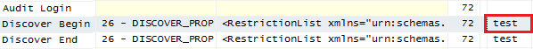

# Connection String Properties (Analysis Services)
[!INCLUDE[ssas-appliesto-sqlas-all-aas](../../includes/ssas-appliesto-sqlas-all-aas.md)]

  This topic describes connection string properties you might set in one of the designer or administration tools, or see in connection strings built by client applications that connect to and query Analysis Services data. As such, it covers just a subset of the available properties. The complete list includes numerous server and database properties, allowing you to customize a connection for a specific application, independent of how the instance or database is configured on the server.  
  
 Developers who build custom connection strings in application code should review the API documentation for ADOMD.NET client to view a more detailed list: <xref:Microsoft.AnalysisServices.AdomdClient.AdomdConnection.ConnectionString%2A>  
  
 The properties described in this topic are used by the Analysis Services client libraries, ADOMD.NET, AMO, and the OLE DB provider for Analysis Services. The majority of connection string properties can be used with all three client libraries. Exceptions are called out in the description.
  
> [!NOTE]  
>  When setting properties, if you inadvertently set the same property twice, the last one in the connection string is used.  
  
 For more information about how to specify an Analysis Services connection in existing Microsoft applications, see [Connect from client applications &#40;Analysis Services&#41;](../../analysis-services/instances/connect-from-client-applications-analysis-services.md).  
  
##   Connection parameters in common use  
 The following table describes those properties most often used when building a connection string.  
  
|Property|Description|Example|  
|--------------|-----------------|-------------|  
|**Data Source** or **DataSource**|Specifies the server instance. This property is required for all connections. Valid values include the network name or IP address of the server, local or localhost for local connections, a URL if the server is configured for HTTP or HTTPS access, or the name of a local cube (.cub) file.    Valid value for Azure Analysis Services, `<protocol>://<region>/<servername>` where protocol is string asazure, region is the Uri where the server was created (for example, westus.asazure.windows.net) and servername is the name of your unique server within the region. |`Data source=asazure://westus.asazure.windows.net/myasserver`  `Data source=AW-SRV01` for the default instance and port (TCP 2383).   `Data source=AW-SRV01$Finance:8081` for a named instance ($Finance) and fixed port.   `Data source=AW-SRV01.corp.Adventure-Works.com` for a fully qualified domain name, assuming the default instance and port.   `Data source=172.16.254.1` for an IP address of the server, bypassing DNS server lookup, useful for troubleshooting connection problems.|  
|**Initial Catalog** or **Catalog**|Specifies the name of the Analysis Services database to connect to. The database must be deployed on Analysis Services, and you must have permission to connect to it. This property is optional for AMO connections, but required for ADOMD.NET.|`Initial catalog=AdventureWorks2016`|  
|**Provider**|Valid values include MSOLAP.\<version>, where \<version> is either 4, 5, 6 or 7.   -   MSOLAP.4 released in SQL Server 2008 and again SQL Server 2008 R2 (filename is msolap100.dll for SQL Server 2008 and 2008 R2) -   MSOLAP.5 released in SQL Server 2012 (filename is msolap110.dll) -   MSOLAP.6 released in SQL Server 2014 (filename is msolap1200.dll) -   MSOLAP.7 released in SQL Server 2016 (filename is msolap130.dll)   This property is optional. By default, the client libraries read the current version of the OLE DB provider from the registry. You only need to set this property if you require a specific version of the data provider, for example to connect to a SQL Server 2012 instance.   MSOLAP.4 was released in both SQL Server 2008 and SQL Server 2008 R2. The 2008 R2 version supports [!INCLUDE[ssGemini](../../includes/ssgemini-md.md)] workbooks and sometimes needs to be installed manually on SharePoint servers. To distinguish between these versions, you must check the build number in the file properties of the provider: Go to Program files\Microsoft Analysis Services\AS OLEDB\10. Right-click msolap110.dll and select **Properties**. Click **Details**. View the file version information. The version should include 10.50.\<buildnumber> for SQL Server 2008 R2. For more information, see [Install the Analysis Services OLE DB Provider on SharePoint Servers](http://msdn.microsoft.com/2c62daf9-1f2d-4508-a497-af62360ee859) and [Data providers used for Analysis Services connections](../../analysis-services/instances/data-providers-used-for-analysis-services-connections.md).|`Provider=MSOLAP.7` is used for connections that require the SQL Server 2016 version of the OLE DB provider for Analysis Services.|  
|**Cube**|Cube name or perspective name. A database can contain multiple cubes and perspectives. When multiple targets are possible, include the cube or perspective name on the connection string.|`Cube=SalesPerspective` shows that you can use the Cube connection string property to specify either the name of a cube or the name of a perspective.|  
  
##   Authentication and Security  
 This section includes connection string properties related to authentication and encryption. Analysis Services uses Windows Authentication only, but you can set properties on the connection string to pass in a specific user name and password.  
  
 Properties are listed in alphabetical order.  
  
|Property|Description|  
|--------------|-----------------|  
|**EffectiveUserName**|Use when an end user identity must be impersonated on the server. Specify the account in a domain\user format. To use this property, the caller must have administrative permissions in Analysis Services. For more information about using this property in an Excel workbook from SharePoint, see [Use Analysis Services EffectiveUserName in SharePoint Server 2013](http://go.microsoft.com/fwlink/?LinkId=311905).   **EffectiveUserName** is used in a [!INCLUDE[ssGemini](../../includes/ssgemini-md.md)] for SharePoint installation to capture usage information. The user identity is provided to the server so that events or errors that include user identity can be recorded in the log files. In the case of [!INCLUDE[ssGemini](../../includes/ssgemini-md.md)], it is not used for authorization purposes.|  
|**Encrypt Password**|Specifies whether a local password is to be used to encrypt local cubes. Valid values are True or False. The default is False.|  
|**Encryption Password**|The password used to decrypt an encrypted local cube. Default value is empty. This value must be explicitly set by the user.|  
|**Impersonation Level**|Indicates the level of impersonation that the server is allowed to use when impersonating the client. Valid values include:   -   Anonymous. The client is anonymous to the server. The server process cannot obtain information about the client, nor can the client be impersonated. -   Identify. The server process can get the client identity. The server can impersonate the client identity for authorization purposes but cannot access system objects as the client. -   Impersonate. This is the default value. The client identity can be impersonated, but only when the connection is established, and not on every call. -   Delegate. The server process can impersonate the client security context while acting on behalf of the client. The server process can also make outgoing calls to other servers while acting on behalf of the client.|  
|**Integrated Security**|The Windows identity of the caller is used to connect to Analysis Services. Valid values are blank, SSPI, and BASIC.   **Integrated Security**=**SSPI** is the default value for TCP connections, allowing NTLM, Kerberos, or Anonymous authentication. Blank is the default value for HTTP connections.   When using **SSPI**, **ProtectionLevel** must be set to one of the following: **Connect**, **PktIntegrity**, **PktPrivacy**.|  
|**Persist Encrypted**|Set this property when the client application requires the data source object to persist sensitive authentication information, such as a password, in encrypted form. By default, authentication information is not persisted.|  
|**Persist Security Info**|Valid values are True and False. When set to True, security information, such as the user identity or password previously specified on the connection string, can be obtained from the connection after the connection is made. The default value is False.|  
|**Protection Level**|Determines the security level used on the connection. Valid values are:   -   **None**. Unauthenticated or anonymous connections. Performs no authentication on data sent to the server. -   **Connect**. Authenticated connections. Authenticates only when the client establishes a relationship with a server. -   **Pkt Integrity**. Encrypted connections. Verifies that all data is received from the client and that it has not been changed in transit. -   **Pkt Privacy**. Signed encryption, supported only for XMLA. Verifies that all data is received from the client, that it has not been changed in transit, and protects the privacy of the data by encrypting it.   For more information, see [Establishing Secure Connections in ADOMD.NET](https://docs.microsoft.com/bi-reference/adomd/multidimensional-models-adomd-net-client/connections-in-adomd-net-establishing-secure-connections)|  
|**Roles**|Specify a comma-delimited list of predefined roles to connect to a server or database using permissions conveyed by that role. If this property is omitted, all roles are used, and the effective permissions are the combination of all roles. Setting the property to an empty value (for example, Roles=' ') the client connection has no role membership.   An administrator using this property connects using the permissions conveyed by the role. Some commands might fail if the role does not provide sufficient permission.|  
|**SSPI**|Explicitly specifies which security package to use for client authentication when **Integrated Security** is set to **SSPI**. SSPI supports multiple packages, but you can use this property to specify a particular package. Valid values are Negotiate, Kerberos, NTLM, and Anonymous User. If this property is not set, all packages will be available to the connection.|  
|**Use Encryption for Data**|Encrypts data transmissions. Value values are True and False.|  
|**User ID**=...; **Password**=|**User ID** and **Password** are used together. Analysis Services impersonates the user identity specified through these credentials. On an Analysis Services connection, putting credentials on the command line is used only when the server is configured for HTTP access, and you specified Basic authentication instead of integrated security on the IIS virtual directory. When connecting directly to the server, **UserID** and **Password** connection string params are ignored and the connection is made using the context of the logged on user.   The user name and password must be the credentials of a Windows identity, either a local or a domain user account. Notice that **User ID** has an embedded space. Other aliases for this property include **UserName** (no space), and **UID**. Alias for **Password** is **PWD**.|  
  
##   Special-purpose parameters  
 This section describes the remainder of the connection string parameters. These are used to ensure specific connection behaviors required by an application.  
  
 Properties are listed in alphabetical order.  
  
|Property|Description|  
|--------------|-----------------|  
|**Application Name**|Sets the name of the application associated with the connection. This value can be useful when monitoring tracing events, especially when you have several applications accessing the same databases. For example, adding Application Name='test' to a connection string causes 'test' to appear in a SQL Server Profiler trace, as shown in the following screenshot:      Aliases for this property include **sspropinitAppName**, **AppName**. For more information, see [Use Application Name parameter when connecting to SQL Server](http://go.microsoft.com/fwlink/?LinkId=301699).|  
|**AutoSyncPeriod**|Sets the frequency (in milliseconds) of client and server cache synchronization. ADOMD.NET provides client caching for frequently used objects that have minimal memory overhead. This helps reduce the number of round trips to the server. The default is 10000 milliseconds (or 10 seconds). When set to null or 0, automatic synchronization is turned off.|  
|**Character Encoding**|Defines how characters are encoded on the request. Valid values are Default or UTF-8 (these are equivalent), and UTF-16| 
|**CommitTimeout**|An XMLA property. Determines how long, in milliseconds, the commit phase of a currently running command waits before rolling back. When greater than 0, overrides the value of the corresponding CommitTimeout property in the server configuration. |   
|**CompareCaseSensitiveStringFlags**|Adjusts case-sensitive string comparisons for a specified locale. For more information about setting this property, see [CompareCaseSensitiveStringFlags Property](http://msdn.microsoft.com/library/aa237459\(v=sql.80\).aspx).|  
|**Compression Level**|If **TransportCompression** is XPRESS, you can set the compression level to control how much compression is used. Valid values are 0 through 9, with 0 having least compression, and 9 having the most compression. Increased compression slows performance. The default value is 0.|  
|**Connect Timeout**|Determines the maximum amount of time (in seconds) the client attempts a connection before timing out. If a connection does not succeed within this period, the client quits trying to connect and generates an error.|  
|**DbpropMsmdRequestMemoryLimit**|This property overrides the [Memory\QueryMemoryLimit](../server-properties/memory-properties.md) server property value for a connection. Specified in kilobytes. |
|**MDX Compatibility**|The purpose of this property is to ensure a consistent set of MDX behaviors for applications that issue MDX queries. Excel, which uses MDX queries to populate and calculate a PivotTable connected to Analysis Services, sets this property to 1, to ensure that placeholder members in ragged hierarchies are visible in a PivotTable. Valid values include 0, 1, 2.   0 and 1 expose placeholder members; 2 does not. If this is empty, 0 is assumed.|  
|**MDX Missing Member Mode=Error**|Indicates whether missing members are ignored in MDX statements. Valid values are Default, Error, and Ignore. Default uses a server-defined value. Error generates an error when a member does not exist. Ignore specifies that missing values should be ignored.|  
|**Optimize Response**|A bitmask indicating which of the following query response optimizations are enabled.   -   0x01 Use the NormalTupleSet (this is the default) -   0x02 Use when slicers are empty|  
|**Packet Size**|A network packet size (in bytes) between 512 and 32,767. The default network packet size is 4096.|  
|**Protocol Format**|Sets the format of the XML sent to the server. Valid values are Default, XML, or Binary. The protocol is XMLA. You can specify that the XML be sent in compressed form (this is the default), as raw XML, or in a binary format. Binary format encodes XML elements and attributes, making them smaller. Compression is a proprietary format that further reduces the size of requests and responses. Compression and binary formats are used to speed up data transfer requests and responses.   You must use a client library on the connection if using binary or compressed format. OLE DB provider can format requests and responses in binary or compressed format. AMO and ADOMD.NET format the requests as Text, but accept responses in binary or compressed format.   This connection string property is equivalent to the **EnableBinaryXML** and **EnableCompression** server configuration settings.|  
|**Real Time Olap**|Set this property to bypass caching, causing all partitions to actively listen for query notifications. By default, this property is not set.|  
|**Safety Options**|Sets the safety level for user-defined functions and actions. Valid values are 0, 1, 2. In an Excel connection this property is Safety Options=2. Details about this option can be found in <xref:Microsoft.AnalysisServices.AdomdClient.AdomdConnection.ConnectionString%2A>.|  
|**SQLQueryMode**|Specifies whether SQL queries include calculations. Valid values are Data, Calculated, IncludeEmpty. Data means that no calculations are allowed. Calculated allows calculations. IncludeEmpty allows calculations and empty rows to be returned in the query result.|  
|**Timeout**|Specifies how long (in seconds) the client library waits for a command to complete before generating an error.|  
|**Transport Compression**|Defines how client and server communications are compressed, when compression is specified via the **Protocol Format** property. Valid values are Default, None, Compressed and **gzip**. Default is no compression for TCP, or **gzip** for HTTP. None indicates that no compression is used. Compressed uses XPRESS compression (SQL Server 2008 and later). **gzip** is only valid for HTTP connections, where the HTTP request includes Accept-Encoding=gzip.|  
|**UseExistingFile**|Used when connecting to a local cube. This property specifies whether the local cube is overwritten. Valid values are True or False. If set to True, the cube file must exist. The existing file will be the target of the connection. If set to False, the cube file is overwritten.|  
|**VisualMode**|Set this property to control how members are aggregated when dimension security is applied.   For cube data that everyone is allowed to see, aggregating all of the members makes sense because all of the values that contribute to the total are visible. However, if you filter or restrict dimensions based on user identity, showing a total based on all the members (combining both restricted and allowed values into a single total) might be confusing or show more information than should be revealed.   To specify how members are aggregated when dimension security is applied, you can set this property to True to use only allowed values in the aggregation, or False to exclude restricted values from the total.   When set on the connection string, this value applies to the cube or perspective level. Within a model, you can control visual totals at a more granular level.   Valid values are 0, 1, and 2.   -   0 is the default. Currently, the default behavior is equivalent to 2, where aggregations include values that are hidden from the user. -   1 excludes hidden values from the total. This is the default for Excel. -   2 includes hidden values in the total. This is the default value on the server.   Aliases for this property include **Visual Total** or **Default MDX Visual Mode**.|  
  
##   Reserved for future use  
 The following properties are allowed on a connection string, but are not operational in current releases of Analysis Services.  
  
-   Authenticated User  
  
-   Cache Authentication  
  
-   Cache Mode (Use of this property was investigated in earlier releases. Although you might find blog posts recommending its usage, you should avoid setting this property unless instructed by Microsoft Support).  
  
-   Cache Policy  
  
-   Cache Ratio  
  
-   Cache Ratio2  
  
-   Dynamic Debug Limit  
  
-   Debug Mode  
  
-   Mode  
  
-   SQLCompatibility  
  
-   Use Formula Cache  
  
##   Example connection strings  
 This section shows the connection string that you'll most likely use when setting up an Analysis Services connection in commonly used applications.  
  
 **Generic connection string**  
  
 You might use a connection string like this one if you are configuring a connection from Reporting Services.  
  
 `Data source=<servername>; initial catalog=<databasename>`  
  
 **Connection string in Excel**  
  
 The default ADOMD.NET connection string in Excel specifies the data provider, server, database name, Windows integrated security. The MDX Compatibility level is always set to 1. Although you can change the value for the current session, Excel will reset MDX Compatibility to1 when the file is next opened.  
  
 `Provider=MSOLAP.5;Integrated Security=SSPI;Persist Security Info=True;Initial Catalog=Adventure Works DW 2008R2;Data Source=AW-SRV01;MDX Compatibility=1;Safety Options=2;MDX Missing Member Mode=Error`  
  
 For more information, see [Data Connections, Data Sources, and Connection Strings &#40;Report Builder and SSRS&#41;](../../reporting-services/report-data/data-connections-data-sources-and-connection-strings-report-builder-and-ssrs.md) and [Data Authentication for Excel Services in SharePoint Server 2013](http://go.microsoft.com/fwlink/?LinkId=296350).  
  
##   Connection string formats used in Analysis Services  
 This section lists all of the connection string formats supported by Analysis Services. With the exception of connections to [!INCLUDE[ssGemini](../../includes/ssgemini-md.md)] databases, you can specify these connections strings in applications that connect to Analysis Services.  
  
 **Native (or direct) connections to the server**  
  
 `Data Source=server[:port][\instance]` where "port" and "\instance" are optional. For example, specifying "Data Source=server1" opens a connection to the default instance (and default port 2383) on a server named "server1".  
  
 "Data Source=server1:port1" will open a connection to an Analysis Services instance running on port "port1" on "server1".  
  
 "Data Source=server1\instance1" will open a connection to SQL Browser (on its default port 2382), resolve the port for the named instance  "instance1", then open the connection to that Analysis Services port.  
  
 "Data Source=server1:port1\instance1" will open a connection to SQL Browser on "port1", resolve the port for the "instance1" named instance, then open the connection to that Analysis Services port.  
  
 **Local cube connections (.cub files)**  
  
 `Data Source=<path>`, for example "Data Source=c:\temp\a.cub"  
  
 **Http(s) connections to msmdpump.dll**  
  
 `Data Source=<URL>`, where the URL is the HTTP or HTTPS address to the virtual IIS folder that contains the msmdpump.dll. For more information, see [Configure HTTP Access to Analysis Services on Internet Information Services &#40;IIS&#41; 8.0](../../analysis-services/instances/configure-http-access-to-analysis-services-on-iis-8-0.md).  
  
 **Http(s) connections to [!INCLUDE[ssGemini](../../includes/ssgemini-md.md)] workbooks (.xlsx, .xlsb or .xlsm files)**  
  
 `Data Source=<URL>`, where the URL is the SharePoint path to a [!INCLUDE[ssGemini](../../includes/ssgemini-md.md)] workbook that has been published to a SharePoint library. For example, `Data Source=http://localhost/Shared Documents/Sales.xlsx`.  
  
 **Http(s) connections to BI Semantic Model Connection files**  
  
 `Data Source=<URL>` where the URL is the SharePoint path to the .bism file. For example, `Data Source=http://localhost/Shared Documents/Sales.bism`.  
  
 **Embedded [!INCLUDE[ssGemini](../../includes/ssgemini-md.md)] connections**  
  
 `Data Source=$Embedded$` where $embedded$ is a moniker that refers to an embedded [!INCLUDE[ssGemini](../../includes/ssgemini-md.md)] data model inside the workbook. This connection string is created and managed internally. Do not modify it. Embedded connection strings are resolved by the [!INCLUDE[ssGemini](../../includes/ssgemini-md.md)] for Excel add-in on client workstations, or by [!INCLUDE[ssGemini](../../includes/ssgemini-md.md)] for SharePoint instances in a SharePoint farm.  
  
 **Local server context in Analysis Services stored procedures**  
  
 `Data Source=*`, where * resolves to the local instance.  
  
##   Encrypting Connection Strings  
 Analysis Services uses its own encryption keys to encrypt connection strings. It does not generate a self-signed certificate.  
  
 [!INCLUDE[ssASnoversion](../../includes/ssasnoversion-md.md)] encrypts and stores the connection strings it uses to connect to each of its data sources. If the connection to a data source requires a user name and password, you can have [!INCLUDE[ssASnoversion](../../includes/ssasnoversion-md.md)] store the name and password with the connection string, or prompt you for the name and password each time a connection to the data source is required. Having [!INCLUDE[ssASnoversion](../../includes/ssasnoversion-md.md)] prompt you for user information means that this information does not have to be stored and encrypted. However, if you store this information in the connection string, this information does need to be encrypted and secured.  
  
 To encrypt and secure the connection string information, [!INCLUDE[ssASnoversion](../../includes/ssasnoversion-md.md)] uses the Data Protection API.  
  
 [!INCLUDE[ssASnoversion](../../includes/ssasnoversion-md.md)] uses a separate encryption key to encrypt connection string information for each [!INCLUDE[ssASnoversion](../../includes/ssasnoversion-md.md)] database. [!INCLUDE[ssASnoversion](../../includes/ssasnoversion-md.md)] creates this key when you create a database, and encrypts connection string information based on the [!INCLUDE[ssASnoversion](../../includes/ssasnoversion-md.md)] startup account. When [!INCLUDE[ssASnoversion](../../includes/ssasnoversion-md.md)] starts, the encrypted key for each database is read, decrypted, and stored. [!INCLUDE[ssASnoversion](../../includes/ssasnoversion-md.md)] then uses the appropriate decrypted key to decrypt the data source connection string information when [!INCLUDE[ssASnoversion](../../includes/ssasnoversion-md.md)] needs to connect to a data source.  
  
## See Also  
 [Configure HTTP Access to Analysis Services on Internet Information Services &#40;IIS&#41; 8.0](../../analysis-services/instances/configure-http-access-to-analysis-services-on-iis-8-0.md)   
 [Configure Analysis Services for Kerberos constrained delegation](../../analysis-services/instances/configure-analysis-services-for-kerberos-constrained-delegation.md)   
 [Data providers used for Analysis Services connections](../../analysis-services/instances/data-providers-used-for-analysis-services-connections.md)   
 [Connect to Analysis Services](../../analysis-services/instances/connect-to-analysis-services.md)  
  
  
