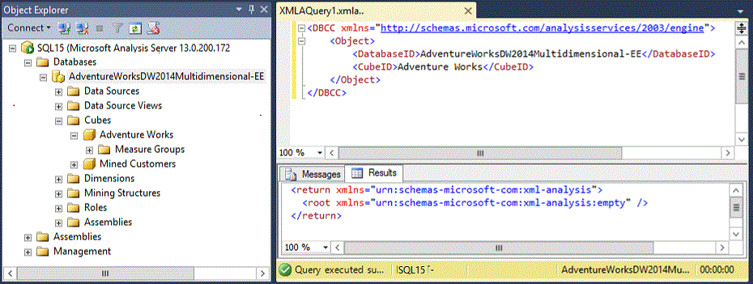
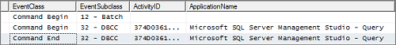

# Database Consistency Checker (DBCC) for Analysis Services
[!INCLUDE[ssas-appliesto-sqlas](../../includes/ssas-appliesto-sqlas.md)]
  DBCC provides on-demand database validation for Multidimensional and Tabular databases on an Analysis Services instance. You can execute DBCC in an MDX or XMLA query window in SQL Server Management Studio (SSMS) and trace the DBCC output in either SQL Server Profiler or xEvent sessions in SSMS.  
The command takes an object definition and returns either an empty result set or detailed error information if the object is corrupted.   In this article, you'll learn how to run the command, interpret results, and address any problems that arise.  
  
 For Tabular databases, consistency checks performed by DBCC are equivalent to the built-in validation that occurs automatically every time you reload, synchronize, or restore  a database.  In contrast, consistency checks for Multidimensional databases happen only when you run DBCC on demand.  
  
 The range of validation checks will vary by mode, with Tabular databases subject to a broader range of checks.  
 Characteristics of a DBCC workload also varies by server mode. Check operations on Multidimensional databases involve reading data from disk, constructing temporary indexes for comparison against actual indexes -- all of which takes significantly longer to complete.  
  
 Command syntax for DBCC uses the object metadata specific to the type of database you are checking:  
  
-   Multidimensional + pre-SQL Server 2016 Tabular 1100 or 1103 compatibility level databases are described in Multidimensional modeling constructs like **cubeID**, **measuregroupID**, and **partitionID**.  
  
-   Metadata for new Tabular model databases at compatibility level 1200 and higher consist of descriptors like **TableName** and **PartitionName**.  
  
 DBCC for Analysis Services will execute on any Analysis Services database at any compatibility level, as long as the database is running on a  SQL Server 2016 instance. Just make sure you're using the right command syntax for each database type.  
  
> [!NOTE]  
>  If you're familiar with [DBCC &#40;Transact-SQL&#41;](../../t-sql/database-console-commands/dbcc-transact-sql.md), you'll quickly notice that the DBCC in Analysis Services has a much narrower scope. DBCC in Analysis Services is a single command that reports exclusively on data corruption across the database or on individual objects. If you have other tasks in mind, such as collecting information, try using AMO PowerShell or XMLA scripts instead.
  
## Permission requirements  
 You must be an Analysis Services database or server administrator (a member of the server role) to run the command. See [Grant database permissions &#40;Analysis Services&#41;](../../analysis-services/multidimensional-models/grant-database-permissions-analysis-services.md) or [Grant server admin rights to an  Analysis Services instance](../../analysis-services/instances/grant-server-admin-rights-to-an-analysis-services-instance.md) for instructions.  
  
## Command syntax 
 Tabular databases at the 1200 and higher compatibility levels use tabular metadata for object definitions. The complete DBCC syntax for a tabular database created at a SQL Server 2016 functional level is illustrated in the following example.  
  
 Key differences between the two syntaxes include a newer XMLA namespace, no \<Object> element, and  no \<Model> element (there is still only one model per database).  
  
```  
<DBCC xmlns="http://schemas.microsoft.com/analysisservices/2014/engine">  
     <DatabaseID>MyTabular1200DB_7811b5d8-c407-4203-8793-12e16c3d1b9b</DatabaseID>  
     <TableName>FactSales</TableName>  
     <PartitionName>FactSales 4</PartitionName>  
</DBCC>  
```  
  
 You can omit lower-level objects, such as table or partition names, to check the entire schema.  
  
 You can get object names and DatabaseID from Management Studio, through the property page of each object.  
  
## Command syntax for Multidimensional and Tabular 110x databases  
 DBCC uses identical syntax for   multidimensional as well as tabular 1100 and 1103 databases. You can run DBCC against specific database objects, including the entire database. See [Object Element &#40;XMLA&#41;](https://docs.microsoft.com/bi-reference/xmla/xml-elements-properties/object-element-xmla) for more information about the object definition.  
  
```  
<DBCC xmlns="http://schemas.microsoft.com/analysisservices/2003/engine">  
     <Object>  
          <DatabaseID>AdventureWorksDW2014Multidimensional-EE</DatabaseID>  
          <CubeID>Adventure Works</CubeID>  
          <MeasureGroupID>Fact Internet Sales 1</MeasureGroupID>  
          <PartitionID>Internet_Sales_2006</PartitionID>  
     </Object>  
</DBCC>  
  
```  
  
 To run DBCC on objects higher up the object chain, delete any lower-level object ID elements you don't need:  
  
```  
<DBCC xmlns="http://schemas.microsoft.com/analysisservices/2003/engine">  
     <Object>  
          <DatabaseID>AdventureWorksDW2014Multidimensional-EE</DatabaseID>  
          <CubeID>Adventure Works</CubeID>  
     </Object>  
</DBCC>  
  
```  
  
 For tabular 110x databases, the object definition syntax is modeled after the syntax of Process command (specifically, in how tables are mapped to dimensions and measure groups).  
  
-   **CubeID** maps to the model ID, which is **Model**.  
  
-   **MeasureGroupID** maps to a table ID.  
  
-   **PartitionID** maps to a partition ID.  
  
## Usage  
 In SQL Server Management Studio, you can invoke DBCC using either an MDX or XMLA query window. Additionally, you can use either [!INCLUDE[ssCurrent](../../includes/sscurrent-md.md)] Profiler or Analysis Services xEvents to view DBCC output. Note that SSAS DBCC messages are not reported to the Windows application event log or the msmdsrv.log file.  
  
 DBCC checks for physical data corruption, as well as logical data corruption that occur when orphaned members exist in a segment. A database must be processed before you can run DBCC. It skips remote, empty, or unprocessed partitions.  
  
 The command runs in a read transaction, and can thus be kicked out by force commit timeout. Partition checks are run in parallel.  
  
 A service restart might be required to pick up any corruption errors that have occurred since the last service restart. Reconnecting to the server is not enough to pick up the changes.  
  
### Run DBCC commands in Management Studio  
 For ad hoc queries, open an MDX or XMLA query window in SQL Server Management Studio. To do this, right-click the database | **New Query** | **XMLA**) to run the command and read the output.  
  
   
  
 The Results tab will indicate an empty result set (as shown in the screenshot) if no problems were detected.  
  
 The Messages tab provides detail information but is not always reliable for smaller databases. Status messages are sometimes trimmed, indicating the command completed, but without the status check messages on each object. A typical message report might look similar to the one shown below.  
  
 **Messages reported from DBCC for the cube validation check**  
  
```  
Executing the query ...  
READS, 0  
READ_KB, 0  
WRITES, 0  
WRITE_KB, 0  
CPU_TIME_MS, 0  
ROWS_SCANNED, 0  
ROWS_RETURNED, 0  
  
<DBCC xmlns="http://schemas.microsoft.com/analysisservices/2003/engine">  
<Object>  
<DatabaseID>AdventureWorksDW2014Multidimensional-EE</DatabaseID>  
<CubeID>Adventure Works</CubeID>  
</Object>  
</DBCC>  
Started checking segment indexes for the 'Internet_Sales_2011' partition.  
Started checking segment indexes for the 'Internet_Sales_2012' partition.  
Finished checking segment indexes for the 'Internet_Sales_2011' partition.  
Started checking segment indexes for the 'Internet_Sales_2013' partition.  
Finished checking segment indexes for the 'Internet_Sales_2012' partition.  
Started checking segment indexes for the 'Internet_Sales_2014' partition.  
Started checking segment indexes for the 'Internet_Orders_2011' partition.  
Finished checking segment indexes for the 'Internet_Sales_2014' partition.  
Started checking segment indexes for the 'Internet_Orders_2012' partition.  
Started checking segment indexes for the 'Internet_Orders_2013' partition.  
Finished checking segment indexes for the 'Internet_Orders_2012' partition.  
...   
Run complete  
  
```  
  
 **Output when running DBCC against an earlier version of Analysis Services**  
  
 DBCC is only supported on databases running on a [!INCLUDE[ssCurrent](../../includes/sscurrent-md.md)] instance. Running the command on older systems will return this error.  
  
```  
Executing the query ...  
The DBCC element at line 7, column 87 (namespace http://schemas.microsoft.com/analysisservices/2003/engine) cannot appear under Envelope/Body/Execute/Command.  
Execution complete  
  
```  
  
### Trace DBCC output in SQL Server Profiler 2016  
 You can view DBCC output in a Profiler trace that includes Progress Reports events (Progress Report Begin, Progress Report Current, Progress Report End, and Progress Report Error).  
  
1.  Start a trace. See [Use SQL Server Profiler to Monitor Analysis Services](../../analysis-services/instances/use-sql-server-profiler-to-monitor-analysis-services.md) for help on how to use SQL Server Profiler with Analysis Services.  
  
2.  Choose **Command Begin** and **Command End** plus any or all of the **Progress Report** Events.  
  
3.  Run the DBCC command in Management Studio in either an XMLA or MDX query window, using the syntax provided in a previous section.  
  
4.  In SQL Server Profiler, DBCC activity is indicated through **Command** events having an event subclass of DBCC:  
  
       
  
     Event code 32 is DBCC execution.  
  
     Event code 64 is a DBCC progress report on individual objects.  
  
     Event code 63 is a segment check for multidimensional objects.  
  
     For both event subclases, review **TextData** values for messages returned by DBCC.  
  
     Status messages start with "Checking consistency of \<object>" , "Started checking \<object>", or "Finished checking \<object>".  
  
    > [!NOTE]  
    >  In CTP 3.0, objects are identified by internal names. For example, a Categories hierarchy is articulated as H$Categories-\<objectID>. Internal names should be replaced by user friendly names in an upcoming CTP.  
  
     Error messages are listed below.  
  
### Trace DBCC output in an xEvent session in SSMS  
 Extended events sessions can use both profiler events or xEvents. Refer to the previous section for guidance on adding **Command** and **Progress Report** events.  
  
1.  Start a session by right-clicking a database > **Management** >**Extended Events** >  **Sessions** > **New Session**. See  [Monitor Analysis Services with SQL Server Extended Events](../../analysis-services/instances/monitor-analysis-services-with-sql-server-extended-events.md) for more information.  
  
2.  Choose any or all of the **Progress Report** Events for the Profiler event category or **RequestProgress** events for the PureXevent category.  
  
3.  Run the DBCC command in Management Studio in either an XMLA or MDX query window, using the syntax provided in a previous section.  
  
4.  In SSMS, refresh the Sessions folder. Right-click the session name > **Watch Live Data**.  
  
5.  Review TextData values for messages returned by DBCC.  TextData is a property of an event field and shows status and error messages returned by the event.  
  
     Status messages start with "Checking consistency of \<object>" , "Started checking \<object>", or "Finished checking \<object>".  
  
     Error messages are listed below.  
  
## Reference: Consistency checks and errors for Multidimensional databases  
 For multidimensional databases, only  partition indexes are validated.  During execution, DBCC builds a temporary index for each partition and compares it with the persisted index on disk.  Building a temporary index requires reading all data from the partition data on disk and then holding the temporary index in memory for comparison. Given the additional workload, your server might experience significant disk IO and memory consumption while running a DBCC execution.  
  
 Detection of Multidimensional index corruption includes the following checks. Errors in this table appear in xEvent or Profiler traces for failures at the object level.  
  
||||  
|-|-|-|  
|**Object**|**DBCC check description**|**Error on failure**|  
|Partition Index|Check segment statistics and indexes.<br /><br /> Compares the ID of each member in the temporary partition index against the partition statistics stored on disk.  If a member is found in the temporary index with a data ID value outside the range stored for the partition index statistics on disk, then the statistics for the index are considered corrupt.|The partition segment statistics are corrupted.|  
|Partition Index|Validates metadata.<br /><br /> Verifies that each member in the temporary index can be found in the index header file for the segment on disk.|The partition segment is corrupted.|  
|Partition Index|Scan segments to look for physical corruptions.<br /><br /> Reads the index file on disk for each member in the temporary index and verifies that the size of the index records match, and that the same data pages are flagged as having records for the current member.|The partition segment is corrupted.|  
  
## Reference: Consistency checks and errors for Tabular databases  
 The following table  is list of all consistency checks performed on tabular objects, alongside errors that are raised if the check indicates corruption. Errors in this table appear in xEvent or Profiler traces for failures at the object level.  
  
||||  
|-|-|-|  
|**Object**|**DBCC check description**|**Error on failure**|  
|Database|Checks count of tables in the database.  A value less than zero indicates corruption.|There is corruption in the storage layer. The collection of tables in the '%{parent/}' database is corrupt.|  
|Database|Checks internal structure used to track Referential Integrity and throw s an error if the size is incorrect.|Database files failed to pass consistency checks.|  
|Table|Checks internal value used to determine if table is a Dimension or Fact table.  A value  that falls outside the  known range indicates corruption.|Database consistency checks (DBCC) failed while checking the table statistics.|  
|Table|Checks that the number of partitions in the segment map for the table matches the number of partitions defined for the table.|There is corruption in the storage layer. The collection of partitions in the '%{parent/}' table is corrupt.|  
|Table|If a tabular database was created or imported from PowerPivot for Excel 2010 and has a partition count greater than one, an error will be raised, as partition support was added in later versions and this would indicate corruption.|Database consistency checks (DBCC) failed while checking the segment map.|  
|Partition|Verifies for each partition that the number segments of data and the record count for each segment of data in the segment matches the values stored in the index for the segment.|Database consistency checks (DBCC) failed while checking the segment map.|  
|Partition|Raise an error if the number of total records, segments, or records per segment is not valid (less than zero), or the number of segments doesn't match the calculated number of segments needed based on total record count.|Database consistency checks (DBCC) failed while checking the segment map.|  
|Relationship|Raise an error if the structure used to store data about the relationship contains no records or if the name of the table used in the relationship is empty.|Database consistency checks (DBCC) failed while checking relationships.|  
|Relationship|Verify that the name of the primary table, primary column, foreign table, and foreign column are set and that the columns and tables involved in the relationship can be accessed.<br /><br /> Verify that the column types involved are valid and that the index of Primary Key-Foreign Key values results in a valid lookup structure.|Database consistency checks (DBCC) failed while checking relationships.|  
|Hierarchy|Raise an error if the sort order for the hierarchy isn't a recognized value.|Database consistency checks (DBCC) failed while checking the '%{hier/}' hierarchy.|  
|Hierarchy|The checks performed on the hierarchy depend on the internal type of hierarchy mapping scheme used.<br /><br /> All hierarchies are checked for correct processed state, that the hierarchy store exists, and that where applicable, data structures used for a data-ID-to-hierarchy-position conversion exists.<br /><br /> Assuming all these checks pass, the hierarchy structure is walked to verify that each position in the hierarchy points to the correct member.<br />If any of these tests fail, an error is raised.|Database consistency checks (DBCC) failed while checking the '%{hier/}' hierarchy.|  
|User defined Hierarchy|Checks that the hierarchy level names are set.<br /><br /> If the hierarchy has been processed, check that the internal hierarchy data store has the correct format.  Verify that the internal hierarchy store doesn't contain any invalid data values.<br /><br /> If the hierarchy is marked as unprocessed, confirm that this state applies to old data structures and that all levels of the hierarchy are marked as empty.|Database consistency checks (DBCC) failed while checking the '%{hier/}' hierarchy.|  
|Column|Raise an error if the encoding used for the column is not set to a known value.|Database consistency checks (DBCC) failed while checking the column statistics.|  
|Column|Check whether the column was compressed by the in-memory engine or not.|Database consistency checks (DBCC) failed while checking the column statistics.|  
|Column|Check the compression type on the column for known values.|Database consistency checks (DBCC) failed while checking the column statistics.|  
|Column|When the column "tokenization" is not set to a known value, raise an error.|Database consistency checks (DBCC) failed while checking the column statistics.|  
|Column|If the id range stored for a columns data dictionary does not match the number of values in the data dictionary or is outside the allowed range, raise an error.|Database consistency checks (DBCC) failed while checking the data dictionary.|  
|Column|Check that the number of data segments for a column matches the number of data segments for the table to which it belongs.|There is corruption in the storage layer. The collection of segments in the '%{parent/}' column is corrupt.|  
|Column|Check that the number of Partitions for a data column matches the number of partitions for the data segment map for the column.|Database consistency checks (DBCC) failed while checking the segment map.|  
|Column|Verify that the number of records in a column segment matches the record count stored in the index for that column segment.|There is corruption in the storage layer. The collection of segments in the '%{parent/}' column is corrupt.|  
|Column|If a column has no segment statistics, raise an error.|Database consistency checks (DBCC) failed while checking the segment statistics.|  
|Column|If a column has no compression information or segment storage, raise an error.|Database files failed to pass consistency checks.|  
|Column|Report an error if segment statistics for a column don't match the actual column values for Minimum Data ID, Maximum Data ID, number of Distinct values, number of rows, or presence of NULL values.|Database consistency checks (DBCC) failed while checking the segment statistics.|  
|ColumnSegment|If the minimum data ID or maximum data ID is less than the system reserved value for NULL, mark the  column segment information as corrupt.|Database consistency checks (DBCC) failed while checking the segment statistics.|  
|ColumnSegment|If there are no rows  for this segment, the minimum and maximum data values for the column should be set to the system reserved value for NULL.  If the value is not null, raise an error.|Database consistency checks (DBCC) failed while checking the segment statistics.|  
|ColumnSegment|If the column has rows and at least one non-null value, checkthat the minimum and maximum data id for the column is greater than the system reserved value for NULL.|Database consistency checks (DBCC) failed while checking the segment statistics.|  
|Internal|Verify that the store tokenization hint is set and that if the store is processed, there are valid pointers for internal tables.  If the store is not processed, verify all the pointers are null.<br />If not, return a generic DBCC error.|Database files failed to pass consistency checks.|  
|DBCC Database|Raise an error if the database schema has no tables or one or more tables cannot be accessed.|There is corruption in the storage layer. The collection of tables in the '%{parent/}' database is corrupt.|  
|DBCC Database|Raise an error if a table is marked as temporary or has an unknown type.|A bad table type was encountered.|  
|DBCC Database|Raise an error if the number of relationships for a table has a negative value, or if any table has a relationship defined and a corresponding relationship structure cannot be found.|There is corruption in the storage layer. The collection of relationships in the '%{parent/}' table is corrupt.|  
|DBCC Database|If the compatibility level for the database is 1050 (SQL Server 2008 R2/PowerPivot v1.0) and the number of relationships exceeds the number of tables in the model, mark the database as corrupted.|Database files failed to pass consistency checks.|  
|DBCC Table|For the table under validation, check if the number of columns is less than zero and raise an error if true.  An error also occurs  if the column store for a column in the table is NULL.|There is corruption in the storage layer. The collection of columns in the '%{parent/}' table is corrupt.|  
|DBCC Partition|Checks the table that the partition being validated belongs to, and if the number of columns for the table is less than zero, it indicates the Columns collection is corrupt for the table. An error will also occur if the column store for a column in the table is NULL.|There is corruption in the storage layer. The collection of columns in the '%{parent/}' table is corrupt.|  
|DBCC Partition|Loops through each column for the selected partition and checks that each segment for the partition has a valid link to a column segment structure.  If any segment has a NULL link, the partition is considered corrupt.|There is corruption in the storage layer. The collection of segments in the '%{parent/}' column is corrupt.|  
|Column|Returns an error if the column type is not valid.|A bad segment type was encountered.|  
|Column|Returns an error if any column has a negative count for the number of segments in a column, or if the pointer to the column segment structure for a segment has a NULL link.|There is corruption in the storage layer. The collection of segments in the '%{parent/}' column is corrupt.|  
|DBCC Command|The DBCC Command will report multiple status messages as it proceeds through the DBCC operation.  It will report a status message before starting that includes the database, table, or column name of the object, and again after finishing each object check.|Checking consistency of the \<objectname> \<objecttype>. Phase: pre-check.<br /><br /> Checking consistency of the \<objectname> \<objecttype>. Phase: post-check.|  
  
## Common resolutions for error conditions  
 The following errors appear in SQL Server Management Studio or in msmdsrv.log files. These errors appear when one or more checks fail to pass. Depending on the error, the recommended resolution is to either reprocess an object, delete and redeploy a solution, or restore the database.  
  
|Error|Issue|Resolution|  
|-----------|-----------|----------------|  
|**Errors in the metadata manager**<br /><br /> The object reference '\<objectID>' is not valid. It does not match the structure of the metadata class hierarchy.|malformed command|Check the command syntax. Most likely, you included a lower level object without specifying one or more of its parent objects.|  
|**Errors in the metadata manager**<br /><br /> Either the \<object> with the ID of '\<objectID>' does not exist in the \<parentobject> with the ID of '\<parentobjectID>', or the user does not have permissions to access the object.|Index corruption (multidimensional)|Reprocess the object and any dependent objects.|  
|**Error occurred during consistency check of the partition**<br /><br /> An error occurred while checking consistency of the \<partition-name> partition of the \<measure-group-name> measure group for the \<cube-name> cube from the \<database-name> database. Please re-process the partition or indexes in order to fix the corruption.|Index corruption (multidimensional)|Reprocess the object and any dependent objects.|  
|**Partition segment statistics corrupted**|Index corruption (multidimensional)|Reprocess the object and any dependent objects.|  
|**Partition segment is corrupted**|Metadata corruption (multidimensional or tabular)|Delete and redeploy the project, or restore from a backup and reprocess.<br /><br /> See [How to handle corruption in Analysis Services databases (blog)](http://blogs.msdn.com/b/karang/archive/2010/08/11/how-to-deal-with-corruption-in-analysis-services.aspx) for instructions.|  
|**Table metadata corruption**<br /><br /> Table \<table-name> metadata file is corrupt. The main table is not found under DataFileList node.|Metadata corruption (tabular only)|Delete and redeploy the project, or restore from a backup and reprocess.<br /><br /> See [How to handle corruption in Analysis Services databases (blog)](http://blogs.msdn.com/b/karang/archive/2010/08/11/how-to-deal-with-corruption-in-analysis-services.aspx) for instructions.|  
|**Corruption in storage layer**<br /><br /> Corruption in storage layer: collection of \<type-name> in \<parent-name> \<parent-type> is corrupt.|Metadata corruption (tabular only)|Delete and redeploy the project, or restore from a backup and reprocess.<br /><br /> See [How to handle corruption in Analysis Services databases (blog)](http://blogs.msdn.com/b/karang/archive/2010/08/11/how-to-deal-with-corruption-in-analysis-services.aspx) for instructions.|  
|**System table is missing**<br /><br /> System table \<table-name> is missing.|Object corruption (tabular only)|Reprocess the object and any dependent objects|  
|**Table statistics are corrupt**<br /><br /> Statistics of table System table \<table-name> is missing.|Metadata corruption (tabular only)|Delete and redeploy the project, or restore from a backup and reprocess.<br /><br /> See [How to handle corruption in Analysis Services databases (blog)](http://blogs.msdn.com/b/karang/archive/2010/08/11/how-to-deal-with-corruption-in-analysis-services.aspx) for instructions.|  
  
## Disable automatic consistency checks on database load operations through  the msmdsrv.ini configuration file  
 Although its not recommended, you can disable the built-in database consistency checks that occur automatically on database load events (on tabular databases only). To do this, you will need to modify a configuration setting in the msmdsrv.ini file:  
  
```  
<ConfigurationSettings>  
     <Vertipaq />  
          <DisableConsistencyChecks />  
```  
  
 This setting is not present in the configuration file and must be added manually.  
  
 Valid values are as follows:  
  
-   **-2** (default) DBCC is enabled. If the  server can logically resolve the error with a high degree of certainty, a fix will be applied automatically. Otherwise, an error will be logged.  
  
-   **-1** DBCC is partially enabled. It is enabled for RESTORE and on pre-commit validations that check database state at the end of a transaction.  
  
-   **0** DBCC is partially enabled. Database consistency checks are performed during RESTORE, IMAGELOAD, LOCALCUBELOAD, and ATTACH  
         operations.  
  
-   **1** DBCC is disabled. Data integrity checks are disabled, however deserialization checks will still occur.  
  
> [!NOTE]  
>  This setting has no impact on DBCC when running the command on demand.  
  
## See Also  
 [Process Database, Table, or Partition &#40;Analysis Services&#41;](../../analysis-services/tabular-models/process-database-table-or-partition-analysis-services.md)   
 [Processing a multidimensional model &#40;Analysis Services&#41;](../../analysis-services/multidimensional-models/processing-a-multidimensional-model-analysis-services.md)   
 [Compatibility Level for Tabular models in Analysis Services](../../analysis-services/tabular-models/compatibility-level-for-tabular-models-in-analysis-services.md)   
 [Server Properties in Analysis Services](../../analysis-services/server-properties/server-properties-in-analysis-services.md)  
  
  
