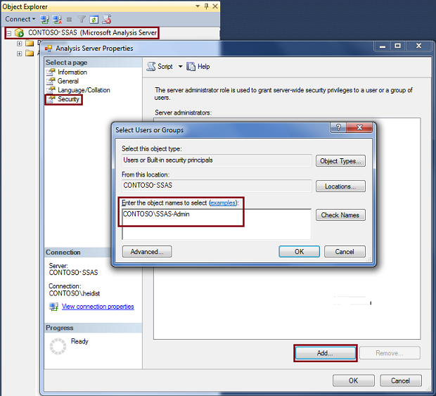

# Grant server admin rights to an  Analysis Services instance
[!INCLUDE[ssas-appliesto-sqlas](../../includes/ssas-appliesto-sqlas.md)]
  Members of the Server administrator role within an instance of [!INCLUDE[ssASnoversion](../../includes/ssasnoversion-md.md)] have unrestricted access to all [!INCLUDE[ssASnoversion](../../includes/ssasnoversion-md.md)] objects and data in that instance. A user must be a member of the Server administrator role to perform any server-wide task, such as creating or processing a database, modifying server properties, or launching a trace (other than for processing events).  
  
 Role membership is established when [!INCLUDE[ssASnoversion](../../includes/ssasnoversion-md.md)] is installed. The user running the Setup program can add him or herself to the role, or add another user. You must specify at least one administrator before Setup will allow you to continue.  
  
 By default, members of the local Administrators group are also granted administrative rights in Analysis Server. Although the local group is not explicitly granted membership in the [!INCLUDE[ssASnoversion](../../includes/ssasnoversion-md.md)] server administrator role, local administrators can create databases, add users and permissions, and perform any other task allowed to system administrators. The implicit granting of administrator permissions is configurable. It is determined by the **BuiltinAdminsAreServerAdmins** server property, which is set to **true** by default. You can change this property in [!INCLUDE[ssManStudioFull](../../includes/ssmanstudiofull-md.md)]. For more information, see [Security Properties](../../analysis-services/server-properties/security-properties.md).  
  
 Post-installation, you can modify role membership to add any additional users who require full rights to the service. You can also manage server roles by using Analysis Management Objects (AMO). For more information, see [Developing with Analysis Management Objects &#40;AMO&#41;](https://docs.microsoft.com/bi-reference/amo/developing-with-analysis-management-objects-amo).  
  
> [!NOTE]  
>  [!INCLUDE[ssASnoversion](../../includes/ssasnoversion-md.md)] provides a progression of increasingly granular roles for processing and querying at server, database, and object levels. See [Roles and Permissions &#40;Analysis Services&#41;](../../analysis-services/multidimensional-models/roles-and-permissions-analysis-services.md) for instructions on how to use these roles.  
  
## Modify Server Role Membership  
  
1.  In [!INCLUDE[ssManStudioFull](../../includes/ssmanstudiofull-md.md)], connect to the instance of [!INCLUDE[ssASnoversion](../../includes/ssasnoversion-md.md)], and then right-click the instance name in Object Explorer and then click **Properties**.  
  
2.  Click **Security** in the **Select a Page** pane, and then click **Add** at the bottom of the page to add one or more Windows users or groups to the server role.  
  
       
  
### Add computer accounts  
 You can also use [!INCLUDE[ssManStudioFull](../../includes/ssmanstudiofull-md.md)] to make a computer account a member of the [!INCLUDE[ssASnoversion](../../includes/ssasnoversion-md.md)] administrators group.  
  
1.  In the **Select Users or Groups** dialog, click **Locations**.  
  
2.  Select the domain the computers that you want to add are a member of or select **Entire directory** and click **Ok**.  
  
3.  Click **Object Types**.  
  
4.  Select **Computers** and click **Ok**.  
  
       
  
5.  In the **Enter the object names to select** text box, type the name of the computer and click **Check Names** to verify the computer account is found in the current Locations. If the computer account is not found, verify the computer name and the correct domain the computer is a member of.  
  
## NT Service\SSASTelemetry account  
 **NT Service/SSASTelemetry** is a low-privileged machine account created during setup and used exclusively to run the [!INCLUDE[ssASnoversion](../../includes/ssasnoversion-md.md)] implementation of the Customer Experience Improvement Program (CEIP) service. This service requires admin rights on the [!INCLUDE[ssASnoversion](../../includes/ssasnoversion-md.md)] instance to run several discover commands. See [Customer Experience Improvement Program for SQL Server Data Tools](../../sql-server/customer-experience-improvement-program-for-sql-server-data-tools.md) and [Microsoft SQL Server Privacy Statement](http://go.microsoft.com/fwlink/?LinkID=868444) for more information.  
  
## See Also  
 [Authorizing access to objects and operations &#40;Analysis Services&#41;](../../analysis-services/multidimensional-models/authorizing-access-to-objects-and-operations-analysis-services.md)   
 [Security Roles  &#40;Analysis Services - Multidimensional Data&#41;](../../analysis-services/multidimensional-models/olap-logical/security-roles-analysis-services-multidimensional-data.md)  
  
  
