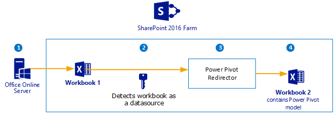
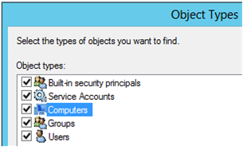
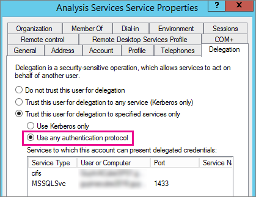

# Configure Analysis Services and Kerberos Constrained Delegation (KCD)
[!INCLUDE[ssas-appliesto-sqlas](../../../includes/ssas-appliesto-sqlas.md)]
  Kerberos constrained delegation (KCD) is an authentication protocol you can configure with Windows authentication to delegate client credentials from service to service throughout your environment. KCD requires additional infrastructure, for example a Domain Controller, and additional configuration of your environment. KCD is a requirement in some scenarios that involve [!INCLUDE[ssASnoversion](../../../includes/ssasnoversion-md.md)] and [!INCLUDE[ssGemini](../../../includes/ssgemini-md.md)] data with SharePoint 2016. In SharePoint 2016, Excel Services has moved outside the SharePoint farm to a separate and new server, the **Office Online Server**. Because the Office Online Server is separate, there is an increased need for a way to delegate client credentials in the typical two hop scenarios.  
  
## Overview  
 KCD enables an account to impersonate another account for the purpose of providing access to resources. The impersonating account would be a service account assigned to a web application or the computer account of a web server while the impersonated account would be a user account requiring access to resources. KCD operates at the service level, so that selected services on a server can be granted access by the impersonating account, while other services on the same server, or services on other servers are denied for access.  
  
 The sections in this topic review common scenarios with [!INCLUDE[ssASnoversion](../../../includes/ssasnoversion-md.md)] and [!INCLUDE[ssGemini](../../../includes/ssgemini-md.md)] where KCD is required as well as an example server deployment with a high level summary of what you need to install and configure. See the [More Information and community content](#bkmk_moreinfo) section for links to more detailed information on the technologies involved such as Domain Controllers and KCD.  
  
## Scenario 1: Workbook as data source (WDS).  
  Office Online Server opens an Excel workbook and  detects a data connection to another workbook. Office Online Server sends a request to the [!INCLUDE[ssGemini](../../../includes/ssgemini-md.md)] Redirector Service  to open the second workbook and the data .  
  
 In this scenario, user credentials need to be delegated from the Office Online Server to the SharePoint [!INCLUDE[ssGemini](../../../includes/ssgemini-md.md)] Redirector Service in SharePoint.  
  
   
  
## Scenario 2: An Analysis Services Tabular model links to an Excel workbook  
 An Analysis Services Tabular model  links to an Excel workbook which contains a Power Pivot model. In this scenario, when [!INCLUDE[ssASnoversion](../../../includes/ssasnoversion-md.md)] loads the Tabular model, [!INCLUDE[ssASnoversion](../../../includes/ssasnoversion-md.md)] detects the link to the workbook. When processing the model, [!INCLUDE[ssASnoversion](../../../includes/ssasnoversion-md.md)] sends a query request to SharePoint to load the workbook. In this scenario, client credentials do **not** need to be delegated from Analysis Services to SharePoint, however a client application can overwrite the data source information in an out-of-line binding. If the out-of-line binding request specifies to impersonate the current user, then the user credentials must be delegated, which requires KCD to be configured between [!INCLUDE[ssASnoversion](../../../includes/ssasnoversion-md.md)] and SharePoint.  
  
   
  
## Example deployment of KCD with Office Online Server and Analysis Services  
 This section describes an example deployment that uses four computers. The following sections summarize the key installation and configuration steps for each computer. Before you begin deployments, it is advised the computers are up to date with operating system patching and you know the computer names because they are needed in some of the configuration steps.  
  
-   Domain Controller  
  
-   SQL Server database engine and Analysis Services in Power Pivot mode. The instance of the database engine will be used for the SharePoint content databases.  
  
-   SharePoint server 2016  
  
-   Office Online Server  
  
   
  
### Domain Controller  
 The following is a summary of what to install for the domain controller (DC).  
  
-   **Role:** Active Directory Domain Services. For an overview, see [Configuring Active Directory (AD DS) in Windows Server 2012](http://sharepointgeorge.com/2012/configuring-active-directory-ad-ds-in-windows-server-2012/).  
  
-   **Role:** DNS Server  
  
-   **Feature:** .NET Framework 3.5 Features / .NET Framework 3.5  
  
-   **Feature:** Remote Server Administration Tools / Role Administration Tools  
  
-   Configure Active Directory to create a new Forest and join the computers to the domain. Before trying to add other computers to the private domain, you will need to configure the client computers DNS to the DC's IP address. On the DC machine, run `ipconfig /all` to get the IPv4 and IPv6 addresses for the next step.  
  
-   It is recommended you configure both IPv4 and IPv6 addresses. You can do this in Windows control panel:  
  
    1.  Click **Network and Sharing Center**  
  
    2.  Click your Ethernet connection  
  
    3.  Click **Properties**  
  
    4.  Click **Internet Protocol Version 6 (TCP/IPv6)**  
  
    5.  Click **Properties**  
  
    6.  Click **Use the following DNS server addresses**  
  
    7.  Type the IP address from the ipconfig command.  
  
    8.  Click the **Advanced** button , click the **DNS** tab and verify the DNS suffixes are correct.  
  
    9. Click **Append these DNS Suffixes.**  
  
    10. Repeat the steps for IPv4.  
  
-   **Note:** you can join computers to the domain from Windows Control panel, in the System settings. For more information, see [How To Join Windows Server 2012 to a Domain](http://social.technet.microsoft.com/wiki/contents/articles/20260.how-to-join-windows-server-2012-to-a-domain.aspx).  
  
   
  
### 2016 SQL Server Database engine and Analysis services in Power Pivot mode  
 The following is a summary of what to install on the [!INCLUDE[ssNoVersion](../../../includes/ssnoversion-md.md)] computer.  
  
  In the [!INCLUDE[ssCurrent](../../../includes/sscurrent-md.md)] setup wizard, [!INCLUDE[ssASnoversion](../../../includes/ssasnoversion-md.md)] in Power Pivot mode is installed as part of the feature selection workflow.  
  
1.  Run the [!INCLUDE[ssCurrent](../../../includes/sscurrent-md.md)] setup wizard and from the feature selection page, click the database engine, [!INCLUDE[ssASnoversion](../../../includes/ssasnoversion-md.md)], and the Management tools. In a later setup for the setup wizard you can specify the [!INCLUDE[ssGemini](../../../includes/ssgemini-md.md)] mode for [!INCLUDE[ssASnoversion](../../../includes/ssasnoversion-md.md)].  
  
2.  For instance configuration, configure a named instance of "POWERPIVOT".  
  
3.  On the Analysis Services Configuration page, configure the Analysis Services server for **Power Pivot** mode and add the **computer name** of the Office Online Server to the list of Analysis Services server administrators. For more information, see [Install Analysis Services in Power Pivot Mode](../../../analysis-services/instances/install-windows/install-analysis-services-in-power-pivot-mode.md).  
  
4.  Note, by default the "Computer" object type is not included in the search. Click  to add the Computers object.  
  
       
  
5.  Create the Service Principal Names (SPN) for the Analysis Services instance.  
  
     The following are useful SPN commands:  
  
    -   List the SPN for a specific account name running the service of interest: `SetSPN -l <account-name>`  
  
    -   Set a SPN for an account name that is running the service of interest: `SetSPN -a <SPN> <account-name>`  
  
    -   Delete a SPN from a specific account name running the service of interest: `SetSPN -D <SPN> <account-name>`  
  
    -   Search for duplicate SPNs: `SetSPN -X`  
  
     The SPN for the PowerPivot instance will be in the form of:  
  
    ```  
    MSSQLSvc.3/\<Fully Qualified Domain Name (FQDN)>:POWERPIVOT  
    MSSQLSvc.3/<NetBIOS Name>:POWERPIVOT  
    ```  
  
     Where the FQDN and NetBIOS names are the name of the machine that the instance resides on. These SPNs will be placed on the Domain Account that is being used for the service account.  If you are using Network Service, Local System, or the Service ID, you will want to place the SPN on the domain machine account.  If you are using a domain user account, you will place the SPN on that account.  
  
6.  Create the SPN for the SQL Browser service on the Analysis Services machine.  
  
     [Learn more](https://support.microsoft.com/en-us/kb/950599)  
  
7.  **Configure constrained delegation** settings on the Analysis Services service account for any external source you will be refreshing from such as SQL Server, or Excel files. On the Analysis Services service account, we want to make sure the following are set.  
  
     **Note:** If you do not see the delegation tab for the account, within Active Directory Users and Computers, it is because there is no SPN on that account.  You can add a fake SPN to get it to appear such as `my/spn`.  
  
     **Trust this user for delegation to specified services only** and **Use any authentication protocol**.  
  
     This is known as constrained delegation, and is required because the windows token will originate from a Claims to Windows Token Services (C2WTS) which requires constrained delegation with protocol transitioning.  
  
       
  
     You will also need to add the services that you will be delegating to. This will vary based on your environment.  
  
### Office Online Server  
  
1.  Install Office Online Server  
  
2.  **Configure Office Online Server** to connect to the [!INCLUDE[ssASnoversion](../../../includes/ssasnoversion-md.md)] server. Note, the Office Online Server computer account needs to be an administrator on the [!INCLUDE[ssASnoversion](../../../includes/ssasnoversion-md.md)] server. This was completed in a previous section of this topic, installing the [!INCLUDE[ssASnoversion](../../../includes/ssasnoversion-md.md)] server.  
  
    1.  On the Office Online Server, open a PowerShell window with administrative privileges and run the following command  
  
    2.  `New-OfficeWebAppsExcelBIServer -ServerId <AS instance name>`  
  
    3.  Sample: `New-OfficeWebAppsExcelBIServer -ServerId "MTGQLSERVER-13\POWERPIVOT"`  
  
3.  **Configure Active Directory** to allow the Office Online Server computer account to impersonate users to the SharePoint service account. So, set delegation property on principal running the Application Pool for SharePoint Web Services, on the Office Online Server: The PowerShell commands in this section require the Active Directory (AD) PowerShell objects.  
  
    1.  Get the Active Directory identity of the Office Online Server  
  
        ```  
        $computer1 = Get-ADComputer -Identity [ComputerName]  
        ```  
  
         find this Principal name is by looking at Task Manager / Details / w3wp.exe's User name. For example "svcSharePoint"  
  
        ```  
        Set-ADUser svcSharePoint -PrincipalsAllowedToDelegateToAccount $computer1  
  
        ```  
  
    2.  To verify the propery was set correctly  
  
    3.  ```  
        Get-ADUser svcSharePoint -Properties PrincipalsAllowedToDelegateToAccount  
        ```  
  
4.  **Configure constrained delegation** settings on the Office Online Server account to the Analysis Services Power Pivot instance. This should be the machine account that Office Online Server is running on. On the Office Online Service account, we want to make sure the following are set.  
  
     **Note:** If you do not see the delegation tab for the account, within Active Directory Users and Computers, it is because there is no SPN on that account.  You can add a fake SPN to get it to appear such as `my/spn`.  
  
     **Trust this user for delegation to specified services only** and **Use any authentication protocol**.  
  
     This is known as constrained delegation, and is required because the windows token will originate from a Claims to Windows Token Services (C2WTS) which requires constrained delegation with protocol transitioning.  You will then want to allow delegation to the MSOLAPSvc.3 and MSOLAPDisco.3 SPNs that we created above.  
  
5.  Setup Claims to windows token service (C2WTS) **This is needed for scenario 1**. For more information see [Claims to Windows Token Service (c2WTS) Overview](https://msdn.microsoft.com/library/ee517278.aspx).  
  
6.  **Configure constrained delegation** settings on the C2WTS service account.  The settings should match what you did in step 4.  
  
   
  
### SharePoint Server 2016  
 The following is a summary of SharePoint Server installation.  
  
1.  Run SharePoint Pre-requisite installer  
  
2.  Run and SharePoint installation and select the **Single Server Farm** setup role.  
  
3.  Run the PowerPivot for SharePoint add-in (spPowerPivot16.msi). For more information, see [Install or Uninstall the Power Pivot for SharePoint Add-in (SharePoint 2016)](../../../analysis-services/instances/install-windows/install-or-uninstall-the-power-pivot-for-sharepoint-add-in-sharepoint-2016.md)  
  
4.  Run the PowerPivot Configuration wizard. See [Power Pivot Configuration Tools](../../../analysis-services/power-pivot-sharepoint/power-pivot-configuration-tools.md).  
  
5. Connect SharePoint to the Office Online Server. (Configure_xlwac_on_SPO.ps1)
  
6.  Configure SharePoint Authentication providers for Kerberos. **This is needed for scenario 1**. For more information, see [Plan for Kerberos authentication in SharePoint 2013](https://technet.microsoft.com/library/ee806870.aspx).  
  
##  <a name="bkmk_moreinfo"></a> More Information and community content  
 [Kerberos for the Busy Admin](http://blogs.technet.com/b/askds/archive/2008/03/06/kerberos-for-the-busy-admin.aspx)  
  
 [Understanding Kerberos Double Hop](http://blogs.technet.com/b/askds/archive/2008/06/13/understanding-kerberos-double-hop.aspx)  
  
 [ALL things .Net and SharePoint](http://sbrickey.com/Tech/Blog/Post/Kerberos_Primer)  
  
 [Resource Based Kerberos Constrained Delegation](http://blog.kloud.com.au/2013/07/11/kerberos-constrained-delegation/)  
  
 [KERBEROS PRIMER - videos](http://blog.martinlund.it/kerberos-primer/)  
  
 [Microsoft® Kerberos Configuration Manager for SQL Server®](http://www.microsoft.com/en-us/download/details.aspx?id=39046)  
  
  
