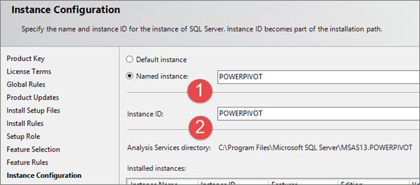
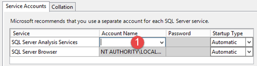
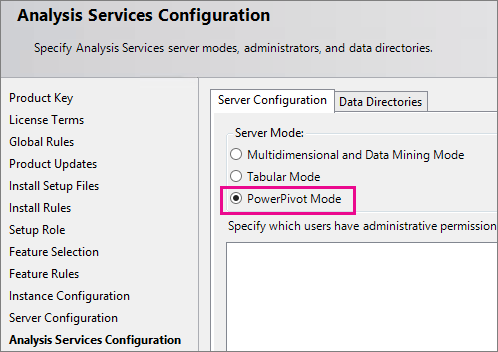

# Install Analysis Services in Power Pivot Mode
[!INCLUDE[ssas-appliesto-sqlas](../../../includes/ssas-appliesto-sqlas.md)]
  The procedures in this topic guide you through a single server installation of a [!INCLUDE[ssASnoversion](../../../includes/ssasnoversion-md.md)] server in [!INCLUDE[ssGemini](../../../includes/ssgemini-md.md)] mode for a SharePoint deployment. The steps include running the SQL Server installation wizard as well as configuration tasks that use SharePoint Central Administration.  
  
##  <a name="bkmk_background"></a> Background  
 [!INCLUDE[ssGemini](../../../includes/ssgemini-md.md)] for SharePoint is a collection of middle-tier and backend services that provide [!INCLUDE[ssGemini](../../../includes/ssgemini-md.md)] data access in a SharePoint 2016, or SharePoint 2013, farm.  
  
-   **Backend services:** If you use [!INCLUDE[ssGemini](../../../includes/ssgemini-md.md)] for Excel to create workbooks that contain analytical data, you must have [!INCLUDE[ssGemini](../../../includes/ssgemini-md.md)] for SharePoint to access that data in a server environment. You can run [!INCLUDE[ssNoVersion](../../../includes/ssnoversion-md.md)] Setup on a computer that has SharePoint Server installed, or on a different computer that has no SharePoint software. [!INCLUDE[ssASnoversion](../../../includes/ssasnoversion-md.md)] does not have any dependencies on SharePoint.  
  
     **Note:** This topic describes the installation of the [!INCLUDE[ssASnoversion](../../../includes/ssasnoversion-md.md)] server and the backend services.  
  
-   **Middle-tier:** Enhancements to the [!INCLUDE[ssGemini](../../../includes/ssgemini-md.md)] experiences in SharePoint including [!INCLUDE[ssGemini](../../../includes/ssgemini-md.md)] Gallery, Schedule data refresh, Management dashboard, and data providers. For more information on installing and configuring the middle-tier, see the following:  
  
    -   [Install or Uninstall the Power Pivot for SharePoint Add-in (SharePoint 2016)](../../../analysis-services/instances/install-windows/install-or-uninstall-the-power-pivot-for-sharepoint-add-in-sharepoint-2016.md)  
  
    -   [Install or Uninstall the Power Pivot for SharePoint Add-in &#40;SharePoint 2013&#41;](../../../analysis-services/instances/install-windows/install-or-uninstall-the-power-pivot-for-sharepoint-add-in-sharepoint-2013.md)  
  
    -   [Configure Power Pivot and Deploy Solutions &#40;SharePoint 2016&#41;](../../../analysis-services/instances/install-windows/configure-power-pivot-and-deploy-solutions-sharepoint-2016.md)  
  
    -   [Configure Power Pivot and Deploy Solutions &#40;SharePoint 2013&#41;](../../../analysis-services/instances/install-windows/configure-power-pivot-and-deploy-solutions-sharepoint-2013.md)  
  
##  <a name="bkmk_prereq"></a> Prerequisites  
  
1.  You must be a local administrator to run [!INCLUDE[ssNoVersion](../../../includes/ssnoversion-md.md)] Setup.  
  
2.  SharePoint Server enterprise edition is required for [!INCLUDE[ssGemini](../../../includes/ssgemini-md.md)] for SharePoint. You can also use the evaluation enterprise edition.  
  
3.  The computer must be joined to a domain in the same Active Directory forest as the Office Online Server (SharePoint 2016) or  Excel Services (SharePoint 2013).  
  
4.  The [!INCLUDE[ssGemini](../../../includes/ssgemini-md.md)] instance name must be available. You cannot have an existing [!INCLUDE[ssGemini](../../../includes/ssgemini-md.md)]-named instance on the computer on which you are installing Analysis Services in [!INCLUDE[ssGemini](../../../includes/ssgemini-md.md)] mode.  
  
     **Note:** The instance name must be POWERPIVOT.  
  
5.  Review [Hardware and Software Requirements for Analysis Services Server in SharePoint Mode](http://msdn.microsoft.com/library/fb86ca0a-518c-4c61-ae78-7680c57fae1f).  
  
6.  Review the release notes at [SQL Server 2016 Release Notes](../../../sql-server/sql-server-2016-release-notes.md).  
  
###  <a name="bkmk_sqleditions"></a> SQL Server Edition Requirements  
 Business intelligence features are not all available in all editions of [!INCLUDE[ssCurrent](../../../includes/sscurrent-md.md)]. For details, see [Analysis Services Features Supported by the Editions of SQL Server 2016](../../../analysis-services/analysis-services-features-supported-by-the-editions-of-sql-server-2016.md) and [Editions and Components of SQL Server 2016](../../../sql-server/editions-and-components-of-sql-server-2016.md).  
  
##  <a name="InstallSQL"></a> Step 1: Install Power Pivot for SharePoint  
 In this step, you run SQL Server Setup to install an [!INCLUDE[ssASnoversion](../../../includes/ssasnoversion-md.md)] server in [!INCLUDE[ssGemini](../../../includes/ssgemini-md.md)] mode. In a subsequent step, you configure Excel Services to use this server for workbook data models.  
  
1.  Run the SQL Server Installation Wizard (Setup.exe).  
  
2.  select **Installation** in the left navigation.  
  
3.  select **New SQL Server stand-alone installation or add features to an existing installation**.  
  
4.  If you see the **Product Key** page, specify the evaluation edition or enter a product key for a licensed copy of the enterprise edition. select **Next**. For more information on editions, see [Editions and Components of SQL Server 2016](../../../sql-server/editions-and-components-of-sql-server-2016.md).  
  
5.  Review and accept the Microsoft Software License Terms of agreement, and then select **Next**.  
  
6.  If you see the **Global Rules** page, review any rules information the setup wizard displays.  
  
7.  On the **Microsoft Update** page, it is recommended you use Microsoft Update to check for updates, then select **Next**.  
  
8.  The **Install Setup Files** page runs for several minutes. Review any rule warnings or failed rules, and then select **Next**.  
  
9. If you see another **Setup Support Rules**, review any warnings and select **Next**.  
  
     **Note:** Because Windows Firewall is enabled, you see a warning to open ports to enable remote access.  
  
10. On the **Setup Role** page, select **SQL Server Feature Installation**.  
  
     Select **Next**.  
  
11. On the Feature Selection page, select **Analysis Services**. This option allows you to install any of the three [!INCLUDE[ssASnoversion](../../../includes/ssasnoversion-md.md)] modes. You will select the mode in a later step. Select **Next**.  
  
12. On the **Instance Configuration** page, select **Named Instance** and type **POWERPIVOT** for the instance name Click **Next**.  
  
       
  
13. On the **Server Configuration** page, configure all of the services for Automatic **Startup Type**. Specify the desired domain account and password for **SQL Server Analysis Services**, **(1)** in the following diagram.  
  
    -   For [!INCLUDE[ssASnoversion](../../../includes/ssasnoversion-md.md)], you can use a **domain user** account or **NetworkService** account. Do not use LocalSystem or LocalService accounts.  
  
    -   If you added the SQL Server Database Engine and SQL Server Agent, you can configure the services to run under domain user accounts or under the default virtual account.  
  
    -   Never provision service accounts with your own domain user account. Doing so grants the server the same permissions that you have to the resources in your network. If a malicious user compromises the server, that user is logged in under your domain credentials. The user has the permissions to download or use the same data and applications that you do.  
  
     Select **Next**.  
  
       
  
14. If you are installing the [!INCLUDE[ssDE](../../../includes/ssde-md.md)], the **Database Engine Configuration** page appears. In [!INCLUDE[ssDE](../../../includes/ssde-md.md)] Configuration, select **Add Current User** to grant your user account administrator permissions on the Database Engine instance.  
  
     Select **Next**.  
  
15. On the **Analysis Services Configuration** page, select **PowerPivot Mode** under **Server Mode**  
  
       
  
16. On the **Analysis Services Configuration** page, select **Add Current User** to grant your user account administrative permissions. You will need administrative permission to configure the server after Setup is finished.  
  
    -   In the same page, add the Windows user account of any person who also requires administrative permissions. For example, any user who wants to connect to the [!INCLUDE[ssGeminiSrv](../../../includes/ssgeminisrv-md.md)] instance in [!INCLUDE[ssManStudioFull](../../../includes/ssmanstudiofull-md.md)] to troubleshoot database connection problems must have system administrator permissions. Add the user account of any person who might need to troubleshoot or administer the server now.  
  
    -   > [!NOTE]  
        >  All service applications that require access to the Analysis Services server instance need to have Analysis Services Administrative permissions. For example, add the service accounts for Excel Services, Power View, and Performance Point Services. Also, add the SharePoint farm account, which is used as the identity of the web application that hosts Central Administration.  
  
     Select **Next**.  
  
17. On the **Error Reporting** page, select **Next**.  
  
18. On the **Ready to Install** page, select **Install**.  
  
19. If you see the dialog **Computer Restart Required**, select **OK**.  
  
20. When the installation is complete, select **Close**.  
  
21. Restart the computer.  
  
22. If you have a firewall in your environment, review the SQL Server Books Online topic, [Configure the Windows Firewall to Allow Analysis Services Access](../../../analysis-services/instances/configure-the-windows-firewall-to-allow-analysis-services-access.md).  
  
### Verify the SQL Server Installation  
 Verify that the Analysis Services Service is running.  
  
1.  In Microsoft Windows click **Start**, select **All Programs**, and select the **Microsoft SQL Server 2016** group.  
  
2.  Select **SQL Server Management Studio**.  
  
3.  Connect to the Analysis Services instance, for example **[your server name]\POWERPIVOT**. If you can connect to the instance, you have verified the Service is running.  
  
##  <a name="bkmk_config"></a> Step 2: Configure Basic Analysis Services SharePoint Integration  
 The following steps describe configuration changes needed so you can interact with Excel advanced data models inside a SharePoint document library. Complete these steps after you install SharePoint  and SQL Server Analysis Services.  
  
### SharePoint 2016  
 Excel Services was removed from SharePoint 2016 , and instead uses Office Online Server for hosting Excel.  
  
#### Grant Office Online Server machine account Administration Rights on Analysis Services  
 You do not need to complete this section if during the Analysis Services installation; you added the Office Online Server machine account as an Analysis Services administrator.  
  
1.  On the Analysis Services server, start SQL Server Management Studio and connect to the Analysis Services instance, for example `[MyServer]\POWERPIVOT`.  
  
2.  In Object Explorer, right-click the instance name and select **Properties**.  
  
       
  
3.  In the left pane, select **Security**. Add the machine account that the Office Online Server is installed on.  
  
       
  
#### Register Analysis Services server with Office Online Server  
 You will want to perform these steps on the Office Online Server.  
  
-   Open a PowerShell command window as an administrator.  
  
-   Load the `OfficeWebApps` PowerShell module.  
  
     `Import-Module OfficeWebApps`  
  
-   Add the Analysis Services server, for example `[MyServer]\POWERPIVOT`.  
  
     `New-OfficeWebAppsExcelBIServer -ServerId [MyServer]\POWERPIVOT]`  
  
### SharePoint 2013  
  
#### Grant Excel Services Server Administration Rights on Analysis Services  
 You do not need to complete this section if during the Analysis Services installation; you added the Excel Services Application service account as an Analysis Services administrator.  
  
1.  On the Analysis Services server, start SQL Server Management Studio and connect to the Analysis Services instance, for example `[MyServer]\POWERPIVOT`.  
  
2.  In Object Explorer, right-click the instance name and select **Properties**.  
  
       
  
3.  In the left pane, select **Security**. Add the domain login you configured for the Excel Services Application in step 1.  
  
       
  
#### Configure Excel Services for Analysis Services integration  
  
1.  In SharePoint Central Administration, in the Application Management group, click **Manage Service Applications**.  
  
2.  Click the name of your service application, the default is **Excel Services Application**.  
  
3.  On the **Manage Excel Services Application page**, click **Data Model Settings**.  
  
4.  Click **Add Server**.  
  
5.  In **Server Name**, type the Analysis Services server name and the [!INCLUDE[ssGemini](../../../includes/ssgemini-md.md)] instance name. For example `MyServer\POWERPIVOT`. The [!INCLUDE[ssGemini](../../../includes/ssgemini-md.md)] instance name is required.  
  
     Type a description.  
  
6.  Click **Ok**.  
  
7.  The changes will take effect in a few minutes or you can **Stop** and **Start** the service **Excel Calculation Services**. To  
  
     Another option is to open a command prompt with administrative privileges, and type `iisreset /noforce`.  
  
     You can verify the server is recognized by Excel Services by reviewing entries in the ULS log. You will see entries similar to the following:  
  
    ```  
    Excel Services Application            Data Model        27           Medium                Check Administrator Access ([ServerName]\POWERPIVOT): Pass.        f127bd9b-bae3-e0e0-9b48-3f7b5ad1eae6  
    Excel Services Application            Data Model        27           Medium                Check Server Version ([ServerName]\POWERPIVOT): Pass (11.0.2809.24 >= 11.0.2800.0).         f127bd9b-bae3-e0e0-9b48-3f7b5ad1eae6  
    Excel Services Application            Data Model        27           Medium                Check Deployment Mode ([ServerName]\POWERPIVOT): Pass.            f127bd9b-bae3-e0e0-9b48-3f7b5ad1eae6  
  
    ```  
  
##  <a name="bkmk_verify"></a> Step 3: Verify the Integration  
 The following steps walk you through creating and uploading a new workbook to verify the Analysis Services integration. You will need a SQL Server database to complete the steps.  
  
1.  **Note:** If you already have an advanced workbook with slicers or filters, you can upload it to your SharePoint document library and verify you are able to interact with the slicers and filters from the document library view.  
  
2.  Start a new workbook in Excel.  
  
3.  On the Data tab, select **From Other Sources** on the ribbon in the **Get External Data**.  
  
4.  Select **From SQL Server**.  
  
5.  In the **Data Connection Wizard**, enter the name of the SQL Server instance that has the database you want to use.  
  
6.  Under Log on credentials, verify that **Use Windows Authentication** is selected, and then select **Next**.  
  
7.  Select the database you want to use.  
  
8.  Verify that the **Connect to specific table** checkbox is selected.  
  
9. Select the **Enable selection of multiple tables and add tables to the Excel Data Model** checkbox.  
  
10. Select the tables you want to import.  
  
11. Select the checkbox **Import relationships between selected tables**, and then select **Next**. Importing multiple tables from a relational database lets you work with tables that are already related. You save steps because you don't have to build the relationships manually.  
  
12. In the **Save Data Connection File and Finish** page of the wizard,, type a dame for your connection and select **Finish**.  
  
13. The **Import Data** dialog box will appear. Choose **PivotTable Report**, and then select **Ok**.  
  
14. A PivotTable Field List appears in the workbook.   
    On the field list, select the **All** tab  
  
15. Add fields to the Row, Columns, and Value areas in the field list.  
  
16. Add a slicer or a filter to the PivotTable. **Do not skip this step**. A slicer or filter is the element that will help you verify your Analysis Services installation.  
  
17. Save the workbook to a document library in your SharePoint farm. You can also save the workbook to a file share and then upload it to the SharePoint document library.  
  
18. Select the name of your workbook to view it in Excel Online and click the slicer or change the filter that you previously added. If a data update occurs, you know that Analysis Services is installed and available to Excel. If you open the workbook in Excel you will be using a cached copy and not using the Analysis Services server.  
  
##  <a name="bkmk_firewall"></a> Configure the Windows Firewall to Allow Analysis Services Access  
 Use the information in the topic [Configure the Windows Firewall to Allow Analysis Services Access](../../../analysis-services/instances/configure-the-windows-firewall-to-allow-analysis-services-access.md) to determine whether you need to unblock ports in a firewall to allow access to Analysis Services or [!INCLUDE[ssGemini](../../../includes/ssgemini-md.md)] for SharePoint. You can follow the steps provided in the topic to configure both port and firewall settings. In practice, you should perform these steps together to allow access to your Analysis Services server.  
  
##  <a name="bkmk_upgrade_workbook"></a> Upgrade Workbooks and Scheduled Data Refresh  
 The steps required to upgrade workbooks created in previous versions of [!INCLUDE[ssGemini](../../../includes/ssgemini-md.md)] depend on what version of [!INCLUDE[ssGemini](../../../includes/ssgemini-md.md)] created the workbook. For more information, see [Upgrade Workbooks and Scheduled Data Refresh &#40;SharePoint 2013&#41;](../../../analysis-services/instances/install-windows/upgrade-workbooks-and-scheduled-data-refresh-sharepoint-2013.md).  
  
##  <a name="bkmk_multiple_servers"></a> Beyond the Single-Server Installation - Power Pivot for Microsoft SharePoint  
 **Web front-end (WFE)** or **Middle-tier:**: To use an [!INCLUDE[ssASnoversion](../../../includes/ssasnoversion-md.md)] server in SharePoint mode in a larger SharePoint farm and to install additional [!INCLUDE[ssGemini](../../../includes/ssgemini-md.md)] features into the farm, run the installer package **spPowerPivot16.msi (SharePoint 2016), or spPowerPivot.msi (SharePoint 2013),** on each of the SharePoint servers. The spPowerPivot16.msi, or spPowerPivot.msi, installs required data providers and the [!INCLUDE[ssGemini](../../../includes/ssgemini-md.md)] for SharePoint 2016, or 2013, Configuration tool.  
  
 For more information on installing and configuring the middle-tier, see the following:  
  
-   [Install or Uninstall the Power Pivot for SharePoint Add-in &#40;SharePoint 2013&#41;](../../../analysis-services/instances/install-windows/install-or-uninstall-the-power-pivot-for-sharepoint-add-in-sharepoint-2013.md)  
  
-   [Install or Uninstall the Power Pivot for SharePoint Add-in &#40;SharePoint 2013&#41;](../../../analysis-services/instances/install-windows/install-or-uninstall-the-power-pivot-for-sharepoint-add-in-sharepoint-2013.md)  
  
-   To download the .msi, see [Microsoft SQL Server 2016 Power Pivot for Microsoft SharePoint 2016](http://go.microsoft.com/fwlink/?LinkID=324854)  
  
-   [Configure Power Pivot and Deploy Solutions &#40;SharePoint 2013&#41;](../../../analysis-services/instances/install-windows/configure-power-pivot-and-deploy-solutions-sharepoint-2013.md)  
  
 **Redundancy and server load:** Installing a second, or more [!INCLUDE[ssASnoversion](../../../includes/ssasnoversion-md.md)] servers in [!INCLUDE[ssGemini](../../../includes/ssgemini-md.md)] mode will provide redundancy of the [!INCLUDE[ssASnoversion](../../../includes/ssasnoversion-md.md)] server functionality. Additional servers will also spread the load across servers. For more information, see the following:  
  
-   [Configure Analysis Services for processing data models in Excel Services (SharePoint 2013)](http://technet.microsoft.com/library/jj614437(v=office.15)).  
  
-   [Manage Excel Services data model settings (SharePoint 2013)](http://technet.microsoft.com/library/jj219780(v=office.15)).  
  
  [Submit feedback and contact information through SQL Server Feedback](https://feedback.azure.com/forums/908035-sql-server).  
  
## See Also  
 [Migrate Power Pivot to SharePoint 2013](../../../analysis-services/instances/install-windows/migrate-power-pivot-to-sharepoint-2013.md)   
 [Install or Uninstall the Power Pivot for SharePoint Add-in &#40;SharePoint 2013&#41;](../../../analysis-services/instances/install-windows/install-or-uninstall-the-power-pivot-for-sharepoint-add-in-sharepoint-2013.md)   
 [Upgrade Workbooks and Scheduled Data Refresh &#40;SharePoint 2013&#41;](../../../analysis-services/instances/install-windows/upgrade-workbooks-and-scheduled-data-refresh-sharepoint-2013.md)  
  
  
