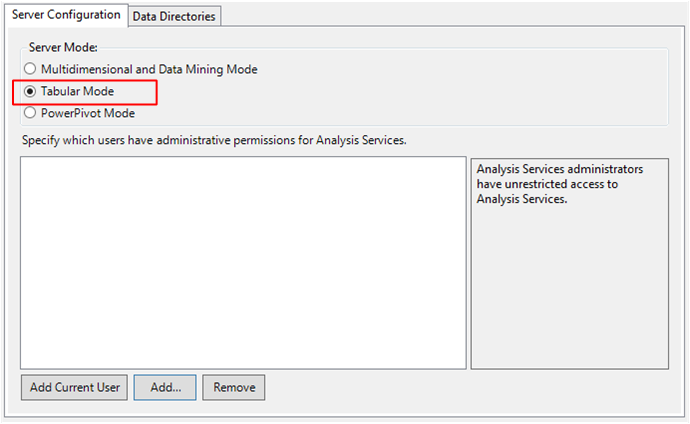

# Install SQL Server Analysis Services
[!INCLUDE[ssas-appliesto-sqlas](../../../includes/ssas-appliesto-sqlas.md)]
  SQL Server Analysis Services is an analytical database server that hosts Tabular models, multidimensional cubes, and data mining models that you can access from reports, spreadsheets, and dashboards.  
  
 Analysis Services is multi-instance, which means that you can install more than one copy on a single computer, or run new and old versions  side-by-side. Any instance you install runs in one of three modes, as determined during setup: Multidimensional and Data Mining, Tabular, or SharePoint. If you want to use multiple modes, you'll need a separate instance for each one.  
  
 After you install the server in a particular mode, you can use it host solutions that conform to that mode. For example, a tabular mode server is required if you want tabular model data access over the network.  
  
## Get tools and designers  
 SQL Server Setup no longer installs the model designers or management tools used for solution design or server administration. In this release, tools have a separate installation, which you can get from the following links:  
  
-   [Download SQL Server Management Studio (SSMS)](../../../ssms/download-sql-server-management-studio-ssms.md)  
  
-   [Download SQL Server Data Tools (SSDT)](../../../ssdt/download-sql-server-data-tools-ssdt.md)  
  
 You'll need both SSMS and SSDT to work with Analysis Services instances and data. Tools can be installed anywhere, but be sure to configure ports on the server before attempting a connection. See [Configure the Windows Firewall to Allow Analysis Services Access](../../../analysis-services/instances/configure-the-windows-firewall-to-allow-analysis-services-access.md) for details.  
  
## Install using a wizard  
 The following list shows you which pages in the SQL Server Installation wizard are used to install Analysis Services.  
  
1.  Select **Analysis Services** from the Feature Tree in Setup.  
  
       
  
2.  On the Analysis Services Configuration page, select a mode. Tabular mode is the default..  
  
       
  
  Tabular mode uses the xVelocity in-memory analytics engine (VertiPaq), which is the default storage for tabular models. After you deploy tabular models to the server, you can selectively configure tabular solutions to use DirectQuery disk storage as an alternative to memory-bound storage.  
 
 Multidimensional and Data Mining mode use MOLAP as the default storage for models deployed to Analysis Services. After deploying to the server, you can configure a solution to use ROLAP if you want to run queries directly against the relational database rather than storing query data in an Analysis Services  multidimensional database .  
  

  
 Memory management and IO settings can be adjusted to get better performance when using non-default storage modes. See [Server Properties in Analysis Services](../../../analysis-services/server-properties/server-properties-in-analysis-services.md) for more information.  
  
## Command Line Setup  
 SQL Server Setup includes a parameter (**ASSERVERMODE**) that specifies the server mode. The following example illustrates a command line setup that installs Analysis Services in Tabular server mode.  
  
```  
  
Setup.exe /q /IAcceptSQLServerLicenseTerms /ACTION=install /FEATURES=AS /ASSERVERMODE=TABULAR /INSTANCENAME=ASTabular /INDICATEPROGRESS /ASSVCACCOUNT=<DomainName\UserName> /ASSVCPASSWORD=<StrongPassword> /ASSYSADMINACCOUNTS=<DomainName\UserName>   
```  
  
 **INSTANCENAME** must be less than 17 characters.  
  
 All placeholder account values must be replaced with valid accounts and password.  
  
 **ASSERVERMODE** is case-sensitive.  All values must be expressed in upper case. The following table describes the valid values for **ASSERVERMODE**.  
  
|Value|Description|  
|-----------|-----------------|  
|TABULAR|This is the default value. If you do not set **ASSERVERMODE**, the server is installed in Tabular mode.|
|MULTIDIMENSIONAL|This value is optional.|  
|POWERPIVOT|This value is optional. In practice, if you set the **ROLE** parameter, the server mode is automatically set to 1, making **ASSERVERMODE** optional for a [!INCLUDE[ssGemini](../../../includes/ssgemini-md.md)] for SharePoint installation. For more information, see [Install Power Pivot from the Command Prompt](http://msdn.microsoft.com/7f1f2b28-c9f5-49ad-934b-02f2fa6b9328).|  
  
  
## See Also  
 [Determine the Server Mode of an Analysis Services Instance](../../../analysis-services/instances/determine-the-server-mode-of-an-analysis-services-instance.md)   
 [Tabular Modeling](https://msdn.microsoft.com/library/hh212945(v=sql.110).aspx)  
  
  
