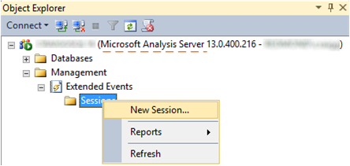
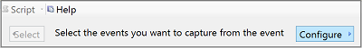

# Monitor Analysis Services with SQL Server Extended Events
  Extended Events (*xEvents*) is a light-weight tracing and performance monitoring system that uses very few system resources, making it an ideal tool for diagnosing problems on both production and test servers. It's also highly scalable, configurable, and in SQL Server 2016 ,  easier to use through new built-in tool support. In SQL Server Management Studio, on connections to Analysis Services instances, you can configure, run, and monitor a live trace, similar to using SQL Server Profiler. The addition of better tooling should make xEvents a more reasonable replacement for SQL Server Profiler and creates more symmetry in how you diagnose issues in your database engine and Analysis Services workloads.  
  
 Besides [!INCLUDE[ssManStudioFull](../../includes/ssmanstudiofull-md.md)], you can also configure  [!INCLUDE[ssASnoversion](../../includes/ssasnoversion-md.md)] Extended Event sessions the old way,  through XMLA scripting, as was supported in previous releases.  
  
 All Analysis Services events can be captured and targeted to specific consumers, as defined in [Extended Events](../../relational-databases/extended-events/extended-events.md).  
  
> [!NOTE]  
>  Watch this [quick video introduction](https://www.youtube.com/watch?v=ja2mOHWRVC0&index=1&list=PLv2BtOtLblH1YvzQ5YnjfQFr_oKEvMk19) or read the [supporting blog post](http://blogs.msdn.com/b/analysisservices/archive/2015/09/22/using-extended-events-with-sql-server-analysis-services-2016-cpt-2-3.aspx) to learn more about xEvents for Analysis Services in SQL Server 2016.  
  
##  <a name="bkmk_top"></a> In this topic  
  
-   [Use Management Studio to Configure Analysis Services](#bkmk_ssas_extended_events_ssms)  
  
-   [XMLA Script to Start Extended Events in Analysis Services](#bkmk_script_start)  
  
##  <a name="bkmk_ssas_extended_events_ssms"></a> Use Management Studio to Configure Analysis Services  
 For both tabular and multidimensional instances, Management Studio provides a new Management folder that contains user-initiated xEvent sessions. You can run multiple sessions at once. However, in the current implementation, the [!INCLUDE[ssASnoversion](../../includes/ssasnoversion-md.md)] Extended Events user interface does not support updating or replaying an existing session.  
  
   
  
 **Choose Events**  
  
 If you already know which events you want to capture, searching for them is the easiest way to add them to the trace. Otherwise, the following events are commonly used for monitoring operations:  
  
-   **CommandBegin** and **CommandEnd**.  
  
-   **QueryBegin**, **QueryEnd**, and **QuerySubcubeVerbose** (shows the entire MDX or DAX query sent to the server), plus **ResourceUsage** for stats on resources consumed by the query and how many rows are returned.  
  
-   **ProgressReportBegin** and **ProgressReportEnd** (for processing operations).  
  
-   **AuditLogin** and **AuditLogout** (captures the user identity under which a client application connects to Analysis Services).  
  
 **Choose Data Storage**  
  
 A session can be streamed live to a window in Management Studio or persisted to a file for subsequent analysis using Power Query or Excel.  
  
-   **event_file** stores session data in an .xel file.  
  
-   **event_stream** enables the **Watch Live Data** option in Management Studio.  
  
-   **ring_buffer** stores session data in memory for as long as the server is running. On a server restart, the session data is thrown out  
  
 **Add Event Fields**  
  
 Be sure to configure the session to include event fields so that you can easily see information of interest.  
  
 **Configure** is an option on the far side of the dialog box.  
  
   
  
 In configuration, on the Event Fields tab, select **TextData** so that this field appears adjacent to the event, showing return values, including queries that are executing on the server.  
  
 After you configure a session for the desired events and data storage, you can click the script button to send your configuration to one of supported destinations including a file, a new query in [!INCLUDE[ssManStudioFull](../../includes/ssmanstudiofull-md.md)], and the clipboard.  
  
 **Refresh Sessions**  
  
 Once you create the session, be sure to refresh the Sessions folder in Management Studio to see the session you just created. If you configured an event_stream, you can right-click the session name and choose **Watch Live Data** to monitor server activity in real time.  
  
##  <a name="bkmk_script_start"></a> XMLA Script to Start Extended Events in Analysis Services  
 Extended Event tracing is enabled using a similar XMLA create object script command as shown below:  
  
```  
<Execute …>  
   <Command>  
      <Batch …>  
         <Create …>  
            <ObjectDefinition>  
               <Trace>  
                  <ID>trace_id</ID>  
                  <Name>trace_name</Name>  
                  <ddl300_300:XEvent>  
                     <event_session …>  
                        <event package="AS" name="AS_event">  
                           <action package="PACKAGE0" …/>  
                        </event>  
                        <target package="PACKAGE0" name="asynchronous_file_target">  
                           <parameter name="filename" value="data_filename.xel"/>  
                           <parameter name="metadatafile" value="metadata_filename.xem"/>  
                        </target>  
                     </event_session>  
                  </ddl300_300:XEvent>  
               </Trace>  
            </ObjectDefinition>  
         </Create>  
      </Batch>  
   </Command>  
   <Properties></Properties>  
</Execute>  
  
```  
  
 Where the following elements are to be defined by the user, depending on the tracing needs:  
  
 *trace_id*  
 Defines the unique identifier for this trace.  
  
 *trace_name*  
 The name given to this trace; usually a human readable definition of the trace. It is a common practice to use the *trace_id* value as the name.  
  
 *AS_event*  
 The Analysis Services event to be exposed. See [Analysis Services Trace Events](../../analysis-services/trace-events/analysis-services-trace-events.md) for names of the events.  
  
 *data_filename*  
 The name of the file that contains the events data. This name is suffixed with a time stamp to avoid data overwriting if the trace is sent over and over.  
  
 *metadata_filename*  
 The name of the file that contains the events metadata. This name is suffixed with a time stamp to avoid data overwriting if the trace is sent over and over.  
  
||  
|-|  
| [In this topic](#bkmk_top)|  
  
##  <a name="bkmk_script_stop"></a> XMLA Script to Stop Extended Events in Analysis Services  
 To stop the Extended Events tracing object you need to delete that object using a similar XMLA delete object script command as shown below:  
  
```  
<Execute xmlns="urn:schemas-microsoft-com:xml-analysis">  
   <Command>  
      <Batch …>  
         <Delete …>  
            <Object>  
               <TraceID>trace_id</TraceID>  
            </Object>  
         </Delete>  
      </Batch>  
   </Command>  
   <Properties></Properties>  
</Execute>  
  
```  
  
 Where the following elements are to be defined by the user, depending on the tracing needs:  
  
 *trace_id*  
 Defines the unique identifier for the trace to be deleted.  
  
||  
|-|  
| [In this topic](#bkmk_top)|  
  
## See Also  
 [Extended Events](../../relational-databases/extended-events/extended-events.md)  
  
  