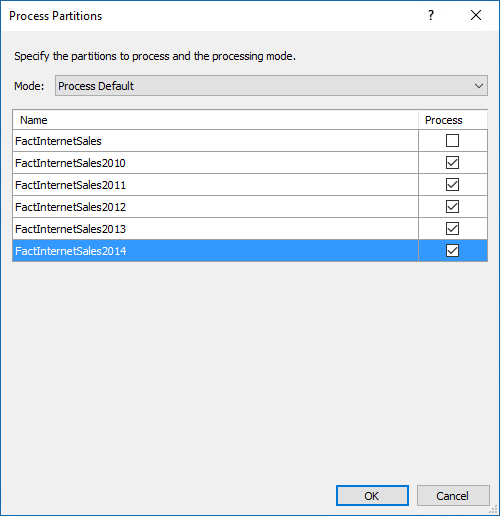

# Lesson 10: Create Partitions
[!INCLUDE[ssas-appliesto-sql2016-later-aas](../includes/ssas-appliesto-sql2016-later-aas.md)]

In this lesson, you will create partitions to divide the FactInternetSales table into smaller logical parts that can be processed (refreshed) independent of other partitions. By default, every table you include in your model has one partition which includes all of the table's columns and rows. For the FactInternetSales table, we want to divide the data by year; one partition for each of the table's five years. Each partition can then be processed independently. To learn more, see [Partitions](../analysis-services/tabular-models/partitions-ssas-tabular.md).  
  
Estimated time to complete this lesson: **15 minutes**  
  
## Prerequisites  
This topic is part of a tabular modeling tutorial, which should be completed in order. Before performing the tasks in this lesson, you should have completed the previous lesson: [Lesson 9: Create Hierarchies](../analysis-services/lesson-9-create-hierarchies.md).  
  
## Create partitions  
  
#### To create partitions in the FactInternetSales table  
  
1.  In Tabular Model Explorer, expand **Tables**, right-click **FactInternetSales** > **Partitions**.  
  
2.  In the Partition Manager dialog box, click **Copy**.  
  
3.  In **Partition Name**, change the name to **FactInternetSales2010**.  
  
    > [!TIP]  
    > Notice the column names in the Table Preview window display those columns included in the model table (checked) with the column names from the source. This is because the Table Preview window displays columns from the source table, not from the model table.  
  
4.  Select the **SQL** button just above the right side of the preview window to open the SQL Statement editor.  
  
    Because you want the partition to include only those rows within a certain period, you must include a WHERE clause. You can only create a WHERE clause by using a SQL Statement.  
  
5.  In the **SQL Statement** field, replace the existing statement by copying and pasting the following statement:  
  
    ```  
    SELECT   
    [dbo].[FactInternetSales].[ProductKey],  
    [dbo].[FactInternetSales].[CustomerKey],  
    [dbo].[FactInternetSales].[PromotionKey],  
    [dbo].[FactInternetSales].[CurrencyKey],  
    [dbo].[FactInternetSales].[SalesTerritoryKey],  
    [dbo].[FactInternetSales].[SalesOrderNumber],  
    [dbo].[FactInternetSales].[SalesOrderLineNumber],  
    [dbo].[FactInternetSales].[RevisionNumber],  
    [dbo].[FactInternetSales].[OrderQuantity],  
    [dbo].[FactInternetSales].[UnitPrice],  
    [dbo].[FactInternetSales].[ExtendedAmount],  
    [dbo].[FactInternetSales].[UnitPriceDiscountPct],  
    [dbo].[FactInternetSales].[DiscountAmount],  
    [dbo].[FactInternetSales].[ProductStandardCost],  
    [dbo].[FactInternetSales].[TotalProductCost],  
    [dbo].[FactInternetSales].[SalesAmount],  
    [dbo].[FactInternetSales].[TaxAmt],  
    [dbo].[FactInternetSales].[Freight],  
    [dbo].[FactInternetSales].[CarrierTrackingNumber],  
    [dbo].[FactInternetSales].[CustomerPONumber],  
    [dbo].[FactInternetSales].[OrderDate],  
    [dbo].[FactInternetSales].[DueDate],  
    [dbo].[FactInternetSales].[ShipDate]   
    FROM [dbo].[FactInternetSales]  
    WHERE (([OrderDate] >= N'2010-01-01 00:00:00') AND ([OrderDate] < N'2011-01-01 00:00:00'))  
    ```  
  
    This statement specifies the partition should include all of the data in those rows where the OrderDate is for the 2010 calendar year as specified in the WHERE clause.  
  
6.  Click **Validate**.  
  
  
#### To create a partition for the 2011 year  
  
1.  In the partitions list, click the **FactInternetSales2010** partition you just created, and then click **Copy**.  
  
2.  In **Partition Name**, type **FactInternetSales2011**.  
  
3.  In the SQL Statement, in-order for the partition to include only those rows for the 2011 year, replace the WHERE clause with the following:  
  
    ```  
    WHERE (([OrderDate] >= N'2011-01-01 00:00:00') AND ([OrderDate] < N'2012-01-01 00:00:00'))  
    ```  
  
#### To create a partition for the 2012 year  
  
- Follow the steps above, using the following WHERE clause. 
  
    ```  
    WHERE (([OrderDate] >= N'2012-01-01 00:00:00') AND ([OrderDate] < N'2013-01-01 00:00:00'))  
    ```  
  
#### To create a partition for the 2013 year  
  
- Follow the steps above, using the following WHERE clause. 
  
    ```  
    WHERE (([OrderDate] >= N'2013-01-01 00:00:00') AND ([OrderDate] < N'2014-01-01 00:00:00'))  
    ```  
  
#### To create a partition for the 2014 year  
  
- Follow the steps above, using the following WHERE clause. 
  
    ```  
    WHERE (([OrderDate] >= N'2014-01-01 00:00:00') AND ([OrderDate] < N'2015-01-01 00:00:00'))  
    ```  

## Delete the FactInternetSales partition
Now that you have partitions for each year, you can delete the FactInternetSales partition. This prevents overlap when choosing Process all when processing partitions.
#### To delete the FactInternetSales partition
-  Click the FactInternetSales partition, and then click **Delete**.


## Process partitions  
In Partition Manager, notice the **Last Processed** column for each of the new partitions you just created shows these partitions have never been processed. When you create new partitions, you should run a Process Partitions or Process Table operation to refresh the data in those partitions.  
  
#### To process the FactInternetSales partitions  
  
1.  Click **OK** to close the Partition Manager dialog box.  
  
2.  Click the **FactInternetSales** table, then click the **Model** menu > **Process** > **Process Partitions**.  
  
3.  In the Process Partitions dialog box, verify **Mode** is set to **Process Default**.  
  
4.  Select the checkbox in the **Process** column for each of the five partitions you created, and then click **OK**.  

    
  
    If you're prompted for Impersonation credentials, enter the Windows user name and password you specified in Lesson 2.  
  
    The **Data Processing** dialog box appears and displays process details for each partition. Notice that a different number of rows for each partition are transferred. This is because each partition includes only those rows for the year specified in the WHERE clause in the SQL Statement. When processing is finished, go ahead and close the Data Processing dialog box.  
  
    
  
 ## What's next?
Go to the next lesson: [Lesson 11: Create Roles](../analysis-services/lesson-11-create-roles.md). 
