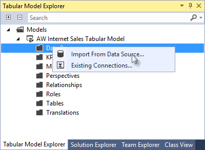

# Lesson 2: Add Data
[!INCLUDE[ssas-appliesto-sql2016-later-aas](../includes/ssas-appliesto-sql2016-later-aas.md)]

In this lesson, you'll use the Table Import Wizard in SSDT to connect to the AdventureWorksDW SQL sample database, select data, preview and filter the data, and then import the data into your model workspace.  
  
By using the Table Import Wizard, you can import data from a variety of relational sources: Access, SQL, Oracle, Sybase, Informix, DB2, Teradata, and more. The steps for importing data from each of these relational sources are very similar to what is described below. Data can also be selected using a stored procedure. To learn more about importing data and the different types of data sources you can import from, see [Data Sources](../analysis-services/tabular-models/data-sources-supported-ssas-tabular.md).  
  
Estimated time to complete this lesson: **20 minutes**  
  
## Prerequisites  
This topic is part of a tabular modeling tutorial, which should be completed in order. Before performing the tasks in this lesson, you should have completed the previous lesson: [Lesson 1: Create a New Tabular Model Project](../analysis-services/lesson-1-create-a-new-tabular-model-project.md).  
  
## Create a connection  
  
#### To create a connection to a the AdventureWorksDW2014 database  
  
1.  In Tabular Model Explorer, right-click **Data Sources** > **Import from Data Source**.  
  
    This launches the Table Import Wizard, which guides you through setting up a connection to a data source. If you don't see Tabular Model Explorer, double click **Model.bim** in **Solution Explorer** to open the model in the designer. 
    
     

    Note: If you're creating your model at the 1400 compatibility level, you'll see the new Get Data experience instead of the Table Import Wizard. The dialogs will appear a little different from the steps below, but you'll still be able to follow along. 
  
2.  In the Table Import Wizard, under **Relational Databases**, click **Microsoft SQL Server** > **Next**.  
  
3.  In the **Connect to a Microsoft SQL Server Database** page, in **Friendly Connection Name**, type **Adventure Works DB from SQL**.  
  
4.  In **Server name**, type the name of the server where you installed the AdventureWorksDW database.  
  
5.  In the **Database name** field, select **AdventureWorksDW**, and then click **Next**.  
  
    
  
6.  In the **Impersonation Information** page, you need to specify the credentials Analysis Services will use to connect to the data source when importing and processing data. Verify **Specific Windows user name and password** is selected, and then in **User Name** and **Password**, enter your Windows logon credentials, and then click **Next**.  
  
    > [!NOTE]  
    > Using a Windows user account and password provides the most secure method of connecting to a data source. For more information, see [Impersonation](../analysis-services/tabular-models/impersonation-ssas-tabular.md).  
  
7.  In the **Choose How to Import the Data** page, verify **Select from a list of tables and views to choose the data to import** is selected. You want to select from a list of tables and views, so click **Next** to display a list of all the source tables in the source database.  
  
8.  In the **Select Tables and Views** page, select the check box for the following tables: **DimCustomer**, **DimDate**, **DimGeography**, **DimProduct**, **DimProductCategory**, **DimProductSubcategory**, and **FactInternetSales**.  
  
    **DO NOT** click **Finish**.  
  
## Filter the table data  
The DimCustomer table that you're importing from the sample database contains a subset of the data from the original SQL Server Adventure Works database. You will filter out some more of the columns from the DimCustomer table that aren't necessary when imported into your model. When possible, you'll want to filter out data that won't be used in order to save in-memory space used by the model.  
  
#### To filter the table data prior to importing  
  
1.  Select the row for the **DimCustomer** table, and then click **Preview & Filter**. The **Preview Selected Table** window opens with all the columns in the DimCustomer source table displayed.  
  
2.  Clear the checkbox at the top of the following columns: **SpanishEducation**, **FrenchEducation**, **SpanishOccupation**, **FrenchOccupation**. 

    
  
    Since the values for these columns are not relevant to Internet sales analysis, there is no need to import these columns. Eliminating unnecessary columns will make your model smaller and more efficient.  
  
3.  Verify that all other columns are checked, and then click **OK**.  
  
    Notice the words **Applied filters** are now displayed in the **Filter Details** column in the **DimCustomer** row; if you click on that link you'll see a text description of the filters you just applied.  
    
    
    
  
4.  Filter the remaining tables by clearing the checkboxes for the following columns in each table:  
    
    **DimDate**
    
      |Column|  
      |--------|  
      |**DateKey**|  
      |**SpanishDayNameOfWeek**|  
      |**FrenchDayNameOfWeek**|  
      |**SpanishMonthName**|  
      |**FrenchMonthName**|  
  
    **DimGeography**
  
      |Column|  
      |-------------|  
      |**SpanishCountryRegionName**|  
      |**FrenchCountryRegionName**|  
      |**IpAddressLocator**|  
  
    **DimProduct**
  
      |Column|  
      |-----------|  
      |**SpanishProductName**|  
      |**FrenchProductName**|  
      |**FrenchDescription**|  
      |**ChineseDescription**|  
      |**ArabicDescription**|  
      |**HebrewDescription**|  
      |**ThaiDescription**|  
      |**GermanDescription**|  
      |**JapaneseDescription**|  
      |**TurkishDescription**|  
  
    **DimProductCategory**
  
      |Column|  
      |--------------------|  
      |**SpanishProductCategoryName**|  
      |**FrenchProductCategoryName**|  
  
    **DimProductSubcategory**
  
      |Column|  
      |-----------------------|  
      |**SpanishProductSubcategoryName**|  
      |**FrenchProductSubcategoryName**|  
  
    **FactInternetSales**
  
      |Column|  
      |------------------|  
      |**OrderDateKey**|  
      |**DueDateKey**|  
      |**ShipDateKey**|   
  
## Import the selected tables and column data  
Now that you've previewed and filtered out unnecessary data, you can import the rest of the data you do want. The wizard imports the table data along with any relationships between tables. New tables and columns are created in the model and data that you filtered out will not be imported.  
  
#### To import the selected tables and column data  
  
1.  Review your selections. If everything looks okay, click **Finish**.  
  
    While importing the data, the wizard displays how many rows have been fetched. When all the data has been imported, a message indicating success is displayed.  
    
     
  
    > [!TIP]  
    > To see the relationships that were automatically created between the imported tables, on the **Data preparation** row, click **Details**. 
  
2.  Click **Close**.  
  
    The wizard closes and the model designer now shows your imported tables. 
  
## Save your model project  
It's important to frequently save your model project.  
  
#### To save the model project  
  
-   Click **File** > **Save All**.  
  
## What's next?
Go to the next lesson: [Lesson 3: Mark as Date Table](../analysis-services/lesson-3-mark-as-date-table.md).

  
  
