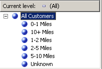

# Lesson 4-5 - Sorting Attribute Members Based on a Secondary Attribute
[!INCLUDE[ssas-appliesto-sqlas](../includes/ssas-appliesto-sqlas.md)]
In Lesson 3, you learned how to sort attribute members based on either their name or key value. You also learned how to use a composite member key to affect attribute members and sort order. For more information, see [Modifying the Date Dimension](../analysis-services/lesson-3-4-modifying-the-date-dimension.md). However, if neither the name nor the key of the attribute provide the sort order that you want, you can use a secondary attribute to achieve the desired sort order. By defining a relationship between the attributes, you can use the second attribute to sort the members of the first attribute.  
  
Attribute relationships define the relationships or dependencies between attributes. In a dimension that is based on a single relational table, all attributes are typically related to each other through the key attribute. This is because all the attributes for a dimension provide information about the members linked by the key attribute of the dimension to the facts in the fact table for each related measure group. In a dimension that is based on multiple tables, attributes are typically linked based on the join key between the tables. If the underlying data supports it, related attributes can be used to specify a sort order. For example, you might create a new attribute that provides the sort logic for a related attribute.  
  
Dimension Designer lets you define additional relationships between attributes or change the default relationships to increase performance. The main constraint when you create an attribute relationship is to make sure that the attribute referred to has no more than one value for any member in the attribute to which it is related. When you define a relationship between two attributes, you can define the relationship as rigid or flexible, based on whether the relationships between members will change over time. For example, an employee might move to a different sales region, but a city will not move to a different state. If a relationship is defined as rigid, attribute aggregations are not recalculated every time the dimension is incrementally processed. However, if the relationship between members does change, the dimension must be fully processed. For more information, see [Attribute Relationships](../analysis-services/multidimensional-models-olap-logical-dimension-objects/attribute-relationships.md), [Define Attribute Relationships](../analysis-services/multidimensional-models/attribute-relationships-define.md), [Configure Attribute Relationship Properties](../analysis-services/multidimensional-models/attribute-relationships-configure-attribute-properties.md), and [Specifying Attribute Relationships Between Attributes in a User-Defined Hierarchy](../analysis-services/lesson-4-6-specifying-attribute-relationships-in-user-defined-hierarchy.md).  
  
In the tasks in this topic, you will define a new attribute in the **Date** dimension based on an existing column in the underlying dimension table. You will use this new attribute to sort calendar month members chronologically instead of alphabetically. You will also define a new attribute in the **Customer** dimension based on the named calculation that you will use to sort the **Commute Distance** attribute members. In the tasks in the next topic, you will learn to use attribute relationships to increase query performance.  
  
## Defining an Attribute Relationship and Sort Order in the Date Dimension  
  
1.  Open Dimension Designer for the **Date** dimension, and then review the **OrderBy** property for the **Month Name** attribute in the Properties window.  
  
    Notice that the **Month Name** attribute members are ordered by their key values.  
  
2.  Switch to the **Browser** tab, verify that **Calendar Date** is selected in the **Hierarchy** list, and then expand the levels in the user-defined hierarchy to review the sort order for the calendar months.  
  
    Notice that the members of the attribute hierarchy are sorted based on the ASCII values of their member keys, which are month and year. In this case, sorting by the attribute name or key does not sort calendar months chronologically. To solve this, you will sort the members of the attribute hierarchy based on a new attribute, the **MonthNumberOfYear** attribute. You will create this attribute based on a column that conveniently exists in the **Date** dimension table.  
  
3.  Switch to the **Dimension Structure** tab for the Date dimension, right-click **MonthNumberOfYear** in the **Data Source View** pane, and then click **New Attribute from Column**.  
  
4.  In the **Attributes** pane, select **Month Number Of Year**, and then set the **AttributeHierarchyEnabled** property to **False** in the Properties window, set the **AttributeHierarchyOptimizedState** property to **NotOptimized**, and set the **AttributeHierarchyOrdered** property to **False**.  
  
    These settings will hide the attribute from users and will improve processing time. This attribute will not be used for browsing. It will only be used for ordering the members of another attribute.  
  
    > [!NOTE]  
    > Sorting properties in the Properties window alphabetically will simplify this task as these three properties will be sorted adjacent to each other.  
  
5.  Click the **Attribute Relationships** tab.  
  
    Notice that all the attributes in the **Date** dimension are related directly to the **Date** attribute, which is the member key that relates the dimension members to the facts in the related measure groups. There is no relationship defined between the **Month Name** attribute and the **Month Number Of Year** attribute.  
  
6.  In the diagram, right-click the **Month Name** attribute and then select **New Attribute Relationship**.  
  
7.  In the **Create Attribute Relationship** dialog box, the **Source Attribute** is **Month Name**. Set the **Related Attribute** to **Month Number Of Year**.  
  
8.  In the **Relationship type** list, set the relationship type to **Rigid**.  
  
    The relationships between the members of the **Month Name** attribute and the **Month Number Of Year** attribute will not change over time. As a result, Analysis Services will not drop aggregations for this relationship during incremental processing. If a change does occur, a processing error will occur during incremental processing and you will need to perform a full process of the dimension. You are now ready to set the sort order for the members of **Month Name**.  
  
9. [!INCLUDE[clickOK](../includes/clickok-md.md)]  
  
10. Click the **Dimension Structure** tab.  
  
11. Select **Month Name** in the **Attributes** pane, and then change the value of the **OrderBy** property in the Properties window to **AttributeKey** and change the value of the **OrderByAttribute** property to **Month Number Of Year**.  
  
12. On the **Build** menu, click **Deploy Analysis Services Tutorial**.  
  
13. When deployment has successfully completed, switch to the **Browser** tab for the Date dimension, click **Reconnect**, and then browse the **Calendar Date** and **Fiscal Date** user hierarchies to verify that months now sort in chronological order.  
  
    Notice that the months are now sorted in chronological order, as shown in the following image.  
  
      
  
## Defining Attribute Relationships and Sort Order in the Customer Dimension  
  
1.  Switch to the **Browser** tab in Dimension Designer for the Customer dimension, and then browse the members of the **Commute Distance** attribute hierarchy.  
  
    Notice that the members of this attribute hierarchy are sorted based on the ASCII values of the member key. In this case, sorting by the attribute name or key does not sort the commute distances from least to most. In this task, you sort the members of the attribute hierarchy based on the **CommuteDistanceSort** named calculation that ascribes the appropriate sort number to each distinct value in the column. To save time, this named calculation has already been added to the **Customer** table in the [!INCLUDE[ssSampleDBCoShort](../includes/sssampledbcoshort-md.md)] DW data source view. You can switch to this data source view to view the SQL script that is used in this named calculation. For more information, see [Define Named Calculations in a Data Source View &#40;Analysis Services&#41;](../analysis-services/multidimensional-models/define-named-calculations-in-a-data-source-view-analysis-services.md).  
  
    The following image shows the members of the **Commute Distance** attribute hierarchy, sorted by the ASCII values of the member key.  
  
      
  
2.  Switch to the **Dimension Structure** tab in Dimension Designer for the Customer dimension, right-click **CommuteDistanceSort** in the **Customer** table in the **Data Source View** pane, and then click **New Attribute from Column**.  
  
3.  In the **Attributes** pane, select **Commute Distance Sort**, and then set the **AttributeHierarchyEnabled** property for this attribute to **False** in the Properties window, set the **AttributeHierarchyOptimizedState** property to **NotOptimized**, and set the **AttributeHierarchyOrdered** property to **False**.  
  
    These settings will hide the attribute from users and will improve processing time. This attribute will not be used for browsing. It will only be used for ordering the members of another attribute.  
  
4.  Select **Geography**, and then set its **AttributeHierarchyVisible** property to **False** in the Properties window, set its **AttributeHierarchyOptimizedState** property to **NotOptimized**, and set its **AttributeHierarchyOrdered** property to **False**.  
  
    These settings will hide the attribute from users and will improve processing time. This attribute will not be used for browsing. It will be only be used for ordering the members of another attribute. Because **Geography** has member properties, its **AttributeHierarchyEnabled** property must be set to **True**. Therefore, to hide the attribute, you set the **AttributeHierarchyVisible** property to **False**.  
  
5.  Click the **Attribute Relationships** tab.  
  
6.  In the attributes list, right-click the **Commute Distance** attribute and then select **New Attribute Relationship**.  
  
7.  In the **Create Attribute Relationship** dialog box, the **Source Attribute** is **Commute Distance**. Set the **Related Attribute** to **Commute Distance Sort**.  
  
8.  In the **Relationship type** list, set the relationship type to **Rigid**.  
  
    The relationship between the members of the **Commute Distance** attribute and the **Commute Distance Sort** attribute will not change over time.  
  
9. [!INCLUDE[clickOK](../includes/clickok-md.md)]  
  
    You are now ready to set the sort order for the **Commute Distance** attribute.  
  
10. Click the **Dimension Structure** tab.  
  
11. In the **Attributes** pane, select **Commute Distance**, and then change the value of the **OrderBy** property in the Properties window to **AttributeKey**, and change the value of the **OrderByAttribute** property to **Commute Distance Sort**.  
  
12. On the **Build** menu, click **Deploy Analysis Services Tutorial**.  
  
13. When deployment has successfully completed, switch to the **Browser** tab of Dimension Designer for the Customer dimension, click **Reconnect**, and then browse the **Commute Distance** attribute hierarchy.  
  
    Notice that the attribute hierarchy members are now sorted in a logical order based on increasing distance, as shown in the following image.  
  
      
  
## Next Task in Lesson  
[Specifying Attribute Relationships Between Attributes in a User-Defined Hierarchy](../analysis-services/lesson-4-6-specifying-attribute-relationships-in-user-defined-hierarchy.md)  
  
  
  
