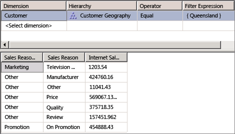

# Lesson 5-3 - Defining a Many-to-Many Relationship
[!INCLUDE[ssas-appliesto-sqlas](../includes/ssas-appliesto-sqlas.md)]

When you define a dimension, typically each fact joins to one and only one dimension member, whereas a single dimension member can be associated with many different facts. For example, each customer can have many orders but each order belongs to a single customer. In relational database terminology, this is referred to as a *one-to-many relationship*. However, sometimes a single fact can join to multiple dimension members. In relational database terminology, this is referred to as a *many-to-many relationship*. For example, a customer may have multiple reasons for making a purchase, and a purchase reason can be associated with multiple purchases. A join table is used to define the sales reasons that relate to each purchase. A Sales Reason dimension constructed from such relationships would then have multiple members that relate to a single sales transaction. Many-to-many dimensions expand the dimensional model beyond the classic star schema and support complex analytics when dimensions are not directly related to a fact table.  
  
In [!INCLUDE[ssASnoversion](../includes/ssasnoversion-md.md)], you define a many-to-many relationship between a dimension and a measure group by specifying an intermediate fact table that is joined to the dimension table. An intermediate fact table is joined, in turn, to an intermediate dimension table to which the fact table is joined. The many-to-many relationships between the intermediate fact table and both the dimension tables in the relationship and the intermediate dimension creates the many-to-many relationships between members of the primary dimension and measures in the measure group that is specified by the relationship. In order to define a many-to-many relationship between a dimension and a measure group through an intermediate measure group, the intermediate measure group must share one or more dimensions with the original measure group.  
  
With a many-to-many dimension, values are distinct summed, which means that they do not aggregate more than once to the All member.  
  
> [!NOTE]  
> In order to support a many-to-many dimension relationship, a primary key-foreign key relationship must be defined in the data source view between all the tables that are involved. Otherwise, you will not be able to select the correct intermediate measure group when you establish the relationship in the **Dimension Usage** tab of Cube Designer.  
  
For more information, see [Dimension Relationships](../analysis-services/multidimensional-models-olap-logical-cube-objects/dimension-relationships.md), and [Define a Many-to-Many Relationship and Many-to-Many Relationship Properties](../analysis-services/multidimensional-models/define-a-many-to-many-relationship-and-many-to-many-relationship-properties.md).  
  
In the tasks in this topic, you define the Sales Reasons dimension and the Sales Reasons measure group, and you define a many-to-many relationship between the Sales Reasons dimension and the Internet Sales measure group through the Sales Reasons measure group.  
  
## Adding Required Tables to the Data Source View  
  
1.  Open Data Source View Designer for the **Adventure Works DW 2012** data source view.  
  
2.  Right-click anywhere in the **Diagram Organizer** pane, click **New Diagram**, and specify **Internet Sales Order Reasons** as the name for this new diagram.  
  
3.  Drag the **InternetSales** table to the **Diagram** pane from the **Tables** pane.  
  
4.  Right-click anywhere in the **Diagram** pane, and then click **Add/Remove Tables**.  
  
5.  In the **Add/Remove Tables** dialog box, add the **DimSalesReason** table and the **FactInternetSalesReason** table to the **Included objects** list, and then click **OK**.  
  
    Notice that the primary key-foreign key relationships between the tables that are involved are established automatically because those relationships are defined in the underlying relational database. If these relationships were not defined in the underlying relational database, you would have to define them in the data source view.  
  
6.  On the **Format** menu, point to **Auto Layout**, and then click **Diagram**.  
  
7.  In the Properties window, change the **FriendlyName** property of the **DimSalesReason** table to **SalesReason**, and then change the **FriendlyName** property of the **FactInternetSalesReason** table to **InternetSalesReason**.  
  
8.  In the **Tables** pane, expand **InternetSalesReason (dbo.FactInternetSalesReason)**, click **SalesOrderNumber**, and then review the **DataType** property for this data column in the Properties window.  
  
    Notice that the data type for the **SalesOrderNumber** column is a string data type.  
  
9. Review the data types for the other columns in the **InternetSalesReason** table.  
  
    Notice that the data types for the other two columns in this table are numeric data types.  
  
10. In the **Tables** pane, right-click **InternetSalesReason (dbo.FactInternetSalesReason)**, and then click **Explore Data**.  
  
    Notice that, for each line number within each order, a key value identifies the sales reason for the purchase of that line item, as shown in the following image.  
  
      
  
## Defining the Intermediate Measure Group  
  
1.  Switch to Cube Designer for the [!INCLUDE[ssASnoversion](../includes/ssasnoversion-md.md)] Tutorial cube, and then click the **Cube Structure** tab.  
  
2.  Right-click anywhere in the **Measures** pane, and then click **New Measure Group**. For more information, see [Create Measures and Measure Groups in Multidimensional Models](../analysis-services/multidimensional-models/create-measures-and-measure-groups-in-multidimensional-models.md).  
  
3.  In the **New Measure Group** dialog box, select **InternetSalesReason** in the **Select a table from the data source view** list, and then click **OK**.  
  
    Notice that the **Internet Sales Reason** measure group now appears in the **Measures** pane.  
  
4.  Expand the **Internet Sales Reason** measure group.  
  
    Notice that only a single measure is defined for this new measure group, the **Internet Sales Reason Count** measure.  
  
5.  Select **Internet Sales Reason Count** and review the properties of this measure in the Properties window.  
  
    Notice that the **AggregateFunction** property for this measure is defined as **Count** instead of **Sum**. [!INCLUDE[ssASnoversion](../includes/ssasnoversion-md.md)] chose **Count** because the underlying data type is a string data type. The other two columns in the underlying fact table were not selected as measures because [!INCLUDE[ssASnoversion](../includes/ssasnoversion-md.md)] detected them as numeric keys instead of as actual measures. For more information, see [Define Semiadditive Behavior](../analysis-services/multidimensional-models/define-semiadditive-behavior.md).  
  
6.  In the Properties window, change the **Visible** property of the **Internet Sales Reason Count** measure to **False**.  
  
    This measure will only be used to join the Sales Reason dimension that you will define next to the Internet Sales measure group. Users will not browse this measure directly.  
  
    The following image shows the properties for the **Internet Sales Reason Count** measure.  
  
      
  
## Defining the Many-to-Many Dimension  
  
1.  In Solution Explorer, right-click **Dimensions**, and then click **New Dimension**.  
  
2.  On the **Welcome to the Dimension Wizard** page, click **Next**.  
  
3.  On the **Select Creation Method** page, verify that the **Use an existing table** option is selected, and then click **Next**.  
  
4.  On the **Specify Source Information** page, verify that the [!INCLUDE[ssSampleDBCoShort](../includes/sssampledbcoshort-md.md)] DW 2012 data source view is selected.  
  
5.  In the **Main table** list, select **SalesReason**.  
  
6.  In the **Key columns** list, verify that **SalesReasonKey** is listed.  
  
7.  In the **Name column** list, select **SalesReasonName**.  
  
8.  Click **Next**.  
  
9. On the **Select Dimension Attributes** page, the **Sales Reason Key** attribute is automatically selected because it is the key attribute. Select the check box beside the **Sales Reason Reason Type** attribute, change its name to **Sales Reason Type**, and then click **Next**.  
  
10. On the **Completing the Wizard** page, click **Finish** to create the Sales Reason dimension.  
  
11. On the **File** menu, click **Save All**.  
  
12. In the **Attributes** pane of the Dimension Designer for the **Sales Reason** dimension, select **Sales Reason Key**, and then change the **Name** property in the Properties window to **Sales Reason.**  
  
13. In the **Hierarchies** pane of the Dimension Designer, create a **Sales Reasons** user hierarchy that contains the **Sales Reason Type** level and the **Sales Reason** level, in that order.  
  
14. In the Properties window, define **All Sales Reasons** as the value for the **AllMemberName** property of the Sales Reasons hierarchy.  
  
15. Define **All Sales Reasons** as the value for **AttributeAllMemberName** property of the Sales Reason dimension.  
  
16. To add the newly created dimension to the [!INCLUDE[ssASnoversion](../includes/ssasnoversion-md.md)] Tutorial cube as a cube dimension, switch to **Cube Designer**. On the **Cube Structure** tab, right-click in the **Dimensions** pane and select **Add Cube Dimension**.  
  
17. In the **Add Cube Dimension** dialog box, select **Sales Reason** and then click **OK**.  
  
18. On the **File** menu, click **Save All**.  
  
## Defining the Many to Many Relationship  
  
1.  Switch to Cube Designer for the [!INCLUDE[ssASnoversion](../includes/ssasnoversion-md.md)] Tutorial cube, and then click the **Dimension Usage** tab.  
  
    Notice that the **Sales Reason** dimension has a regular relationship defined with the **Internet Sales Reason** measure group, but has no relationship defined with the **Internet Sales** or **Reseller Sales** measure groups. Notice also that the **Internet Sales Order Details** dimension has a regular relationship defined with the **Internet Sales Reason** dimension, which in turn has a **Fact Relationship** with the **Internet Sales** measure group. If this dimension was not present (or another dimension with a relationship with both the **Internet Sales Reason** and the **Internet Sales** measure group were not present), you would not be able to define the many-to-many relationship.  
  
2.  Click the cell at the intersection of the **Internet Sales** measure group and the **Sales Reason** dimension and then click the browse button (**...**).  
  
3.  In the **Define Relationship** dialog box, select **Many-to-Many** in the **Select relationship type** list.  
  
    You have to define the intermediate measure group that connects the Sales Reason dimension to the Internet Sales measure group.  
  
4.  In the **Intermediate measure group** list, select **Internet Sales Reason**.  
  
    The following image shows the changes in the **Define Relationship** dialog box.  
  
      
  
5.  Click **OK**.  
  
    Notice the many-to-many icon that represents the relationship between the Sales Reason dimension and the Internet Sales measure group.  
  
## Browsing the Cube and the Many-to-Many Dimension  
  
1.  On the **Build** menu, click **Deploy Analysis Services Tutorial**.  
  
2.  When deployment has successfully completed, switch to the **Browser** tab in Cube Designer for the [!INCLUDE[ssASnoversion](../includes/ssasnoversion-md.md)] Tutorial cube, and then click **Reconnect**.  
  
3.  Add the **Internet Sales-Sales Amount** measure to the data area of the data pane.  
  
4.  Add the **Sales Reasons** user-defined hierarchy from the **Sales Reason** dimension to the row area of the data pane.  
  
5.  In the metadata pane, expand **Customer**, expand **Location**, expand **Customer Geography**, expand **Members**, expand **All Customers**, expand **Australia**, right-click **Queensland**, and then click **Add to Filter**.  
  
6.  Expand each member of the **Sales Reason Type** level to review the dollar values that are associated with each reason a customer in Queensland gave for their purchase of an [!INCLUDE[ssSampleDBCoShort](../includes/sssampledbcoshort-md.md)] product over the Internet.  
  
    Notice that the totals that are associated with each sales reason add up to more than the total sales. This is because some customers cited multiple reasons for their purchase.  
  
    The following image shows the **Filter** pane and **Data** pane of Cube Designer.  
  
      
  
## Next Task in Lesson  
[Defining Dimension Granularity within a Measure Group](../analysis-services/lesson-5-4-defining-dimension-granularity-within-a-measure-group.md)  
  
## See Also  
[Work with Diagrams in Data Source View Designer &#40;Analysis Services&#41;](../analysis-services/multidimensional-models/work-with-diagrams-in-data-source-view-designer-analysis-services.md)  
[Dimension Relationships](../analysis-services/multidimensional-models-olap-logical-cube-objects/dimension-relationships.md)  
[Define a Many-to-Many Relationship and Many-to-Many Relationship Properties](../analysis-services/multidimensional-models/define-a-many-to-many-relationship-and-many-to-many-relationship-properties.md)  
  
  
  
