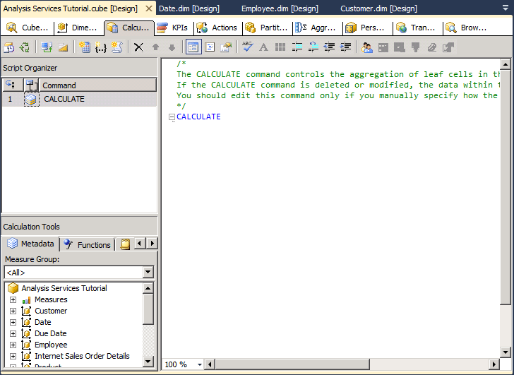

# Lesson 6-1 - Defining Calculated Members
[!INCLUDE[ssas-appliesto-sqlas](../includes/ssas-appliesto-sqlas.md)]

Calculated members are members of a dimension or a measure group that are defined based on a combination of cube data, arithmetic operators, numbers, and functions. For example, you can create a calculated member that calculates the sum of two physical measures in the cube. Calculated member definitions are stored in cubes, but their values are calculated at query time.  
  
To create a calculated member, use the **New Calculated Member** command on the **Calculations** tab of Cube Designer. You can create a calculated member within any dimension, including the measures dimension. You can also place a calculated member within a display folder in the **Calculation Properties** dialog box. For more information, see [Calculations](../analysis-services/multidimensional-models-olap-logical-cube-objects/calculations.md), [Calculations in Multidimensional Models](../analysis-services/multidimensional-models/calculations-in-multidimensional-models.md), and [Create Calculated Members](../analysis-services/multidimensional-models/create-calculated-members.md).  
  
In the tasks in this topic, you define calculated measures to let users view the gross profit margin percentage and sales ratios for Internet sales, reseller sales, and for all sales.  
  
## Defining Calculations to Aggregate Physical Measures  
  
1.  Open Cube Designer for the [!INCLUDE[ssASnoversion](../includes/ssasnoversion-md.md)] Tutorial cube, and then click the **Calculations** tab.  
  
    Notice the default CALCULATE command in the **Calculation Expressions** pane and in the **Script Organizer** pane. This command specifies that the measures in the cube should be aggregated according to the value that is specified by their AggregateFunction properties. Measure values are generally summed, but may also be counted or aggregated in some other manner.  
  
    The following image shows the **Calculations** tab of Cube Designer.  
  
      
  
2.  On the toolbar of the **Calculations** tab, click **New Calculated Member**.  
  
    A new form appears in the **Calculation Expressions** pane within which you define the properties of this new calculated member. The new member also appears in the **Script Organizer** pane.  
  
    The following image shows the form that appears in the **Calculation Expressions** pane when you click **New Calculated Member**.  
  
      
  
3.  In the **Name** box, change the name of the calculated measure to **[Total Sales Amount]**.  
  
    If the name of a calculated member contains a space, the calculated member name must be enclosed in square brackets.  
  
    Notice in the **Parent hierarchy** list that, by default, a new calculated member is created in the **Measures** dimension. A calculated member in the Measures dimension is also frequently called a calculated measure.  
  
4.  On the **Metadata** tab in the **Calculation Tools** pane of the **Calculations** tab, expand **Measures** and then expand **Internet Sales** to view the metadata for the **Internet Sales** measure group.  
  
    You can drag metadata elements from the **Calculation Tools** pane into the **Expression** box and then add operators and other elements to create Multidimensional Expressions (MDX) expressions. Alternatively, you can type the MDX expression directly into the **Expression** box.  
  
    > [!NOTE]  
    > If you cannot view any metadata in the **Calculation Tools** pane, click **Reconnect** on the toolbar. If this does not work, you may have to process the cube or start the instance of [!INCLUDE[ssASnoversion](../includes/ssasnoversion-md.md)].  
  
5.  Drag **Internet Sales-Sales Amount** from the **Metadata** tab in the **Calculation Tools** pane into the **Expression** box in the **Calculation Expressions** pane.  
  
6.  In the **Expression** box, type a plus sign (**+**) after **[Measures].[Internet Sales-Sales Amount]**.  
  
7.  On the **Metadata** tab in the **Calculation Tools** pane, expand **Reseller Sales**, and then drag **Reseller Sales-Sales Amount** into the **Expression** box in the **Calculation Expressions** pane after the plus sign (+).  
  
8.  In the **Format string** list, select **"Currency".**  
  
9. In the **Non-empty behavior** list, select the check boxes for **Internet Sales-Sales Amount** and **Reseller Sales-Sales Amount**, and then click **OK**.  
  
    The measures you specify in the **Non-empty behavior** list are used to resolve NON EMPTY queries in MDX. When you specify one or more measures in the **Non-empty behavior** list, [!INCLUDE[ssASnoversion](../includes/ssasnoversion-md.md)] treats the calculated member as empty if all the specified measures are empty. If the **Non-empty behavior** property is blank, [!INCLUDE[ssASnoversion](../includes/ssasnoversion-md.md)] must evaluate the calculated member itself to determine whether the member is empty.  
  
    The following image shows the **Calculation Expressions** pane populated with the settings that you specified in the previous steps.  
  
      
  
10. On the toolbar of the **Calculations** tab, click **Script View**, and then review the calculation script in the **Calculation Expressions** pane.  
  
    Notice that the new calculation is added to the initial CALCULATE expression; each individual calculation is separated by a semicolon. Notice also that a comment appears at the beginning of the calculation script. Adding comments within the calculation script for groups of calculations is a good practice, to help you and other developers understand complex calculation scripts.  
  
11. Add a new line in the calculation script after the **Calculate;** command and before the newly added calculation script, and then add the following text to the script on its own line:  
  
    ```  
    /* Calculations to aggregate Internet Sales and Reseller Sales measures */  
    ```  
  
    The following image shows the calculation scripts as they should appear in the **Calculation Expressions** pane at this point in the tutorial.  
  
      
  
12. On the toolbar of the **Calculations** tab, click **Form View**, verify that **[Total Sales Amount]** is selected in the **Script Organizer** pane, and then click **New Calculated Member**.  
  
13. Change the name of this new calculated member to **[Total Product Cost]**, and then create the following expression in the **Expression** box:  
  
    ```  
    [Measures].[Internet Sales-Total Product Cost] + [Measures].[Reseller Sales-Total Product Cost]  
    ```  
  
14. In the **Format string** list, select **"Currency"**.  
  
15. In the **Non-empty behavior** list, select the check boxes for **Internet Sales-Total Product Cost** and **Reseller Sales-Total Product Cost**, and then click **OK**.  
  
    You have now defined two calculated members, both of which are visible in the **Script Organizer** pane. These calculated members can be used by other calculations that you define later in the calculation script. You can view the definition of any calculated member by selecting the calculated member in the **Script Organizer** pane; the definition of the calculated member will appear in the **Calculation Expressions** pane in the Form view. Newly defined calculated members will not appear in the **Calculation Tools** pane until these objects have been deployed. Calculations do not require processing.  
  
## Defining Gross Profit Margin Calculations  
  
1.  Verify that **[Total Product Cost]** is selected in the **Script Organizer** pane, and then click **New Calculated Member** on the toolbar of the **Calculations** tab.  
  
2.  In the **Name** box, change the name of this new calculated measure to **[Internet GPM]**.  
  
3.  In the **Expression** box, create the following MDX expression:  
  
    ```  
    ([Measures].[Internet Sales-Sales Amount] -   
    [Measures].[Internet Sales-Total Product Cost]) /  
    [Measures].[Internet Sales-Sales Amount]  
    ```  
  
4.  In the **Format string** list, select **"Percent"**.  
  
5.  In the **Non-empty behavior** list, select the check box for **Internet Sales-Sales Amount**, and then click **OK**.  
  
6.  On the toolbar of the **Calculations** tab, click **New Calculated Member**.  
  
7.  In the **Name** box, change the name of this new calculated measure to **[Reseller GPM]**.  
  
8.  In the **Expression** box, create the following MDX expression:  
  
    ```  
    ([Measures].[Reseller Sales-Sales Amount] -   
    [Measures].[Reseller Sales-Total Product Cost]) /  
    [Measures].[Reseller Sales-Sales Amount]  
    ```  
  
9. In the **Format string** list, select **"Percent"**.  
  
10. In the **Non-empty behavior** list, select the check box for **Reseller Sales-Sales Amount**, and then click **OK**.  
  
11. On the toolbar of the **Calculations** tab, click **New Calculated Member**.  
  
12. In the **Name** box, change the name of this calculated measure to **[Total GPM]**.  
  
13. In the **Expression** box, create the following MDX expression:  
  
    ```  
    ([Measures].[Total Sales Amount] -   
    [Measures].[Total Product Cost]) /  
    [Measures].[Total Sales Amount]  
    ```  
  
    Notice that this calculated member is referencing other calculated members. Because this calculated member will be calculated after the calculated members that it references, this is a valid calculated member.  
  
14. In the **Format string** list, select **"Percent"**.  
  
15. In the **Non-empty behavior** list, select the check boxes for **Internet Sales-Sales Amount** and **Reseller Sales-Sales Amount**, and then click **OK**.  
  
16. On the toolbar of the **Calculations** tab, click **Script View** and review the three calculations you just added to the calculation script.  
  
17. Add a new line in the calculation script immediately before the **[Internet GPM]** calculation, and then add the following text to the script on its own line:  
  
    ```  
    /* Calculations to calculate gross profit margin */  
    ```  
  
    The following image shows the **Expressions** pane with the three new calculations.  
  
      
  
## Defining the Percent of Total Calculations  
  
1.  On the toolbar of the **Calculations** tab, click **Form View**.  
  
2.  In the **Script Organizer** pane, select **[Total GPM]**, and then click **New Calculated Member** on the toolbar of the **Calculations** tab.  
  
    Clicking the final calculated member in the **Script Organizer** pane before you click **New Calculated Member** guarantees that the new calculated member will be entered at the end of the script. Scripts execute in the order that they appear in the **Script Organizer** pane.  
  
3.  Change the name of this new calculated member to **[Internet Sales Ratio to All Products]**.  
  
4.  Type the following expression in the **Expression** box:  
  
    ```  
    Case  
        When IsEmpty( [Measures].[Internet Sales-Sales Amount] )   
        Then 0  
        Else ( [Product].[Product Categories].CurrentMember,  
               [Measures].[Internet Sales-Sales Amount]) /  
             ( [Product].[Product Categories].[(All)].[All],   
               [Measures].[Internet Sales-Sales Amount] )  
        End  
    ```  
  
    This MDX expression calculates the contribution to total Internet sales of each product. The Case statement together with the IS EMPTY function ensures that a divide by zero error does not occur when a product has no sales.  
  
5.  In the **Format string** list, select **"Percent"**.  
  
6.  In the **Non-empty behavior** list, select the check box for **Internet Sales-Sales Amount**, and then click **OK**.  
  
7.  On the toolbar of the **Calculations** tab, click **New Calculated Member**.  
  
8.  Change the name of this calculated member to **[Reseller Sales Ratio to All Products]**.  
  
9. Type the following expression in the **Expression** box:  
  
    ```  
    Case  
        When IsEmpty( [Measures].[Reseller Sales-Sales Amount] )   
        Then 0  
        Else ( [Product].[Product Categories].CurrentMember,  
               [Measures].[Reseller Sales-Sales Amount]) /  
             ( [Product].[Product Categories].[(All)].[All],   
               [Measures].[Reseller Sales-Sales Amount] )  
        End  
    ```  
  
10. In the **Format string** list, select **"Percent"**.  
  
11. In the **Non-empty behavior** list, select the check box for **Reseller Sales-Sales Amount**, and then click **OK**.  
  
12. On the toolbar of the **Calculations** tab, click **New Calculated Member**.  
  
13. Change the name of this calculated member to **[Total Sales Ratio to All Products]**.  
  
14. Type the following expression in the **Expression** box:  
  
    ```  
    Case  
        When IsEmpty( [Measures].[Total Sales Amount] )   
        Then 0  
        Else ( [Product].[Product Categories].CurrentMember,  
               [Measures].[Total Sales Amount]) /  
             ( [Product].[Product Categories].[(All)].[All],   
               [Measures].[Total Sales Amount] )  
        End  
    ```  
  
15. In the **Format string** list, select **"Percent"**.  
  
16. In the **Non-empty behavior** list, select the check boxes for **Internet Sales-Sales Amount** and **Reseller Sales-Sales Amount**, and then click **OK**.  
  
17. On the toolbar of the **Calculations** tab, click **Script View**, and then review the three calculations that you just added to the calculation script.  
  
18. Add a new line in the calculation script immediately before the **[Internet Sales Ratio to All Products]** calculation, and then add the following text to the script on its own line:  
  
    ```  
    /* Calculations to calculate percentage of product to total product sales */  
    ```  
  
    You have now defined a total of eight calculated members, which are visible in the **Script Organizer** pane when you are in Form view.  
  
## Browsing the New Calculated Members  
  
1.  On the **Build** menu of [!INCLUDE[ssBIDevStudioFull](../includes/ssbidevstudiofull-md.md)], click **Deploy Analysis Services Tutorial**.  
  
2.  When deployment has successfully completed, switch to the **Browser** tab, click **Reconnect**.  
  
3.  Click the Excel icon, and then click **Enable**.  
  
4.  In the **PivotTable Field List** pane, expand **Values** folder to view the new calculated members in the Measures dimension.  
  
5.  Drag the **Total Sales Amount** to the Values area, and then review the results.  
  
    Drag **Internet Sales-Sales Amount** and **Reseller Sales-Sales Amount** measures from the **Internet Sales** and **Reseller Sales** measure groups to the Values area.  
  
    Notice that the **Total Sales Amount** measure is the sum of the **Internet Sales-Sales Amount** measure and the **Reseller Sales-Sales Amount** measure.  
  
6.  Add the **Product Categories** user-defined hierarchy to the filter area of the **Report Filter** area, and then filter the data by **Mountain Bikes**.  
  
    Notice that the **Total Sales Amount** measure is calculated for the **Mountain Bikes** category of product sales based on the **Internet Sales-Sales Amount** and the **Reseller Sales-Sales Amount** measures for **Mountain Bikes**.  
  
7.  Add the **Date.Calendar Date** user-defined hierarchy to the Row labels area, and then review the results.  
  
    Notice that the **Total Sales Amount** measure for each calendar year is calculated for the **Mountain Bikes** category of product sales based on the **Internet Sales-Sales Amount** and the **Reseller Sales-Sales Amount** measures for **Mountain Bikes**.  
  
8.  Add the **Total GPM**, **Internet GPM**, and **Reseller GPM** measures to the Values area, and then review the results.  
  
    Notice that the gross profit margin for reseller sales is significantly lower than for sales over the Internet, as shown in the following image.  
  
      
  
9. Add the **Total Sales Ratio to All Products**, **Internet Sales Ratio to All Products**, and **Reseller Sales Ratio to All Products** measures to the Values area.  
  
    Notice that the ratio of the sales of mountain bikes to all products has increased over time for Internet sales, but is decreasing over time for reseller sales. Notice also that the ratio of the sale of mountain bikes to all products is lower from sales through resellers than it is for sales over the Internet.  
  
10. Change the filter from **Mountain Bikes** to **Bikes**, and review the results.  
  
    Notice that the gross profit margin for all bikes sold through resellers is negative, because touring bikes and road bikes are being sold at a loss.  
  
11. Change the filter to **Accessories**, and then review the results.  
  
    Notice that the sale of accessories is increasing over time, but that these sales make up only a small fraction of total sales. Notice also that the gross profit margin for sales of accessories is higher than for bikes.  
  
## Next Task in Lesson  
[Defining Named Sets](../analysis-services/lesson-6-2-defining-named-sets.md)  
  
## See Also  
[Calculations](../analysis-services/multidimensional-models-olap-logical-cube-objects/calculations.md)  
[Calculations in Multidimensional Models](../analysis-services/multidimensional-models/calculations-in-multidimensional-models.md)  
[Create Calculated Members](../analysis-services/multidimensional-models/create-calculated-members.md)  
  
  
  
