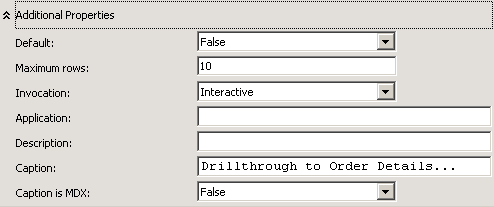
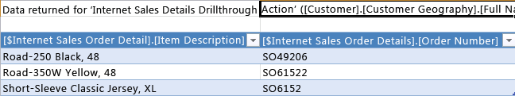

# Lesson 8-1 - Defining and Using a Drillthrough Action
[!INCLUDE[ssas-appliesto-sqlas](../includes/ssas-appliesto-sqlas.md)]

Dimensioning fact data by a fact dimension without correctly filtering the data that the query returns can cause slow query performance. To avoid this, you can define a drillthrough action that restricts the total number of rows that are returned. This will significantly improve query performance.  
  
In the tasks in this topic, you define a drillthrough action to return order detail information for sales to customers over the Internet.  
  
## Defining the Drillthrough Action Properties  
  
1.  In Cube Designer for the [!INCLUDE[ssASnoversion](../includes/ssasnoversion-md.md)] Tutorial cube, click the **Actions** tab.  
  
    The **Actions** tab includes several panes. On the left side of the tab are the **Action Organizer** pane and the **Calculation Tools** pane. The pane to the right of these two panes is the **Display** pane, which contains the details of the action that is selected in the **Action Organizer** pane.  
  
    The following image shows the **Actions** tab of Cube Designer.  
  
      
  
2.  On the toolbar of the **Actions** tab, click the **New Drillthrough Action** button.  
  
    A blank action template appears in the display pane.  
  
      
  
3.  In the **Name** box, change the name of this action to **Internet Sales Details Drillthrough Action**.  
  
4.  In the **Measure group members** list, select **Internet Sales**.  
  
5.  In the **Drillthrough Columns** box, select **Internet Sales Order Details** in the **Dimensions** list.  
  
6.  In the **Return Columns** list, select the **Item Description** and the **Order Number** check boxes, and then click **OK**. The following image shows the Action template as it should appear at this point in this procedure.  
  
      
  
7.  Expand the **Additional Properties** box, as shown in the following image.  
  
      
  
8.  In the **Maximum Rows** box, type **10**.  
  
9. In the **Caption** box, type **Drillthrough to Order Details...**.  
  
    These settings limit the number of rows returned and specify the caption that appears in the client application menu. The following image shows these settings in the **AdditionalProperties** box.  
  
      
  
## Using the Drillthrough Action  
  
1.  On the **Build** menu, click **Deploy Analysis Services Tutorial**.  
  
2.  When deployment has successfully completed, click the **Browser** tab in Cube Designer for the [!INCLUDE[ssASnoversion](../includes/ssasnoversion-md.md)] Tutorial cube, and then click the **Reconnect** button.  
  
3.  Start Excel.  
  
4.  Add the **Internet Sales-Sales Amount** measure to the Values area.  
  
5.  Add the **Customer Geography** user-defined hierarchy from the **Location** folder in the **Customer** dimension to the **Report Filter** area.  
  
6.  On the PivotTable, in **Customer Geography**, add a filter that selects a single customer. Expand **All Customers**, expand **Australia**, expand **Queensland**, expand **Brisbane**, expand **4000**, select the check box for **Adam Powell**, and then click **OK**.  
  
    The total sales of products by [!INCLUDE[ssSampleDBCoFull](../includes/sssampledbcofull-md.md)] to Adam Powell are displayed in the data area.  
  
7.  Right-click on the sales amount, point to **Additional Actions**, and then click **Drillthrough to Order Details**.  
  
    The details of the orders that were shipped to Adam Powell are displayed in the **Data Sample Viewer**, as shown in the following image. However, some additional details would also be useful, such as the order date, due date, and ship date. In the next procedure, you will add these additional details.  
  
      
  
8.  Close Excel/  
  
## Modifying the Drillthrough Action  
  
1.  Open Dimension Designer for the **Internet Sales Order Details** dimension.  
  
    Notice that only three attributes have been defined for this dimension.  
  
2.  In the **Data Source View** pane, right-click an open area, and then click **Show All Tables**.  
  
3.  On the **Format** menu, point to **Autolayout** and then click **Diagram**.  
  
4.  Locate the **InternetSales (dbo.FactInternetSales)** table by right-clicking in an open area of the **Data Source View** pane. Then click **Find Table,** click **InternetSales,** and click **OK**.  
  
5.  Create new attributes based on the following columns:  
  
    -   OrderDateKey  
  
    -   DueDateKey  
  
    -   ShipDateKey  
  
6.  Change the **Name** property for the **Order Date Key** attribute to **Order Date** Then, click the browse button for the **Name Column** property, and in the **Name Column** dialog box, select **Date** as the source table and select SimpleDate as the source column. [!INCLUDE[clickOK](../includes/clickok-md.md)]  
  
7.  Change the **Name** property for the **Due Date Key** attribute to **Due Date**, and then, by using the same method as the **Order Date Key** attribute, change the **Name Column** property for this attribute to **Date.SimpleDate (WChar)**.  
  
8.  Change the **Name** property for the **Ship Date Key** attribute to **Ship Date**, and then change the **Name Column** property for this attribute to **Date.SimpleDate (WChar)**.  
  
9. Switch to the **Actions** tab of Cube Designer for the [!INCLUDE[ssASnoversion](../includes/ssasnoversion-md.md)] Tutorial cube.  
  
10. In the **Drillthrough Columns** box, select the check boxes to add the following columns to the **Return Columns** list, and then click **OK**:  
  
    -   Order Date  
  
    -   Due Date  
  
    -   Ship Date  
  
    The following image shows these columns selected.  
  
      
  
## Reviewing the Modified Drillthrough Action  
  
1.  On the **Build** menu, click **Deploy Analysis Services Tutorial**.  
  
2.  When deployment has successfully completed, switch to the **Browser** tab in Cube Designer for the [!INCLUDE[ssASnoversion](../includes/ssasnoversion-md.md)] Tutorial cube, and then click the **Reconnect** button.  
  
3.  Start Excel.  
  
4.  Recreate the PivotTable using **Internet Sales-Sales Amount** in the Values area and **Customer Geography** in the Report Filter.  
  
    Add a filter that selects from **All Customers**, **Australia**, **Queensland**, **Brisbane**, **4000**, **Adam Powell**.  
  
5.  Click the **Internet Sales-Sales Amount** data cell, point to **Additional Actions**, and then click **Drillthrough to Order Details**.  
  
    The details of these orders shipped to Adam Powell are displayed in a temporary worksheet. This includes item description, order number, order date, due date, and ship date information, as shown in the following image.  
  
      
  
## Next Lesson  
[Lesson 9: Defining Perspectives and Translations](../analysis-services/lesson-9-defining-perspectives-and-translations.md)  
  
## See Also  
[Actions &#40;Analysis Services - Multidimensional Data&#41;](../analysis-services/multidimensional-models/actions-analysis-services-multidimensional-data.md)  
[Actions in Multidimensional Models](../analysis-services/multidimensional-models/actions-in-multidimensional-models.md)  
[Dimension Relationships](../analysis-services/multidimensional-models-olap-logical-cube-objects/dimension-relationships.md)  
[Defining a Fact Relationship](../analysis-services/lesson-5-2-defining-a-fact-relationship.md)  
[Define a Fact Relationship and Fact Relationship Properties](../analysis-services/multidimensional-models/define-a-fact-relationship-and-fact-relationship-properties.md)  
  
  
  
