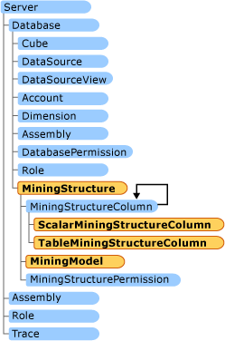

# AMO Data Mining Classes
  Data mining classes help you create, modify, delete, and process data mining objects. Working with data mining objects includes creating data mining structures, creating data mining models, and processing the models.  
  
 For more information about how to set up the environment, and about <xref:Microsoft.AnalysisServices.Server>, <xref:Microsoft.AnalysisServices.Database>, <xref:Microsoft.AnalysisServices.DataSource>, and <xref:Microsoft.AnalysisServices.DataSourceView> objects, see [AMO Fundamental Classes](../../../analysis-services/multidimensional-models/analysis-management-objects/amo-fundamental-classes.md).  
  
 Defining objects in Analysis Management Objects (AMO) requires setting a number of properties on each object to set up the correct context. Complex objects, such as OLAP and data mining objects, require lengthy and detailed coding.  
  
 This topic contains the following sections:  
  
-   [MiningStructure Objects](#MiningStructure)  
  
-   [MiningModel Objects](#MiningModel)  
  
 The following illustration shows the relationship of the classes that are explained in this topic.  
  
   
  
##   MiningStructure Objects  
 A mining structure is the container for mining models. The structure defines all possible columns that the mining models may use. Each mining model defines its own columns from the set of defined columns in the structure.  
  
 A simple <xref:Microsoft.AnalysisServices.MiningStructure> object is composed of: basic information, a data source view, one or more <xref:Microsoft.AnalysisServices.ScalarMiningStructureColumn>, zero or more <xref:Microsoft.AnalysisServices.TableMiningStructureColumn>, and a <xref:Microsoft.AnalysisServices.MiningModelCollection>.  
  
 Basic information includes the name and ID (internal identifier) of the <xref:Microsoft.AnalysisServices.MiningStructure> object.  
  
 The <xref:Microsoft.AnalysisServices.DataSourceView> object holds the underlying data model for the mining structure.  
  
 <xref:Microsoft.AnalysisServices.ScalarMiningStructureColumn> are columns or attributes that have single values.  
  
 <xref:Microsoft.AnalysisServices.TableMiningStructureColumn> are columns or attributes that have multiple values for each case.  
  
 <xref:Microsoft.AnalysisServices.MiningModelCollection> contains all mining models built on the same data.  
  
 A <xref:Microsoft.AnalysisServices.MiningStructure> object is created by adding it to the <xref:Microsoft.AnalysisServices.MiningStructureCollection> of the database and updating the <xref:Microsoft.AnalysisServices.MiningStructure> object to the server, by using the Update method.  
  
 To remove a <xref:Microsoft.AnalysisServices.MiningStructure> object, it must be dropped by using the Drop method of the <xref:Microsoft.AnalysisServices.MiningStructure> object. Removing a <xref:Microsoft.AnalysisServices.MiningStructure> object from the collection does not affect the server.  
  
 The <xref:Microsoft.AnalysisServices.MiningStructure> can be processed using its own process method, or it can be processed when a parent object processes itself with its own process method.  
  
### Columns  
 Columns hold the data for the model and can be of different types depending on the usage: Key, Input, Predictable, or InputPredictable. Predictable columns are the target of building the mining model.  
  
 Single-value columns are known as <xref:Microsoft.AnalysisServices.ScalarMiningStructureColumn> in AMO. Multiple-value columns are known as <xref:Microsoft.AnalysisServices.TableMiningStructureColumn>.  
  
#### ScalarMiningStructureColumn  
 A simple <xref:Microsoft.AnalysisServices.ScalarMiningStructureColumn> object is composed of basic information, Type, Content, and data binding.  
  
 Basic information includes the name and ID (internal identifier) of the <xref:Microsoft.AnalysisServices.ScalarMiningStructureColumn>.  
  
 Type is the data type of the value: LONG, BOOLEAN, TEXT, DOUBLE, DATE.  
  
 Content tells the engine how the column can be modeled. Values can be: Discrete, Continuous, Discretized, Ordered, Cyclical, Probability, Variance, StdDev, ProbabilityVariance, ProbabilityStdDev, Support, Key.  
  
 Data binding is linking the data mining column with the underlying data model by using a data source view element.  
  
 A <xref:Microsoft.AnalysisServices.ScalarMiningStructureColumn> is created by adding it to the parent <xref:Microsoft.AnalysisServices.MiningStructureCollection>, and updating the parent <xref:Microsoft.AnalysisServices.MiningStructure> object to the server by using the Update method.  
  
 To remove a <xref:Microsoft.AnalysisServices.ScalarMiningStructureColumn>, it must be removed from the collection of the parent <xref:Microsoft.AnalysisServices.MiningStructure>, and the parent <xref:Microsoft.AnalysisServices.MiningStructure> object must be updated to the server by using the Update method.  
  
#### TableMiningStructureColumn  
 A simple <xref:Microsoft.AnalysisServices.TableMiningStructureColumn> object is composed of basic information and scalar columns.  
  
 Basic information includes the name and ID (internal identifier) of the <xref:Microsoft.AnalysisServices.TableMiningStructureColumn>.  
  
 Scalar columns are <xref:Microsoft.AnalysisServices.ScalarMiningStructureColumn>.  
  
 A <xref:Microsoft.AnalysisServices.TableMiningStructureColumn> is created by adding it to the parent <xref:Microsoft.AnalysisServices.MiningStructure> collection, and updating the parent <xref:Microsoft.AnalysisServices.TableMiningStructureColumn> object to the server by using the Update method.  
  
 To remove a <xref:Microsoft.AnalysisServices.ScalarMiningStructureColumn>, it has to be removed from the collection of the parent <xref:Microsoft.AnalysisServices.MiningStructure>, and the parent <xref:Microsoft.AnalysisServices.MiningStructure> object must be updated to the server by using the Update method.  
  
##   MiningModel Objects  
 A <xref:Microsoft.AnalysisServices.MiningModel> is the object that allows you to choose which columns from the structure to use, an algorithm to use, and optionally specific parameters to tune the model. For example, you might want to define several mining models in the same mining structure that use the same algorithms, but to ignore some columns from the mining structure in one model, use them as inputs in another model, and use them as input and predict in a third model. This can be useful if in one mining model you want to treat a column as continuous, but in other model you want to treat the column as discretized.  
  
 A simple <xref:Microsoft.AnalysisServices.MiningModel> object is composed of: basic information, algorithm definition, and columns.  
  
 Basic information includes the name and ID (internal identifier) of the mining model.  
  
 An algorithm definition refers to any one of the standard algorithms provided in [!INCLUDE[ssASnoversion](../../../includes/ssasnoversion-md.md)], or any custom algorithms enabled on the server.  
  
 Columns are a collection of the columns that are used by the algorithm and their usage definition.  
  
 A <xref:Microsoft.AnalysisServices.MiningModel> is created by adding it to the <xref:Microsoft.AnalysisServices.MiningModelCollection> of the database and updating the <xref:Microsoft.AnalysisServices.MiningModel> object to the server by using the Update method.  
  
 To remove a <xref:Microsoft.AnalysisServices.MiningModel>, it has to be dropped by using the Drop method of the <xref:Microsoft.AnalysisServices.MiningModel>. Removing a <xref:Microsoft.AnalysisServices.MiningModel> from the collection does not affect the server.  
  
 After it is created, a <xref:Microsoft.AnalysisServices.MiningModel> can be processed by using its own process method, or it can be processed when a parent object processes itself with its own process method.  
  
## See Also  
 <xref:Microsoft.AnalysisServices>   
 [AMO Fundamental Classes](../../../analysis-services/multidimensional-models/analysis-management-objects/amo-fundamental-classes.md)   
 [Programming AMO Data Mining Objects](../../../analysis-services/multidimensional-models/analysis-management-objects/programming-amo-data-mining-objects.md)   
 [Introducing AMO Classes](../../../analysis-services/multidimensional-models/analysis-management-objects/amo-classes-introduction.md)   
 [Logical Architecture &#40;Analysis Services - Multidimensional Data&#41;](../../../analysis-services/multidimensional-models/olap-logical/understanding-microsoft-olap-logical-architecture.md)   
 [Database Objects &#40;Analysis Services - Multidimensional Data&#41;](../../../analysis-services/multidimensional-models/olap-logical/database-objects-analysis-services-multidimensional-data.md)  
  
  