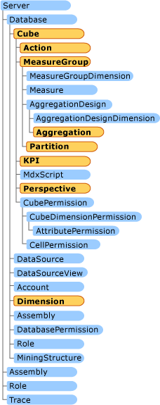

# AMO OLAP Classes
  Analysis Management Objects (AMO) OLAP classes help you create, modify, delete, and process cubes, dimensions, and related objects such as Key Performance Indicators (KPIs), actions, and proactive caching.  
  
 For more information about setting up the AMO programming environment, how to establish a connection with a server, accessing a database or defining data sources and data source views, see [AMO Fundamental Classes](../../../analysis-services/multidimensional-models/analysis-management-objects/amo-fundamental-classes.md).  
  
 This topic contains the following sections:  
  
-   [Dimension Objects](#Dimensions)  
  
-   [Cube Objects](#Cubes)  
  
-   [MeasureGroup Objects](#MeasureGroups)  
  
-   [Partition Objects](#Partition)  
  
-   [AggregationDesign Objects](#AggregationDesign)  
  
-   [Aggregation Objects](#Aggregation)  
  
-   [Action Objects](#Action)  
  
-   [KPI Objects](#KPI)  
  
-   [Perspective Objects](#Perspective)  
  
-   [Translation Objects](#Translation)  
  
-   [ProactiveCaching Objects](#ProactiveCaching)  
  
 The following illustration shows the relationship of the classes that are explained in this topic.  
  
   
  
## Basic Classes  
  
###   Dimension Objects  
 A dimension is created by adding it to the dimensions collection of the parent database, and by updating the <xref:Microsoft.AnalysisServices.Dimension> object to the server by using the Update method.  
  
 To remove a dimension, it has to be dropped by using the Drop method of the <xref:Microsoft.AnalysisServices.Dimension>. Removing a <xref:Microsoft.AnalysisServices.Dimension> from the dimensions collection of the database by using the Remove method does not delete it on the server, just in the AMO object model.  
  
 A <xref:Microsoft.AnalysisServices.Dimension> object can be processed after it has been created. The <xref:Microsoft.AnalysisServices.Dimension> can be processed using its own process method, or it can be processed with the parent object's process method when the parent object is processed.  
  
 For more information about methods and properties available, see <xref:Microsoft.AnalysisServices.Dimension> in the <xref:Microsoft.AnalysisServices>.  
  
###   Cube Objects  
 A cube is created by adding it to the cubes collection of the database, then updating the <xref:Microsoft.AnalysisServices.Cube> object to the server by using the Update method. The Update method of the cube can include the parameter UpdateOptions.ExpandFull, which ensures that all objects in the cube that were modified will be updated to the server in this update action.  
  
 To remove a cube, it has to be dropped by using the Drop method of the <xref:Microsoft.AnalysisServices.Cube>. Removing a cube from the collection does not affect the server.  
  
 A <xref:Microsoft.AnalysisServices.Cube> object can be processed after it has been created. The <xref:Microsoft.AnalysisServices.Cube> can be processed using its own process method, or it can be processed when a parent object processes itself with its own Process method.  
  
 For more information about methods and properties available, see <xref:Microsoft.AnalysisServices.Cube> in the <xref:Microsoft.AnalysisServices>.  
  
###   MeasureGroup Objects  
 A measure group is created by adding it to the measure group collection of the cube, then updating the <xref:Microsoft.AnalysisServices.MeasureGroup> object to the server by using its own Update method. A <xref:Microsoft.AnalysisServices.MeasureGroup> object is removed using its own Drop method.  
  
 A <xref:Microsoft.AnalysisServices.MeasureGroup> object can be processed after it has been created. The <xref:Microsoft.AnalysisServices.MeasureGroup> can be processed by using its own Process method, or it can be processed when a parent object processes itself with its own Process method.  
  
 For more information about methods and properties available, see <xref:Microsoft.AnalysisServices.MeasureGroup> in the <xref:Microsoft.AnalysisServices>.  
  
###   Partition Objects  
 A <xref:Microsoft.AnalysisServices.Partition> object is created by adding it to the partitions collection of the parent measure group, then updating the <xref:Microsoft.AnalysisServices.Partition> object on the server by using the Update method. A <xref:Microsoft.AnalysisServices.Partition> object is removed by using the Drop method.  
  
 For more information about methods and properties available, see <xref:Microsoft.AnalysisServices.Partition> in the <xref:Microsoft.AnalysisServices>.  
  
###   AggregationDesign Objects  
 Aggregation designs are constructed using the AggregationDesign method from an <xref:Microsoft.AnalysisServices.AggregationDesign> object.  
  
 For more information about methods and properties available, see <xref:Microsoft.AnalysisServices.AggregationDesign> in the <xref:Microsoft.AnalysisServices>.  
  
###   Aggregation Objects  
 An <xref:Microsoft.AnalysisServices.Aggregation> object is created by adding it to the aggregation designs collection of the parent measure group, then updating the parent measure group object on the server by using the Update method. An aggregation is removed from the <xref:Microsoft.AnalysisServices.AggregationCollection> by using the Remove method or the RemoveAt method.  
  
 For more information about methods and properties available, see <xref:Microsoft.AnalysisServices.Aggregation> in the <xref:Microsoft.AnalysisServices>.  
  
## Advanced Classes  
 Advanced classes provide OLAP functionality beyond building and browsing a cube. The following are some of the advanced classes and the benefits they provide:  
  
-   Action classes are used to create an active response when browsing certain areas of the cube.  
  
-   Key Performance Indicators (KPIs) enable comparison analysis between values of data.  
  
-   Perspectives provide selected views of a single cube, so that users can focus on what is important to them.  
  
-   Translations allow the cube to be customized to the user locale.  
  
-   Proactive caching classes can provide a balance between the enhanced performance of MOLAP storage and the immediacy of ROLAP storage, and provide scheduled partition processing.  
  
 AMO is used to set the definitions for this enhanced behavior, but the actual experience is defined by the browsing client that implements all of these enhancements.  
  
###   Action Objects  
 An <xref:Microsoft.AnalysisServices.Action> object is created by adding it to the actions collection of the cube, then updating the <xref:Microsoft.AnalysisServices.Cube> object to the server by using the Update method. The update method of the cube can include the parameter UpdateOptions.ExpandFull, which ensures that all objects in the cube that were modified will be updated to the server with this update action.  
  
 To remove an <xref:Microsoft.AnalysisServices.Action> object, it must be removed from the collection and the parent cube must be updated.  
  
 A cube must be updated and processed before the action can be used from the client.  
  
 For more information about methods and properties available, see <xref:Microsoft.AnalysisServices.Action> in the <xref:Microsoft.AnalysisServices>.  
  
###   Kpi Objects  
 A <xref:Microsoft.AnalysisServices.Kpi> object is created by adding it to the KPI collection of the cube, then updating the <xref:Microsoft.AnalysisServices.Cube> object to the server by using the Update method. The Update method of the cube can include the parameter UpdateOptions.ExpandFull, which ensures that all objects in the cube that were modified will be updated to the server with this update action.  
  
 To remove a <xref:Microsoft.AnalysisServices.Kpi> object, it must be removed from the collection, then and the parent cube must be updated.  
  
 A cube must be updated and processed before the KPI can be used.  
  
 For more information about methods and properties available, see <xref:Microsoft.AnalysisServices.Kpi> in the <xref:Microsoft.AnalysisServices>.  
  
###   Perspective Objects  
 A <xref:Microsoft.AnalysisServices.Perspective> object is created by adding it to the perspective collection of the cube, then updating the <xref:Microsoft.AnalysisServices.Cube> object to the server by using the Update method. The Update method of the cube can include the parameter UpdateOptions.ExpandFull, which ensures that all objects in the cube that were modified will be updated to the server with this update action.  
  
 To remove a <xref:Microsoft.AnalysisServices.Perspective> object, it must be removed from the collection, then the parent cube must be updated.  
  
 A cube has to be updated and processed before the perspective can be used.  
  
 For more information about methods and properties available, see <xref:Microsoft.AnalysisServices.Perspective> in the <xref:Microsoft.AnalysisServices>.  
  
###   Translation Objects  
 A <xref:Microsoft.AnalysisServices.Translation> object is created by adding it to the translation collection of the desired object, then updating the closest major parent object to the server by using the Update method. The Update method of the closest parent object can include the parameter UpdateOptions.ExpandFull, which ensures that all children objects that were modified will be updated to the server with this update action.  
  
 To remove a <xref:Microsoft.AnalysisServices.Translation> object, it must be removed from the collection, then the closest parent object must be updated.  
  
 For more information about methods and properties available, see <xref:Microsoft.AnalysisServices.Translation> in the <xref:Microsoft.AnalysisServices>.  
  
###   ProactiveCaching Objects  
 A <xref:Microsoft.AnalysisServices.ProactiveCaching> object is created by adding it to the proactive caching object collection of the dimension or partition, then updating the dimension or partition object to the server by using the Update method.  
  
 To remove a <xref:Microsoft.AnalysisServices.ProactiveCaching> object, it must be removed from the collection, then the parent object must be updated.  
  
 A dimension or partition must be updated and processed before proactive caching is enabled and ready to be used.  
  
 For more information about methods and properties available, see <xref:Microsoft.AnalysisServices.ProactiveCaching> in the <xref:Microsoft.AnalysisServices>.  
  
## See Also  
 <xref:Microsoft.AnalysisServices>   
 [Introducing AMO Classes](../../../analysis-services/multidimensional-models/analysis-management-objects/amo-classes-introduction.md)   
 [Programming AMO OLAP Basic Objects](../../../analysis-services/multidimensional-models/analysis-management-objects/programming-amo-olap-basic-objects.md)   
 [Programming AMO OLAP Advanced Objects](../../../analysis-services/multidimensional-models/analysis-management-objects/programming-amo-olap-advanced-objects.md)   
 [Logical Architecture &#40;Analysis Services - Multidimensional Data&#41;](../../../analysis-services/multidimensional-models/olap-logical/understanding-microsoft-olap-logical-architecture.md)   
 [Database Objects &#40;Analysis Services - Multidimensional Data&#41;](../../../analysis-services/multidimensional-models/olap-logical/database-objects-analysis-services-multidimensional-data.md)  
  
  