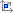
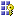

# Attribute Properties - View Attributes in Dimension Designer
[!INCLUDE[ssas-appliesto-sqlas](../../includes/ssas-appliesto-sqlas.md)]
  Attributes are created on dimension objects. You can view and configure attributes by using Dimension Designer in [!INCLUDE[msCoName](../../includes/msconame-md.md)] [!INCLUDE[ssNoVersion](../../includes/ssnoversion-md.md)] [!INCLUDE[ssASnoversion](../../includes/ssasnoversion-md.md)]. The **Attributes** pane of the **Dimension Structure** tab of Dimension Designer lists the attributes that are in a dimension. Use this pane to add, remove, or configure attributes. You can also select attributes to use as a level in a new hierarchy or to add as a level in an existing hierarchy.  
  
 To view the attributes in a dimension, open Dimension Designer for the dimension. The **Attributes** pane of the **Dimension Structure**  tab of the designer shows the attributes that are in the dimension. You can switch between a list, tree, or grid view by pointing to **Show Attributes in** on the **Dimension** menu of [!INCLUDE[ssBIDevStudioFull](../../includes/ssbidevstudiofull-md.md)] and then clicking one of the following commands:  
  
1.  Show Attributes in a **List**. Displays the attributes in list format. Right-click an attribute to delete it from the list, to rename the attribute, or to change the usage of the attribute. Use this view for building hierarchies. Attribute information and member properties are not visible.  
  
2.  Show Attributes in a **Tree**. Display the attributes in tree format, with the dimension as the top-level node in the tree. Expand an attribute to view attribute relationships for it or to create a new attribute relationship, by performing the following actions:  
  
    -   Click the dimension, an attribute, or a member property to view its properties in the **Properties** window.  
  
    -   Right-click an attribute or a member property to delete it from the list, to rename it, or to change its usage.  
  
     Use this view for viewing and creating member properties. You can also use this view to build hierarchies.  
  
3.  Show Attributes in a **Grid**. Display the attributes in grid format. The grid displays the following columns:  
  
    -   **Name** shows the value of the **Name** property. Type a different name to change the setting.  
  
    -   **Usage** specifies whether this is a Regular, Key, Parent, or AccountType attribute. Click a value in this column to select a different setting.  
  
    -   **Type** specifies the business intelligence category for the attribute. Click this cell to select a different setting.  
  
    -   **Key Column** shows the OLE DB data type for the **KeyColumn** property on the attribute. This column cannot be changed.  
  
    -   **Name Column** indicates whether the **NameColumn** property setting on the attribute is the same column as the setting for the **KeyColumn** property. This column cannot be changed.  
  
     Click any row in the grid to view properties for that attribute.  
  
     Use this view for creating and configuring attributes.  
  
 In [!INCLUDE[ssBIDevStudio](../../includes/ssbidevstudio-md.md)], the icons shown in the following table mark attributes according to their usage.  
  
|Icon|Attribute Usage|  
|----------|---------------------|  
||Regular or AccountType|  
||Key|  
||Parent|  
  
## See Also  
 [Dimension Attribute Properties Reference](../../analysis-services/multidimensional-models/dimension-attribute-properties-reference.md)  
  
  
