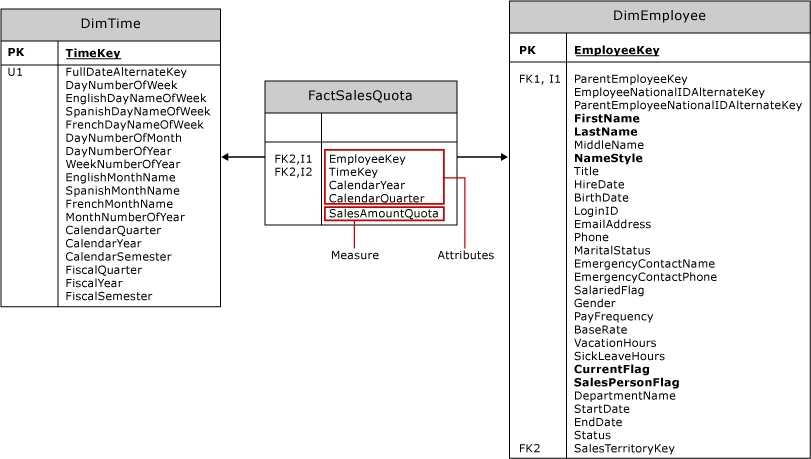

# Create Measures and Measure Groups in Multidimensional Models
[!INCLUDE[ssas-appliesto-sqlas](../../includes/ssas-appliesto-sqlas.md)]
  A *measure* is an aggregation of numeric data values, such as sum, count, minimum, maximum, average, or a custom MDX expression that you create. A *measure group* is a container for one or more measures. All measures exist in a measure group, even if there is only one measure. A cube must have at least one measure and measure group.  
  
 This topic includes the following sections:  
  
-   [Approaches for creating measures](#bkmk_create)  
  
-   [Components of a measure](#bkmk_comps)  
  
-   [Modeling measures and measure groups on facts and fact tables](#bkmk_modeling)  
  
-   [Granularity of a measure group](#bkmk_grain)  
  
##   Approaches for creating measures  
 Measures can be a static element of the cube, created at design time, always present whenever the cube is accessed. But you can also define a measure as a *calculated member* by using a MDX to provide a calculated value for a measure based on other measures in the cube. A calculated member can be scoped to session or user.  
  
 To create a measure or a measure group, use one of these approaches:  
  
|||  
|-|-|  
|Cube Wizard|Run the Cube Wizard in [!INCLUDE[ssBIDevStudioFull](../../includes/ssbidevstudiofull-md.md)] to create a cube.   In Solution Explorer, right-click **Cubes** and choose **New Cube**. See [Multidimensional Modeling &#40;Adventure Works Tutorial&#41;](../../analysis-services/multidimensional-modeling-adventure-works-tutorial.md) if you need help with these steps.   When you create a cube based on tables from an existing data warehouse, definitions for the measures and measure group materialize as part of the cube creation process. In the wizard, you'll choose which facts and fact tables to use as the basis for the measure and measure group objects in your cube.|  
|New Measure dialog|Assuming the cube already exists in [!INCLUDE[ssBIDevStudioFull](../../includes/ssbidevstudiofull-md.md)], double-click the cube name in Solution Explorer to open it in Cube Designer. In the Measures pane, right-click the top node to create a new measure group, or new measures, by specifying a source table, column, and aggregation type. Using this approach requires that you choose the aggregation method from a fixed list of prebuilt functions. See [Use Aggregate Functions](../../analysis-services/multidimensional-models/use-aggregate-functions.md) for a discussion of the more commonly used aggregations.|  
|Calculated member|Calculated members add flexibility and analysis capability to a cube in [!INCLUDE[ssASnoversion](../../includes/ssasnoversion-md.md)] because you can control when and how they are created. Sometimes you only need a measure temporarily, for the duration of a user session, or in Management Studio as part of an investigation.   In [!INCLUDE[ssBIDevStudioFull](../../includes/ssbidevstudiofull-md.md)], open the Calculations tab to create a new calculated member.   Choose this approach when basing a measure on an MDX expression. See these topics for more information: [Building Measures in MDX](../../analysis-services/multidimensional-models/mdx/mdx-building-measures.md), [Calculations](../../analysis-services/multidimensional-models-olap-logical-cube-objects/calculations.md), [Calculations in Multidimensional Models](../../analysis-services/multidimensional-models/calculations-in-multidimensional-models.md) and [MDX Scripting Fundamentals &#40;Analysis Services&#41;](../../analysis-services/multidimensional-models/mdx/mdx-scripting-fundamentals-analysis-services.md).|  
|MDX or XMLA|In SQL Server Management Studio, you can execute MDX or XMLA to alter a database to include a new calculated measure. This approach is useful for ad hoc testing of data, after the solution is deployed to a server. See [Document and Script an Analysis Services Database](../../analysis-services/multidimensional-models/document-and-script-an-analysis-services-database.md).|  
  
##   Components of a measure  
 A measure is an object with properties. In addition to its name, a measure must have an aggregation type and a source column or an expression used to load the measure with data. You can modify the measure definition by setting its properties.  
  
|||  
|-|-|  
|**source**|Most measures come from numeric columns in fact tables in an external data warehouse, such as the Sales Amount column in the Internet Sales and Reseller Sales tables in the AdventureWorks data warehouse, but you can also create new measures based entirely on calculations that you define.   Attribute columns from dimension tables can be used to define measures, but such measures are typically semiadditive or nonadditive in terms of their aggregation behavior. For more information about semiadditive behavior, see [Define Semiadditive Behavior](../../analysis-services/multidimensional-models/define-semiadditive-behavior.md).|  
|**aggregation**|By default, measures are summed along each dimension. However, the **AggregateFunction** property lets you modify this behavior. See [Use Aggregate Functions](../../analysis-services/multidimensional-models/use-aggregate-functions.md) for a list.|  
|**Properties**|See [Configure Measure Properties](../../analysis-services/multidimensional-models/configure-measure-properties.md) for additional property descriptions.|  
  
##   Modeling measures and measure groups on facts and fact tables  
 Before you run a wizard, it helps to understand the modeling principles behind measure definition.  
  
 Measures and measure groups are the multidimensional objects that represent facts and fact tables in an external data warehouse. In most cases, measures and measure groups will be based on objects in a data source view, which in turn are created from the underlying data warehouse.  
  
 The following diagram represents the **FactSalesQuota** fact table and the two dimension tables associated with it, **DimTime** and **DimEmployee**. In the Adventure Works sample cube, these tables are used as the basis of the Sales Quotas measure group, and the Time and Employee dimensions.  
  
   
  
 The fact table contains two basic types of columns: attribute columns and measure columns.  
  
-   Attribute columns are used to create foreign key relationships to dimension tables, so that the quantifiable data in the measure columns can be organized by the data contained in the dimension tables. Attribute columns are also used to define the granularity of a fact table and its measure group.  
  
-   Measure columns define the measures contained by a measure group.  
  
 When you run the Cube Wizard, the foreign keys are filtered out. In the list of remaining columns to choose from, you will see measure columns, plus attribute columns that are not identified as a foreign key. In the **FactSalesQuota** example, the wizard will offer **CalendarYear** and **CalendarQuarter** in addition to **SalesAmountQuota**. Only the **SalesAmountQuota** measure column will result in a workable measure for your multidimensional model. The other date-based columns exist to qualify each quota amount. You should exclude the other columns, **CalendarYear** and **CalendarQuarter**, from the measure list in the Cube Wizard (or remove them from the measure group later in the designer).  
  
 The point to take away from this discussion is that not all columns offered by the wizard are useful as a measure. Rely on your understanding of the data and how it will be used when deciding which columns to use as measures. Remember that you can right-click a table in the data source view to explore the data, which can help you identify which columns to use as measures. See [Explore Data in a Data Source View &#40;Analysis Services&#41;](../../analysis-services/multidimensional-models/explore-data-in-a-data-source-view-analysis-services.md) for more information.  
  
> [!NOTE]  
>  Not all measures are derived directly from a value stored in a column of the fact table. For example, the **Sales Person Count** measure defined in the **Sales Quota** measure group of the Adventure Works sample cube is actually based on the count of unique values (or distinct count) in the **EmployeeKey** column of the **FactSalesQuota** fact table.  
  
##   Granularity of a measure group  
 Measure groups have an associated granularity that refers to the level of detail supported by a fact table. The granularity is set through the foreign key relationship to a dimension.  
  
 For example, the **FactSalesQuota** fact table has a foreign key relationship with the **DimEmployee** table, each record in the **FactSalesQuota** table is related to a single employee, and thus the granularity of the measure group as viewed from the Employee dimension is at the individual employee level.  
  
 The granularity of a measure group can never be set finer than the lowest level of the dimension from which the measure group is viewed, but the granularity can be made coarser by using additional attributes. For example, the **FactSalesQuota** fact table uses three columns, **TimeKey**, **CalendarYear**, and **CalendarQuarter**, to establish the granularity of the relationship with the **DimTime** table. As a result, the granularity of the measure group as viewed from the Time dimension is by calendar quarter, and not by day, which is the lowest level of the Time dimension.  
  
 You can specify the granularity of a measure group with relation to a specific dimension by using the **Dimension Usage** tab of the Cube Designer. For more information about dimension relationships, see [Dimension Relationships](../../analysis-services/multidimensional-models-olap-logical-cube-objects/dimension-relationships.md).  
  
## See Also  
 [Cubes in Multidimensional Models](../../analysis-services/multidimensional-models/cubes-in-multidimensional-models.md)   
 [Measures and Measure Groups](../../analysis-services/multidimensional-models/measures-and-measure-groups.md)  
  
  
