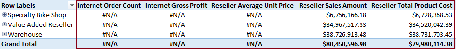

# Grant custom access to cell data (Analysis Services)
[!INCLUDE[ssas-appliesto-sqlas](../../includes/ssas-appliesto-sqlas.md)]
  Cell security is used to allow or deny access to measure data within a cube. The following illustration shows a combination of allowed and denied measures in a PivotTable, when connected as a user whose role only allows access to certain measures. In this example, **Reseller Sales Amount** and **Reseller Total Product Cost** are the only measures available through this role. All other measures are implicitly denied (the steps used to get this result are provided below in the next section, Allow access to specific measures).  
  
   
  
 Cell permissions apply to data inside the cell, and not to its metadata. Notice how the cell is still visible in the results of a query, displaying a value of **#N/A** instead of the actual cell value. The **#N/A** value appears in the cell unless the client application translates the value, or another value is specified by setting the Secured Cell Value property in the connection string.  
  
 To hide the cell entirely, you have to limit the members-dimensions, dimension attributes, and dimension attribute members-that are viewable. For more information, see [Grant custom access to dimension data &#40;Analysis Services&#41;](../../analysis-services/multidimensional-models/grant-custom-access-to-dimension-data-analysis-services.md).  
  
 As an administrator, you can specify whether role members have read, read contingent, or read/write permissions on cells within a cube. Putting permissions on a cell is the lowest level of security allowed, so before you start applying permissions at this level, it's important to keep a few facts in mind:  
  
-   Cell-level security cannot expand rights that have been restricted at a higher level. An example: if a role denies access to dimension data, cell-level security cannot override the denied set. Another example: consider a role with **Read** permission on a cube and **Read/Write** permission on a cell ─ the cell data permission will not be **Read/Write**; it will be **Read**.  
  
-   Custom permissions often need to be coordinated between dimension members and cells within the same role. For example, suppose you want to deny access to several discount-related measures for different combinations of resellers. Given **Resellers** as dimension data and **Discount Amount** as a measure, you would need to combine within the same role permissions on both the measure (using the instructions in this topic), as well as on dimension members. See [Grant custom access to dimension data &#40;Analysis Services&#41;](../../analysis-services/multidimensional-models/grant-custom-access-to-dimension-data-analysis-services.md) for details on setting dimension permissions.  
  
 Cell-level security is specified through MDX expressions. Because a cell is a tuple (that is, an intersection point across potentially multiple dimensions and measures), it is necessary to use MDX to identify specific cells.  
  
## Allow access to specific measures  
 You can use cell security to explicitly choose which measures are available. Once you specifically identify which members are allowed, all other measures become unavailable. This is perhaps the simplest scenario to implement via MDX script, as the following steps illustrate.  
  
1.  In [!INCLUDE[ssManStudioFull](../../includes/ssmanstudiofull-md.md)] connect to the instance of [!INCLUDE[ssASnoversion](../../includes/ssasnoversion-md.md)], select a database, open the **Roles** folder, and then click a database role (or create a new database role). Membership should already be specified, and the role should have **Read** access to the cube. See [Grant cube or model permissions &#40;Analysis Services&#41;](../../analysis-services/multidimensional-models/grant-cube-or-model-permissions-analysis-services.md) if you need help with this step.  
  
2.  In **Cell Data**, check the cube selection to be sure you have chosen the right one, and then select **Enable read permissions**.  
  
     If you select just this check box, and do not provide an MDX expression, the effect is the same as denying access to all cells in the cube. This is because the default allowed set is an empty set whenever [!INCLUDE[ssASnoversion](../../includes/ssasnoversion-md.md)] resolves a subset of cube cells.  
  
3.  Enter the following MDX expression.  
  
    ```  
    (Measures.CurrentMember IS [Measures].[Reseller Sales Amount]) OR (Measures.CurrentMember IS [Measures].[Reseller Total Product Cost])  
    ```  
  
     This expression explicitly identifies which measures are visible to users. No other measures will be available to users connecting through this role. Notice that [CurrentMember &#40;MDX&#41;](../../mdx/currentmember-mdx.md) sets the context and is followed by the measure that is allowed. The effect of this expression is, if the current member includes either the **Reseller Sales Amount** or the **Reseller Total Product Cost**, show the value. Otherwise, deny access. The expression has multiple parts, with each part enclosed in parentheses. The **OR** operator is used to specify multiple measures.  
  
## Deny access to specific measures  
 The following MDX expression, also specified in **Create Role** | **Cell Data** | **Allow reading of cube content**, has the opposite effect, making certain measures unavailable. In this example, **Discount Amount** and **Discount Percentage** are made unavailable using the **NOT** and **AND** operators. All other measures will be visible to users connecting through this role.  
  
```  
(NOT Measures.CurrentMember IS [Measures].[Discount Amount]) AND (NOT Measures.CurrentMember IS [Measures].[Discount Percentage])  
```  
  
 In Excel, cell-security is evident in the following illustration:  
  
   
  
## Set Read permissions on calculated measures  
 Permissions on a calculated measure can be set independently of its constituent parts. Skip ahead to the next section on Read-Contingent if you want to coordinate permissions between a calculated measure and its dependent measures.  
  
 To understand how Read permissions work for a calculated measure, consider **Reseller Gross Profit** in AdventureWorks. It's derived from **Reseller Sales Amount** and **Reseller Total Product Cost** measures. As long as a role has Read permission on **Reseller Gross Profit** cells, this measure is viewable even if permissions are expressly denied on the other measures. As a demonstration, copy the following MDX expression into **Create Role** | **Cell Data** | **Allow reading of cube content**.  
  
```  
(NOT Measures.CurrentMember IS [Measures].[Reseller Sales Amount])  
AND (NOT Measures.CurrentMember IS [Measures].[Reseller Total Product Cost])  
```  
  
 In Excel, connect to the cube using the current role, and choose all three measures to see the effects of cell security. Notice that measures in the denied set are unavailable, but the calculated measure is visible to the user.  
  
   
  
## Set Read-Contingent permissions on calculated measures  
 Cell-security offers an alternative, Read-Contingent, for setting permissions on the related cells participating in a calculation. Consider again the **Reseller Gross Profit** example. When you enter the same MDX expression provided in the previous section, placed this time into the second text area of the **Create Role** | **Cell data** dialog box (in the text area below **Allow reading of cell content contingent on cell security**), the result is apparent when viewed in Excel. Because **Reseller Gross Profit** is contingent upon **Reseller Sales Amount** and **Reseller Total Product Cost**, gross profit is now inaccessible because its constituent parts are inaccessible.  
  
> [!NOTE]  
>  What happens if you set both the Read and Read-Contingent permissions on a cell within the same role? The role will provide Read permissions on the cell, and not Read-Contingent.  
  
 Recall from previous sections that selecting just the **Enable read-contingent permissions** checkbox, without providing any MDX expression, denies access to all cells in the cube. This is because the default allowed set is an empty set whenever [!INCLUDE[ssASnoversion](../../includes/ssasnoversion-md.md)] resolves a subset of cube cells.  
  
## Set Read/Write permissions on a cell  
 Read/write permissions on a cell are used to enable writeback, provided that members have read/write permissions to the cube itself. Permissions that are granted at the cell level cannot be greater than the permissions that are granted at the cube level. See [Set Partition Writeback](../../analysis-services/multidimensional-models/set-partition-writeback.md) for details.  
  
## See Also  
 [MDX Builder &#40;Analysis Services - Multidimensional Data&#41;](http://msdn.microsoft.com/library/fecbf093-65ea-4e1b-b637-f04876f1cb0f)   
 [The Basic MDX Script &#40;MDX&#41;](../../analysis-services/multidimensional-models/mdx/the-basic-mdx-script-mdx.md)   
 [Grant process permissions &#40;Analysis Services&#41;](../../analysis-services/multidimensional-models/grant-process-permissions-analysis-services.md)   
 [Grant permissions on a dimension &#40;Analysis Services&#41;](../../analysis-services/multidimensional-models/grant-permissions-on-a-dimension-analysis-services.md)   
 [Grant custom access to dimension data &#40;Analysis Services&#41;](../../analysis-services/multidimensional-models/grant-custom-access-to-dimension-data-analysis-services.md)   
 [Grant cube or model permissions &#40;Analysis Services&#41;](../../analysis-services/multidimensional-models/grant-cube-or-model-permissions-analysis-services.md)  
  
  
