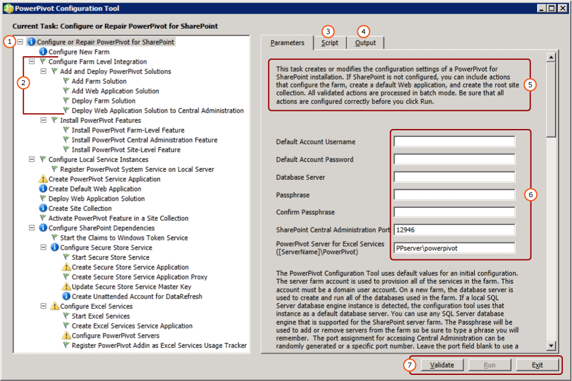

# Configure or Repair Power Pivot for SharePoint 2013
[!INCLUDE[ssas-appliesto-sqlas](../../includes/ssas-appliesto-sqlas.md)]
  To configure or repair an installation of [!INCLUDE[ssCurrent](../../includes/sscurrent-md.md)][!INCLUDE[ssGemini](../../includes/ssgemini-md.md)] for SharePoint 2013, use the [!INCLUDE[ssGemini](../../includes/ssgemini-md.md)] for SharePoint Configuration tool. The configuration tool starts by scanning the system and returns a list of actions needed to complete or repair an installation. The [!INCLUDE[ssCurrent](../../includes/sscurrent-md.md)] setup wizard installs the [!INCLUDE[ssGemini](../../includes/ssgemini-md.md)] Configuration Tool for SharePoint 2010 as well as a [!INCLUDE[ssGemini](../../includes/ssgemini-md.md)] Configuration Tool for SharePoint 2013. This topic describes the [!INCLUDE[ssGemini](../../includes/ssgemini-md.md)] Configuration Tool for SharePoint 2013. For more information on SharePoint 2010, see [Configure or Repair Power Pivot for SharePoint 2010 (Power Pivot Configuration Tool)](http://msdn.microsoft.com/d61f49c5-efaa-4455-98f2-8c293fa50046).  
  
 **[!INCLUDE[applies](../../includes/applies-md.md)]**  SharePoint 2013  
  
 **In this topic:**  
  
 [Before you start](#bkmk_before)  
  
 [To Use the Power Pivot for SharePoint 2013 Configuration Tool](#bkmk_using)  
  
 [Configuration steps](#bkmk_steps)  
  
 [Input values used to configure the server](#bkmk_input)  
  
 [Next steps](#bkmk_nextsteps)  
  
##  <a name="bkmk_before"></a> Before you start  
 The [!INCLUDE[ssGemini](../../includes/ssgemini-md.md)] for SharePoint 2013 Configuration tool scans for program files, registry settings, and available ports. To get the most use out of the tools, review the following.  
  
-   General requirements to run the configuration tool, [Power Pivot Configuration Tools](../../analysis-services/power-pivot-sharepoint/power-pivot-configuration-tools.md).  
  
-   [!INCLUDE[ssGemini](../../includes/ssgemini-md.md)] for SharePoint 2013 prefers web application configured for claims based authentication. If the [!INCLUDE[ssGemini](../../includes/ssgemini-md.md)] for SharePoint 2013 Configuration tool creates the application for you, it configures the application to use claims-based Windows authentication. For more information about authentication requirements, see [Power Pivot Authentication and Authorization](../../analysis-services/power-pivot-sharepoint/power-pivot-authentication-and-authorization.md).  
  
-   Port 80 must be available for the P[!INCLUDE[ssGemini](../../includes/ssgemini-md.md)] for SharePoint 2013 Configuration tool to create a web application.  
  
##  <a name="bkmk_using"></a> To Use the Power Pivot for SharePoint 2013 Configuration Tool  
 The first page of the tool provides a summary of the input values used to configure the SharePoint farm. In addition to the input values that you provide, default values are used to configure the system. Default names are used for service applications, service application databases, and service application properties.  
  
> [!TIP]  
>  If the configuration tool scans the computer and returns a blank task list in the left pane, then no features or settings were detected that need configuration. To modify the SharePoint or [!INCLUDE[ssGemini](../../includes/ssgemini-md.md)] configuration, use Windows PowerShell or the management pages in SharePoint Central Administration. For more information, see [Power Pivot Server Administration and Configuration in Central Administration](../../analysis-services/power-pivot-sharepoint/power-pivot-server-administration-and-configuration-in-central-administration.md).  
  
 Values for service accounts are used for multiple services. For example, the configuration tool uses the default account on the first page to set all application pool identities. You can change these accounts later by modifying the service application properties in Central Administration.  
  
 The tool provides a tabbed interface that includes parameter inputs, Windows PowerShell script, and status messages.  
  
 The tool uses Windows PowerShell to configure the server. You can click the **Script** tab to review the Windows PowerShell script that the tool uses to configure the server.  
  
   
  
||Description|  
|-|-----------------|  
|**(1)**|Task list window.|  
|**(2)**|Individual actions.|  
|**(3)**|The Windows PowerShell scripts created by the configuration tool.|  
|**(4)**|Log messages created when you start validation or run actions.|  
|**(5)**|Description of the page.|  
|**(6)**|Input parameters|  
|**(7)**|The **Run** button is enabled after you validate the actions.|  
  
##  <a name="bkmk_steps"></a> Configuration steps  
 The link to the configuration tool is only visible when [!INCLUDE[ssGemini](../../includes/ssgemini-md.md)] for SharePoint 2013 is installed on the local server.  
  
1.  On the **Start** menu, point to **All Programs**, click [!INCLUDE[ssCurrentUI](../../includes/sscurrentui-md.md)], click **Configuration Tools**, and then click **[!INCLUDE[ssGemini](../../includes/ssgemini-md.md)] for SharePoint 2013 Configuration**.  
  
2.  Click **Configure or Repair [!INCLUDE[ssGemini](../../includes/ssgemini-md.md)] for SharePoint**.  
  
3.  Expand the window to full size. You should see a button bar at the bottom of the window that includes **Validate**, **Run**, and **Exit** commands.  
  
4.  **Default Account:** On the Parameters tab, type a domain user account for the **Default Account Username**. This account is used to provision essential services, including the [!INCLUDE[ssGemini](../../includes/ssgemini-md.md)] service application pool. Do not specify a built-in account such as Network Service or Local System. The tool blocks configurations that specify built-in accounts.  
  
     **Passphrase:** type a passphrase. If the SharePoint farm is new, the passphrase is used whenever new servers or applications are added  to the SharePoint farm. If the farm exists, enter the passphrase that allows you to add a server application to the farm.  
  
5.  **Port:** Optionally, type a port number to connect to the Central Administration web application or use the provided randomly generated number. The configuration tool checks that the number is available before offering it as an option.  
  
6.  On the main page, type the name of a [!INCLUDE[ssCurrent](../../includes/sscurrent-md.md)][!INCLUDE[ssGemini](../../includes/ssgemini-md.md)] Server running in SharePoint mode.  
  
7.  Optionally, review the remaining input values used to complete each action. For more information about each one, see [Input values used to configure the server](#bkmk_input) in this topic.  
  
8.  Optionally, remove any actions that you do not want to process. For example, if you want to configure Secure Store Service later, click **Configure Secure Store Service**, and then clear the checkbox **Include this action in the task list**.  
  
9. Click **Validate** to check whether the tool has sufficient information to process the actions in the list.  
  
10. Click **Run** to process all of the actions in the task list. The **Run** button becomes available after you validate the actions. If **Run** is not enabled, click **Validate** first.  
  
     If you see an error message similar to the following, verify that the SQL Server database instance is started.  
  
    ```  
    Cannot connect to the database server instance  
    ```  
  
11. [Verify a Power Pivot for SharePoint Installation](../../analysis-services/instances/install-windows/verify-a-power-pivot-for-sharepoint-installation.md).  
  
##  <a name="bkmk_input"></a> Input values used to configure the server  
 The [!INCLUDE[ssGemini](../../includes/ssgemini-md.md)] Configuration Tool uses a combination of input values that you type in and default values that it detects or uses automatically.  
  
 The list of actions the configuration tool displays, depends on the SharePoint farms current configuration. For example, if the SharePoint farm is already configured, you do not see actions that configure the farm or create a web application. You can run the tool at any time to configure, repair, or detect configuration errors. If required services such as Excel Services or Secure Store Service are not running in the farm, the tool detects the missing services and provide options to enable them. If no actions are required, the task list is empty.  
  
 The following table describes the values that are used to configure the server.  
  
|Page|Input Value|Source|Description|  
|----------|-----------------|------------|-----------------|  
|**Configure or Repair [!INCLUDE[ssGemini](../../includes/ssgemini-md.md)] for SharePoint**|Default Account|Current user|The default account is a domain Windows user account used to provision shared services in the farm. It is used to provision the following:|  
||||-<br />                    [!INCLUDE[ssGemini](../../includes/ssgemini-md.md)] service application|  
||||-Secure Store Service|  
||||-Excel Services|  
||||-The web application pool identity|  
||||-The site collection administrator|  
||||-The [!INCLUDE[ssGemini](../../includes/ssgemini-md.md)] unattended data refresh account.|  
||||By default, the domain account of the current user is used.<br /><br /> Note: It is recommended you replace the default value unless you are configuring a server for evaluation and non-production purposes.<br /><br /> You can change service identities after configuration or repair, using Central Administration.<br /><br /> Optionally, in the [!INCLUDE[ssGemini](../../includes/ssgemini-md.md)] Configuration tool, specify dedicated accounts for the following:|  
||||-Web application, using the **Create Default Web Application** page (assuming that the tool is creating a web application for the farm).|  
||||-<br />                    [!INCLUDE[ssGemini](../../includes/ssgemini-md.md)] unattended data refresh account, using the **Create Unattended Account for Data Refresh** page in this tool.|  
||Database Server|Local [!INCLUDE[ssGemini](../../includes/ssgemini-md.md)] named instance, if available|If a database engine instance is installed as a [!INCLUDE[ssGemini](../../includes/ssgemini-md.md)] named instance, the tool populates the database server field with this instance name. If you did not install the database engine, this field is empty.<br /><br /> **Database Server**  is a required parameter. It can be any version or edition of SQL Server that is supported for SharePoint farms.|  
||Passphrase|User input|If you are creating a new farm, the passphrase you enter is used as the passphrase for the farm. If you are adding [!INCLUDE[ssGemini](../../includes/ssgemini-md.md)] for SharePoint to an existing farm, type the existing farm passphrase.|  
||SharePoint Central Administration port|Default, if needed|If the farm is not configured, the tool provides options to create the farm, including creating an HTTP endpoint to Central Administration. It picks a randomly generated port number that is not in use.|  
||[!INCLUDE[ssGemini](../../includes/ssgemini-md.md)] for Excel Services ([ServerName]\ [!INCLUDE[ssGemini](../../includes/ssgemini-md.md)])|User input|The [!INCLUDE[ssGemini](../../includes/ssgemini-md.md)] server is required for Excel Services to Enable the core [!INCLUDE[ssGemini](../../includes/ssgemini-md.md)] capabilities. The server name you type on this page is also added to the list on the **Configure [!INCLUDE[ssGemini](../../includes/ssgemini-md.md)] Servers** page.|  
|**Configure New Farm**|Database Server<br /><br /> Farm Account<br /><br /> PassPhrase<br /><br /> SharePoint Central Administration port|Default, if needed|The settings default to what you entered on the main page.|  
|**Create [!INCLUDE[ssGemini](../../includes/ssgemini-md.md)] Service Application**|Service Application Name|Default|[!INCLUDE[ssGemini](../../includes/ssgemini-md.md)] Service Application Name The default name is **Default [!INCLUDE[ssGemini](../../includes/ssgemini-md.md)] Service Application**. You can substitute a different value in the tool.|  
||Database Server|Default|The database server to host the [!INCLUDE[ssGemini](../../includes/ssgemini-md.md)] service application database. The default server name is the same database server used for the farm. You can substitute a different value than the default server name.|  
||Database Name|Default|The name of the database to create for the [!INCLUDE[ssGemini](../../includes/ssgemini-md.md)] Service Application Database. The default database name is based on the service application name, followed by a GUID to ensure a unique name. You can substitute a different value in the tool.|  
|**Create Default Web Application**|Web Application Name|Default, if needed|If no web applications exist, the tool creates one. The web application is configured for classic mode authentication, and listens on port 80. The maximum file upload size is set to 2047, the maximum allowed by SharePoint. The larger file upload size is to accommodate the large [!INCLUDE[ssGemini](../../includes/ssgemini-md.md)] files that will be uploaded to the server.|  
||URL|Default, if needed|The tool creates a URL based on the server name, using the same file naming conventions as SharePoint.|  
||Application Pool|Default, if needed|The tool creates a default application pool in IIS.|  
||Application Pool Account and Password|Default, if needed|The application pool account is based on the default account, but you can override it in the tool.|  
||Database Server|Default, if needed|The default database instance is pre-selected to store the application content database, but you can specify a different SQL Server instance in the tool.|  
||Database Name|Default, if needed|The name of the application database. The database name is based on the file naming conventions of SharePoint, but you can choose a different name.|  
|**Deploy Web Application Solution**|URL|Default, if needed|The Default URL is from the default web application.|  
||Maximum File Size (in MB)|Default, if needed|Default setting is 2047. SharePoint document libraries also have a maximum size and the [!INCLUDE[ssGemini](../../includes/ssgemini-md.md)] setting should not exceed the document library setting. For more information, see [Configure Maximum File Upload Size &#40;Power Pivot for SharePoint&#41;](../../analysis-services/power-pivot-sharepoint/configure-maximum-file-upload-size-power-pivot-for-sharepoint.md).|  
|**Create Site Collection**|Site Administrator|Default, if needed|The tool uses the default account. You can override it in the **Create Site Collection** page.|  
||Contact E-mail|Default, if needed|If Microsoft Outlook is configured on the server, the tool will use the email address of the current user. Otherwise, a placeholder value is used.|  
||Site URL|Default, if needed|The tool creates the site URL, using the same URL naming conventions as SharePoint.|  
||Site Title|Default, if needed|The tool adds **[!INCLUDE[ssGemini](../../includes/ssgemini-md.md)] Site** as the default title.|  
|**Activate [!INCLUDE[ssGemini](../../includes/ssgemini-md.md)] Feature in a Site Collection**|Site URL||URL of the site collection for which you are activating [!INCLUDE[ssGemini](../../includes/ssgemini-md.md)] features.|  
||Enable premium feature for this site||Enable the SharePoint site feature "PremiumSite".|  
|**Create Secure Store Service Application**|Service Application Name|Default, if needed|Type the name for the Secure Store service application.|  
||Database Server|User input|Type the name of the database server to use for the Secure Store service application.|  
|**Create Secure Store Service Application Proxy**|Service Application Name|Default, if needed|Type the name for the Secure Store service application you typed in the previous page.|  
||Service Application Proxy|Default, if needed|Type the name for the Secure Store service application proxy. The name will appear in the default connection group that associates applications with SharePoint content web applications.|  
|**Update Secure Store Service Master Key**|Service Application Proxy|Default, if needed|Type the name of the Secure Store service application proxy you typed in the previous page.|  
||Passphrase|User input|The master key used for data encryption. By default, the passphrase used to generate the key is the same passphrase that is used to provision new servers in the farm. You can replace the default passphrase with a unique passphrase.|  
|**Create Unattended Account for DataRefresh**|Target Application ID|Default, if needed|Create a target application to stores credentials for unattended [!INCLUDE[ssGemini](../../includes/ssgemini-md.md)] data refresh.<br /><br /> The application ID can be descriptive text.|  
||Friendly Name for Target Application|Default, if needed||  
||Unattended Account User Name and Password|Default, if needed|Type credentials of a Windows user account that is used by the target application to run unattended data refresh. For more information, see [Configure Excel Services data refresh by using the unattended service account in SharePoint Server 2013](http://technet.microsoft.com/library/hh525344\(office.15\).aspx) (http://technet.microsoft.com/library/hh525344(office.15).aspx).|  
||Site URL|Default, if needed|Type the site URL of the site collection associated wit the target application. To associate with additional site collections, use SharePoint Central administration.|  
|**Create Excel Services Service Application**|Service Application Name|Default, if needed|Type a service application name. A service application database with the same name is created on the SharePoint farm's database server.|  
|**Configure [!INCLUDE[ssGemini](../../includes/ssgemini-md.md)] Servers**|Service Application Name|Default, if needed|Service application name you typed on the previous page.|  
||[!INCLUDE[ssGemini](../../includes/ssgemini-md.md)] Server Name||List of Registered [!INCLUDE[ssGemini](../../includes/ssgemini-md.md)] Servers.<br /><br /> The server name typed on the main page is automatically be added to this page.|  
|**Register [!INCLUDE[ssGemini](../../includes/ssgemini-md.md)] Add-in as Excel Services Usage Tracker**|Service Application Name||Service application name you typed on the previous page.|  
|||||  
  
 If the [!INCLUDE[ssGemini](../../includes/ssgemini-md.md)] for SharePoint 2013 Configuration tool creates the farm, it creates the required databases on the database server, using the same file naming conventions as SharePoint. You cannot change the farm database name.  
  
 If the tool creates a site collection, it creates a content database on the database server, using the same file naming conventions as SharePoint. You cannot change the content database name.  
  
## Verify the Configuration  
 See the "Verify [!INCLUDE[ssGemini](../../includes/ssgemini-md.md)] Configuration" section of [Configure Power Pivot and Deploy Solutions &#40;SharePoint 2013&#41;](../../analysis-services/instances/install-windows/configure-power-pivot-and-deploy-solutions-sharepoint-2013.md).  
  
##  <a name="bkmk_nextsteps"></a> Next steps  
 After you complete server installation, there are several post-installation tasks you should perform:  
  
-   Grant SharePoint permissions to individuals and groups. This task is necessary to enable access to sites and content.  
  
-   Change the service application pool identities to run under a different account. Specifying different identities for services and applications is a SharePoint best practice recommendation for secure deployment.  
  
-   Create additional trusted sites in Excel Services so that you can vary permissions and configuration settings that work best for [!INCLUDE[ssGemini](../../includes/ssgemini-md.md)] data access.  
  
-   Install commonly used data providers to enable server-side data refresh.  
  
### Grant SharePoint Permissions to Workbook Users  
 Users will need SharePoint permissions before they can publish or view workbooks. Grant **View** permissions to users who need to view published workbooks and **Contribute** permissions to users who publish or manage workbooks. You must be a site collection administrator to grant permissions.  
  
1.  In a SharePoint 2013 site, click the settings icon  and then click **Site Settings**.  
  
2.  Click **Site Permissions** in the **Users and Permissions** group.  
  
3.  Create groups as needed if you want a set of users with **Contribute** permissions and another group for a set of users with only **View** permissions.  
  
4.  Enter the Windows domain user or group accounts who should have membership in the groups. As before, do not use e-mail addresses or distribution group if the application is configured for classic authentication.  
  
### Install Data Providers Used in Data Refresh and Check User Permissions  
 Server-side data refresh allows users to re-import updated data to their workbooks in unattended mode. In order for data refresh to succeed, the server runnin Analysis Services in SharePoint mode must have the same data providers that were used to originally import the data. In addition, the user account under which data refresh runs often requires read permissions on the external data sources. Be sure to check the requirements for enabling and configuring data refresh to ensure a successful outcome. For more information, see [Power Pivot Data Refresh with SharePoint 2010](http://msdn.microsoft.com/01b54e6f-66e5-485c-acaa-3f9aa53119c9).  
  
> [!NOTE]
>  For [!INCLUDE[ssCurrent](../../includes/sscurrent-md.md)][!INCLUDE[ssGemini](../../includes/ssgemini-md.md)] for SharePoint 2013, the data providers are installed when you run the **spPowerPivot.msi** installer and [!INCLUDE[ssGemini](../../includes/ssgemini-md.md)] for SharePoint 2013 Configuration tool. For more information, see [Install or Uninstall the Power Pivot for SharePoint Add-in &#40;SharePoint 2013&#41;](../../analysis-services/instances/install-windows/install-or-uninstall-the-power-pivot-for-sharepoint-add-in-sharepoint-2013.md).  
  
### Change Application Pool and Service Identities in SharePoint  
 The [!INCLUDE[ssGemini](../../includes/ssgemini-md.md)] Configuration tool provisions farm features, applications, and services to run under a single account. This simplifies installation, but it does not result in a deployment that meets the security requirements of a SharePoint farm. To create a more robust deployment, change the application pools and service identities to run under different accounts after setup is complete. For more information, see [Configure Power Pivot Service Accounts](../../analysis-services/power-pivot-sharepoint/configure-power-pivot-service-accounts.md).  
  
### Create Additional Trusted Sites in Excel Services  
 You can add trusted sites in Excel Services to vary permissions and configuration settings on sites that provide Excel workbooks and [!INCLUDE[ssGemini](../../includes/ssgemini-md.md)] data. For more information, see [Create a trusted location for Power Pivot sites in Central Administration](../../analysis-services/power-pivot-sharepoint/create-a-trusted-location-for-power-pivot-sites-in-central-administration.md).  
  
### Build a [!INCLUDE[ssGemini](../../includes/ssgemini-md.md)] Workbook  
 After you have the server components installed in a farm, you can create your first Excel 2013 workbook that uses embedded [!INCLUDE[ssGemini](../../includes/ssgemini-md.md)] data, and then publish it to a SharePoint library. Alternatively, you can upload or publish a sample [!INCLUDE[ssGemini](../../includes/ssgemini-md.md)] workbook to verify [!INCLUDE[ssGemini](../../includes/ssgemini-md.md)] data access in SharePoint. For more information, see the following:  
  
-   [Power Pivot Help](https://support.office.com/en-us/article/Power-Pivot-Help-241aac41-92e3-4e46-ae58-2f2cd7dbcf4f) (https://support.office.com/en-us/article/Power-Pivot-Help-241aac41-92e3-4e46-ae58-2f2cd7dbcf4f).  
  
-   [Start Power Pivot in Excel 2013 add-in](http://office.microsoft.com/excel-help/start-powerpivot-in-excel-2013-add-in-HA102837097.aspx?CTT=5&origin=HA102837110) (http://office.microsoft.com/excel-help/start-powerpivot-in-excel-2013-add-in-HA102837097.aspx?CTT=5&origin=HA102837110).  
  
### Add additional Analysis Services servers in SharePoint mode  
 Over time, if you determine that additional data storage and processing capability is needed, you can add additional servers running Analysis Services in SharePoint mode to the farm. For [!INCLUDE[ssCurrent](../../includes/sscurrent-md.md)][!INCLUDE[ssGemini](../../includes/ssgemini-md.md)] for SharePoint 2013, you install new [!INCLUDE[ssASnoversion](../../includes/ssasnoversion-md.md)] servers in SharePoint mode and then configure Excel Services. For more information, see the "Beyond the single-server installation" section of [Install Analysis Services in Power Pivot Mode](../../analysis-services/instances/install-windows/install-analysis-services-in-power-pivot-mode.md).  
  
## Additional Resources  
  [Submit feedback and contact information through SQL Server Feedback](https://feedback.azure.com/forums/908035-sql-server).  
  
## See Also  
 [Install or Uninstall the Power Pivot for SharePoint Add-in &#40;SharePoint 2013&#41;](../../analysis-services/instances/install-windows/install-or-uninstall-the-power-pivot-for-sharepoint-add-in-sharepoint-2013.md)   
 [Power Pivot Configuration Tools](../../analysis-services/power-pivot-sharepoint/power-pivot-configuration-tools.md)   
 [Power Pivot Server Administration and Configuration in Central Administration](../../analysis-services/power-pivot-sharepoint/power-pivot-server-administration-and-configuration-in-central-administration.md)   
 [Upgrade Workbooks and Scheduled Data Refresh &#40;SharePoint 2013&#41;](../../analysis-services/instances/install-windows/upgrade-workbooks-and-scheduled-data-refresh-sharepoint-2013.md)  
  
  
