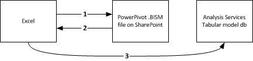

# Power Pivot BI Semantic Model Connection (.bism)
[!INCLUDE[ssas-appliesto-sqlas](../../includes/ssas-appliesto-sqlas.md)]
  A BI semantic model connection (.bism) is a portable connection that connects Excel or Power View reports to an Analysis Services tabular model database or an Analysis Services instance in multidimensional mode. If you are familiar with office data connection (.odc) files, you will notice a similarity in how a .bism connection file is defined and used.  
  
 A BI semantic model connection is created and accessed via SharePoint. Creating BI semantic model connections enables quick launch commands on a BI semantic model connection in a library. Quick launch commands open a new Excel workbook or options for editing the connection file. If Reporting Services is installed, you will also see a command to create a [!INCLUDE[ssCrescent](../../includes/sscrescent-md.md)] report.  
  
   
  
##   Supported databases  
 A BI semantic model connection points to tabular model data. There are three sources for this data:  
  
-   A tabular model database running on a standalone Analysis Services instance in tabular server mode. A deployment of a standalone Analysis Services instance is external to the farm. Accessing data sources off the farm requires additional permissions, which you can read about in this topic: [Create a BI Semantic Model Connection to a Tabular Model Database](../../analysis-services/power-pivot-sharepoint/create-a-bi-semantic-model-connection-to-a-tabular-model-database.md).  
  
-   [!INCLUDE[ssGemini](../../includes/ssgemini-md.md)] workbooks saved to SharePoint. Embedded [!INCLUDE[ssGemini](../../includes/ssgemini-md.md)] databases inside Excel workbooks are equivalent to tabular model databases that run on a standalone Analysis Services tabular mode server. If you already use [!INCLUDE[ssGemini](../../includes/ssgemini-md.md)] for Excel and [!INCLUDE[ssGemini](../../includes/ssgemini-md.md)] for SharePoint, you can define a BI semantic model connection that points to [!INCLUDE[ssGemini](../../includes/ssgemini-md.md)] workbooks in a SharePoint library and build [!INCLUDE[ssCrescent](../../includes/sscrescent-md.md)] reports using existing [!INCLUDE[ssGemini](../../includes/ssgemini-md.md)] data.  You can use workbooks created in either SQL Server 2008 R2 or [!INCLUDE[ssSQL11](../../includes/sssql11-md.md)] versions of [!INCLUDE[ssGemini](../../includes/ssgemini-md.md)] for Excel.  
  
-   A multidimensional data model on an Analysis Services instance.  
  
 For a comparison of the data sources, see the community content [Understanding the SQL Server 2012 BI Semantic Model (BISM)](http://www.mssqltips.com/sqlservertip/2818/understanding-the-sql-server-2012-bi-semantic-model-bism/).  
  
## Understanding the Connection Sequence for BI Semantic Connections  
 This section explains the connection behavior between various client applications, such as the Excel desktop application or the Power View reporting client on SharePoint, and a tabular model database inside or outside the SharePoint farm.  
  
 All connections to a tabular model database are made using the credentials of the user who is requesting the data. However, the mechanics of that connection will vary depending on whether the connection is an in-farm connection, a single or double-hop connection, and whether Kerberos is enabled. For more information about authenticated connections between SharePoint and backend data sources, see [Double-hop authentication: Why NTLM fails and Kerberos works](http://go.microsoft.com/fwlink/?LinkId=237137).  
  
 **Connecting from Excel to tabular data on a network**  
  
 When an Excel user specifies a BI semantic model connection as a data source, the connection information inside the .bism file is downloaded to the client application, which then issues its own direct request to the tabular model database on Analysis Services. To access the .bism connection, the Excel user must be a SharePoint user with read permissions on the .bism connection file. Once the connection information is downloaded, all subsequent connections bypass SharePoint, flowing directly from Excel to the backend tabular model database.  
  
 The following illustration shows this connection sequence. It starts with a request for the .bism connection, followed by the download of connection information to the client, and finally the single-hop connection to the database. The connection is made using the Windows credentials of the Excel user, who has read permissions on the Analysis Services database. It is a single hop, so even if Kerberos is enabled, it is not required for this scenario.  
  
   
  
 **Connecting from Power View to tabular data on a network**  
  
 When a SharePoint user clicks on a BI semantic connection in a document library, Power View (if it is installed), starts immediately and opens a connection to the tabular model database.  
  
 Connections between Power View and a tabular model database follow a double-hop authentication sequence where the user identity is flowed from the client to SharePoint, and then from SharePoint to a back-end Analysis Services tabular model database that runs outside of the farm. The ADOMD.NET client library that handles the connection request always tries Kerberos on the first attempt. If Kerberos is configured, the user identity is impersonated on the connection to the tabular model database, and the connection succeeds.  
  
 If Kerberos is not configured and the request fails, Reporting Services makes a second attempt. Under this scenario, the client library connects to Analysis Services using the Reporting Services service identity and NTLM authentication. The identity of the Power View user is passed on the connection string using the **effectiveusername** parameter.  
  
 Only a member of the system administrator role on the Analysis Services instance has permission to make a connection using the **effectiveusername** parameter and impersonate another user on the server instance. For this reason, the execution account of the Reporting Services shared service must have administrative rights on the Analysis Services instance.  Instructions for granting administrative permissions to the service account is provided in this topic, [Create a BI Semantic Model Connection to a Tabular Model Database](../../analysis-services/power-pivot-sharepoint/create-a-bi-semantic-model-connection-to-a-tabular-model-database.md).  
  
 The following illustration shows a connection sequence that uses the same Windows user identity for each connection. On the last connection to Analysis Services, the connection is made by the Reporting Services service application identity, passing the Windows user identity using **effectiveusername**.  
  
   
  
 **Connecting from Power View to [!INCLUDE[ssGemini](../../includes/ssgemini-md.md)] data in SharePoint**  
  
 When a SharePoint user clicks on a BI semantic connection that resolves to a [!INCLUDE[ssGemini](../../includes/ssgemini-md.md)] workbook in the same farm, the connections occur within the context of the SharePoint environment. A [!INCLUDE[ssGemini](../../includes/ssgemini-md.md)] service application handles the connection request, which it forwards to the Analysis Services instance on the same computer. The Analysis Services instance extracts the [!INCLUDE[ssGemini](../../includes/ssgemini-md.md)] data from the workbook and loads it. All subsequent connections are managed by [!INCLUDE[ssGemini](../../includes/ssgemini-md.md)] service applications in the farm.  
  
 In this scenario, all connections occur within the same farm, so there is no requirement for Kerberos or constrained delegation.  
  
##   Related Tasks  
 [Add a BI Semantic Model Connection Content Type to a Library &#40;Power Pivot for SharePoint&#41;](../../analysis-services/power-pivot-sharepoint/add-bi-semantic-model-connection-content-type-to-library.md)  
  
 [Create a BI Semantic Model Connection to a Power Pivot Workbook](../../analysis-services/power-pivot-sharepoint/create-a-bi-semantic-model-connection-to-a-power-pivot-workbook.md)  
  
 [Create a BI Semantic Model Connection to a Tabular Model Database](../../analysis-services/power-pivot-sharepoint/create-a-bi-semantic-model-connection-to-a-tabular-model-database.md)  
  
 [Use a BI Semantic Model Connection in Excel or Reporting Services](../../analysis-services/power-pivot-sharepoint/use-a-bi-semantic-model-connection-in-excel-or-reporting-services.md)  
  
## See Also  
 [Determine the Server Mode of an Analysis Services Instance](../../analysis-services/instances/determine-the-server-mode-of-an-analysis-services-instance.md)   
 [Connect to Analysis Services](../../analysis-services/instances/connect-to-analysis-services.md)  
  
  
