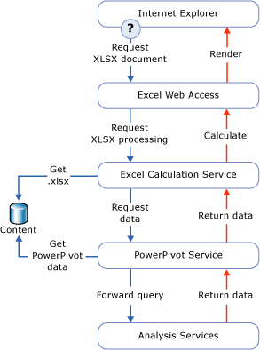

# Power Pivot Data Access
[!INCLUDE[ssas-appliesto-sqlas](../../includes/ssas-appliesto-sqlas.md)]
  This topic describes the ways in which data is retrieved from a [!INCLUDE[ssGemini](../../includes/ssgemini-md.md)] workbook that is published to a SharePoint library.  
  
 [!INCLUDE[ssGemini](../../includes/ssgemini-md.md)] data is stored inside an Excel workbook. The connection string is a URL to a workbook on a SharePoint site.  
  
 [!INCLUDE[ssGemini](../../includes/ssgemini-md.md)] data is most often used by the workbook that contains it, as the data behind PivotTables and PivotCharts. Alternatively, [!INCLUDE[ssGemini](../../includes/ssgemini-md.md)] data can also be used as an external data source, where a workbook, dashboard, or report connects to a separate Excel (.xlsx) file in SharePoint and retrieves the data for subsequent use. Client tools that typically use [!INCLUDE[ssGemini](../../includes/ssgemini-md.md)] data are Excel, [!INCLUDE[ssCrescent](../../includes/sscrescent-md.md)], other Reporting Services reports, and PerformancePoint.  
  
 On the desktop, the [!INCLUDE[ssGemini](../../includes/ssgemini-md.md)] add-in uses AMO and ADOMD.NET to create, process, and query the [!INCLUDE[ssGemini](../../includes/ssgemini-md.md)] data in the client workspace.  
  
 On a SharePoint farm, Excel Services uses the local MSOLAP OLE DB provider to connect to [!INCLUDE[ssGemini](../../includes/ssgemini-md.md)] data. The provider sends the connection request to a [!INCLUDE[ssGemini](../../includes/ssgemini-md.md)] for SharePoint server in the farm. That server loads the data, runs the query, and returns the result set.  
  
##   Querying Power Pivot Data in SharePoint  
 When you view a [!INCLUDE[ssGemini](../../includes/ssgemini-md.md)] workbook from a SharePoint library, the [!INCLUDE[ssGemini](../../includes/ssgemini-md.md)] data that is inside the workbook is detected, extracted, and processed separately on Analysis Services server instances within the farm, while Excel Services renders the presentation layer. You can view the fully-processed workbook in a browser window or in an Excel 2010 desktop application that has the [!INCLUDE[ssGemini](../../includes/ssgemini-md.md)] add-in.  
  
 The following diagram shows how a request for query processing moves through the farm. Because [!INCLUDE[ssGemini](../../includes/ssgemini-md.md)] data is part of an Excel 2010 workbook, a request for query processing occurs when a user opens an Excel workbook from a SharePoint library and interacts with a PivotTable or PivotChart that contains [!INCLUDE[ssGemini](../../includes/ssgemini-md.md)] data.  
  
   
  
 Excel Services and [!INCLUDE[ssGemini](../../includes/ssgemini-md.md)] for SharePoint components process different parts of the same workbook (.xlsx) file. Excel Services detects [!INCLUDE[ssGemini](../../includes/ssgemini-md.md)] data and requests processing from a [!INCLUDE[ssGemini](../../includes/ssgemini-md.md)] server in the farm. The [!INCLUDE[ssGemini](../../includes/ssgemini-md.md)] server allocates the request to an [!INCLUDE[ssGeminiSrv](../../includes/ssgeminisrv-md.md)] instance, which extracts the data from the workbook in the content library and loads the data. Data that is stored in memory is merged back into the rendered workbook, and passed back to Excel Web Access for presentation in a browser window.  
  
 Not all data in a [!INCLUDE[ssGemini](../../includes/ssgemini-md.md)] workbook is handled by [!INCLUDE[ssGemini](../../includes/ssgemini-md.md)] for SharePoint. Excel Services processes tables and cell data in a worksheet. Only PivotTables, PivotCharts, and Slicers that go against [!INCLUDE[ssGemini](../../includes/ssgemini-md.md)] data are handled by the [!INCLUDE[ssGemini](../../includes/ssgemini-md.md)] for SharePoint.  
  
## See Also  
 [Connect to Analysis Services](../../analysis-services/instances/connect-to-analysis-services.md)   

  
  
