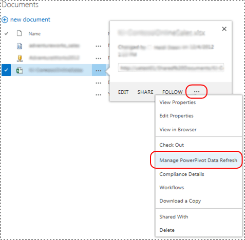

# Power Pivot Data Refresh with SharePoint 2013
[!INCLUDE[ssas-appliesto-sqlas](../../includes/ssas-appliesto-sqlas.md)]
  The design for refresh of [!INCLUDE[ssGemini](../../includes/ssgemini-md.md)] data models in SharePoint 2013 utilizes Excel Services as the primary component to load and refresh data models on an instance of [!INCLUDE[ssCurrent](../../includes/sscurrent-md.md)] [!INCLUDE[ssASnoversion](../../includes/ssasnoversion-md.md)] running in SharePoint mode. The [!INCLUDE[ssASnoversion](../../includes/ssasnoversion-md.md)] server runs external to the SharePoint farm. The architecture in SharePoint 2013 Excel Services supports both **interactive data refresh** and **scheduled data refresh**.  
  
 **[!INCLUDE[applies](../../includes/applies-md.md)]**  SharePoint 2013  
  
 **In this topic:**  
  
-   [Interactive Data Refresh](#bkmk_interactive_refresh)  
  
-   [Windows Authentication with Workbook Data Connections and Interactive Data Refresh](#bkmk_windows_auth_interactive_data_refresh)  
  
-   [Scheduled Data Refresh](#bkmk_scheduled_refresh)  
  
-   [Scheduled Data Refresh Architecture in SharePoint 2013](#bkmk_refresh_architecture)  
  
-   [Additional Authentication Considerations](#datarefresh_additional_authentication)  
  
-   [More Information](#bkmk_moreinformation)  
  
## Background  
 SharePoint Server 2013 Excel Services manages data refresh for Excel 2013 workbooks and triggers the data model processing on a [!INCLUDE[ssCurrent](../../includes/sscurrent-md.md)] [!INCLUDE[ssASnoversion](../../includes/ssasnoversion-md.md)] server that is running in SharePoint mode. For Excel 2010 workbooks, Excel Services also manages the loading and saving of workbooks and data models. However, Excel Services relies on the [!INCLUDE[ssGemini](../../includes/ssgemini-md.md)] System Service to send the processing commands to the data model. The following table summarizes the components that send processing commands for data refresh depending on the version of the workbook. The assumed environment is a SharePoint 2013 farm configured to use a [!INCLUDE[ssCurrent](../../includes/sscurrent-md.md)] Analysis Server running in SharePoint mode.  
  
||||  
|-|-|-|  
||Excel 2013 Workbooks|Excel 2010 Workbooks|  
|Trigger Data Refresh|**Interactive:** Authenticated User   **Scheduled:** [!INCLUDE[ssGemini](../../includes/ssgemini-md.md)] System Service|[!INCLUDE[ssGemini](../../includes/ssgemini-md.md)] System Service|  
|Load Workbook from Content Databases|SharePoint 2013 Excel Services|SharePoint 2013 Excel Services|  
|Load Data model on Analysis Services instance|SharePoint 2013 Excel Services|SharePoint 2013 Excel Services|  
|Send Processing Commands to Analysis Services instance|SharePoint 2013 Excel Services|[!INCLUDE[ssGemini](../../includes/ssgemini-md.md)] System Service|  
|Update Workbook Data|SharePoint 2013 Excel Services|SharePoint 2013 Excel Services|  
|Save Workbook and Data model to Content Database|**Interactive:** N/A   **Scheduled:** SharePoint 2013 Excel Services|SharePoint 2013 Excel Services|  
  
 The following table summarizes the supported refresh features in a SharePoint 2013 farm configured to use a [!INCLUDE[ssCurrent](../../includes/sscurrent-md.md)] Analysis Server running in SharePoint mode:  
  
|Workbook created in|Scheduled data refresh|Interactive refresh|  
|-------------------------|----------------------------|-------------------------|  
|2008 R2 [!INCLUDE[ssGemini](../../includes/ssgemini-md.md)] for Excel|Not supported. Upgrade the workbook **(\*)**|Not supported. Upgrade the workbook **(\*)**|  
|2012 [!INCLUDE[ssGemini](../../includes/ssgemini-md.md)] for Excel|Supported|Not supported. Upgrade the workbook **(\*)**|  
|Excel 2013|Supported|Supported|  
  
 **(\*)** For more information on workbook upgrades, see [Upgrade Workbooks and Scheduled Data Refresh &#40;SharePoint 2013&#41;](../../analysis-services/instances/install-windows/upgrade-workbooks-and-scheduled-data-refresh-sharepoint-2013.md).  
  
##   Interactive Data Refresh  
 Interactive, or manual data refresh in SharePoint Server 2013 Excel Services can refresh data models with data from the original data source. Interactive data refresh is available after you configure an Excel Services application by registering an [!INCLUDE[ssASnoversion](../../includes/ssasnoversion-md.md)] server, running in SharePoint mode. For more information, see [Manage Excel Services data model settings (SharePoint Server 2013)](http://technet.microsoft.com/library/jj219780.aspx) (http://technet.microsoft.com/library/jj219780.aspx).  
  
> [!NOTE]
>  Interactive data refresh is only available for workbooks that created in Excel 2013. If you try to refresh an Excel 2010 workbook, Excel Services displays an error message similar to " [!INCLUDE[ssGemini](../../includes/ssgemini-md.md)] Operation Failed: The Workbook was created in an older version of Excel and [!INCLUDE[ssGemini](../../includes/ssgemini-md.md)] cannot be refreshed until the file is upgraded". For more information on upgrading workbooks, see [Upgrade Workbooks and Scheduled Data Refresh &#40;SharePoint 2013&#41;](../../analysis-services/instances/install-windows/upgrade-workbooks-and-scheduled-data-refresh-sharepoint-2013.md).  
  
 **Interactive refresh key point of interest:**  
  
-   Interactive data refresh only refreshes the data in the current user session. The data is not automatically saved back to the workbook item in the SharePoint content database.  
  
-   **Credentials:** Interactive data refresh can use the identity of the currently logged-on user as credentials or stored credentials to connect to the data source. The  credentials used depend on the Excel Services Authentication Settings defined for the workbook connection to the external data source.  
  
-   **Supported Workbooks:**  Workbooks created in Excel 2013.  
  
 **To refresh data:**  
  
-   See the illustration that follows the steps.  
  
1.  In a SharePoint document library, open a [!INCLUDE[ssGemini](../../includes/ssgemini-md.md)] workbook in the browser.  
  
2.  In the browser window, click the **Data** menu and then click **Refresh Selected Connection** or **Refresh All Connections**.  
  
3.  Excel Services loads the [!INCLUDE[ssGemini](../../includes/ssgemini-md.md)] database, processes it and then queries it to refresh the Excel workbook cache.  
  
4.  **Note:** The updated workbook is not automatically saved back to the document library.  
  
   
  
###   Windows Authentication with Workbook Data Connections and Interactive Data Refresh  
 Excel Services sends the Analysis Services server a process command that instructs the server to impersonate a user account. To obtain system rights sufficient to perform the user impersonation-delegation process, the Analysis Services service account, requires **Act as part of the operating system** privilege on the local server. The Analysis Services server also needs to be able to delegate the user's credentials to data sources. The query result is sent to Excel Services.  
  
 Typical user experience: When a customer selects "Refresh All Connections" in an Excel 2013 workbook that contains a [!INCLUDE[ssGemini](../../includes/ssgemini-md.md)] model, they see an error message similar to the following:  
  
-   **External Data Refresh Failed:** An error occurred while working on the Data Model in the workbook. Please try again. We are unable to refresh one or more data connections in this workbook.  
  
 Depending on the data provider you are using, you see messages similar to the following in the ULS log.  
  
 **With the SQL Native Client:**  
  
-   Failed to create an external connection or execute a query. Provider message: Out of line object 'DataSource', referring to ID(s) '20102481-39c8-4d21-bf63-68f583ad22bb', has been specified but has not been used.  OLE DB or ODBC error: A network-related or instance-specific error has occurred while establishing a connection to SQL Server. Server is not found or not accessible. Check if instance name is correct and if SQL Server is configured to allow remote connections. For more information see SQL Server Books Online.; 08001; SSL Provider: The requested security package does not exist ; 08001; Client unable to establish connection; 08001; Encryption not supported on the client.; 08001.  , ConnectionName: ThisWorkbookDataModel, Workbook: book1.xlsx.  
  
 **With the Microsoft OLE DB Provider for SQL Server:**  
  
-   Failed to create an external connection or execute a query. Provider message: Out of line object 'DataSource', referring to ID(s) '6e711bfa-b62f-4879-a177-c5dd61d9c242', has been specified but has not been used. OLE DB or ODBC error. , ConnectionName: ThisWorkbookDataModel, Workbook: OLEDB Provider.xlsx.  
  
 **With the .NET Framework Data Provider for SQL Server:**  
  
-   Failed to create an external connection or execute a query. Provider message: Out of line object 'DataSource', referring to ID(s) 'f5fb916c-3eac-4d07-a542-531524c0d44a', has been specified but has not been used.  Errors in the high-level relational engine. The following exception occurred while the managed IDbConnection interface was being used: Could not load file or assembly 'System.Transactions, Version=4.0.0.0, Culture=neutral, PublicKeyToken=b77a5c561934e089' or one of its dependencies. Either a required impersonation level was not provided, or the provided impersonation level is invalid. (Exception from HRESULT: 0x80070542).  , ConnectionName: ThisWorkbookDataModel, Workbook: NETProvider.xlsx.  
  
 **Summary of Configuration Steps** To configure **Act as part of the operating system** privilege on the local server:  
  
1.  On the Analysis Services Server running in SharePoint mode, Add the Analysis Services service account to the "Act as part of the operating system" privilege:  
  
    1.  Run "`secpol.msc`"  
  
    2.  Click **Local Security Policy**, then click **Local policies**, and then click **User rights assignment**.  
  
    3.  Add the service account.  
  
2.  Restart Excel Services and reboot the Analysis Services server.  
  
3.  Delegation from the Excel Services service account or from Claims to Windows token service (C2WTS) to the Analysis services instance is not required. Therefore no configuration for KCD from Excel Services or C2WTS to [!INCLUDE[ssGemini](../../includes/ssgemini-md.md)] AS service is necessary. If the backend data source is on the same server as the [!INCLUDE[ssASnoversion](../../includes/ssasnoversion-md.md)] instance, Kerberos Constrained Delegation is not required. However, the [!INCLUDE[ssASnoversion](../../includes/ssasnoversion-md.md)] service account requires the right to Act As Part Of The Operating System.  
  
   
  
 For more information, see [Act as part of the operating system](http://technet.microsoft.com/library/cc784323\(WS.10\).aspx) (http://technet.microsoft.com/library/cc784323(WS.10).aspx).  
  
##   Scheduled Data Refresh  
 **Scheduled data refresh key points of interest:**  
  
-   Requires the deployment of the [!INCLUDE[ssGemini](../../includes/ssgemini-md.md)] for SharePoint add-in. For more information, see [Install or Uninstall the Power Pivot for SharePoint Add-in &#40;SharePoint 2013&#41;](../../analysis-services/instances/install-windows/install-or-uninstall-the-power-pivot-for-sharepoint-add-in-sharepoint-2013.md).  
  
-   A user configures a refresh schedule for a workbook. At the scheduled time, the [!INCLUDE[ssGemini](../../includes/ssgemini-md.md)] System Service sends a request to Excel Services to:  
  
    -   Load and process the [!INCLUDE[ssGemini](../../includes/ssgemini-md.md)] database.  
  
    -   Refresh the workbook.  
  
    -   Save the workbook back to the content database.  
  
-   **Credentials:** Uses stored credentials. Does not use the identity of the current user.  
  
-   **Supported Workbooks:** Workbooks created using the [!INCLUDE[ssSQL11](../../includes/sssql11-md.md)][!INCLUDE[ssGemini](../../includes/ssgemini-md.md)] add-in for Excel 2010 or using Excel 2013. Workbooks created in Excel 2010 with the [!INCLUDE[ssKilimanjaro](../../includes/sskilimanjaro-md.md)][!INCLUDE[ssGemini](../../includes/ssgemini-md.md)] add-in are not supported. Upgrade the workbook to at least the [!INCLUDE[ssSQL11](../../includes/sssql11-md.md)][!INCLUDE[ssGemini](../../includes/ssgemini-md.md)] format. For more information on workbook upgrades, see [Upgrade Workbooks and Scheduled Data Refresh &#40;SharePoint 2013&#41;](../../analysis-services/instances/install-windows/upgrade-workbooks-and-scheduled-data-refresh-sharepoint-2013.md).  
  
 To display the **Manage Data Refresh** page:  
  
-   See the illustration that follows the steps.  
  
1.  In a SharePoint document library, click the **Open menu** (**...**) for a [!INCLUDE[ssGemini](../../includes/ssgemini-md.md)] workbook.  
  
2.  Click the second **Open menu** and then click **Manage [!INCLUDE[ssGemini](../../includes/ssgemini-md.md)] Data Refresh**.  
  
3.  On the **Manage Data Refresh** page, click **Enable** and then configure the refresh schedule.  
  
4.  At the specified time, the [!INCLUDE[ssGemini](../../includes/ssgemini-md.md)] System Service sends a request to Excel Services to:  
  
    -   Load and process the [!INCLUDE[ssGemini](../../includes/ssgemini-md.md)] data model.  
  
    -   Refresh the workbook.  
  
    -   Save the workbook back to the content database.  
  
   
  
> [!TIP]  
>  For information on refreshing workbooks from SharePoint online, see [Refreshing Excel workbooks with embedded Power Pivot models from SharePoint Online (white paper)](http://technet.microsoft.com/library/jj992650.aspx) (http://technet.microsoft.com/library/jj992650.aspx).  
  
##   Scheduled Data Refresh Architecture in SharePoint 2013  
 The following illustration summarizes the data refresh architecture in SharePoint 2013 and SQL Server 2012 SP1.  
  
   
  
||Description||  
|-|-----------------|-|  
|**(1)**|Analysis Services Engine|An [!INCLUDE[ssCurrent](../../includes/sscurrent-md.md)][!INCLUDE[ssASnoversion](../../includes/ssasnoversion-md.md)] server that is running in SharePoint mode. The server runs outside of the SharePoint farm.|  
|**(2)**|User Interface|The user interface is comprised of two pages. One to define the schedule and the second to view the refresh history. The pages do not directly access the [!INCLUDE[ssGemini](../../includes/ssgemini-md.md)] Service application databases but use the [!INCLUDE[ssGemini](../../includes/ssgemini-md.md)] system service to access the databases.|  
|**(3)**|[!INCLUDE[ssGemini](../../includes/ssgemini-md.md)] System Service|The service is installed when you deploy the [!INCLUDE[ssGemini](../../includes/ssgemini-md.md)] for SharePoint add-in.   The service is used for the following:|  
|||This service hosts the refresh scheduling engine, which calls Excel Services APIs for data refresh of Excel 2013 workbooks. For Excel 2010 workbooks, the service directly performs the data model processing but continues to reply on Excel Services for loading the data model and updating the workbook.|  
|||This service provides methods for components such as the user interface pages, to communicate with the system service.|  
|||Manages requests for external access to workbooks as a data source, received through the [!INCLUDE[ssGemini](../../includes/ssgemini-md.md)] Web Service.|  
|||Scheduled data refresh request management for timer jobs and configuration pages. The service manages requests to read data in and out of the service application database and trigger data refresh with Excel Services.|  
|||Usage processing and related timer job.|  
|**(4)**|Excel Calculation Services|Responsible for loading the data models.|  
|**(5)**|Secure Store Service|If the authentication settings in the workbook are configured to **Use the authenticated user's account** or **None**, the credentials stored in the Secure Store target application ID are used for data refresh. For more information, see the [Additional Authentication Considerations](#datarefresh_additional_authentication) section in this topic.|  
|**(6)**|[!INCLUDE[ssGemini](../../includes/ssgemini-md.md)] data refresh timer Job|Instructs the [!INCLUDE[ssGemini](../../includes/ssgemini-md.md)] system service to connect with Excel Services for refreshing data models.|  
  
 [!INCLUDE[ssASnoversion](../../includes/ssasnoversion-md.md)] requires appropriate data providers and client libraries so that the [!INCLUDE[ssASnoversion](../../includes/ssasnoversion-md.md)] server in SharePoint mode can access data sources.  
  
> [!NOTE]  
>  Because the [!INCLUDE[ssGemini](../../includes/ssgemini-md.md)] system service no longer loads or saves [!INCLUDE[ssGemini](../../includes/ssgemini-md.md)] models, most of the settings for caching models on an application server do not apply to a SharePoint 2013 farm.  
  
## Data refresh log data  
 **Usage Data:** You can view data refresh usage data in the [!INCLUDE[ssGemini](../../includes/ssgemini-md.md)] Management Dashboard. To see the usage data:  
  
1.  In SharePoint Central Administration, click **[!INCLUDE[ssGemini](../../includes/ssgemini-md.md)] Management Dashboard** in the **General application settings** group.  
  
2.  At the bottom of the dashboard, see the **Data Refresh - Recent Activity** and **Data Refresh - Recent Failures**.  
  
3.  For more information on usage data and how to enable it, see [Power Pivot Management Dashboard and Usage Data](../../analysis-services/power-pivot-sharepoint/power-pivot-management-dashboard-and-usage-data.md).  
  
 **Diagnostic log data:** You can view SharePoint diagnostic log data related to data refresh. First, verify the configuration of diagnostic logging for the **[!INCLUDE[ssGemini](../../includes/ssgemini-md.md)] Service** in SharePoint Central Administration **Monitoring** page. You may need to increase the level of logging for the "least critical event" to log. For example, temporarily set the value to **Verbose** and then rerun data refresh operations.  
  
 The log entries contain:  
  
-   The **Area** of **[!INCLUDE[ssGemini](../../includes/ssgemini-md.md)] Service**.  
  
-   The category of **Data Refresh**.  
  
 Review the **configure diagnostic logging**. For more information, see [Configure and View SharePoint Log Files  and Diagnostic Logging &#40;Power Pivot for SharePoint&#41;](../../analysis-services/power-pivot-sharepoint/configure-and-view-sharepoint-and-diagnostic-logging.md).
  
##   Additional Authentication Considerations  
 The settings in the **Excel Services Authentication Settings** dialog in Excel 2013, determine the Windows identity that Excel Services and [!INCLUDE[ssASnoversion](../../includes/ssasnoversion-md.md)] use for data refresh.  
  
-   **Use the authenticated user's account**: Excel Services performs data refresh under the identity of the currently logged-in user.  
  
-   **Use a stored account**: Assumes a SharePoint Secure Store Service application ID, which Excel Services uses to retrieve the user name and password to authenticate data refresh authentication.  
  
-   **None**: The Excel Services **Unattended Service Account** is used. The service account is associated with a Secure Store Proxy. Configure the settings on the **Excel Services Application Settings** page, in the **External Data** section.  
  
 To open the authentication settings dialog:  
  
1.  Click the **Data** tab in Excel 2013.  
  
2.  Click **Connections** in the ribbon.  
  
3.  In the **Workbook connections dialog**, select the connection and click **Properties**.  
  
4.  In the **Connection properties** dialog, click **Definition**, and then click the **Authentication Settings...** button.  
  
   
  
 For more information on data refresh authentication and usage of credentials, see the blog post [Refreshing Power Pivot Data in SharePoint 2013](http://blogs.msdn.com/b/analysisservices/archive/2012/12/21/refreshing-powerpivot-data-in-sharepoint-2013.aspx).  
  
##   More Information  
 [Troubleshooting Power Pivot Data Refresh](http://social.technet.microsoft.com/wiki/contents/articles/3870.troubleshooting-powerpivot-data-refresh.aspx).  
  
 [Excel Services in SharePoint](/sharepoint/dev/general-development/excel-services-in-sharepoint).  
  
## See Also  
 [Install Analysis Services in Power Pivot Mode](../../analysis-services/instances/install-windows/install-analysis-services-in-power-pivot-mode.md)  
  
  
