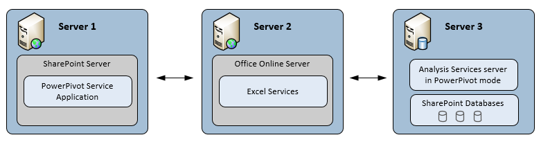

# Power Pivot for SharePoint (SSAS)
[!INCLUDE[ssas-appliesto-sqlas](../../includes/ssas-appliesto-sqlas.md)]
  An [!INCLUDE[ssASnoversion](../../includes/ssasnoversion-md.md)] server in [!INCLUDE[ssGemini](../../includes/ssgemini-md.md)] mode provides server hosting of [!INCLUDE[ssGemini](../../includes/ssgemini-md.md)] data in a SharePoint farm. [!INCLUDE[ssGemini](../../includes/ssgemini-md.md)] data is an analytical data model that you build using one of the following:  
  
-   The [!INCLUDE[ssGemini](../../includes/ssgemini-md.md)] for Excel 2010 add-in  
  
-   Excel 2013  
  
-   Excel 2016  
  
 **[!INCLUDE[applies](../../includes/applies-md.md)]**  [!INCLUDE[ssGeminiShort](../../includes/ssgeminishort-md.md)] 2016 | [!INCLUDE[ssGeminiShort](../../includes/ssgeminishort-md.md)] 2013  
  
 Server hosting of that data requires SharePoint, Excel Services, and an installation of [!INCLUDE[ssGemini](../../includes/ssgemini-md.md)] for SharePoint. Data is loaded on [!INCLUDE[ssGemini](../../includes/ssgemini-md.md)] for SharePoint instances where it can be refreshed at scheduled intervals using the [!INCLUDE[ssGemini](../../includes/ssgemini-md.md)] data refresh capability that the server provides for Excel 2010 workbooks, that the [!INCLUDE[ssGemini](../../includes/ssgemini-md.md)] provides for Excel 2013 and 2016 workbooks.  
  
## Power Pivot for SharePoint 2016  
 [!INCLUDE[ssCurrent](../../includes/sscurrent-md.md)] [!INCLUDE[ssGeminiShort](../../includes/ssgeminishort-md.md)] supports [!INCLUDE[msCoName](../../includes/msconame-md.md)] SharePoint 2016 and Office Online Server usage of Excel workbooks containing data models and [!INCLUDE[ssRSnoversion](../../includes/ssrsnoversion-md.md)] Power View reports.  
  
 Excel, within Office Online Server includes data model functionality to enable interaction with a [!INCLUDE[ssGemini](../../includes/ssgemini-md.md)] workbook in the browser. You do not need to deploy the [!INCLUDE[ssGemini](../../includes/ssgemini-md.md)] for SharePoint 2016 add-in into the farm. You only need to install an [!INCLUDE[ssASnoversion](../../includes/ssasnoversion-md.md)] server in [!INCLUDE[ssGemini](../../includes/ssgemini-md.md)] mode and register the server with Office Online Server.  
  
 Deploying the [!INCLUDE[ssGemini](../../includes/ssgemini-md.md)] for SharePoint 2016 add-in enables additional functionality and features in your SharePoint farm. The additional features include [!INCLUDE[ssGemini](../../includes/ssgemini-md.md)] Gallery and Schedule Data Refresh.  
  
   
  
## Power Pivot for SharePoint 2013  
 [!INCLUDE[ssCurrent](../../includes/sscurrent-md.md)] [!INCLUDE[ssGeminiShort](../../includes/ssgeminishort-md.md)] supports [!INCLUDE[msCoName](../../includes/msconame-md.md)] SharePoint 2013 Excel Services usage of Excel workbooks containing data models and [!INCLUDE[ssRSnoversion](../../includes/ssrsnoversion-md.md)] Power View reports.  
  
 Excel Services in SharePoint 2013 includes data model functionality to enable interaction with a [!INCLUDE[ssGemini](../../includes/ssgemini-md.md)] workbook in the browser. You do not need to deploy the [!INCLUDE[ssGemini](../../includes/ssgemini-md.md)] for SharePoint 2013 add-in into the farm. You only need to install an [!INCLUDE[ssASnoversion](../../includes/ssasnoversion-md.md)] server in SharePoint mode and register the server within the Excel Services **Data Model** settings.  
  
 Deploying the [!INCLUDE[ssGemini](../../includes/ssgemini-md.md)] for SharePoint 2013 add-in enables additional functionality and features in your SharePoint farm. The additional features include [!INCLUDE[ssGemini](../../includes/ssgemini-md.md)] Gallery, Schedule Data Refresh, and the [!INCLUDE[ssGemini](../../includes/ssgemini-md.md)] Management Dashboard.  
  
   
  
##   In This Section  
 [Power Pivot Server Administration and Configuration in Central Administration](../../analysis-services/power-pivot-sharepoint/power-pivot-server-administration-and-configuration-in-central-administration.md)  
  
 [Power Pivot Configuration using Windows PowerShell](../../analysis-services/power-pivot-sharepoint/power-pivot-configuration-using-windows-powershell.md)  
  
 [Power Pivot Configuration Tools](../../analysis-services/power-pivot-sharepoint/power-pivot-configuration-tools.md)  
  
 [Power Pivot Authentication and Authorization](../../analysis-services/power-pivot-sharepoint/power-pivot-authentication-and-authorization.md)  
  
 [Configure Power Pivot Health Rules](../../analysis-services/power-pivot-sharepoint/configure-power-pivot-health-rules.md)  
  
 [Power Pivot Management Dashboard and Usage Data](../../analysis-services/power-pivot-sharepoint/power-pivot-management-dashboard-and-usage-data.md)  
  
 [Power Pivot Gallery](http://msdn.microsoft.com/library/2a0db616-e08e-4062-aac8-979f8cad7794)  
  
 [Power Pivot Data Access](../../analysis-services/power-pivot-sharepoint/power-pivot-data-access.md)  
  
 [Power Pivot Data Refresh](../../analysis-services/power-pivot-sharepoint/power-pivot-data-refresh.md)  
  
 [Power Pivot Data Feeds](../../analysis-services/power-pivot-sharepoint/power-pivot-data-feeds.md)  
  
 [Power Pivot BI Semantic Model Connection &#40;.bism&#41;](../../analysis-services/power-pivot-sharepoint/power-pivot-bi-semantic-model-connection-bism.md)  
  
 **In other sections**  
  
## Additional topics  
 [Upgrade Power Pivot for SharePoint](../../database-engine/install-windows/upgrade-power-pivot-for-sharepoint.md)  
  
 [Install Analysis Services in Power Pivot Mode](../../analysis-services/instances/install-windows/install-analysis-services-in-power-pivot-mode.md)  
  
 [PowerShell Reference for Power Pivot for SharePoint](../../analysis-services/powershell/powershell-reference-for-power-pivot-for-sharepoint.md)  
  
 [Example License Topologies and Costs  for SQL Server 2016 Business Intelligence](http://msdn.microsoft.com/library/682b8711-407a-48d1-9807-415d4c24dad6)  
  
## See Also  
 [Power Pivot Planning and Deployment](http://go.microsoft.com/fwlink/?linkID=220972)   
 [Disaster Recovery for Power Pivot for SharePoint](http://go.microsoft.com/fwlink/p/?LinkId=389570)  
  
  
