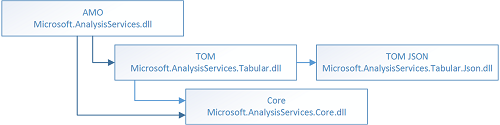

# Install, distribute, and reference the Tabular Object Model

[!INCLUDE[ssas-appliesto-sql2016-later-aas](../../includes/ssas-appliesto-sql2016-later-aas.md)]

This article explains how to download, reference, and redistribute Analysis Services Tabular Object Model (TOM), a C# library for creating and managing Tabular models and databases in managed code.  
  
TOM is an extension of the AMO client library (Microsoft.AnalysisServices.dll) that ships with SQL Server 2016. It works with Tabular models targeting the Tabular metadata engine in the SQL Server 2016 release. To use TOM, the model and database must be at compatibility level 1200 or higher.  

## AMO-TOM Assemblies

SQL Server 2016 refactors and expands AMO to include new Core, Tabular, and JSON assemblies. It also includes the original AMO assembly, Microsoft.AnalysisServices.dll, that has been part of Analysis Services since its first release. A restructured AMO offloads common classes to one assembly, and provides a logical division between Tabular and Multidimensional APIs through additional assemblies. 

The following table describes each assembly.
  
Assembly  |Functionality  |Important classes |
---------|---------|--------------  |
Core <br/>Microsoft.AnalysisServices.Core.dll | Common to both Tabular and Multidimensional databases. <br/><br/>Provides exception handling, generic connections to an Analysis Services instance and database, and access to common properties and methods for Server and Database objects. <br/><br/>It's required for any AMO solution targeting SQL Server 2016. | Core&nbsp;Server<br/>Core&nbsp;Database<br/>AmoException
TOM<br/> Microsoft.AnalysisServices.Tabular.dll, version 13.0.1601.5 or later.| Create and manage Tabular metadata objects. | TOM&nbsp;Server <br/>TOM&nbsp;Database<br /> Model<br /> Table<br /> Column<br /> Relationship
  AMO<br /> Microsoft.AnalysisServices.dll| Create and manage Multidimensional metadata objects, including Tabular 1050-1103 databases. | AMO&nbsp;Server <br />AMO&nbsp;Database <br /> Cube <br /> Dimension <br /> MeasureGroup 
Json<br/>Microsoft.AnalysisServices.Tabular.Json.dll | A helper DLL that wraps the NewtonSoftJson.dll (JSON.NET) to control updates, removing the risk of introducing functional changes to JSON serialization in Analysis Services workloads. <br /> <br />This DLL exists as a dependency in TOM and is not intended to be used directly in your code. | None.  
  
 ### Understanding assembly dependencies
  
To program against AMO, your solution must include references to dependent DLLs. Both AMO and TOM depend on Core because it provides base classes.

AMO depends on TOM because some classes in AMO reference classes from TOM. For example, the AMO Database object has a property Model of type Model, implemented in the TOM dll. 



You can't distribute Microsoft.AnalysisServices.dll without Microsoft.AnalysisServices.Tabular.dll, but you can reference their respective namespaces without the other.

### Choosing which namespace to use in code

In the [object hierarchy](../../analysis-services/tabular-model-programming-compatibility-level-1200/introduction-to-the-tabular-object-model-tom-in-analysis-services-amo.md) , any object below Database is either a Tabular metadata construction via the Model object, or a Multidimensional metadata construction via a Cube, Dimension, or MeasureGroup object. For high-level operations at the Server, Database, Role, or Trace level, the choice of which namespace to reference will depend on the workloads your code needs to support.

* Use Tabular.Server or Tabular.Database if your solution is compatibility level 1200 or higher, and the Database object you work with must provide access to Model, Table, Columns, and other objects expressed as Tabular metadata constructions.
* Use AnalysisServices.Server or AnalysisServices.Database if downstream code references Multidimensional objects such as Cubes, DataSources, DataSourceViews, and Dimensions.

You'll need both namespaces for tools and applications supporting a mix of databases and model types. 

Referencing the Core namespace in your code is unnecessary; the classes in Core are base classes created for the purpose of providing common properties, like Name and Description, for major objects.  
  
## Determine whether AMO and TOM installation is required  
   
 AMO and TOM are bundled together in a single client library. If you already installed either a SQL Server 2016 Analysis Services instance, the client libraries, or a version of SQL Server Data Tools that targets a 2016 instance of SQL Server, the Microsoft.AnalysisServices.dll is already installed.  
  
 To determine whether the assemblies are already installed, check any of these locations:
* C:\Windows\Microsoft.NET\assembly\GAC_MSIL
* C:\Program Files\Microsoft SQL Server\130\SDK\Assemblies
* C:\Program Files\Microsoft SQL Server\130\DTS\Tasks
* C:\Program Files\Microsoft SQL Server\MSAS13.MSSQLSERVER\OLAP\bin
 
 Verify the following assemblies exist:
*  Microsoft.AnalysisServices.Core.dll
*  Microsoft.AnalysisServices.dll
*  Microsoft.AnalysisServices.Tabular.dll
*  Microsoft.AnalysisServices.Tabular.Json.dll   
   
## Download SQL_AS_AMO  
 
 Note that Microsoft.AnalysisServices.dll is not available via NuGet manager.
  
1. Go to [Download page of the SQL Server 2016 Feature Pack](https://www.microsoft.com/download/details.aspx?id=52676).  
  
2. Click **Download**.  
  
3. Select either **\X64\SQL_AS_AMO.msi** or **\X86\SQL_AS_AMO.msi**. You can choose either one: AMO and TOM assemblies are platform-neutral.
  
4. Click **Next** to proceed with the download. You will find the .msi files in your **Downloads** folder.  
  
## Install SQL_AS_AMO  
  
1. Double-click **SQL_AS_AMO.msi** and step through the installation.  
  
2. Go to **C:\Program Files\Microsoft SQL Server\130\SDK\Assemblies** to confirm the placement of Microsoft.AnalysisServices.Core.dll, Microsoft.AnalysisServices.dll, Microsoft.AnalysisServices.Tabular.dll, and Microsoft.AnalysisServices.Tabular.Json.dll.   
  
## Add References  
  
1. In **Solution Explorer** > **Add Reference** > **Browse**.  
2. Go to **C:\Program Files\Microsoft SQL Server\130\SDK\Assemblies** and select:  
   * Microsoft.AnalysisServices.Core  
   * Microsoft.AnalysisServices.Tabular  
   * Microsoft.AnalysisSerivces.Tabular.Json  
  
3. Click **OK**.  In **Solution Explorer**, confirm the assemblies exist in the References folder.
  
4. In your code page, add the Microsoft.AnalysisServces.Tabular namespace if databases and models are Tabular 1200 or higher compatibility level. 
  
   ```   
   using Microsoft.AnalysisServices; 
   using Microsoft.AnalysisServices.Tabular;
   ```  
    Optionally, add Microsoft.AnalysisServces to support a broader set of connections to instances of Analysis Services that are not specifically SQL Server 2016 in Tabular server mode. 
 
    When including namespaces that have classes in common for Server, Database, Role, and Trace objects, avoid ambiguous references by qualifying which namespace you want to use (for example, Microsoft.AnalysisServices.Tabular.Server instantiates a Server object using the Tabular namespace).

## Redistribute AMO and TOM with your application  
  
Redistribution of AMO and TOM is through the **sql_as_amo.msi** installation package. If you are building a setup program for a client application that calls into AMO or TOM, add **sql_as_amo.msi** to your executable. This is the only supported mechanism for redistributing the AMO and TOM client libraries.  
  
The package is self-contained and provides all assemblies required for calling AMO and TOM in your code. Other packages, such as SQL_AS_OLEDB.msi or SQL_AS_ADOMD.msi, are not specifically required for TOM programming scenarios.