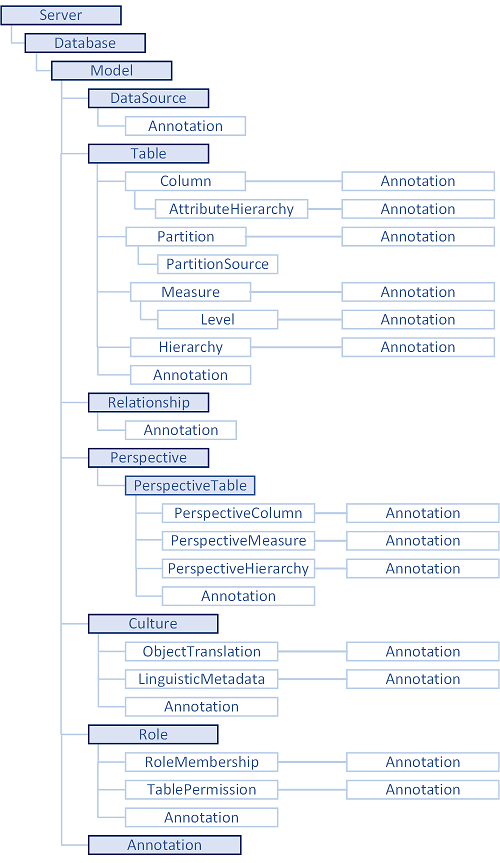

# Introduction to the Tabular Object Model (TOM) in Analysis Services AMO

[!INCLUDE[ssas-appliesto-sql2016-later-aas](../../includes/ssas-appliesto-sql2016-later-aas.md)]

  The Tabular object model (TOM) is an extension of the Analysis Services Management Object (AMO) client library, created to support programming scenarios for Tabular models built at compatibility level 1200 and higher. As with AMO, TOM provides a programmatic way to handle administrative functions like creating models, importing and refreshing data, and assigning roles and permissions.  
  
TOM exposes native tabular metadata, such as **model**, **tables**, **columns**, and **relationships** objects.  A high-level view of the object model tree, provided below, illustrates how the component parts are related.  
  
 Because TOM is an extension of AMO, all classes representing new Tabular objects introduced in SQL Server 2016 are implemented in a new Microsoft.AnalysisServices.Tabular.dll assembly. General-purpose classes of AMO were moved to Microsoft.AnalysisServices.Core assembly. Your code will need to reference both assemblies.
 See [Install, distribute, and reference the Tabular Object Model &#40;Microsoft.AnalysisServices.Tabular&#41;](../../analysis-services/tabular-model-programming-compatibility-level-1200/install-distribute-and-reference-the-tabular-object-model.md) for details.  
  
 Currently, the API is available only for managed code over the .NET framework. To review the full list of programming options, including script and query language support, see [Tabular Model Programming for Compatibility Level 1200](../../analysis-services/tabular-model-programming-compatibility-level-1200/tabular-model-programming-for-compatibility-level-1200.md).  
  
## Tabular object model hierarchy  
 From a logical perspective, all Tabular objects form a tree, the root of which is a **Model**, descended from Database. **Server** and **Database** are not considered "tabular" because these objects can also represent a Multidimensional database hosted on a server running in Multidimensional mode, or a Tabular model at a lower compatibility level that does not use Tabular metadata for object definitions. 
  
 With the exception of **AttributeHierarchy**, **KPI**, and **LinguisticMetadata**, each child object can be a member of a collection. For example, the **Model** object contains a collection of **Table** objects (via the **Tables** property), with each **Table** object containing a collection of **Column** objects, and so on.  
  
 The lowest level descendant of any parent object in this hierarchy is an **Annotation** object that can be used to optionally extend the schema as long as you provide the code to handle it.  
  
   
  
## TOM and other related technologies

TOM is built on top of the AMO infrastructure, which also accommodates Multidimensional and Tabular databases at compatibility levels below 1200.

This has some practical implications.
First of all, when you manage objects that are not specified in Tabular metadata (such as a **Server** or **Database**), you'll need to leverage parts of the existing AMO stack that describe those objects. Along with the legacy API is the concept of major and minor objects that provide granular descriptions of object state as discovered from the server, or when saved to the server. The MajorObject class under Microsoft.AnalysisServices namespace exposes methods for **Refresh** and **Update**. Minor objects are only refresh or saved via the major object that contains them.

In contrast, when you manage objects that are part of Tabular metadata (such as **Model** or **Table**), you leverage a completely new Tabular stack. Within this stack, updates are fine-grained, which means every metadata object (derived from the **MetadataObject** class under the Microsoft.AnalysisServices.Tabular namespace) can be individually saved to the server. Typically, you would discover the entire **Model**, then make changes to individual metadata objects under it (such as **Table** or **Column**), then call **Model.SaveChanges()** method (which understands changes made by you at fine-grained level), sending commands to the server to update only those objects that changed.

### TOM and XMLA

On the wire, TOM uses the XMLA protocol to communicate with the Analysis Services server and to manage objects. When managing non-tabular objects, TOM uses [ASSL](../scripting/analysis-services-scripting-language-assl-for-xmla.md), the Analysis Services Scripting Language extension of XMLA. When managing tabular objects, TOM uses the SSAS tabular protocol, also an extension of XMLA. See [MS-SSAS-T SQL Server Analysis Services Tabular protocol documentation](https://msdn.microsoft.com/library/mt719260.aspx) for more information.

### TOM and JSON

Tabular metadata, which is structured as JSON documents, has a new command and object model definition syntax via the Tabular Model Scripting Language [TMSL](../tabular-model-scripting-language-tmsl-reference.md). The scripting language uses JSON for the body of requests and responses.

Although both TMSL and TOM expose same objects (**Table**, **Column**, and so forth) and the same operations (**Create**, **Delete**, **Refresh**), TOM does not use TMSL on the wire (it uses the MS-SSAS tabular protocol instead, as previously noted).

As a user, you can choose whether to manage tabular databases through the TOM library from your C# program or PowerShell script, or through TMSL script executed through PowerShell, SQL Server Management Studio (SSMS) or a SQL Server Agent Job.

The decision to use one or the other will come down to the specifics of your requirements. The TOM library provides richer functionality compared to TMSL. Specifically, whereas TMSL only offers coarse-grained operations at the Database, Table, Partition, or Role level, TOM allows operations at a much finer grain. To generate or update models programmatically, you will need the full extent of the API in the TOM library.
  
## See Also  
 [Tabular Model Programming for Compatibility Level 1200](../../analysis-services/tabular-model-programming-compatibility-level-1200/tabular-model-programming-for-compatibility-level-1200.md)   
 [Compatibility Level for Tabular models in Analysis Services](../../analysis-services/tabular-models/compatibility-level-for-tabular-models-in-analysis-services.md)  
[Analysis Services PowerShell](../../analysis-services/powershell/analysis-services-powershell-reference.md)
  