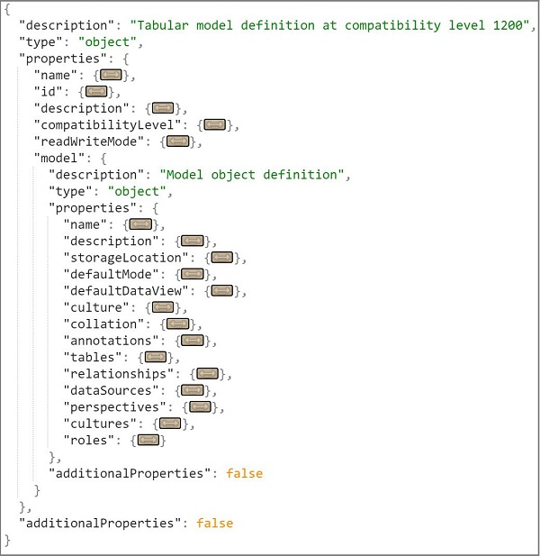

# Tabular Model Scripting Language (TMSL) Reference
  Tabular Model Scripting Language (TMSL) is the command and object model definition syntax for Analysis Services tabular model databases at compatibility level 1200 or higher. TMSL communicates to Analysis Services  through the XMLA protocol, where the [XMLA.Execute](../analysis-services/xmla/xml-elements-methods-execute.md) method accepts both JSON-based **statement** scripts in TMSL as well as the traditional XML-based scripts in [Analysis Services Scripting Language &#40;ASSL for XMLA&#41;](../analysis-services/scripting/analysis-services-scripting-language-assl-for-xmla.md).  
  
 Key elements of TMSL include the following:  
  
-   Tabular metadata based on tabular model semantics. A tabular model is composed of tables, columns, and relationships. Equivalent object definitions in TMSL are now, not surprisingly, tables, columns, relationships, and so forth.  
  
     A new metadata engine supports these definitions.  
  
-   Object definitions are  structured as JSON instead of XML.  
  
 With the exception of how the payload is formatted (in either JSON or XML), both TMSL and ASSL are functionally equivalent in how they provide commands and metadata  to XMLA methods used for server communication and data transfer.  
  
## How to use TMSL  
 The easiest way to  explore TMSL scripting is using the CREATE, ALTER, DELETE, or Process commands in SQL Server Management Studio (SSMS) on a model you already know. Assuming you're using an existing model, remember to upgrade it to compatibility level 1200 or higher first.  
  
1.  Find the command you want to use: [Commands in Tabular Model Scripting Language &#40;TMSL&#41;](../analysis-services/tabular-models-scripting-language-commands/tmsl-reference-commands.md)  
  
2.  Check the object definition reference for objects used in the command: [Object Definitions in Tabular Model Scripting Language &#40;TMSL&#41;](../analysis-services/tabular-models-scripting-language-objects/tmsl-reference-tabular-objects.md)  
  
3.  Choose a method for submitting TMSL script:  
  
    -   XMLA window in Management Studio  
  
    -   **invoke-ascmd** via AMO PowerShell ([Invoke-ASCmd cmdlet](../analysis-services/powershell/invoke-ascmd-cmdlet.md))  
  
    -   [Analysis Services Execute DDL Task](../integration-services/control-flow/analysis-services-execute-ddl-task.md) in SSIS.  
  
## Model definition schema  
 The following screenshot shows an abbreviated version of the schema, collapsed to show the major objects.  
  
   
  
## Scripting languages in Analysis Services  
 Analysis Services supports ASSL and TMSL scripting languages. Only tabular models created at the 1200 compatibility level or higher are described in TMS in JSON format.  
  
 [Analysis Services Scripting Language &#40;ASSL for XMLA&#41;](../analysis-services/scripting/analysis-services-scripting-language-assl-for-xmla.md) was the first scripting language, and is still the only scripting language for Multidimensional models and Tabular models at lower compatibility levels (1100 or 1103). In ASSL, tabular models at 110x are described in multidimensional terms, such as **cube** (for a model) and **measuregroup** (for a table).  
  
> [!NOTE]  
>  In [SQL Server Data Tools (SSDT), you can upgrade an earlier version tabular model to use TMSL by switching up its **CompatibilityLevel** to 1200 or higher. Remember that upgrade is irreversible. Prior to upgrading, back up your model in case you need the original version later.  
  
 The following table is the scripting language matrix for Analysis Services data models across different versions, at specific compatibility levels.  

||||||  
|-|-|-|-|-|  
|**Version**|**Multidimensional**|**Tabular 110x**|**Tabular 1200**| **Tabular 1400** |
|Azure Analysis Services|NA|NA|TMSL|TMSL| 
|SQL Server 2017|ASSL|ASSL|TMSL|TMSL| 
|SQL Server 2016|ASSL|ASSL|TMSL|TMSL| 
|SQL Server 2014|ASSL|ASSL|NA|NA|   
|SQL Server 2012|ASSL|ASSL|NA|NA|  

  
## See Also  
 [Compatibility Level for Tabular models in Analysis Services](../analysis-services/tabular-models/compatibility-level-for-tabular-models-in-analysis-services.md)   
 [Analysis Services Scripting Language &#40;ASSL for XMLA&#41;](../analysis-services/scripting/analysis-services-scripting-language-assl-for-xmla.md)   
 [Determine the Server Mode of an Analysis Services Instance](../analysis-services/instances/determine-the-server-mode-of-an-analysis-services-instance.md)  
  
  