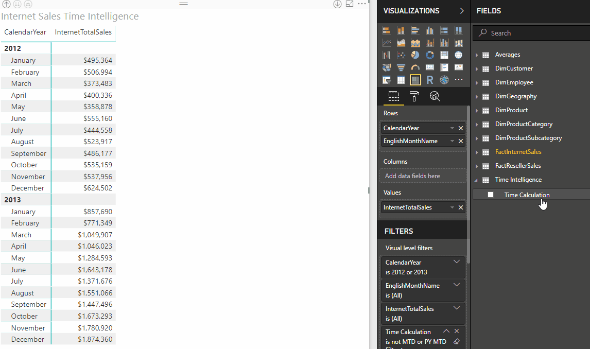

# Calculation groups
 
[!INCLUDE[ssas-appliesto-sqlas-aas](../../includes/ssas-appliesto-sqlas-aas.md)]

Calculation groups address a common issue in complex models where there can be a proliferation of measures using the same calculations, such as time-intelligence. Calculation groups are shown in reporting clients as a table with a single column. Each value in the column represents a reusable calculation, or calculation item, that can be applied to any of the measures.


Calculation groups provide many benefits, for example:

> [!div class="checklist"]
> * Reduces the number of common measures
> * Dynamic format strings
> * MDX query support

Calculation groups are supported in Azure Analysis Services and SQL Server Analysis Services 2019 tabular models at the 1470 and higher [compatibility level](compatibility-level-for-tabular-models-in-analysis-services.md). Keep in mind, models at the 1470 compatibility level cannot be deployed to SQL Server 2017 or earlier, or downgraded to a lower compatibility level. 

### Calculation items

## Benefits

To users, calculated groups appear as a table with a single column.

In the following animation, the user is analyzing sales data for years 2012 and 2013, with the InternetTotalSales measure calculating an aggregate sum for total sales for each month. 

The user then applies a calculation group, **Time Intelligence** which appears as a table. A calculation item named **Time Calculation** appears as a column in the Time Intelligence table. When the user drags the Time Calculation item to **Columns**,  


 
## How they work 

## Example


Table name is **Time Intelligence**.   
Column name is **Time Calculation**.   
Precedence is **20**.   

### Calculation items

#### "Current"

```dax
SELECTEDMEASURE()
```

#### "MTD"

```dax
CALCULATE(SELECTEDMEASURE(), DATESMTD(DimDate[Date]))
```

#### "QTD"

```dax
CALCULATE(SELECTEDMEASURE(), DATESQTD(DimDate[Date]))
```

#### "YTD"

```dax
CALCULATE(SELECTEDMEASURE(), DATESYTD(DimDate[Date]))
```

#### "PY"

```dax
CALCULATE(SELECTEDMEASURE(), SAMEPERIODLASTYEAR(DimDate[Date]))
```

#### "PY MTD"

```dax
CALCULATE(
    SELECTEDMEASURE(),
    SAMEPERIODLASTYEAR(DimDate[Date]),
    'Time Intelligence'[Time Calculation] = "MTD"
)
```


#### "PY QTD"

```dax
CALCULATE(
    SELECTEDMEASURE(),
    SAMEPERIODLASTYEAR(DimDate[Date]),
    'Time Intelligence'[Time Calculation] = "QTD"
)
```

#### "PY YTD"

```dax
CALCULATE(
    SELECTEDMEASURE(),
    SAMEPERIODLASTYEAR(DimDate[Date]),
    'Time Intelligence'[Time Calculation] = "YTD"
)
```

#### "YOY"

```dax
SELECTEDMEASURE() –
CALCULATE(
    SELECTEDMEASURE(),
    'Time Intelligence'[Time Calculation] = "PY"
)
```

#### "YOY%"

```dax
DIVIDE(
    CALCULATE(
        SELECTEDMEASURE(),
        'Time Intelligence'[Time Calculation]="YOY"
    ),
    CALCULATE(
        SELECTEDMEASURE(),
        'Time Intelligence'[Time Calculation]="PY"
    ),
)
```

Here's a DAX query and return table. 

### Query

```dax
EVALUATE
CALCULATETABLE (
    SUMMARIZECOLUMNS (
        DimDate[CalendarYear],
        DimDate[EnglishMonthName],
        "Current", CALCULATE ( [InternetTotalSales], 'Time Intelligence'[Time Calculation] = "Current" ),
        "QTD",     CALCULATE ( [InternetTotalSales], 'Time Intelligence'[Time Calculation] = "QTD" ),
        "YTD",     CALCULATE ( [InternetTotalSales], 'Time Intelligence'[Time Calculation] = "YTD" ),
        "PY",      CALCULATE ( [InternetTotalSales], 'Time Intelligence'[Time Calculation] = "PY" ),
        "PY QTD",  CALCULATE ( [InternetTotalSales], 'Time Intelligence'[Time Calculation] = "PY QTD" ),
        "PY YTD",  CALCULATE ( [InternetTotalSales], 'Time Intelligence'[Time Calculation] = "PY YTD" )
    ),
    DimDate[CalendarYear] IN { 2012, 2013 }
)
```

### Return table

The return shows the calculations applied. For example, QTD for March 2012 is the sum of January, February and March 2012.


## Dynamic format strings

*Dynamic format strings* with calculation groups allow conditional application of format strings to measures without forcing them to return strings.

Tabular models support dynamic formatting of measures using DAX's [FORMAT](https://docs.microsoft.com/dax/format-function-dax) function. However, the FORMAT function has the disadvantage of returning a string, forcing measures that would otherwise be numeric to also be returned as a string. This causes limitations such as not working with most Power BI visuals depending on numeric values like charts, etc.

If we look at the time-intelligence example shown above, all the calculation items except **YOY%** should use the format of the current measure in context. **Sales YTD** should be currency and **Orders YTD** should be a whole number. **YOY%**, however, should be a percentage regardless of the format of the base measure.

For **YOY%**, we can override the format string by setting the format string expression property to **0.00%;-0.00%;0.00%**. To learn more about format string expression properties, see [MDX Cell Properties - FORMAT STRING  Contents](../multidimensional-models/mdx/mdx-cell-properties-format-string-contents.md#numeric-values).

In this matrix visual in Power BI, you see **Sales Current/YOY** and **Orders Current/YOY** retain their respective base measure format strings. **Sales YOY%** and **Orders YOY%** however, override the format string to use *percentage* format.


## Sideways recursion

Some of the calculation items refer to other ones in the same calculation group. This is called “sideways recursion”. For example, YOY% (shown below for easy reference) refers to 2 other calculation items, but they are evaluated separately using different calculate statements. Other types of recursion are not supported (see below).

```dax
DIVIDE(
    CALCULATE(
        SELECTEDMEASURE(),
        'Time Intelligence'[Time Calculation]="YOY"
    ),
    CALCULATE(
        SELECTEDMEASURE(),
        'Time Intelligence'[Time Calculation]="PY"
    ),
)
```

## Single calculation item in filter context

Here's the definition of **PY YTD**:

```dax
CALCULATE(
    SELECTEDMEASURE(),
    SAMEPERIODLASTYEAR(DimDate[Date]),
    'Time Intelligence'[Time Calculation] = "YTD"
)
```

The YTD argument to the CALCULATE() function overrides the filter context to reuse the logic already defined in the YTD calculation item. It is not possible to apply both PY and YTD in a single evaluation. Calculation groups are *only applied* if a single calculation item from the calculation group is in filter context, as shown in the following query and return table.


### Query

```dax
EVALUATE
CALCULATETABLE (
    SUMMARIZECOLUMNS (
        DimDate[CalendarYear],
        DimDate[EnglishMonthName],

        //No time intelligence applied: all calc items in filter context:
        "InternetTotalSales", [InternetTotalSales],

        //No time intelligence applied: 2 calc items in filter context:
        "PY || YTD", CALCULATE ( [InternetTotalSales],
            'Time Intelligence'[Time Calculation] = "PY" || 'Time Intelligence'[Time Calculation] = "YTD"
        ),

        //YTD applied: exactly 1 calc item in filter context:
        "YTD", CALCULATE ( [InternetTotalSales], 'Time Intelligence'[Time Calculation] = "YTD" )
    ),
    DimDate[CalendarYear] = 2012
)
```

### Return table


as-cacl-groups-single-calc-item

A calculation group should be designed so that each calculation item within it presented to the end user only makes sense to be applied *one at a time*. If there is a business requirement to allow the end user to apply more than one calculation item at a time, multiple calculation groups should be used with different precedence.

## Precedence

In the same model as the time-intelligence example above, the following calculation group also exists. It contains average calculations that are independent of traditional time intelligence in that they don’t change the date filter context; they just apply average calculations within it.

In this example, a daily average calculation is defined. It is common in oil-and-gas applications to use calculations such as “barrels of oil per day”. Other common business examples include “store sales average” in the retail industry.

While such calculations are calculated independently of time-intelligence calculations, there may well be a requirement to combine them. For example, the end-user might want to see “YTD barrels of oil per day” to view the daily-oil rate from the beginning of the year to the current date. In this scenario, precedence should be set for calculation items.

Table name is **Time Intelligence**.   
Column name is **Time Calculation**.   
Precedence is **20**.   

### Calculation item

#### "No Average"

```dax
SELECTEDMEASURE()
```

#### "Daily Average"

```dax
DIVIDE(SELECTEDMEASURE(), COUNTROWS(DimDate))


```

Here's a DAX query and return table:

### Query

```dax
EVALUATE
    CALCULATETABLE (
        SUMMARIZECOLUMNS (
        DimDate[CalendarYear],
        DimDate[EnglishMonthName],
        "InternetTotalSales", CALCULATE (
            [InternetTotalSales],
            'Time Intelligence'[Time Calculation] = "Current",
            'Averages'[Average Calculation] = "No Average"
        ),
        "YTD", CALCULATE (
            [InternetTotalSales],
            'Time Intelligence'[Time Calculation] = "YTD",
            'Averages'[Average Calculation] = "No Average"
        ),
        "Daily Average", CALCULATE (
            [InternetTotalSales],
            'Time Intelligence'[Time Calculation] = "Current",
            'Averages'[Average Calculation] = "Daily Average"
        ),
        "YTD Daily Average", CALCULATE (
            [InternetTotalSales],
            'Time Intelligence'[Time Calculation] = "YTD",
            'Averages'[Average Calculation] = "Daily Average"
        )
    ),
    DimDate[CalendarYear] = 2012
)
```

### Return


The following table shows how the March 2012 values are calculated.


|Column name  |Calculation |
|---------|---------|
|YTD     |    Sum of InternetTotalSales for Jan, Feb, Mar 2012<br />= 495,364 + 506,994 + 373,483     |
|Daily Average    |  	InternetTotalSales for Mar 2012 divided by # of days in March<br />= 373,483 / 31       |
|YTD Daily Average     | YTD for Mar 2012 divided by # of days in Jan, Feb and Mar<br />=  1,375,841 / (31 + 29 + 31)       |

Here's the definition of the YTD calculation item, applied with **Precedence of 20**.

```dax
CALCULATE(SELECTEDMEASURE(), DATESYTD(DimDate[Date]))
```

Here's Daily Average, applied with a **Precedence of 10**.

```dax
DIVIDE(SELECTEDMEASURE(), COUNTROWS(DimDate))
```

Since the precedence of the Time Intelligence calculation group is higher than the Averages one, it is applied as broadly as possible. The YTD Daily Average calculation applies YTD to both the numerator *and the denominator* (count of days) of the daily average calculation.

This is equivalent to this calculation:

```dax
CALCULATE(DIVIDE(SELECTEDMEASURE(), COUNTROWS(DimDate)), DATESYTD(DimDate[Date]))
```

Not:

```dax
DIVIDE(CALCULATE(SELECTEDMEASURE(), DATESYTD(DimDate[Date])), COUNTROWS(DimDate)))
```


## Create calculation groups

Currently, creating calculation groups in SQL Server Data Tools or Visual Studio with Analysis Services extensions is not supported. It will be included in updates closer to SQL Server 2019 general availability (GA). Until that time, you can create calculation groups by using TMSL script in SQL Server Management Studio (SSMS) or by using the open source Tabular Editor.

### By using Tabular Editor

[Tabular Editor](https://github.com/otykier/TabularEditor) is an open source tool available on GitHub. Version 2.9.1 and higher support creating calculation groups.

## DAX functions

DAX includes three functions specific to working with calculation groups.

[ISSELECTEDMEASURE](https://docs.microsoft.com/dax/isselectedmeasure-function-dax) - Used by expressions for calculation items to determine the measure that is in context is one of those specified in a list of measures.

[SELECTEDMEASURE](https://docs.microsoft.com/dax/selectedmeasure-function-dax) - Used by expressions for calculation items to reference the measure that is in context.

[SELECTEDMEASURENAME](https://docs.microsoft.com/dax/selectedmeasurename-function-dax) - Used by expressions for calculation items to determine the measure that is in context by name.

## Data Management View (DMV) queries

By using [Data Management Views](../instances/use-dynamic-management-views-dmvs-to-monitor-analysis-services.md), you can query schema rowsets that return information about calculation groups in your model. The following schema rowsets have been introduced for calculation groups: 

- TMSCHEMA_CALCULATION_GROUPS   
- TMSCHEMA_CALCULATION_ITEMS   
 
## See also  

  
  
