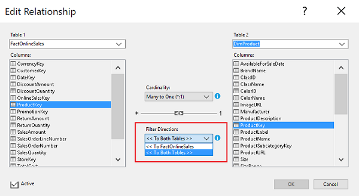
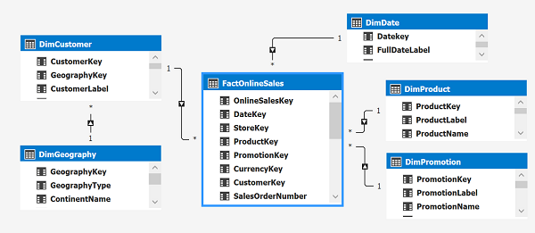
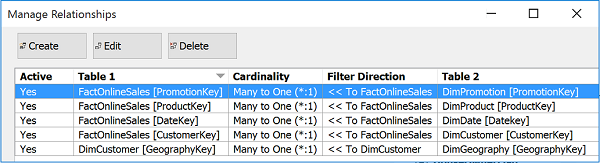
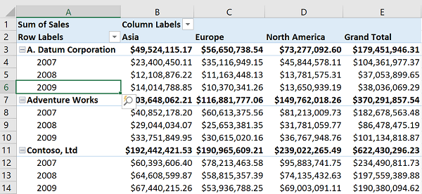
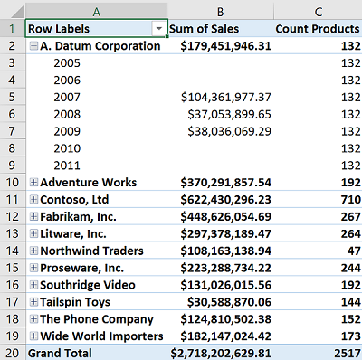
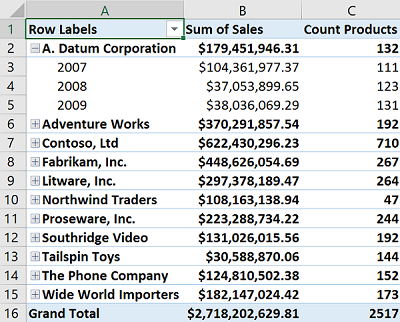
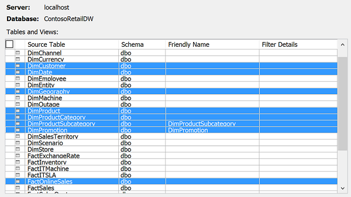

# Bi-directional cross filters in tabular models
[!INCLUDE[ssas-appliesto-sqlas-aas](../../includes/ssas-appliesto-sqlas-aas.md)]
  New in SQL Server 2016 is a built-in approach for enabling *bi-directional cross filters* in tabular models, eliminating the need for hand-crafted DAX workarounds for propagating filter context across table relationships.  
  
 Breaking the concept down into its component parts: *cross filtering* is the ability to set a filter context on a table based on values in a related table, and *bi-directional* is the transference of a filter context to second related table on the other side of a table relationship. As the name implies, you can slice in both directions of the relationship rather than just one way.  Internally, two-way filtering expands filter context to query a superset of your data.  
  
   
  
 There are two types of cross filters: One-way and two-way filtering. One-way is the traditional many-to-one filter direction between fact and dimensional tables in that relationship. Two-way is a cross-filter that enables the filter context of one relationship to be used as the filter context for another table relationship, with  one table common to both relationships.  
  
 Given **DimDate** and **DimProduct** with foreign key relationships to **FactOnlineSales**, a two-way cross filter is equivalent of **FactOnlineSales-to-DimDate** plus **FactOnlineSales-to-DimProduct** used simultaneously.  
  
 Bi-directional cross filters can be an easy  fix to the many-to-many query design problem that has challenged tabular and Power Pivot developers in the past. If you've used the DAX workaround for many-to-many relationships in tabular or Power Pivot models, you can try applying a two-way filter to see if it produces expected results.  
  
 When creating a bi-directional cross filter, keep the following points in mind:  
  
-   Think before you enable two-way filters.  
  
     If you enable two-way filters everywhere, your data could be over-filtered in ways that you might not expect.  You might also inadvertently introduce ambiguity by creating more than one potential query path. To avoid both issues, plan on using a  combination of one-way and two-way filters.  
  
-   Do incremental testing to verify the impact of each filter change on your model. [Analyze in Excel](../../analysis-services/tabular-models/analyze-a-tabular-model-in-excel-ssas-tabular.md) works well for incremental testing. As a best practice, periodically follow that up with tests using other reporting clients so that there are no surprises later.  
  
> [!NOTE]  
>  Starting in CTP 3.2, SSDT includes a default that determines whether bi-directional cross filters are attempted automatically. If you enable bi-directional filters by default, SSDT  will enable two-way filtering only if the model clearly articulates one query path through a chain of table relationships.  
  
## Set the default  
 Single directional filters are the default. You can change the default for all new projects created in the designer, or on the model itself when the project already exists.  
  
 At the project level, the setting is evaluated when you create the project so if you change the default to bi-directional, you'll see the effects of your selection when you create the next project.  
  
1.  In SSDT, select **Tools** > **Options** > **Analysis Services Tabular Designers** > **New project settings**.  
  
2.  Set **Default filter direction** to either **Single direction** or **Both directions**.  
  
 Alternatively, you can change the default on the model.  
  
1.  In Solution Explorer, select **Model.bim** > **Properties** ,  
  
2.  Set **Default filter direction** to either **Single direction** or **Both directions**.  
  
## Walkthrough an example  
 The best way to appreciate the value of bi-directional cross filtering is through an  example. Consider the following dataset from [ContosoRetailDW](http://www.microsoft.com/en-us/download/details.aspx?id=18279), reflecting the cardinality and cross-filters that are created by default.  
  
   
  
> [!NOTE]  
>  By default, during data import, table relationships are created for you in many-to-one configurations derived from the foreign key and primary key relationships between the fact table and related dimension tables.  
  
 Notice that the filter direction is from dimension tables to the fact table -- promotions, products, dates, customer, and customer geography are all valid filters that successfully yield some aggregation of a measure, with the actual value varying based on the dimensions used.  
  
   
  
 For this simple star schema, testing in Excel confirms that data slices nicely when filtering flows from dimension tables on rows and columns to aggregated data provided by a **Sum of Sales** measure located in the central **FactOnlineSales** table.  
  
   
  
 As long as measures are pulled from the fact table and the filter context terminates at the fact table, the aggregations will be filtered correctly for this model. But what happens if you want to create measures elsewhere, such as a distinct count in the products or customer table, or an average discount in the promotion table, and have an existing filter context extend to that measure.  
  
 Let's try it out by adding a distinct count from **DimProducts** to the PivotTable. Notice the repeating values for **Count Products**. At first glance, this looks like a missing table relationship, but in our model, we can see that all the relationships are fully defined and active. In this case, the repeating values occur because there is no date filter on rows in the product table.  
  
   
  
 After adding a two-way cross filter between **FactOnlineSales** and **DimProduct**, the rows in the product table  are now correctly filtered by manufacturer and date.  
  
   
  
## Learn step-by-step  
 You can try out bi-directional cross filters by stepping through this walkthrough. To follow along, you'll need:  
  
-   SQL Server 2016 Analysis Services instance, tabular mode, latest CTP release  
  
-   [SQL Server Data Tools for Visual Studio 2015 (SSDT)](http://go.microsoft.com/fwlink/p/?LinkID=627574), co-released with the latest CTP.  
  
-   [ContosoRetailDW](http://www.microsoft.com/en-us/download/details.aspx?id=18279)  
  
-   Read permissions on this data.  
  
-   Excel (for use with Analyze in Excel)  
  
### Create a project  
  
1.  Start SQL Server Data Tools for Visual Studio 2015.  
  
2.  Click **File** > **New** > **Project** > **Analysis Services Tabular Model**.  
  
3.  In Tabular Model Designer, set the workspace database to a SQL Server 2016 Preview Analysis Services instance in tabular server mode.  
  
4.  Verify model compatibility level is set to **SQL Server 2016 RTM (1200)** or higher.  
  
     Click **OK** to create the project.  
  
### Add Data  
  
1.  Click **Model** > **Import from Data Source** > **Microsoft SQL Server**.  
  
2.  Specify the server, database, and authentication method.  
  
3.  Choose the ContosoRetailDW database.  
  
4.  Click **Next**.  
  
5.  On table selection, ctrl-select the following tables:  
  
    -   FactOnlineSales  
  
    -   DimCustomer  
  
    -   DimDate  
  
    -   DimGeography  
  
    -   DimPromotion  
  
     You can edit the names at this point  if you want them to be more readable in the model.  
  
       
  
6.  Import the data.  
  
 If you get errors, confirm that the account used to connect to the database has a SQL Server login with read permissions on the Contoso data warehouse. On a remote connection, you might also want to check port configuration in the firewall for SQL Server.  
  
### Review default table relationships  
 Switch to diagram view: **Model** > **Model View** > **Diagram View**. Cardinality and active relationships are indicated visually. All of the relationships are one-to-many between any two related tables.  
  
   
  
 Alternatively, click **Table** > **Manage Relationships** to view the same information in a table layout.  
  
   
  
### Create measures  
 You'll need an aggregation to sum sale amounts by different facets of dimensional data. In **DimProduct,** you can create a measure that counts products, and then use it in an analysis of product merchandising that shows a count of how many products participated in sales for a given year, a given region, or customer type.  
  
1.  Click **Model** > **Model View** > **Diagram View**.  
  
2.  Click **FactOnlineSales**.  
  
3.  Select the **SalesAmount** column.  
  
4.  Click **Column** > **AutoSum** > **Sum** to create a measure for sales.  
  
5.  Click **DimProduct**.  
  
6.  Select the **ProductKeycolumn**.  
  
7.  Click **Column** > **AutoSum** > **DistinctCount** to create a measure for unique products.  
  
### Analyze in Excel  
  
1.  Click **Model** > **Analyze in Excel** to bring all the data together in a PivotTable.  
  
2.  Select the two measures you just created from the field list.  
  
3.  Select **Products** > **Manufacturer**.  
  
4.  Select **Date** > **Calendar Year**.  
  
 Notice that sales are broken out by year and manufacturer as expected. This is because the default filter context between **FactOnlineSales**, **DimProduct**, and **DimDate** works correctly for measures on the 'many' side of the relationship.  
  
 At the same time, you can see that product count is not picking up on the same filter context as sales. While product counts are correctly filtered by manufacturer (both manufacturer and product counts are in the same table), the date filter is not propagated to product count.  
  
### Change the cross-filter  
  
1.  Back in the model, select **Table** > **Manage Relationships**.  
  
2.  Edit the relationship between **FactOnlineSales** and **DimProduct**.  
  
     Change the filter direction to both tables.  
  
3.  Save the settings.  
  
4.  In the workbook, click **Refresh** to re-read the model.  
  
 You should now see that both product counts and sales are filtered by the same filter context, one that includes not only manufacturers from **DimProducts** but also calendar year from **DimDate**.  
  
## Next steps  
 Understanding when and how a bi-directional cross filter can be a matter of trial and error to see how it works in your scenario. At times, you'll find that the built-in behaviors are not sufficient and will need to fall back on DAX computations to get the job done. In the **See Also** section, you'll find several links to additional resources on this subject.  
  
 In practical terms, cross-filtering can enable forms of data exploration typically delivered only through a many-to-many construction. Having said that, it's important to recognize that bi-directional cross-filtering is not a many-to-many construct.  An actual many-to-many table configuration remains unsupported in the designer for tabular models in this release.  
  
## See also  
 [Create and manage relationships in Power BI Desktop](https://support.powerbi.com/knowledgebase/articles/464155-create-and-manage-relationships-in-power-bi-desktop)   
 [A practical example of how to handle simple many-to-manay relationships in Power Pivot and tabular models](http://social.technet.microsoft.com/wiki/contents/articles/22202.a-practical-example-of-how-to-handle-simple-many-to-many-relationships-in-power-pivotssas-tabular-models.aspx)   
 [Resolving many-to-many relationships leveraging DAX cross-table filtering](http://blog.gbrueckl.at/2012/05/resolving-many-to-many-relationships-leveraging-dax-cross-table-filtering/)   
 [Many to many revolution (SQLBI blog)](http://www.sqlbi.com/articles/many2many/)  
  
  
