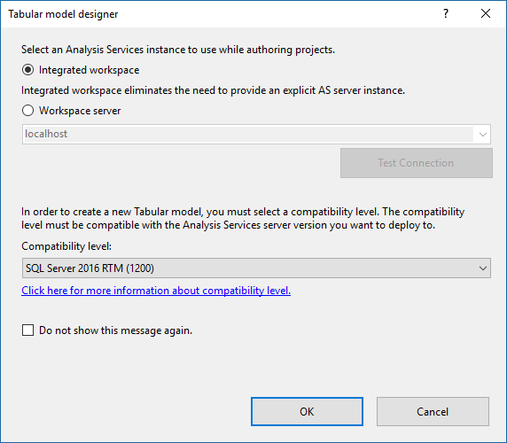

# Compatibility level for Analysis Services tabular models
[!INCLUDE[ssas-appliesto-sqlas-aas](../../includes/ssas-appliesto-sqlas-aas.md)]

  The *compatibility level* refers to release-specific behaviors in the Analysis Services engine. For example, DirectQuery and tabular object metadata have different implementations depending on the compatibility level. In-general, you should choose the latest compatibility level supported by your servers.

  **The latest compatibility level is 1400** 
  
Major features in the 1400 compatibility level include:

*  New infrastructure for data connectivity and import into tabular models with support for TOM APIs and TMSL scripting. This enables support for additional data sources such as Azure Blob storage. Additional data sources will be included in future updates.
*  Data transformation and data mashup capabilities by using Get Data and M expressions in SSDT.
*  Measures now support a Detail Rows property with a DAX expression, enabling BI tools such as Microsoft Excel drill-down to detailed data from an aggregated report. For example, when end-users view total sales for a region and month, they can view the associated order details. 
*  Object-level security for table and column names, in addition to the data within them.
*  Enhanced support for ragged hierarchies.
*  Performance and monitoring improvements.

  
## Supported compatibility levels by version
  
|||  
|-|-|- 
|**Compatibility level**|**Server version**| 
|1400|Azure Analysis Services, SQL Server 2017 |  
|1200|Azure Analysis Services, SQL Server 2017, SQL Server 2016| 
|1103|SQL Server 2017*, SQL Server 2016, SQL Server 2014, SQL Server 2012 SP1|  
|1100|SQL Server 2017*, SQL Server 2016, SQL Server 2014, SQL Server 2012 SP1, SQL Server 2012| 

\* 1100 and 1103 compatibility levels are deprecated in SQL Server 2017.
  
## Set compatibility level 
 When creating a new tabular model project in SQL Server Data Tools (SSDT), you can specify the compatibility level on the **Tabular model designer** dialog. 
  
   
  
 If you select the **Do not show this message again** option, all subsequent projects will use the compatibility level you specified as the default. You can change the default compatibility level in SSDT in **Tools** > **Options**.  
  
 To upgrade a tabular model project in SSDT, set  the **Compatibility Level** property in the model **Properties** window. Keep in-mind, upgrading the compatibility level is irreversible.
  
## Check compatibility level for a database in SSMS  
 In SSMS, right-click the database name > **Properties** > **Compatibility Level**.  
  
## Check supported compatibility level for a server in SSMS  
 In SSMS, right-click the server name>  **Properties** > **Supported Compatibility Level**.  
  
 This property specifies the highest compatibility level of a database that will run on the server. The supported compatibility level is read-only cannot be changed.  
  
## See also  
 [Compatibility Level of a multidimensional database](../../analysis-services/multidimensional-models/compatibility-level-of-a-multidimensional-database-analysis-services.md)   
 [What's new in Analysis Services](../../analysis-services/what-s-new-in-analysis-services.md)   
 [Create a new tabular model project](../../analysis-services/tabular-models/create-a-new-tabular-model-project-analysis-services.md)  
  
  
