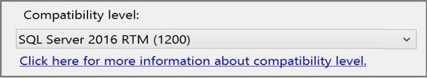

# Compatibility Level for Tabular models in Analysis Services
  The *compatibility level* of a model or database refers to a set of release-specific behaviors in the [!INCLUDE[ssASnoversion](../../includes/ssasnoversion-md.md)] engine. You can create models at any supported compatibility level to get behaviors of a particular release. For example, DirectQuery and tabular object metadata have different implementations depending on the compatibility level assignment.  
  
 **SQL Server 2016 RTM (1200)**, or 1200 compatibility level for short, is new in SQL Server 2016 and applies to Tabular models only.  Tabular models at 1200 compatibility level will run only on a [!INCLUDE[ssASCurrent](../../includes/ssascurrent-md.md)] Tabular instance.  
  
 To create or upgrade a Tabular model, use SQL Server Data Tools (SSDT) and set the **Compatibility Level** property when creating the project or on the **model.bim** file after the project is created.  
  
> [!NOTE]  
>  Multidimensional models follow an independent version path in terms of compatibility levels. When the numbers happen to be the same, as is the case with 1103,  it's coincidental. See [Compatibility Level of a Multidimensional Database &#40;Analysis Services&#41;](../../analysis-services/multidimensional-models/compatibility-level-of-a-multidimensional-database-analysis-services.md) for more information.  
  
## Supported compatibility levels for tabular model databases  
 Analysis Services supports the following compatibility levels, applicable to both models and databases.  The version of the tool used to create a model determines whether higher compatibility levels are available.  
  
||||  
|-|-|-|  
|Compatibility level|Server version|Modeling tool version|  
|1200|Runs on SQL Server 2016 instances only|[SQL Server Data Tools for Visual Studio 2015 only](http://go.microsoft.com/fwlink/?LinkID=690931) 1   [What's New in Analysis Services](../../analysis-services/what-s-new-in-analysis-services.md) describes functionality available at this level.|  
|1103|SQL Server 2016   SQL Server 2014   SQL Server 2012 SP1|[SQL Server Data Tools for Visual Studio 2015](http://go.microsoft.com/fwlink/?LinkID=690931) 2   [SQL Server Data Tools for Business Intelligence (Visual Studio 2013)](https://www.microsoft.com/en-us/download/details.aspx?id=42313)   [SQL Server Data Tools for Business Intelligence (Visual Studio 2012)](http://www.microsoft.com/en-us/download/details.aspx?id=36843)|  
|1100|SQL Server 2016   SQL Server 2014   SQL Server 2012 SP1   SQL Server 2012|[SQL Server Data Tools for Visual Studio 2015](http://go.microsoft.com/fwlink/?LinkID=690931) 1   [SQL Server Data Tools for Business Intelligence (Visual Studio 2013)](https://www.microsoft.com/en-us/download/details.aspx?id=42313)   [SQL Server Data Tools for Business Intelligence (Visual Studio 2012)](http://www.microsoft.com/en-us/download/details.aspx?id=36843)   Business Intelligence Development Studio (runs in the Visual Studio 2010 shell and installs via SQL Server Setup)|  
  
 1 You can use SQL Server Data Tools for Visual Studio 2015 to deploy an 1100 or 1103 tabular model to earlier releases of Analysis Services.  
  
 2 Compatibility levels 1100, 1103, and 1200 are all valid for Tabular model projects in SQL Server Data Tools for Visual Studio 2015, but you can only deploy and run a 1200 model on a SQL Server 2016 instance of Analysis Services.  
  
## Set compatibility level when creating or upgrading a Tabular in SSDT  
 When creating a new Tabular model project in SQL Server Data Tools (SSDT), on the **New Tabular project options** dialog you can specify the compatibility level:  
  
   
  
 You can also specify a default compatibility level by selecting the **Do not show this message again** option. All subsequent projects will use the compatibility level you specified. You can change the default compatibility level in SSDT in **Tools** > **Options**.  
  
 To upgrade a Tabular model project, set  the **Compatibility Level** property in the model **Properties** window to **SQL Server 2016 RTM (1200)**.  See [Upgrade Analysis Services](../../database-engine/install-windows/upgrade-analysis-services.md) for more information.  
  
> [!NOTE]  
>  One way to create a Tabular model is to base it on an imported Power Pivot workbook. by default, Power BI Desktop creates Tabular models at the 1200 compatibility level automatically. However, earlier versions of Power Pivot workbooks could be at the 1100 level. When using an older workbook, remember to change the **Compatibility Level** property to upgrade it.  
  
## Check compatibility level for a database in SSMS  
 In SSMS, right-click the database name > **Properties** > **Compatibility Level** property.  
  
## Check supported compatibility level for a server in SSMS  
 In SSMS, right-click the server name>  **Properties** > **Supported Compatibility Level**.  
  
 This property specifies the highest compatibility level  of a database that will run on the server.  The supported compatibility level is read-only cannot be changed.  
  
## See Also  
 [Compatibility Level of a Multidimensional Database &#40;Analysis Services&#41;](../../analysis-services/multidimensional-models/compatibility-level-of-a-multidimensional-database-analysis-services.md)   
 [What's New in Analysis Services](../../analysis-services/what-s-new-in-analysis-services.md)   
 [Import from Power Pivot &#40;SSAS Tabular&#41;](../../analysis-services/tabular-models/import-from-power-pivot-ssas-tabular.md)   
 [Create a New Tabular Model Project &#40;Analysis Services&#41;](../../analysis-services/tabular-models/create-a-new-tabular-model-project-analysis-services.md)  
  
  