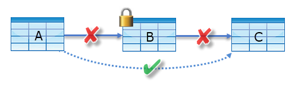

# Object-level security
[!INCLUDE[ssas-appliesto-sqlas-aas](../../includes/ssas-appliesto-sqlas-aas.md)]
Data model security starts with effectively implementing [roles](../../analysis-services/tabular-models/roles-ssas-tabular.md) and row-level filters to define user permissions on data model objects and data. Beginning with tabular 1400 models, you can also define object-level security, which includes table-level security and column-level security in the [Roles object](https://docs.microsoft.com/bi-reference/tmsl/roles-object-tmsl).

## Table-level security

With table-level security, you can not only restrict access to table data, but also sensitive table names, helping prevent malicious users from discovering if a table exists. 

 Table-level security is set in the JSON-based metadata in the Model.bim, [Tabular Model Scripting Language (TMSL)](https://docs.microsoft.com/bi-reference/tmsl/tabular-model-scripting-language-tmsl-reference), or [Tabular Object Model (TOM)](https://docs.microsoft.com/bi-reference/tom/introduction-to-the-tabular-object-model-tom-in-analysis-services-amo). Set the **metadataPermission** property of the **tablePermissions** class in the [Roles object](https://docs.microsoft.com/bi-reference/tmsl/roles-object-tmsl) to **none**.

In this example, the metadataPermission property of the tablePermissions class for the Product table is set to none:

```
"roles": [
  {
    "name": "Users",
    "description": "All allowed users to query the model",
    "modelPermission": "read",
    "tablePermissions": [
      {
        "name": "Product",
        "metadataPermission": "none"
      }
    ]
  }
```

## Column-level security

Similar to table-level security, with column-level security you can not only restrict access to column data, but also sensitive column names,  helping prevent malicious users from discovering a column.

 Column-level security is set in the JSON-based metadata in the Model.bim, [Tabular Model Scripting Language (TMSL)](https://docs.microsoft.com/bi-reference/tmsl/tabular-model-scripting-language-tmsl-reference), or [Tabular Object Model (TOM)](https://docs.microsoft.com/bi-reference/tom/introduction-to-the-tabular-object-model-tom-in-analysis-services-amo). Set the **metadataPermission** property of the **columnPermissions** class in the [Roles object](https://docs.microsoft.com/bi-reference/tmsl/roles-object-tmsl) to **none**.

In this example, the metadataPermission property of the columnPermissions class for the Base Rate column in the Employees table is set to none:

```
"roles": [
  {
    "name": "Users",
    "description": "All allowed users to query the model",
    "modelPermission": "read",
    "tablePermissions": [
      {
        "name": "Employee",
        "columnPermissions": [
          {
            "name": "Base Rate",
            "metadataPermission": "none"
          }
        ]
      }
    ]
  }
```

## Restrictions

*  Table-level security cannot be set for a model if it breaks a relationship chain. An error is generated at design time.
 For example, if there are relationships between tables A and B, and B and C, you cannot secure table B. If table B is secured, a query on table A cannot transit the relationships between table A and B, and B and C. In this case, a separate relationship could be configured between tables A and B.

      


*  Row-level security and object-level security cannot be combined from different roles because it could introduce unintended access to secured data. An error is generated at query time for users who are members of such a combination of roles.

*  Dynamic calculations (measures, KPIs, DetailRows) are automatically  restricted if they reference a secured table or column. While there is no mechanism to explicitly secure a measure, it is possible to implicitly secure a measure by updating the expression to refer to a secured table or column.

*  Relationships that reference a secured column work provided the table the column is in is not secured.


## See Also  
[Roles](../../analysis-services/tabular-models/roles-ssas-tabular.md)  
[Roles object (TMSL)](https://docs.microsoft.com/bi-reference/tmsl/roles-object-tmsl)  
[Tabular Model Scripting Language (TMSL)](https://docs.microsoft.com/bi-reference/tmsl/tabular-model-scripting-language-tmsl-reference)  
[Tabular Object Model (TOM)](https://docs.microsoft.com/bi-reference/tom/introduction-to-the-tabular-object-model-tom-in-analysis-services-amo).

  
