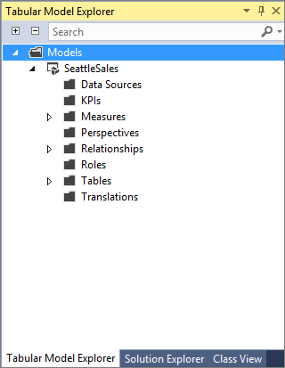

# Tabular model designer
[!INCLUDE[ssas-appliesto-sqlas-aas](../../includes/ssas-appliesto-sqlas-aas.md)]
The tabular model designer is part of [!INCLUDE[ssBIDevStudioFull](../../includes/ssbidevstudiofull-md.md)], integrated with Microsoft [!INCLUDE[vsprvs](../../includes/vsprvs-md.md)], with additional project type templates specifically for developing professional tabular model solutions.  [!INCLUDE[ssBIDevStudioFull](../../includes/ssbidevstudiofull-md.md)] is installed as a free web download. See [Download SQL Server Data Tools (SSDT)](../../ssdt/download-sql-server-data-tools-ssdt.md) for details.    
  
##   Benefits  
 When you install [!INCLUDE[ssBIDevStudioFull](../../includes/ssbidevstudiofull-md.md)], new project templates for creating tabular models are added to the available project types. After creating a new tabular model project by using one of the templates, you can begin model authoring by using the tabular model designer tools and wizards.  
  
 In addition to new templates and tools for authoring professional multidimensional and tabular model solutions, the [!INCLUDE[vsprvs](../../includes/vsprvs-md.md)] environment provides debugging and project lifecycle capabilities that ensure you create the most powerful BI solutions for your organization. For more information about [!INCLUDE[vsprvs](../../includes/vsprvs-md.md)], see [Getting Started with Visual Studio](http://go.microsoft.com/fwlink/?LinkId=206389).  
  
##   Project templates  
 When you install [!INCLUDE[ssBIDevStudioFull](../../includes/ssbidevstudiofull-md.md)], the following tabular model project templates are added to the Business Intelligence project types:  
  
 **Analysis Services Tabular Project**  
 This template can be used to create a new, blank tabular model project. Compatibility levels are specified when you create the project.
  
 **Import from Server (Tabular)**  
 This template can be used to create a new tabular model project by extracting the metadata from an existing tabular model in Analysis Services.  
  
 Older models have older compatibility levels. You can upgrade by changing the Compatibility Level property after importing the model definition.  
  
 **Import from [!INCLUDE[ssGemini](../../includes/ssgemini-md.md)]**  
 This template is used for creating a new tabular model project by extracting the metadata and data from a [!INCLUDE[ssGeminiClient](../../includes/ssgeminiclient-md.md)] file.  
  
##   Windows and Menus  
 The [!INCLUDE[ssBIDevStudioFull](../../includes/ssbidevstudiofull-md.md)] tabular model authoring environment includes the following:  
  
### Designer window  
 The designer window is used to author tabular models by providing a visual representation of the model. When you open the Model.bim file, the model opens in the designer window. You can author a model in the designer window by using two different view modes:  
  
 **Data view**  
 The data view displays tables in a tabular, grid format. You can also define measures by using the measure grid, which can be shown for each table in Data View only.  
  
 **Diagram view**  
 The diagram view displays tables, with relationships between them, in a graphical format. Columns, measures, hierarchies, and KPIs can be filtered, and you can choose to view the model by using a defined perspective.  
  
 Most model authoring tasks can be performed in either view.  
  
### View Code window  
 You can view the code behind a Model.bim file when you right-click select **View Code** on the file in Solution Explorer. For Tabular models at compatibility level 1200 and later, the model definition is expressed in JSON.  
  
 Note that you will need a full version of Visual Studio that provides the JSON editor. You can download and install the [free Visual Studio Community edition](https://www.visualstudio.com/downloads/download-visual-studio-vs.aspx) if you do not require the additional features in commercial editions.  
  
### Solution Explorer  
 The Solution Explorer window presents the active solution as a logical container for a tabular model project and its associated items. The model project (.smproj) contains only a References object (empty) and the Model.bim file. You can open project items for modification and perform other management tasks directly from this view.  
  
 Tabular model solutions typically contain only one project; however, a solution can contain other projects too, for example, Integration Services or Reporting services project. You can add any number of files provided they are not of the same type as tabular model project files and their Build Action property is set to None, or Copy to Output property is set to Do Not Copy.  
  
 To view Solution Explorer, click the **View** menu, and then click **Solution Explorer**.  

### Tabular Model Explorer
  First available in the August 2016 release (14.0.60812.0) of [SQL Server Data Tools](https://msdn.microsoft.com/mt186501), Tabular Model Explorer helps you navigate metadata objects in tabular models.

 To show Tabular Model Explorer, click **View** > **Other Windows**, and then click **Tabular Model Explorer**.
   
   
  
 Tabular Model Explorer organizes metadata objects into a tree structure that closely resembles the schema of a tabular model. Data Sources, Perspectives, Relationships, Roles, Tables, and Translations correspond to top-level schema objects. There are some exceptions, specifically KPIs and Measures, which technically aren't top-level objects, but child objects of the various tables in the model. However, having consolidated top-level containers for all KPIs and Measures makes it easier to work with these objects, especially if your model includes a very large number of tables. Measures are also listed under their corresponding parent tables, so you have a clear view of the actual parent-child relationships. If you select a measure in the top-level Measures container, the same measure is also selected in the child collection under its table, and vice-versa.  
 
 Object nodes in Tabular Model Explorer are linked to appropriate menu options that until now were hiding under the Model, Table, and Column menus in Visual Studio. You can right-click an object to explore options for the object type. Not all object node types have a context menu yet, but additional options and improvements are coming in subsequent releases. 

 Tabular Model Explorer also offers a convenient search feature. Just type in a portion of the name in the Search box and Tabular Model Explorer narrows down the tree view to the matches. 
  
### Properties window  
 The Properties window lists the properties of the selected object. The following objects have properties that can be viewed and edited in the Properties window:  
  
-   Model.bim  
  
-   Table  
  
-   Column  
  
-   Measure  
  
 Project properties display only the project name and project folder in the Properties window. Projects also have additional deployment Options and deployment server settings that you can set using a modal properties dialog box. To view these properties, in **Solution Explorer**, right click the project, and then click **Properties**.  
  
 Fields in the Properties window have embedded controls that open when you click them. The type of edit control depends on the particular property. Controls include edit boxes, dropdown lists, and links to custom dialog boxes. Properties that are shown as dimmed are read-only.  
  
 To view the **Properties** window, click the **View** menu, and then click **Properties Window**.  
  
### Error List  
 The Error List window contains messages about the model state:  
  
-   Notifications about security best practices.  
  
-   Requirements for data processing.  
  
-   Semantic error information for calculated columns, measures, and row filters for roles. For calculated columns, you can double-click the error message to navigate to the source of the error.  
  
-   DirectQuery validation errors.  
  
 By default, the **Error List** does not appear unless an error is returned. You can, however, view the **Error List** window at any time. To view the **Error List** window, click the **View** menu, and then click **Error List**.  
  
### Output  
 Build and deployment information is displayed in the **Output** Window (in addition to the modal progress dialog). To view the **Output** window, click the **View** menu, and then click Output.  
  
### Menu items  
 When you install [!INCLUDE[ssBIDevStudioFull](../../includes/ssbidevstudiofull-md.md)], additional menu items specifically for authoring tabular models are added to the Visual Studio menu bar. The **Model** menu can be used to launch the Data Import Wizard, view existing connections, process workspace data, and browse the model workspace in [!INCLUDE[msCoName](../../includes/msconame-md.md)] Excel. The **Table** menu is used to create and manage relationships between tables, create and manage measures, specify data table settings, specify calculation options, and specify other table properties. With the **Column** menu, you can add and delete columns in a table, hide and unhide columns, and specify other column properties such as data types and filters. You can build and deploy tabular model solutions on the **Build** menu. Copy/Paste functions are included on the **Edit** menu.  
  
 In addition to these menu items, additional settings are added to the Analysis Services options on the Tools menu items.  
  
### Toolbar  
 The Analysis Services toolbar provides quick and easy access to the most frequently used model authoring commands.  
  
##   Visual Studio integration  
 **Source control**  
 Analysis Services projects integrate with the selected source control plug-in. If you have configured Visual Studio to use source control, you can use check in/check out from Solution Explorer. To configure to use Team Foundation Server, see [Configure Visual Studio with Team Foundation Version Control](http://msdn.microsoft.com/library/ms253064.aspx). Many third-party source control plug-ins are supported as well.  
  
 **Fonts**  
 Tabular models use the [!INCLUDE[vsprvs](../../includes/vsprvs-md.md)] environment font to control the fonts in the display. It can be necessary to change this font if the default [!INCLUDE[vsprvs](../../includes/vsprvs-md.md)] font does not have all of the Unicode characters you need for your language. To change fonts, click the **Tools** menu, then click **Options**, and then click **Fonts and Colors**.  
  
 **Keyboard shortcuts**  
 The Analysis Services keyboard shortcuts can be configured/remapped through the Tools->Options->Keyboard dialog. Some global [!INCLUDE[vsprvs](../../includes/vsprvs-md.md)] shortcuts, such as build, save, debug, new project, etc. are supported in the tabular model designer context. Other tabular model designer specific shortcuts are in the Analysis Services context.  
  
## See also  
 [Tabular Model Projects](../../analysis-services/tabular-models/tabular-model-projects-ssas-tabular.md)   
  
  
