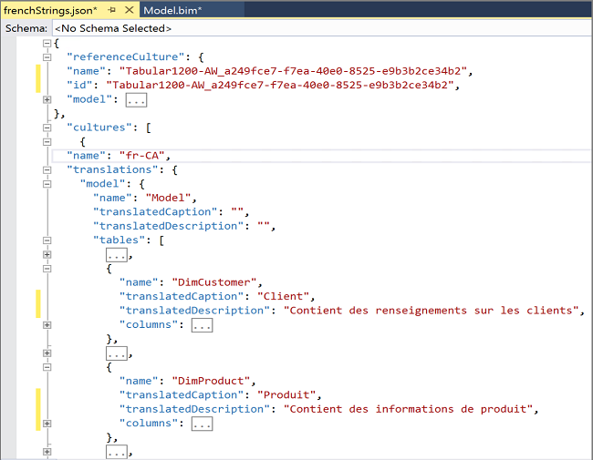
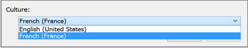

# Translations in Tabular models (Analysis Services)
[!INCLUDE[ssas-appliesto-sqlas-aas](../../includes/ssas-appliesto-sqlas-aas.md)]
  [!INCLUDE[ssCurrent](../../includes/sscurrent-md.md)] adds translation string support for Tabular models. A single object in the model can have multiple translations of a name or description, making it possible to support multi-language versions within the model definition.  
  
 Translated strings are for object metadata only (names and descriptions of tables and columns) that appear in a client tool like an Excel PivotTable list.  To use translated strings, the client connection specifies the culture. In the **Analysis in Excel** feature, you can choose the language from a drop-down list. For other tools, you might need to specify the culture in the connection string.  
  
 This feature is not intended loading translated data into a model. If you want to load translated data values, you should develop a processing strategy that includes extracting translated strings from a data source that provides them.  
  
 A typical workflow for adding translated metadata looks like this:  
  
-   Generate an empty  translation JSON file that contains placeholders for each string translation  
  
-   Add string translations to the JSON file  
  
-   Import the translations back into the model  
  
-   Build, process or deploy the model  
  
-   Connect to the model using a client application that allows an LCID on the connection string  
  
## Create an empty translation file  
 Use [!INCLUDE[ssBIDevStudio](../../includes/ssbidevstudio-md.md)] to add translations.  
  
1.  Click **Model** > **Translations** > **Manage Translations**.  
  
2.  Select the languages for which you are providing translations and then click **Add**.  
  
3.  Choose one or more languages from the list, depending on how you want to import the strings later.  
  
     Your translation file can include multiple languages, but you might find translation management easier if you create one translation file per language. The translation file you're creating now will be imported in its entirety later. To vary import options by language, each language needs to be in its own file.  
  
4.  Click **Export Language File**.  Provide a file name and location.  
  
   
  
## Add translations  
 An empty JSON translation file includes metadata for a specific language translations. Translation placeholders for object names and descriptions are specified in the **Culture** section at the end of the model definition. Translations can be added for the following:  
  
|||  
|-|-|  
|translatedCaption|Table or column title that appears in any client application supporting visualizations of a Tabular model.|  
|translatedDescription|Less common than captions, a description appears as model information in a modeling tool like SSDT.|  
  
 Don't  delete any unspecified metadata from the file.  It should match the file upon which it is based. Just add the strings you want, and then save the file.  
  
 Although it might look like something you should modify, the  **referenceCulture** section  contains the metadata in the default culture of the model. Any changes made to the **referenceCulture** section will not be read in during import and will be ignored.  
  
 The following example shows translated captions and description for the **DimProduct** and **DimCustomer** tables.  
  
   
  
> [!TIP]  
>  You can use any JSON editor to open the file, but we recommend using the JSON editor in Visual Studio so that you can also use the View Code command in Solution explorer to view the Tabular model definition in SSDT. To get the JSON editor, you need a [full version installation of Visual Studio 2015](https://www.visualstudio.com/en-us/downloads/download-visual-studio-vs.aspx). The free Community edition includes the JSON editor.  
  
## Import a translation file  
 Translation strings that you import become a permanent part of the model definition. Once the strings are imported, the translation file is no longer referenced.  
  
1.  Click **Model** > **Translations** > **Import Translations**.  
  
2.  Find the translation file and then click **Open**.  
  
3.  Optionally, specify import options.  
  
    |||  
    |-|-|  
    |Overwrite existing translations|Replaces all existing captions or descriptions of the same language as the file being imported.|  
    |Ignore invalid objects|Specifies whether metadata discrepancies should be ignored or flagged as an error.|  
    |Write import results to a log file|Log files are saved to the project folder by default. The exact path to the file is provided after import concludes. The log file name is SSDT_Translations_Log_\<timestamp>.|  
    |Back up translations to a JSON file before importing|Backs up an existing translation that matches the culture of the strings being imported.  If the culture being imported is not present in the model, then the backup will be empty.   If you need to restore this file later, you can replace the contents of the model.bim with this JSON file.|  
  
4.  Click **Import**.  
  
5.  Optionally, if you generated a log file or backup, you can find the files in the  project folder (for example, C:\Users\Documents\Visual Studio 2015\Projects\Tabular1200-AW\Tabular1200-AW).  
  
6.  To verify the import, follow these steps:  
  
    -   Right-click the **model.bim** file in Solution Explorer and choose **View Code**. Click **Yes** to close the design view and reopen **model.bim** in code view.  If you installed a full version of Visual Studio, such as the free Community edition, the file opens in the built-in JSON editor.  
  
    -   Search for **Culture** or for a specific translated string to verify the strings you expect to see are actually there.  
  
## Connect using a locale identifier  
 This section describes an approach for validating the correct strings are returned from the model.  
  
1.  In Excel, connect to the Tabular model. This step assumes the model has been deployed. If the model only exists in the workspace, deploy it to an Analysis Services instance to complete the validation check.  
  
     Alternatively, you can use the **Analyze in Excel** feature to connect to the model  
  
2.  In the Excel connection dialog box, choose the culture for which string translations exist in your model. Excel detects cultures defined in the model and populates the drop-down list accordingly.  
  
       
  
     When you create a PivotTable, you should see the translated table and column names.  
  
## See Also  
 [Compatibility Level for Tabular models in Analysis Services](../../analysis-services/tabular-models/compatibility-level-for-tabular-models-in-analysis-services.md)   
 [Globalization scenarios for Analysis Services](../../analysis-services/globalization-scenarios-for-analysis-services.md)   
 [Analyze in Excel](../../analysis-services/tabular-models/analyze-in-excel-ssas-tabular.md)  
  
  
