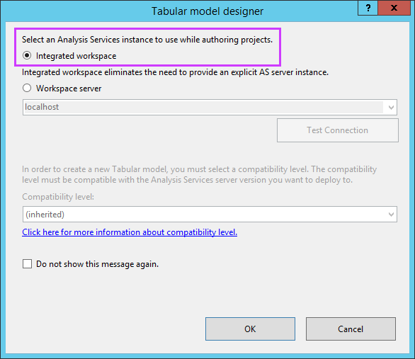

# Workspace database

[!INCLUDE[ssas-appliesto-sqlas-aas](../../includes/ssas-appliesto-sqlas-aas.md)]
  The tabular model workspace database, used during model authoring, is created when you create a new tabular model project in [!INCLUDE[ssBIDevStudioFull](../../includes/ssbidevstudiofull-md.md)].
  
## Specifying a workspace instance  

  When you create a new tabular model project in SSDT, you can specify an Analysis Services instance to use while authoring your project. Beginning  with the September 2016 release (14.0.60918.0) of [!INCLUDE[ssBIDevStudio](../../includes/ssbidevstudio-md.md)],  introduces two modes for specifying a workspace instance when you create a new tabular model project. 

**Integrated workspace** - Recommended. Utilizes SSDT's own internal Analysis Services instance. Use this setting when creating a project that will be deployed to Azure Analysis Services.

**Workspace server** - A workspace database is created on an explicit Analysis Services instance,  often on the same computer as SSDT or another computer in the same network. While you can specify an Azure Analysis Services server, it's not recommended. 
  
### Integrated workspace

With Integrated workspace, a working database is created in-memory using SSDTs own implicit Analysis Services instance. Integrated workspace mode significantly reduces the complexity of authoring tabular projects in SSDT because a separate explicit Analysis Services server is not required.

By using Integrated workspace mode, SSDT Tabular dynamically starts its own internal SSAS instance in the background and loads the database. You can add and view tables, columns, and data in the model designer. If you add additional tables, columns, relationships, etc., you're modifying the workspace database. Integrated workspace mode does not change how SSDT Tabular works with a workspace server and database. What changes is where SSDT Tabular hosts the workspace database.

You can select Integrated workspace mode when creating a new tabular model project in SSDT.

By using the Workspace Database and Workspace Server properties for model.bim, you can discover the name of the temporary database and the TCP port of the internal SSAS instance where SSDT Tabular hosts the database. You can connect to the workspace database with SSMS as long as SSDT Tabular has the database loaded. The Workspace Retention setting specifies that SSDT Tabular keeps the workspace database on disk, but no longer in memory after a model project is closed. This ensures less memory is consumed than if the model was kept in memory at all times. If you want to control these settings, set the Integrated Workspace Mode property to False and then provide an explicit workspace server. An explicit workspace server also make senses if the data you are importing into a model exceeds the memory capacity of your SSDT workstation.

> [!NOTE]  
>  When using Integrated workspace mode, the local Analysis Services instance is 64-bit, while SSDT runs in the 32-bit environment of Visual Studio. If you're connecting to special data sources, make sure you install both the 32-bit and 64-bit versions of the corresponding data providers on your workstation. The 64-bit provider is required for the 64-bit Analysis Services instance and the 32-bit version is required for the Table Import Wizard in SSDT.

###   Workspace server

 A workspace database is created on the [!INCLUDE[ssASnoversion](../../includes/ssasnoversion-md.md)] instance, specified in the Workspace Server property, when you create a new Business Intelligence project by using one of the tabular model project templates in [!INCLUDE[ssBIDevStudio](../../includes/ssbidevstudio-md.md)]. Each tabular model project will have its own workspace database. You can use [!INCLUDE[ssManStudioFull](../../includes/ssmanstudiofull-md.md)] to view the workspace database on the [!INCLUDE[ssASnoversion](../../includes/ssasnoversion-md.md)] server. The workspace database name includes the project name, followed by an underscore, followed by the username, followed by an underscore, followed by a GUID.  
  
 The workspace database resides in-memory while the tabular model project is open in [!INCLUDE[ssBIDevStudio](../../includes/ssbidevstudio-md.md)]. When you close the project, the workspace database is either kept in-memory, stored to disk and removed from memory (default), or removed from memory and not stored on disk, as determined by the Workspace Retention property. For more information about the Workspace Retention property, see [Workspace Database Properties](#bkmk_ws_prop) later in this topic.  
  
 After you've added data to your model project by using the Table Import Wizard or by using copy/paste, when you view the tables, columns, and data in the model designer, you are viewing the workspace database. If you add additional tables, columns, relationships, etc. you are changing the workspace database.  
  
 When you deploy a tabular model project, the deployed model database, which is essentially a copy of the workspace database, is created on the Analysis Services server instance specified in the Deployment Server property. For more information about the Deployment Server property, see [Project properties](../../analysis-services/tabular-models/project-properties-ssas-tabular.md).  
  
 The model workspace database typically resides on localhost or a local named instance of an [!INCLUDE[ssASnoversion](../../includes/ssasnoversion-md.md)] server. You can use a remote instance of [!INCLUDE[ssASnoversion](../../includes/ssasnoversion-md.md)] to host the workspace database, however, this configuration is not recommended due to latency during data queries and other restrictions. Optimally, the instance of [!INCLUDE[ssASnoversion](../../includes/ssasnoversion-md.md)] that will host the workspace databases is on the same computer as [!INCLUDE[ssBIDevStudio](../../includes/ssbidevstudio-md.md)]. Authoring model projects on the same computer as the [!INCLUDE[ssASnoversion](../../includes/ssasnoversion-md.md)] instance that hosts the workspace database can improve performance.  
  
 Remote workspace databases have the following restrictions:  
  
-   Potential latency during queries.  
  
-   The Data Backup property cannot be set to **Backup to disk**.  
  
-   You cannot import data from a [!INCLUDE[ssGemini](../../includes/ssgemini-md.md)] workbook when creating a new tabular model project by using the Import from [!INCLUDE[ssGemini](../../includes/ssgemini-md.md)] project template.  
  
  > [!IMPORTANT]  
>  The model's compatibility level and the Workspace Server must correspond.
  
> [!NOTE]  
>  If any of the tables in your model will contain a large number of rows, consider importing only a subset of the data during model authoring. By importing a subset of the data, you can reduce processing time and consumption of workspace database server resources.  
  
> [!NOTE]  
>  The preview window in the Select Tables and Views page in the Table Import Wizard, Edit Table Properties dialog box, and Partition Manager dialog box show tables, columns, and rows at the data source, and may not show the same tables, columns, and rows as the workspace database.  
  
  
##   Workspace Database Properties  
 Workspace database properties are included in the model properties. To view model properties, in [!INCLUDE[ssBIDevStudio](../../includes/ssbidevstudio-md.md)], in **Solution Explorer**, click the **Model.bim** file. Model properties can be configured using the **Properties** window. Workspace database specific properties include:  
  
> [!NOTE]  
>  **Integrated Workspace Mode**, **Workspace Server**, **Workspace Retention**, and **Data Backup** properties have default settings applied when you create a new model project. You can change the default settings for new model projects on the **Data Modeling** page in **Analysis Server** settings in the Tools\Options dialog box. These properties, as well as others, can also be set for each model project in the **Properties** window. Changing default settings will not apply to model projects already created. For more information, see [Configure default data modeling and deployment properties](../../analysis-services/tabular-models/configure-default-data-modeling-and-deployment-properties-ssas-tabular.md).  
  
|Property|Default Setting|Description|  
|--------------|---------------------|-----------------|  
|**Integrated Workspace Mode**|True, False|If Integrated workspace mode is selected for the workspace database when the project is created, this property will be True. If **Workspace server** mode is selected when the project is created, this property will be False. | 
|**Workspace database**|Name|The name of the workspace database. This property cannot be edited when **Integrated Workspace Mode** is **True**.|  
|**Workspace Retention**|Unload from memory|Specifies how a workspace database is retained after a model project is closed. A workspace database includes model metadata and imported data. In some cases, the workspace database can be very large and consume a large amount of memory. By default, when you close a model project in [!INCLUDE[ssBIDevStudio](../../includes/ssbidevstudio-md.md)], the workspace database is unloaded from memory. When changing this setting it is important to consider your available memory resources as well as how often you plan to work on the model project. This property setting has the following options:   **Keep in memory** - Specifies to keep the workspace database in memory after a model project is closed. This option will consume more memory; however, when opening a model project in [!INCLUDE[ssBIDevStudio](../../includes/ssbidevstudio-md.md)], fewer resources are consumed and the workspace database will load faster.   **Unload from memory** - Specifies to keep the workspace database on disk, but no longer in memory after a model project is closed. This option will consume less memory; however, when opening a model project in [!INCLUDE[ssBIDevStudio](../../includes/ssbidevstudio-md.md)], the workspace database must be re-attached; additional resources are consumed and the model project will load more slowly than if the workspace database is kept in memory. Use this option when in-memory resources are limited or when working on a remote workspace database.   **Delete workspace** - Specifies to delete the workspace database from memory and not keep the workspace database on disk after the model project is closed. This option will consume less memory and storage space; however, when opening a model project in [!INCLUDE[ssBIDevStudio](../../includes/ssbidevstudio-md.md)], additional resources are consumed and the model project will load more slowly than if the workspace database is kept in memory or on-disk. Use this option when only occasionally working on model projects.   The default setting for this property can be changed on the **Data Modeling** page in **Analysis Server** settings in the Tools\Options dialog box. This property cannot be edited when **Integrated Workspace Mode** is **True**.|  
|**Workspace Server**|localhost|This property specifies the default server that will be used to host the workspace database while the model project is being authored in [!INCLUDE[ssBIDevStudio](../../includes/ssbidevstudio-md.md)]. All available instances of [!INCLUDE[ssASnoversion](../../includes/ssasnoversion-md.md)] running on the local computer are included in the listbox.   To specify a different [!INCLUDE[ssASnoversion](../../includes/ssasnoversion-md.md)] server (running in Tabular mode), type the server name. The user logged on must be an Administrator on the [!INCLUDE[ssASnoversion](../../includes/ssasnoversion-md.md)] server.   Note that It is recommended you specify a local [!INCLUDE[ssASnoversion](../../includes/ssasnoversion-md.md)] server as the workspace server. For workspace databases on a remote server, importing from [!INCLUDE[ssGemini](../../includes/ssgemini-md.md)] is not supported, data cannot be backed up locally, and the user interface may experience latency during queries.   The default setting for this property can be changed on the Data Modeling page in [!INCLUDE[ssASnoversion](../../includes/ssasnoversion-md.md)] settings in the Tools\Options dialog box. This property cannot be edited when **Integrated Workspace Mode** is **True**.|  
  
##   Using SSMS to Manage the Workspace Database  
 You can use SQL Server Management Studio (SSMS) to connect to a [!INCLUDE[ssASnoversion](../../includes/ssasnoversion-md.md)] server that hosts a workspace database. Typically, there is no management of the workspace database necessary; the exception, is to detach or delete a workspace database, which must be done from [!INCLUDE[ssManStudioFull](../../includes/ssmanstudiofull-md.md)]. Do not use [!INCLUDE[ssManStudioFull](../../includes/ssmanstudiofull-md.md)] to manage the workspace database while the project is open in the model designer. Doing so could lead to data loss.
   
## See also  
[Model properties](../../analysis-services/tabular-models/model-properties-ssas-tabular.md) 
  
  
