---
title: "What's new in SQL Server 2017 Analysis Services | Microsoft Docs"
ms.date: 05/08/2018
ms.prod: sql
ms.technology: analysis-services
ms.custom:
ms.topic: conceptual
ms.author: owend
ms.reviewer: owend
author: minewiskan
manager: kfile
---
# What's new in SQL Server 2017 Analysis Services
[!INCLUDE[ssas-appliesto-sql2017](../includes/ssas-appliesto-sql2017.md)]

SQL Server 2017 Analysis Services see some of the most important enhancements since SQL Server 2012. Building on the success of Tabular mode (first introduced in SQL Server 2012 Analysis Services), this release makes tabular models more powerful than ever.

Multidimensional mode and Power Pivot for SharePoint mode are a staple for many Analysis Services deployments. In the Analysis Services product lifecycle, these modes are mature. There are no new features for either of these modes in this release. However, bug fixes and performance improvements are included.

The features described here are included in SQL Server 2017 Analysis Services. But in order to take advantage of them, you must also use the latest versions of [SQL Server Data Tools](../ssdt/download-sql-server-data-tools-ssdt.md) (SSDT) and [SQL Server Management Studio](../ssms/download-sql-server-management-studio-ssms.md) (SSMS). SSDT and SSMS are updated monthly with new and improved features that typically coincide with new functionality in SQL Server.  

While it's important to learn about all the new features, it's also important to know what is being deprecated and discontinued in this release and future releases. Be sure to check out [Backward compatibility (SQL Server 2017 Analysis Services)](analysis-services-backward-compatibility-sql2017.md).

Let's take a look at some of the key new features in this release.

## 1400 Compatibility level for tabular models
  To take advantage of many of the new features and functionality described here, new or existing tabular models must be set or upgraded to the 1400 compatibility level. Models at the 1400 compatibility level cannot be deployed to SQL Server 2016 SP1 or earlier, or downgraded to lower compatibility levels. To learn more, see [Compatibility level for Analysis Services tabular models](../analysis-services/tabular-models/compatibility-level-for-tabular-models-in-analysis-services.md).
  
In SSDT, you can select the new 1400 compatibility level when creating new tabular model projects. 

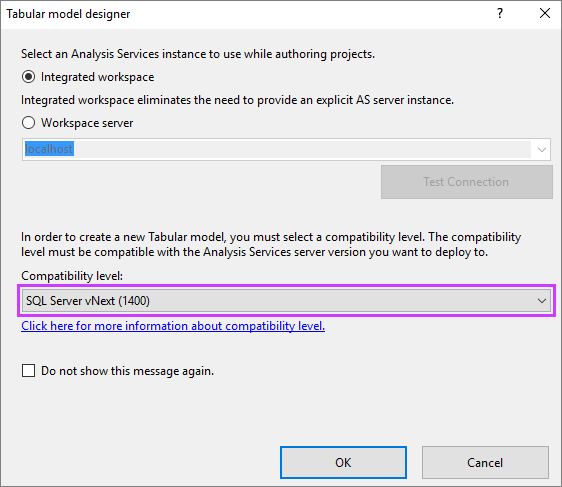


To upgrade an existing tabular model in SSDT, in Solution Explorer, right-click **Model.bim**, and then in **Properties**, set the  **Compatibility Level** property to **SQL Server 2017 (1400)**. 

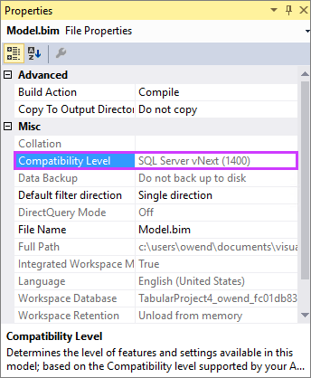

It's important to keep in mind, once you upgrade an existing model to 1400, you can't downgrade. Be sure to keep a backup of your 1200 model database.

## Modern Get Data experience
When it comes to importing data from data sources into your tabular models, SQL Server Data Tools (SSDT) introduces the modern **Get Data** experience for models at the 1400 compatibility level. This new feature is based on similar functionality in Power BI Desktop and Microsoft Excel 2016. The modern Get Data experience provides immense data transformation and data mashup capabilities by using the Get Data query builder and M expressions.

The modern Get Data experience provides support for a wide range of data sources. Going forward, updates will include support for even more.

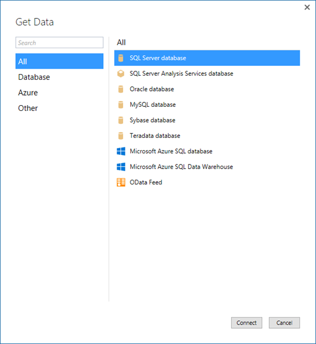

 A powerful and intuitive user interface makes selecting your data and data transformation/mashup capabilities easier than ever.

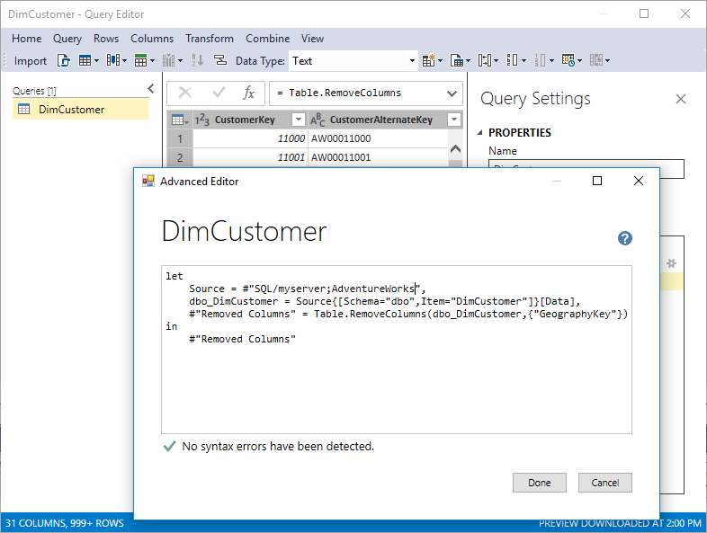


The modern Get Data experience and M mashup capabilities do not apply to existing tabular models upraded from the 1200 compatibility level to 1400. The new experience only applies to new models created at the 1400 compatibility level.

## Encoding hints
This release introduces encoding hints, an advanced feature used to optimize processing (data refresh) of large in-memory tabular models. To better understand encoding, see [Performance Tuning of Tabular Models in SQL Server 2012 Analysis Services](https://msdn.microsoft.com/library/dn393915.aspx) whitepaper to better understand encoding.

* Value encoding provides better query performance for columns that are typically only used for aggregations.

* Hash encoding is preferred for group-by columns (often dimension-table values) and foreign keys. String columns are always hash encoded.

Numeric columns can use either of these encoding methods. When Analysis Services starts processing a table, if either the table is empty (with or without partitions) or a full-table processing operation is being performed, samples values are taken for each numeric column to determine whether to apply value or hash encoding. By default, value encoding is chosen when the sample of distinct values in the column is large enough - otherwise hash encoding usually provides better compression. It is possible for Analysis Services to change the encoding method after the column is partially processed based on further information about the data distribution, and restart the encoding process; however, this increases processing time and is inefficient. The performance-tuning whitepaper discusses re-encoding in more detail and describes how to detect it using SQL Server Profiler.

Encoding hints allow the modeler to specify a preference for the encoding method given prior knowledge from data profiling and/or in response to re-encoding trace events. Since aggregation over hash-encoded columns is slower than over value-encoded columns, value encoding may be specified as a hint for such columns. It is not guaranteed that the preference is applied. It is a hint as opposed to a setting. To specify an encoding hint, set the EncodingHint property on the column. Possible values are "Default", "Value" and "Hash". The following snippet of JSON-based metadata from the Model.bim file specifies value encoding for the Sales Amount column.

```
{
    "name": "Sales Amount",
    "dataType": "decimal",
    "sourceColumn": "SalesAmount",
    "formatString": "\\$#,0.00;(\\$#,0.00);\\$#,0.00",
    "sourceProviderType": "Currency",
    "encodingHint": "Value"
}
```

## Ragged hierarchies
In tabular models, you can model parent-child hierarchies. Hierarchies with a differing number of levels are often referred to as ragged hierarchies. By default, ragged hierarchies are displayed with blanks for levels below the lowest child. Here's an example of a ragged hierarchy in an organizational chart:

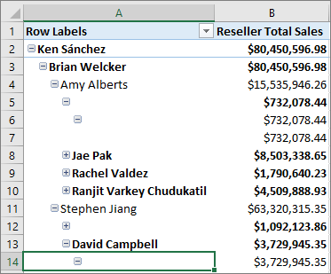

This release introduces the **Hide Members** property. You can set the **Hide Members** property for a hierarchy to **Hide blank members**.

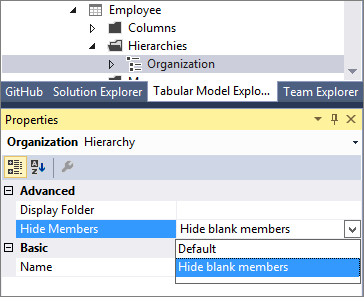

 >[!NOTE]
 > Blank members in the model are represented by a DAX blank value, not an empty string.

When set to **Hide blank members**, and the model deployed, an easier to read version of the hierarchy is shown in reporting clients like Excel.

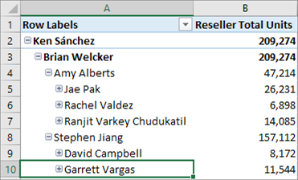


## Detail Rows
You can now define a custom row set contributing to a measure value. Detail Rows is similar to the default drillthrough action in multidimensional models. This allows end-users to view information in more detail than the aggregated level. 

The following PivotTable shows Internet Total Sales by year from the Adventure Works sample tabular model. You can right-click a cell with an aggregated value from the measure and then click **Show Details** to view the detail rows.

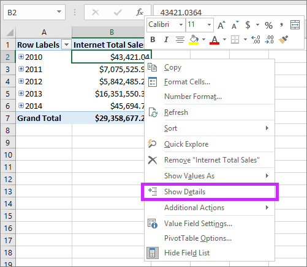

By default, the associated data in the Internet Sales table is displayed. This limited behavior is often not meaningful for the user because the table may not have the necessary columns to show useful information such as customer name and order information. With Detail Rows, you can specify a **Detail Rows Expression** property for measures.

#### Detail Rows Expression property for measures
The **Detail Rows Expression** property for measures allows model authors to customize the columns and rows returned to the end-user.

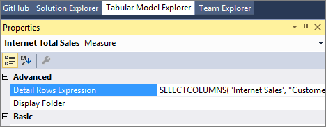

The [SELECTCOLUMNS](https://msdn.microsoft.com/library/mt761759.aspx) DAX function is commonly used in a Detail Rows Expression. The following example defines the columns to be returned for rows in the Internet Sales table in the sample Adventure Works tabular model:

```
SELECTCOLUMNS(
    'Internet Sales',
    "Customer First Name", RELATED( Customer[Last Name]),
    "Customer Last Name", RELATED( Customer[First Name]),
    "Order Date", 'Internet Sales'[Order Date],
    "Internet Total Sales", [Internet Total Sales]
)
```

With the property defined and the model deployed, a custom row set is returned when the user selects **Show Details**. It automatically honors the filter context of the cell that was selected. In this example, only the rows for 2010 value are displayed:

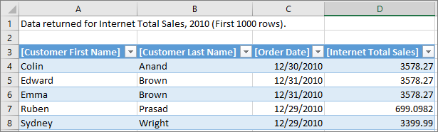

#### Default Detail Rows Expression property for tables
In addition to measures, tables also have a property to define a detail rows expression. The **Default Detail Rows Expression** property acts as the default for all measures within the table. Measures that do not have their own expression defined inherits the expression from the table and show the row set defined for the table. This allows reuse of expressions, and new measures added to the table later automatically inherits the expression.

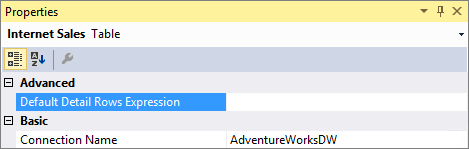
 
#### DETAILROWS DAX Function
Included in this release is a new `DETAILROWS` DAX function that returns the row set defined by the detail rows expression. It works similarly to the `DRILLTHROUGH` statement in MDX, which is also compatible with detail rows expressions defined in tabular models.

The following DAX query returns the row set defined by the detail rows expression for the measure or its table. If no expression is defined, the data for the Internet Sales table is returned because it's the table containing the measure.

```
EVALUATE DETAILROWS([Internet Total Sales])
```

## Object-level security
This release introduces [object-level security](../analysis-services/tabular-models/object-level-security.md) for tables and columns. In addition to restricting access to table and column data, sensitive table and column names can be secured. This helps prevent a malicious user from discovering such a table exists.

Object-level security must be set using the JSON-based metadata, Tabular Model Scripting Language (TMSL), or Tabular Object Model (TOM). 

For example, the following code helps secure the Product table in the sample Adventure Works tabular model by setting the **MetadataPermission** property of the **TablePermission** class to **None**.

```
//Find the Users role in Adventure Works and secure the Product table
ModelRole role = db.Model.Roles.Find("Users");
Table productTable = db.Model.Tables.Find("Product");
if (role != null && productTable != null)
{
    TablePermission tablePermission;
    if (role.TablePermissions.Contains(productTable.Name))
    {
        tablePermission = role.TablePermissions[productTable.Name];
    }
    else
    {
        tablePermission = new TablePermission();
        role.TablePermissions.Add(tablePermission);
        tablePermission.Table = productTable;
    }
    tablePermission.MetadataPermission = MetadataPermission.None;
}
db.Update(UpdateOptions.ExpandFull);
```

## Dynamic Management Views (DMVs)
[DMVs](../analysis-services/instances/use-dynamic-management-views-dmvs-to-monitor-analysis-services.md) are queries in SQL Server Profiler that return information about local server operations and server health.
This release includes improvements to [Dynamic Management Views](https://docs.microsoft.com/sql/analysis-services/instances/use-dynamic-management-views-dmvs-to-monitor-analysis-services) (DMV) for tabular models at the 1200 and 1400 compatibility levels.

[DISCOVER_CALC_DEPENDENCY](https://docs.microsoft.com/bi-reference/schema-rowsets/xml/discover-calc-dependency-rowset) 
Now works with tabular 1200 and 1400 models. Tabular 1400 models show dependencies between M partitions, M expressions and structured data sources. To learn more, see the [Analysis Services blog](https://blogs.msdn.microsoft.com/analysisservices/2017/07/17/whats-new-in-sql-server-2017-rc1-for-analysis-services/).

[MDSCHEMA_MEASUREGROUP_DIMENSIONS](https://docs.microsoft.com/bi-reference/schema-rowsets/ole-db-olap/mdschema-measuregroup-dimensions-rowset)
Improvements are included for this DMV, which is used by various client tools to show measure dimensionality. For example, the Explore feature in Excel Pivot Tables allows the user to cross-drill to dimensions related to the selected measures. This release corrects the cardinality columns, which were previously showing incorrect values.

## DAX enhancements
This release includes support for new DAX functions and functionality. In order to take advantage, you need to use the latest version of SSDT. To learn more, see [New DAX functions](https://msdn.microsoft.com/library/mt704075.aspx).

One of the most important pieces of new DAX functionality is the new [IN Operator / CONTAINSROW Function](https://msdn.microsoft.com/library/mt842621.aspx) for DAX expressions. This is similar to the [`TSQL IN`](https://msdn.microsoft.com/library/ms177682.aspx) operator commonly used to specify multiple values in a `WHERE` clause.

Previously, it was common to specify multi-value filters using the logical `OR` operator, like in the following measure expression:

```
Filtered Sales:=CALCULATE (
        [Internet Total Sales],
                 'Product'[Color] = "Red"
            || 'Product'[Color] = "Blue"
            || 'Product'[Color] = "Black"
    )
```

This is simplified using the `IN` operator:
```
Filtered Sales:=CALCULATE (
        [Internet Total Sales], 'Product'[Color] IN { "Red", "Blue", "Black" }
    )
```

In this case, the `IN` operator refers to a single-column table with 3 rows; one for each of the specified colors. Note the table constructor syntax uses curly braces.

The `IN` operator is functionally equivalent to the `CONTAINSROW` function:
```
Filtered Sales:=CALCULATE (
        [Internet Total Sales], CONTAINSROW({ "Red", "Blue", "Black" }, 'Product'[Color])
    )
```

The `IN` operator can also be used effectively with table constructors. For example, the following measure  filters by combinations of product color and category:
```
Filtered Sales:=CALCULATE (
        [Internet Total Sales],
        FILTER( ALL('Product'),
              ( 'Product'[Color] = "Red"   && Product[Product Category Name] = "Accessories" )
         || ( 'Product'[Color] = "Blue"  && Product[Product Category Name] = "Bikes" )
         || ( 'Product'[Color] = "Black" && Product[Product Category Name] = "Clothing" )
        )
    )
```

By using the new `IN` operator, the measure expression above is now equivalent to the one below:
```
Filtered Sales:=CALCULATE (
        [Internet Total Sales],
        FILTER( ALL('Product'),
            ('Product'[Color], Product[Product Category Name]) IN
            { ( "Red", "Accessories" ), ( "Blue", "Bikes" ), ( "Black", "Clothing" ) }
        )
    )
```

## Additional improvements
In addition to all the new features, Analysis Services, SSDT, and SSMS also include the following improvements:

* Hierarchy and column reuse surfaced in more helpful locations in the Power BI field list.
* Date relationships to easily create relationships to date dimensions based on date fields.
* Default installation option for Analysis Services is now for tabular mode.
* New Get Data (Power Query) data sources.
* DAX Editor for SSDT.
* Existing DirectQuery data sources support for M queries.
* SSMS improvements, such as viewing, editing, and scripting support for structured data sources.


## See also
[SQL Server 2017 Release Notes](../sql-server/sql-server-2017-release-notes.md)   
[What's new in SQL Server 2017](../sql-server/what-s-new-in-sql-server-2017.md)
