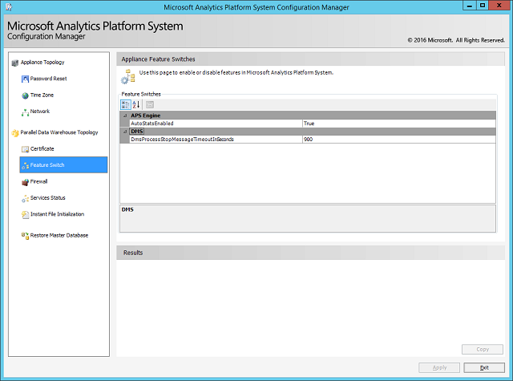

# Appliance Feature Switches

The **Feature Switch** page displays information about the feature switches that are being introduced in Analytics Platform System AU7 and later. Use this configuration page to update or enable/disable features and settings in Analytics Platform System.

> [!NOTE]
> Changes to feature switch values require a service restart.

## AutoStatsEnabled

Controls the auto statistics feature. This feature switch is set to true by default after upgrading to AU7. Any database created after the upgrade will inherit auto creation and asynchronous update of statistics. For existing databases, database administrators can enable auto statistics with [ALTER DATABASE (Parallel Data Warehouse)](../t-sql/statements/alter-database-transact-sql.md?tabs=sqlpdw). For more information on statistics, see [Statistics](../relational-databases/statistics/statistics.md).

## MaxDOPForInsertQueries

Allows you to pick maxdop settings greater than 1 for insert/select operations. Options for this setting are 0, 1, 2 and 4, with default being 1.

## OptimizeCommonSubExpressions

Improves query performance by eliminating data movement for common subexpression in SQL query optimizer. Detailed explanation of this feature can be found [here](common-sub-expression-elimination.md).

## UseCatalogQueries

Using catalog objects for some metadata calls instead of using SMO has shown performance improvement. Set to true by default in CU7.1, this switch controls that behavior.

## DmsProcessStopMessageTimeoutInSeconds

Controls the time Data Movement Service (DMS) waits to synchronize on a busy system when a query involving data movement is canceled. Updating to AU7 sets this value to 900 seconds (15 minutes) by default. The valid range is 0 - 3600 seconds.
